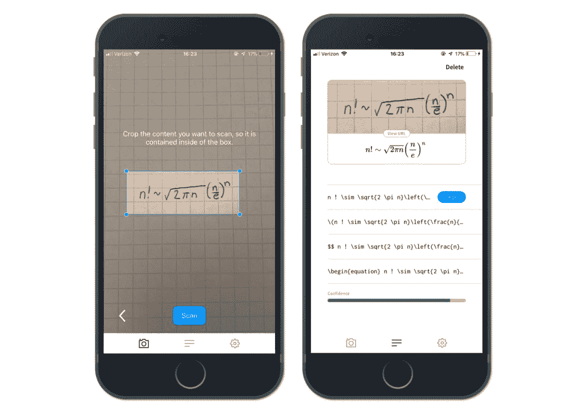
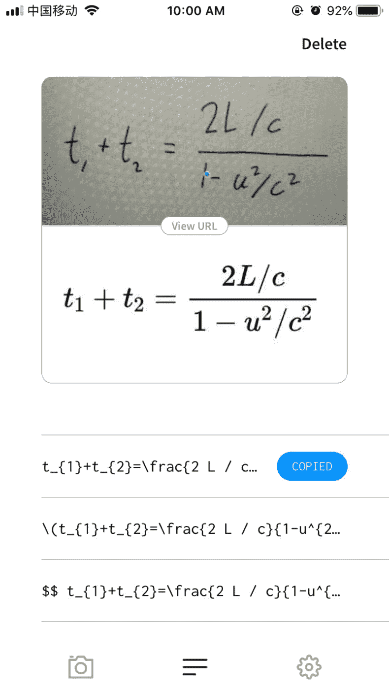
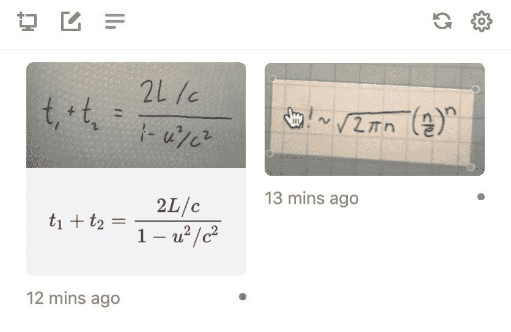
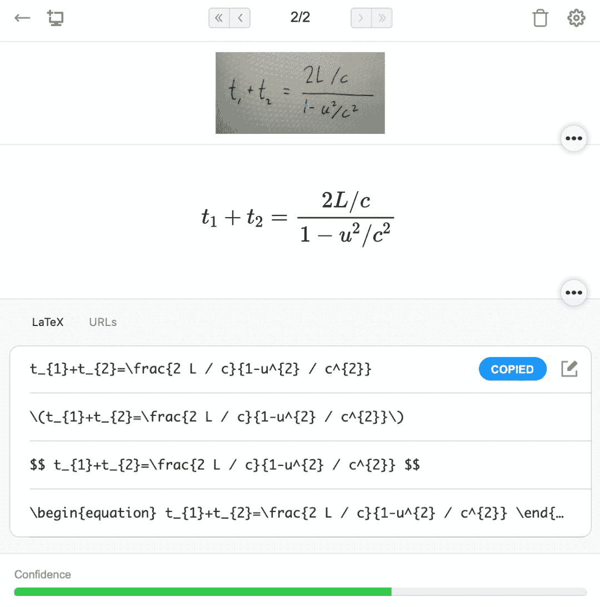

# 免费数学神器 Mathpix 发布移动版，一起来写更快的公式

> 原文：[`mp.weixin.qq.com/s?__biz=MzA3MzI4MjgzMw==&mid=2650767701&idx=2&sn=469af532eea3303e286a26518af40e8d&chksm=871a452bb06dcc3d8c7353799c6b539dc71777f456bc673cc0f59e0fc00cfdaa13fead193e26&scene=21#wechat_redirect`](http://mp.weixin.qq.com/s?__biz=MzA3MzI4MjgzMw==&mid=2650767701&idx=2&sn=469af532eea3303e286a26518af40e8d&chksm=871a452bb06dcc3d8c7353799c6b539dc71777f456bc673cc0f59e0fc00cfdaa13fead193e26&scene=21#wechat_redirect)

机器之心报道

**参与：思**

> 免费数学公式神器 Mathpix Snip 出移动版了，手写公式扫一扫就能识别，一键嵌入 MarkDown。

写博客、记笔记最麻烦的可能还不是文字，而是图表和公式，我们需要花些时间手写并嵌入数学公式。其实用 LaTeX 表达式写数学公式还是挺麻烦的，至少一般人做不到手写速度。但是我们有 Mathpix Snip，只要截个图，公式会自动转化为 LaTeX 表达式，我们只需要复制粘贴就行了。之前机器之心也曾介绍过 Mathpix Snip，并受到很多开发者与研究者的好评：[最好用的文字与公式编辑器，这套数学笔记神器送给你](https://mp.weixin.qq.com/s?__biz=MzA3MzI4MjgzMw==&mid=2650759888&idx=1&sn=9fc4df730d4588c52eabf7d2e2e75009&scene=21#wechat_redirect) 。近日，Snip 发布了免费移动版应用，现在连通电脑与手机，公式编写更便捷。

*   下载地址：https://mathpix.com/

Mathpix Snip 的设计初衷是帮助人们在通过手机或电脑输入数学公式时节省时间。为此，通过将手机作为电脑的扩展，Snip 的使用要比以前便捷很多，能用于本子、黑板上的各种公式。
Snip 移动版 App 可以快速识公式并生成 LaTeX 表达式，不论公式是写在屏幕上、草稿本上、白板上还是印刷课本上都没问题。以前 Snip 都是在电脑端使用，我们可以直接截图屏幕上的公式，并转换为 LaTeX 表达式。但是有了移动版，那么电脑和手机可以一起用，只要我们在手机上识别了公式，那么电脑端可以同步获取图片与表达式。从下面的短视频中，我们可以看到从草稿本上识别公式，并复制到电脑端的 Markdown 文档到底会有多简单。

[`mp.weixin.qq.com/mp/readtemplate?t=pages/video_player_tmpl&action=mpvideo&auto=0&vid=wxv_937861307934670849`](https://mp.weixin.qq.com/mp/readtemplate?t=pages/video_player_tmpl&action=mpvideo&auto=0&vid=wxv_937861307934670849)

**实际使用体验**

因为机器之心以前也使用过电脑版，发现 Snip 虽然非常好用，但是网络不太稳定，有时候需要科学上网才能调用它的识别功能。为此，我们测试了它的移动版，看看到底能不能用，到底怎样和电脑端互联互通。我们测试的是 IOS 系统，它是完全可以正常工作的，也不需要我们做额外的配置。只是这样地识别并转换貌似看起来没什么用，我们总不能在手机上做笔记、写博客吧，但是连接到电脑端就非常强大了。手机相当于扩展了一个摄像头，我们可以用它来拍各种场景下的公式，然后在电脑上调用。只要电脑和手机 APP 登陆同一个账号，那么它们处理的所有公式都会保持同步。如下所示为电脑端的历史展示，前面用手机处理的任务会保存下来，并同步到电脑端。如果我们点击第一个识别任务，那么该任务的原始识别图像、识别结果、对应的 LaTeX 表达式都会显示在一起，我们只要复制粘贴就能将其嵌入到博客或笔记中去。********本****文为机器之心报道，**转载请联系本公众号获得授权****。**
✄------------------------------------------------**加入机器之心（全职记者 / 实习生）：hr@jiqizhixin.com****投稿或寻求报道：**content**@jiqizhixin.com****广告 & 商务合作：bd@jiqizhixin.com**