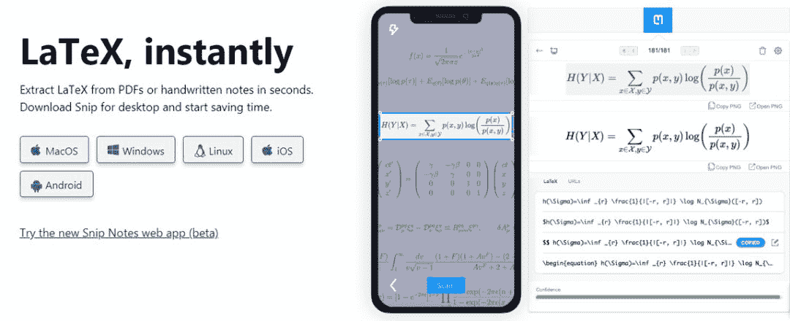
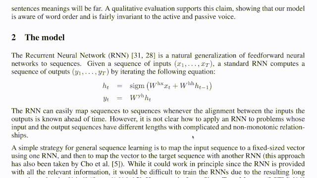

# 公式免费转 LaTex 代码，截图、转换一气呵成，每月 1000 次全免费

> 原文：[`mp.weixin.qq.com/s?__biz=MzA3MzI4MjgzMw==&mid=2650775200&idx=2&sn=4ae30cef70c4c12e10af8ce9cdf8b9d7&chksm=871a5adeb06dd3c8a666872fb88dc61fedeb86dda10115c288063751d05046a64adb5de272af&scene=21#wechat_redirect`](http://mp.weixin.qq.com/s?__biz=MzA3MzI4MjgzMw==&mid=2650775200&idx=2&sn=4ae30cef70c4c12e10af8ce9cdf8b9d7&chksm=871a5adeb06dd3c8a666872fb88dc61fedeb86dda10115c288063751d05046a64adb5de272af&scene=21#wechat_redirect)

选自 GitHub
**参与：一鸣**

> LaTex 是很多人在写论文时使用的方便工具，但是如何将书本上的公式直接转换为 LaTex 格式呢？近日，一位中国开发者开源了这样一款工具。用户可以对图片上的公式截图，然后用工具直接转换。

公式的输入一直是个令人头痛的问题，即使是想用 LaTex 写公式，也需要费一些精力。如果能够从纸质文本上拷贝出公式，直接转到 LaTex 上就方便了。

近日，一位中国开发者开发了一款工具。用户可以输入公式的截图，工具可以自动将其对应的 LaTex 文本转换出来。

项目地址：https://github.com/blaisewang/img2latex-mathpix

**Image2LaTeX：****公式抽取利器**

这一工具的名称是「Image2LaTeX」。顾名思义，这是利用 OCR 技术从图像中提取文字，并转换为 LaTex 代码的工具。具体而言，这一工具借助了 Snip——由 Mathpix 开发的文档文字和公式提取工具。由于 Snip 只能提供免费的 50 次转换功能，所以不够方面。于是加上 MathpixOCR (https://mathpix.com/ocr/) 和作者自己的开发工作，Image2LaTeX 就可以实现 1000 次从文档中提取公式的能力。



*Mathpix 打造的 Snip。*

**使用方法**

作者在项目中提供了相关的安装文件，如果你下载了 Image2LaTeX-x.x.x-os.zip，双击可执行文件 Image2LaTeX（Windows 为 Image2LaTeX.bat）或者在终端内输入：

```py
./Image2LaTeX
```

如果你下载了 Image2LaTeX-x.x.x.jar 并且已经安装了 JAR 启动器，双击已下载的 JAR 或者在终端中输入：

```py
java -jar Image2LaTeX-x.x.x.jar
```

使用操作系统默认的方式（或者其他工具）对公式或文本进行截取（macOS 默认为 Shift (⇧)-Control (⌃)-Command (⌘)-4）后，应用会显示被截取的内容，点击 Submit 进行 OCR 请求。

之后，用户只需要对文档需要截图的公式截取。工具会自动转换为 LaTex 代码。由于有几个备选结果，因此需要用户从中选择正确的。

使用方式如下图所示：



可以看出，无论是 OCR 还是自动转码，速度都是非常快的，准确性也很高。

**安装方式**

由于这是基于 Snip 和相关外部依赖进行的开发，因此作者也介绍了安装方法。

首先，用户需要准备一个 MathpixOCR 控制台中的 API keys（与 Snip 不是同一个账号体系）。如果用户打算使用 Image2LaTeX-x.x.x.jar，则安装 JDK 11 或更高版本（推荐使用 OpenJDK (https://openjdk.java.net/)）。

在程序第一次启动时，用户需要输入 API keys（不含单引号）。OSX 和 Windows 用户可以在系统托盘找到 API Key 选项来修改你的 API keys。

Linux 用户需要首先找到 config 文件，再通过文本编辑器进行修改。之后就可以直接使用了。

第三届机器之心**「Synced Machine Intelligence Awards」**年度奖项评选正在进行中。本次评选设置**六大奖项****，**重点关注人工智能公司的产品、应用案例和产业落地情况，基于真实客观的产业表现筛选出最值得关注的企业，为行业带来实际的参考价值。

**参选报名日期**：2019 年 10 月 23 日~2019 年 12 月 15 日**评审期**：2019 年 12 月 16 日~2019 年 12 月 31 日**奖项公布**：2020 年 1 月


点击**阅读原文**，查看更多详情并报名参选。