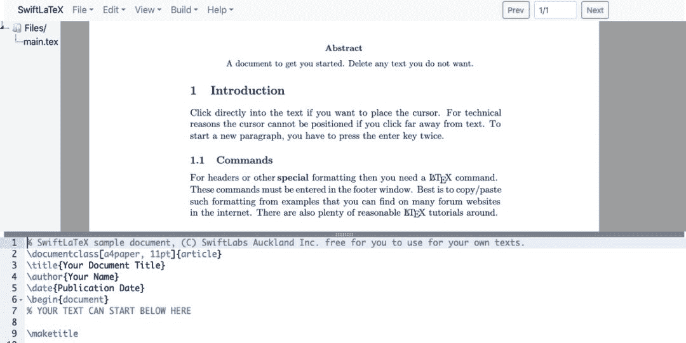

# 写下 LaTeX 代码就要看结果？这款编辑器让你「所见即所得」

> 原文：[`mp.weixin.qq.com/s?__biz=MzA3MzI4MjgzMw==&mid=2650775568&idx=2&sn=acd2e2a56c0e533febb9d110d4bdc206&chksm=871a646eb06ded78d2afd2b62677f42ee4f9b90106bed7b3ce8a286e8f83c8b11d32638dd44d&scene=21#wechat_redirect`](http://mp.weixin.qq.com/s?__biz=MzA3MzI4MjgzMw==&mid=2650775568&idx=2&sn=acd2e2a56c0e533febb9d110d4bdc206&chksm=871a646eb06ded78d2afd2b62677f42ee4f9b90106bed7b3ce8a286e8f83c8b11d32638dd44d&scene=21#wechat_redirect)

选自 GitHub

**参与：****一鸣**

> LaTeX 是一个很多人都比较熟悉的文字排版系统，很多理工科的研究者和学生都在使用。它通过代码的形式，让写出来的报告和论文保持良好的格式，因此受到欢迎。LaTeX 有一个小小的缺点——写好的 LaTeX 代码并不能够立刻表现为真实的排版效果。

近日，GitHub 出现了一个新的项目，是一个名为 SwiftLaTeX 的可视化编辑器。该项目最大的亮点在于：你编写的 LaTeX 代码能够立刻展示实际的效果，所见即所得。这个编辑器还是基于浏览器的，还支持云文件存储。项目地址：https://github.com/SwiftLaTeX/SwiftLaTeX**所见即所得的 LaTeX 编辑器**据作者介绍，SwiftLaTeX 是一个基于网络浏览器的 LaTeX 编辑器，可以创建诸如报告、项目、PPT 等 PDF 文件。当你在编写 LaTeX 代码的时候，写好的代码可以立刻转换为实际的格式效果。*编辑器分为两部分。**下部为代码编辑区，上部则展示了实际的格式效果。*除了在编辑代码的过程中直接展示，SwiftLaTeX 还支持将其利用谷歌网盘和 DropBox 进行分享。项目主要特性一览：

1.  所见即所得；

2.  快速编译；

3.  云文件存储。

作者提供了一个体验版本，可以试试看：https://www.swiftlatex.com/oauth/login_oauth?type=sandbox**安装方法**作者表示，开发者可以在自己的设备上保存、部署这一项目，依据 AGPL 协议即可。当然，你也可以使用他们的网络服务：https://www.swiftlatex.com。如果要本地安装和部署，则有两种方法。**在 Docker 中运行项目**作者表示，他们很快会在 Docker hub 上发布相关的 Docker 镜像。如果想要在 Docker 中运行这一项目，只需要三步：

1.  安装 Docker

2.  运行 docker build . -t swiftlatex/swiftlatex

3.  运行 docker-compose up

**使用 Python3 运行项目**这一项目同样支持使用 Python3 运行，也只需要三步：

1.  安装 Python3 和 Pip3

2.  运行 pip3 install -r requirements.txt

3.  运行 python3 wsgi.py

之后只需要打开 URL：https://127.0.0.1:3000 。**增加云存储支持**项目本身也支持谷歌和 Dropbox 的文件存储服务。首先，你需要成为谷歌开发者，并获得谷歌 API 代理 ID 和 Secret。然后，进入项目的 config.py 文件，将相关信息添加进去就可以了。**下一步支持**作者表示，目前项目还有一些不完善的地方。例如，目前项目的引擎是 pdftex，所以没有对 unicode 的支持。下一步他们将会加入 xetex，让项目更完善。其他准备进行的开发工作如下：

1.  竖排显示；

2.  增加对 XeTeX 的支持，并清理一些源代码；

3.  对 JS 文件进行整合和整理；

4.  增加对 Github 和 S3 存储的支持。

**[机器之心「SOTA 模型」](http://mp.weixin.qq.com/s?__biz=MzA3MzI4MjgzMw==&mid=2650770891&idx=1&sn=25bde35991047a997337c8dd25350089&chksm=871a49b5b06dc0a36fc3407e3643550ef97f72b007e67c4f4be250bfd60c9fdc5389624569c0&scene=21#wechat_redirect)****：****22****大领域、127 个任务，机器学习 SOTA 研究一网打尽。******

点击阅读原文，立即访问。