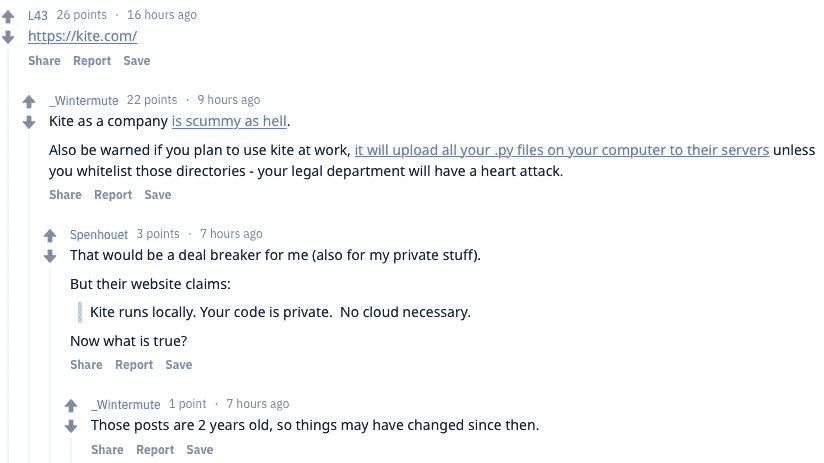

# 你是一个成熟的 AI 了，应该自己学会补全 Python 代码了

> 原文：[`mp.weixin.qq.com/s?__biz=MzA3MzI4MjgzMw==&mid=2650765493&idx=3&sn=ecf4b9b84f38d74958c24f8dc5ad81a9&chksm=871abccbb06d35dde98c286a1932932d63164f24c4eef308d3af33cc2b9afe77c0a50fe8705d&scene=21#wechat_redirect`](http://mp.weixin.qq.com/s?__biz=MzA3MzI4MjgzMw==&mid=2650765493&idx=3&sn=ecf4b9b84f38d74958c24f8dc5ad81a9&chksm=871abccbb06d35dde98c286a1932932d63164f24c4eef308d3af33cc2b9afe77c0a50fe8705d&scene=21#wechat_redirect)

机器之心整理

**参与：思源、一鸣**

> 在项目开发中，优秀的代码自动补全工具可以提升工作效率。然而，近来的 IDE 基本都使用搜索方法进行补全，在一些场景下效果不佳。近日，有开源项目用深度学习模型进行代码补全，显示出非常有潜力的效果。

近日，Reddit 上的一篇帖子引起了网友的热议。帖子作者「mlvpj」称：

「我们使用深度学习完成了一个简单的项目，可以自动进行 Python 代码补全。」

根据介绍，该项目基于 LSTM 模型，训练后，负责对代码的缺失部分进行补全。评价模型的方法是判断节省了多少的按键信息——即模型给出长度为 L 的代码建议，如果和真实的代码匹配，则节省 L - 1 个键入操作。实验结果说明，大约有 30%-50% 的键入成本可以节省下来。

作者在帖子中表示，他们接下来会尝试不同的架构，并提高推断的表现。而现在的模型推断很慢，不能实际使用。作者已在 GitHub 开源了项目代码：

链接地址: https://github.com/vpj/python_autocomplete

**和 IDE 的自动补全有什么区别**

该项目对 Python 代码的自动补全与传统 IDE（如 PyCharm）等不同。IDE 补全基于检索方法，需要从已有代码中进行搜索。

以 PyCharm 中的基本补全（Basic Completion）方法为例。基本补全可帮助补全可见区域的类、方法、关键词代码。使用时，PyCharm 会分析补全使用情况，并提供当前位置可能的选择。如果是对空间、参数或变量声明进行补全，则 PyCharm 会基于类别提供一系列可能的命名。

当出现已定义的类、函数、模块和变量时，基本补全就会启动。

此外，PyCharm 也提供智能补全等其他补全功能，但基本上都需要对已有文本进行搜索，根据位置和类型判断补全的方法。这些方法都没有配置机器学习模型。

Pycharm 的自动补全介绍：https://www.jetbrains.com/help/pycharm/auto-completing-code.html

**深度学习怎样脑补缺失 TF 代码**

最常用的 PyCharm 自动补全也能省很多功夫，但它需要 IDE 能检索到你的代码文件或库，而且补全会提供多个可能的选项。但是在本项目实验的工具中，LSTM 会根据上下文语义确定最可能调用的函数，因此它能节省更多的成本。作者表示如果使用束搜索，那么一次能预测 10 多个字符，不过这样对于实际使用还是有点低效。

在训练深度补全模型前，我们需要先建立训练集。开发者会在清洗评论、标注和空行后，构建比较干净的 Python 代码。然后，模型会在这些数据上进行训练与预测。在数据预处理上，开发者发现通过 tokenizing Python 代码，模型效果比通过 BPE 编码的字符级预测效果还要好。作者提供了一个简单的预训练模型，它是在整个 TensorFlow 项目的 models 代码中训练的。

下图就是作者在验证集中测试的验证样本。绿色的字符表示自动补全的起始位置，用户需要按下 Tab 键选择开始补全。绿色及后面高亮的灰色字符是自动补全的结果。

如上所示为验证样本中的自动补全效果。与代码生成类似，粗略看起来，似乎效果非常不错，但实际上会有很多不合理的地方。不过有意思的是，自动补全中所有字符串都只有一个占位操作，这也是非常合理的处理方法。

样本中自动补全的起始和结束位置都是随机的，也就是说代码可能补全到「tensorfl」就结束了，并不会补全完整的标识符「tensorflow」。这在实际场景中用处非常有限，因此作者将生成结束位置限制为终止 token 而修复问题。目前自动补全能完成多种 operator，且当我们增加束搜索的长度时，它完成的代码长度会更多。

整个模型的主体都是 LSTM，它在 TensorFlow 模型代码库训练后能捕捉非常丰富的 TensorFlow API。如下所示为自动补全模型的主体代码，基本上简单的一个 LSTM 就能搞定：

**网友评价**

项目开源后，有些网友对作者提出了质疑：

「我们已经有很多很好用的自动补全工具了，比如 kite（一个可以在 IDE 上使用的插件），为什么还要费心搞个机器学习模型？」

在讨论中，有人提出，一些无良的自动补全工具会悄悄上传代码到他们的服务器中，（而自行训练的深度学习模型不存在这个问题）。

也有人提出，其实不一定要用 LSTM 模型，隐马尔科夫模型在处理序列数据上效果也很好。

此外，也有网友建议使用 CuDNN 加速 LSTM 的推断过程。这样能大大提升推断速度，集成到 IDE 中也就有了可能。

对于使用深度学习自动补全代码，机器之心的读者们有什么想法呢？欢迎留言讨论。

********本****文为机器之心整理，**转载请联系本公众号获得授权****。**

✄------------------------------------------------

**加入机器之心（全职记者 / 实习生）：hr@jiqizhixin.com**

**投稿或寻求报道：**content**@jiqizhixin.com**

**广告 & 商务合作：bd@jiqizhixin.com**