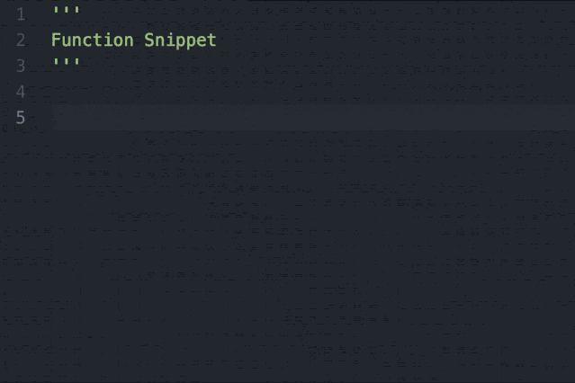
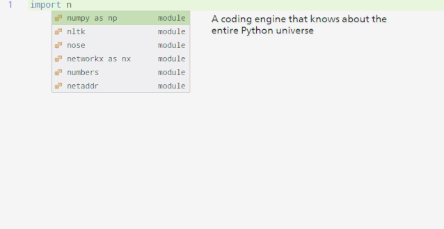
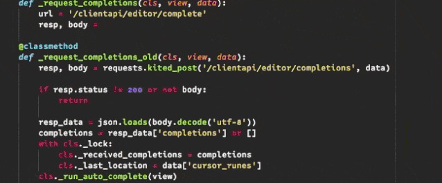

# AI 加持，Kite 增加智能代码补全功能：减少一半操作，实时补全

> 原文：[`mp.weixin.qq.com/s?__biz=MzA3MzI4MjgzMw==&mid=2650770249&idx=4&sn=45fa2fefcd78eca818b37c43677c5af6&chksm=871a4f37b06dc6211129f407ef73bd9dd75acac570ab2556a672627513e87e6b0178e398fcff&scene=21#wechat_redirect`](http://mp.weixin.qq.com/s?__biz=MzA3MzI4MjgzMw==&mid=2650770249&idx=4&sn=45fa2fefcd78eca818b37c43677c5af6&chksm=871a4f37b06dc6211129f407ef73bd9dd75acac570ab2556a672627513e87e6b0178e398fcff&scene=21#wechat_redirect)

机器之心报道

**机器之心编辑部**

> 代码补全工具 Kite 近日更新了最新的版本，增加了名为「Intelligent Snippets」的新功能。这一功能可以帮助开发者更为智能和高效的补全 Python 代码中的函数命令了。

Kite 是一个著名的 Python 代码补全工具，支持在一些 IDE 上作为插件，帮助开发者提升代码效率。近日，Kite 官方宣布将会增加「Intelligent Snippets」功能。据官方表示，这一工具可以帮助开发者补全复杂的、多字符的代码，而且代码的生成几乎是实时的。**Intelligent Snippets 有什么特性**Kite 本身就是一种代码补全工具。在版本更新前，它只能按照规则或检索的方式，帮助用户补全忘记了名称的函数。官方认为，这不是最优的解决方案。在 9 月 5 日发布了新版本后，新加入的 Intelligent Snippets 能帮助代码补全最初更合理的预测。简单总结一番，Kite 最新构建的 Intelligent Snippets 主要有以下特性：

*   支持大部分的编辑器：Atom、PyCharm/IntelliJ、Sublime Text、VS Code 和 Vim；

*   支持全局和局部函数补全；

*   通过 Intelligent Snippets 调用函数，用户只需要一半的击键操作。

如果读者想要试试这种免费的代码补全工具，可以直接下载插件：https://kite.com/download/。**Intelligent Snippets 可以解决什么问题**传统上，我们可以创建一些代码块，然后在需要的时候直接调用并修改这个片段。一般而言，这种代码块都是开发者事前手动定义的，它们都是静态的，并不会随着开发者的编写过程而改变。因此，模板式的代码块限制了代码模式的多样性。例如在下面动图中，开发者使用代码块来插入定义函数的主要结构，然后再修改参数与子语句完成特定的函数。

Kite 的 Intelligent Snippets 引擎能根据我们正在使用的代码动态地生成代码片段，它能自动地检查我们代码库中最一般的模式，并建议我们在写代码时使用这些模式。下面的动图展示了这一新特性，它会预测一些常用的编程模式。

**如何构建 Intelligent Snippets**Intelligent Snippets 建立在 Kite 代码补全核心代码引擎之上。首先，kite 会索引你的代码库，学习函数常用方式。然后，在你调用函数时，Kite 建议该函数的代码段从而轻松补全。Kite 的自动补全依然为每个参数建议补充代码。Intelligent Snippets 不只是节省了敲代码的时间，也能减少你查阅文档的次数。**支持全局与局部函数**下面的动图展示了开发者使用 Intelligent Snippets 快速调用 requests.post：

Intelligent Snippets 也支持自己定义的函数，如以下动图所示：

官方表示，他们希望 Kite 能够在未来成为开发者和 AI 加持的代码工具的交互基石。他们希望 intelligent snippets 可以在补全函数命令之外有更多应用，比如补全 try/except 的代码块或者单元测试样例。

*参考链接：**https://kite.com/blog/product/announcing-intelligent-snippets-for-python/*********本****文为机器之心报道，**转载请联系本公众号获得授权****。**
✄------------------------------------------------**加入机器之心（全职记者 / 实习生）：hr@jiqizhixin.com****投稿或寻求报道：**content**@jiqizhixin.com****广告 & 商务合作：bd@jiqizhixin.com**