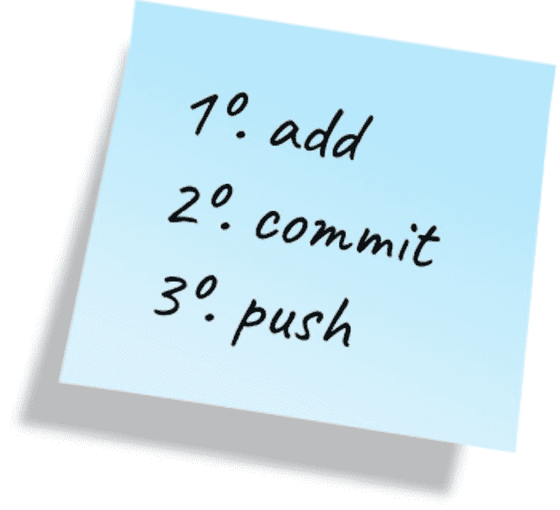
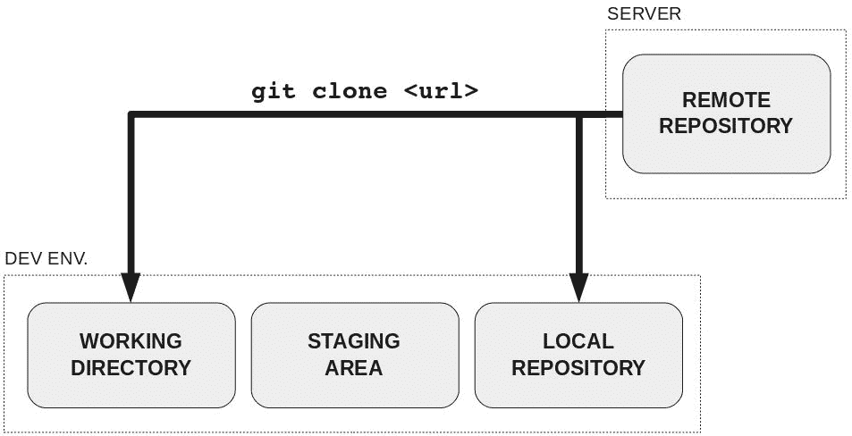
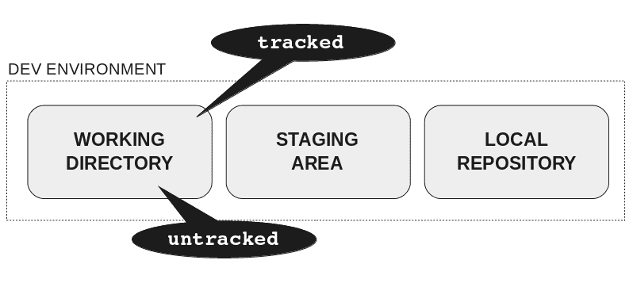
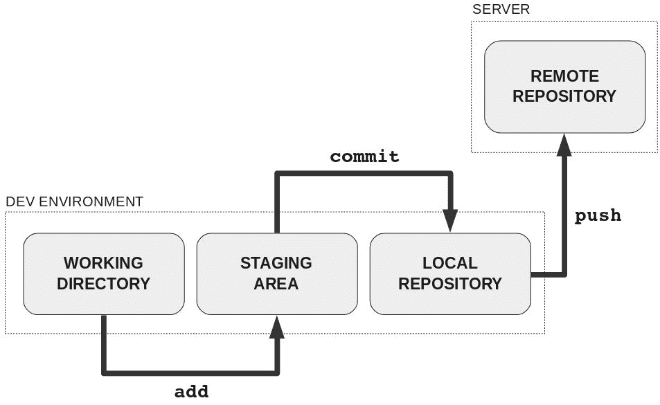
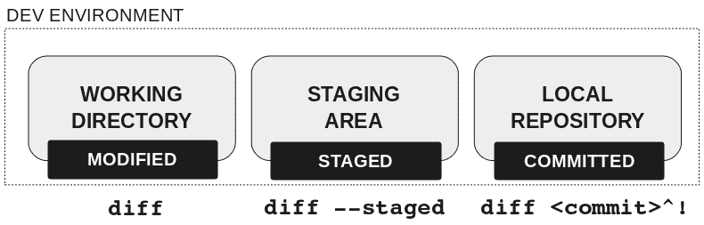
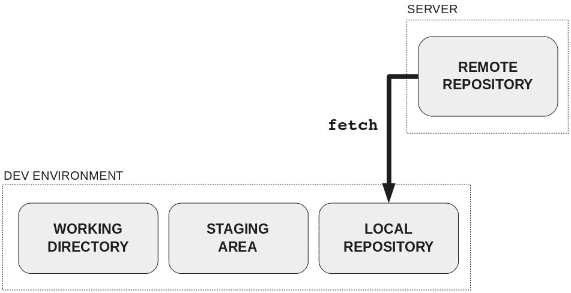
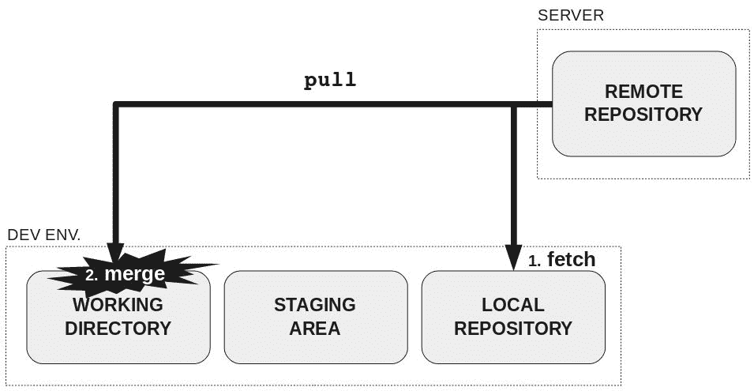
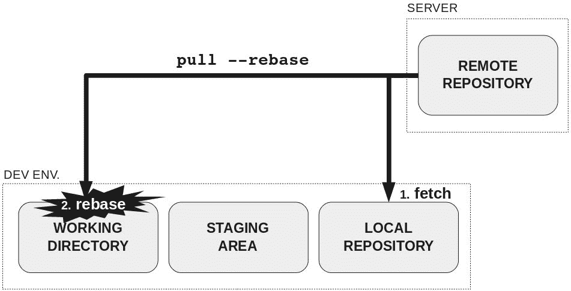

# 如何优雅地向别人介绍高端大气上档次的 Git

> 原文：[`mp.weixin.qq.com/s?__biz=MzA3MzI4MjgzMw==&mid=2650755974&idx=4&sn=7ca85a18fe65b9666d05a57ade648396&chksm=871a97f8b06d1eee9d4f906d66eecdcf95df69fa12b3d4c6b779703fd49a26fb3bdcea035271&scene=21#wechat_redirect`](http://mp.weixin.qq.com/s?__biz=MzA3MzI4MjgzMw==&mid=2650755974&idx=4&sn=7ca85a18fe65b9666d05a57ade648396&chksm=871a97f8b06d1eee9d4f906d66eecdcf95df69fa12b3d4c6b779703fd49a26fb3bdcea035271&scene=21#wechat_redirect)

选自 GitHub.io

**作者：****Rachel Carmena**

**机器之心编译**

**参与：****李诗萌、路雪**

> 本文主题是如何向工具初学者介绍分布式版本控制系统 Git。除了了解关于 Git 的基本知识以外，大家还可以学到一些工具学习方面的东西。

**我发现的问题**

我的一些职业经历涉及跨职能领域，因此我了解所有同事的工作方式。我记得有一家公司在我加入的几周前才开始使用 Git。

我用三步把 post-it 放到屏幕上：第一步是 add，第二步是 commit，第三步是 push。

他们不知道为什么要用这三步，他们只知道为了防止发生其他问题，他们应该遵循这三个步骤。但是问题还是频频发生，所以我决定准备一个关于 Git 的讨论会。

**想法**

我喜欢在头脑中绘图。我不写「思维导图」，因为它们是众所周知的图像形式。而我所说的「图」是一种大脑中的有框架、结构化或其他形式的图像表征。例如，我在头脑中想象骰子来学习加法。

所以我准备了一些图。理解这篇文章不一定需要看懂这些图。但出于可访问性，我对每一张图都作出了解释。

在这种情况下，词汇的教学就非常重要了。否则他们无法理解来自 Git 的信息。这些图是一种很好地向他们介绍词汇的方式。

**分布式版本控制系统**

概括图包括四部分，分别是：

开发环境中的：

*   暂存区或索引

*   本地版本库

服务器中的：

到那个时候，你就可以解释分布式版本控制系统的好处了。

**复制版本库**

在复制版本库时，远程版本库中的数据要传递到两个区域：

*   本地版本库

**在工作区中进行更改**

工作区中有两类文件：

*   未追踪文件：因为尚未添加因此 Git 不知道的文件。

**更新远程版本库**

当工作区更改就绪时，必须先把它们添加到暂存区中。

当暂存区中有一组特定的更改时，我们就需要在本地库中创建带有这些特定信息的 commit。

当本地版本库中有一或多个准备和世界其他地方共享的 commit 时，我们必须把它们 push 到远程版本库中。

这时，开发环境中的文件状态已经有所不同了：已修改、已暂存和已提交（modified, staged and committed）。

此外，你还可以解释：

*   如何显示暂存区的文件更改：git diff –staged

*   在将文件添加到暂存区后，如何在工作区中更改文件

*   等等

**更新开发环境**

**抓取（fetch）**

执行 git fetch 后，远程库中的数据将仅传递到本地库中。

**Pulling**

当执行 git pull 后，远程库中的数据会传输到两个区域：

*   工作区：合并（merge）

你可以用 git pull—rebase 查看 commit 历史。它是由 fetch + rebase 而不是 fetch + merge 组成的。它将会重新执行你的本地提交，而且你无法看到提交历史中已知的 diamond shape。

**下一步**

你可以在开发环境中添加另一个区域来解释暂存区：dirty work directory。

如果人们将这些概念内化，他们就可以建立坚实的基础，从而更容易地使用分支、提交历史以及衍合（rebasing）等。

**温馨提示**

我也曾用过其他版本控制系统（Visual SourceSafe、TFS 和 Subversion），以我的个人经验来讲，缺乏知识对于使用旧工具和新工具而言都有害。我们不仅仅要选择工具，还要掌握工具。********

拓展阅读：https://git-scm.com/book/en

*原文地址：https://rachelcarmena.github.io/2018/12/12/how-to-teach-git.html*

****本文为机器之心编译，**转载请联系本公众号获得授权****。**

✄------------------------------------------------

**加入机器之心（全职记者 / 实习生）：hr@jiqizhixin.com**

**投稿或寻求报道：**content**@jiqizhixin.com**

**广告 & 商务合作：bd@jiqizhixin.com**