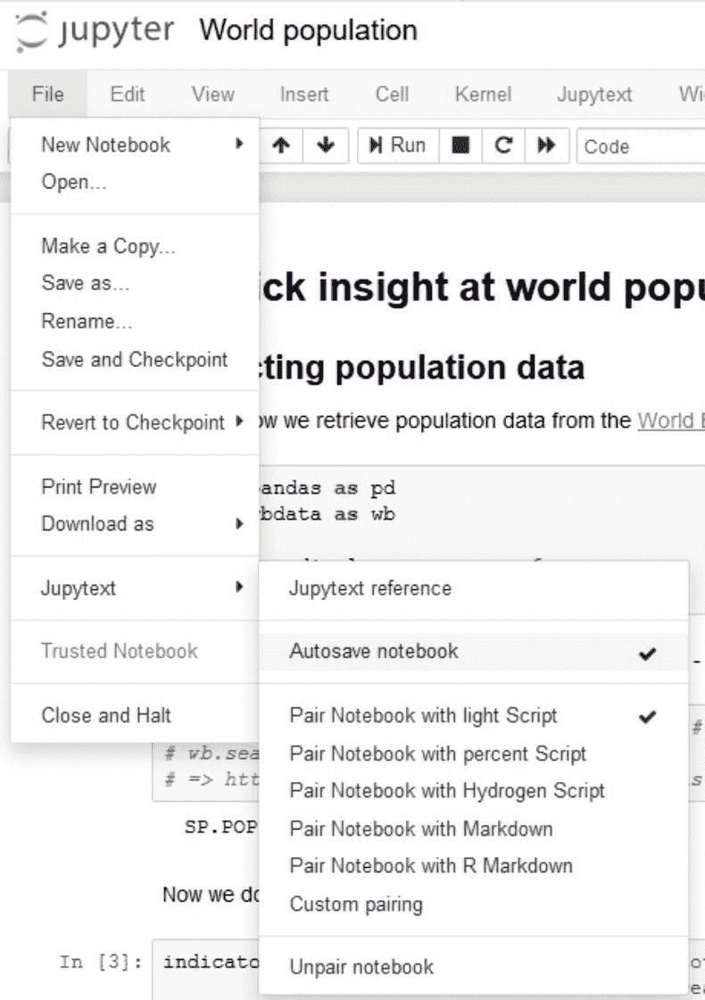
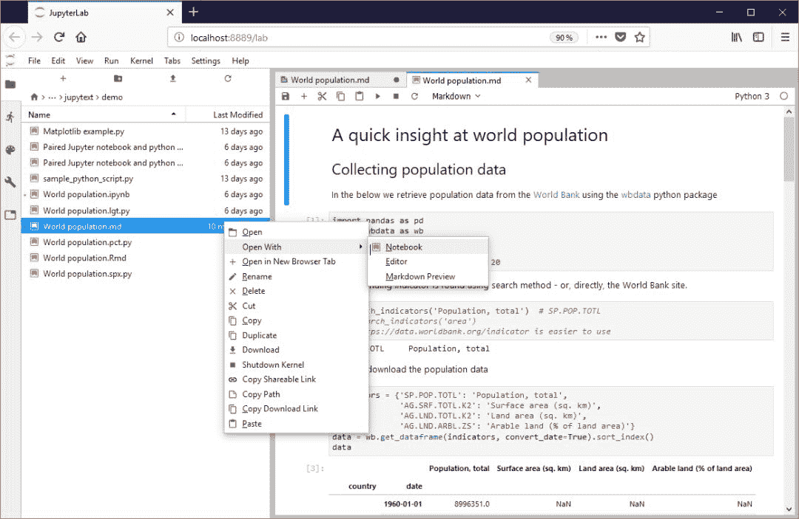

# 是时候联盟 Jupyter 与 PyCharm 了，Jupytext 就是你需要的

> 原文：[`mp.weixin.qq.com/s?__biz=MzA3MzI4MjgzMw==&mid=2650761400&idx=3&sn=acbcd04c5da9ec9ef4bb04523c74a9f6&chksm=871aacc6b06d25d093ac6c89732859180db13ce463068fab3a0dd99ffe58a9164681129f7b33&scene=21#wechat_redirect`](http://mp.weixin.qq.com/s?__biz=MzA3MzI4MjgzMw==&mid=2650761400&idx=3&sn=acbcd04c5da9ec9ef4bb04523c74a9f6&chksm=871aacc6b06d25d093ac6c89732859180db13ce463068fab3a0dd99ffe58a9164681129f7b33&scene=21#wechat_redirect)

选自 GitHub

**项目作者：Marc Wouts**

**机器之心编译**

> Jupyter Notebook 真的是让人又爱又失望，在有的场景下它极其便利，但是在很多大模型或复杂项目上，它又无能为力。在 Jupytext 这个项目中，作者希望既能利用 Notebook 的可视化优势，同时也能利用纯文本编写优势。可以说，是时候联合 Jupyter Notebook 与 PyCharm 了。

*   Jupytext 项目地址：https://github.com/mwouts/jupytext

**Jupyter Notebook 哪不行？**

Jupyter Notebook 是一款免费、开源的交互式 web 工具。研究人员可以利用该工具将软件代码、计算输出、解释文本和多媒体资源组合在一个文档中。笔记本形式的计算已经发展了几十年，但是过去几年里，Jupyter 特别受欢迎，更是成为数据科学家和机器学习研究者们的首选工具。

在 GitHub 的一项分析中（Nature，30 OCTOBER 2018）显示，截至 2018 年 9 月，公开的 Jupyter Notebook 已经超过了 250 万份，而 2015 年这一数字仅为 20 万左右。Jupyter Notebook 之所以这么流行，主要还是它的演示和可视化，我们可以查看每一段代码的输出与运行效果。

这种可视化对于数据科学和机器学习研究而言非常重要，因为我们需要当前的模型特性做决策。此外，正因为这种直观的可视化输出，我们经常使用它作为模型教程，Colab 这种提供免费 GPU 算力的平台也都采用的是 Jupyter Notebook。

因此总的而言，Jupyter 的主要特点是：

*   行内代码执行

*   简单的构思结构

*   对图片和数据帧的良好展示

但是，Jupyter Notebook 也有不好的地方，我们很难用它做版本控制，也很难用于工程实践。其中比较重要的是版本控制，Jupyter Notebook 采用的是 JSON 结构，可读性比较差。而版本控制能让我们发觉潜在的优秀代码，我们可以关注代码的变化而挖掘到底哪些是重要的。

直到现在，版本控制和 Jupyter Notebook 都是两个世界的人，它们之间基本没有啥关系。虽然也有一些工作尝试结合两者，但成果非常有限，对开发者的使用而言也不友好。

**Jupytext 来啦**

现在，Jupytext 来啦，我们可以把 Jupyter Notebook 代码转化成纯文本，用我们最喜欢的 IDE 打开。重要的是，Jupytext 能清楚地查看代码的修改记录，从而更好地进行版本控制，这是以前 Jupyter Notebook 所做不到的。这样的 Jupytext 是不是就是你苦苦追寻的工具？

[`mp.weixin.qq.com/mp/readtemplate?t=pages/video_player_tmpl&action=mpvideo&auto=0&vid=wxv_789949953891336193`](https://mp.weixin.qq.com/mp/readtemplate?t=pages/video_player_tmpl&action=mpvideo&auto=0&vid=wxv_789949953891336193)

在上面的视频中，项目作者展示了如何快速使用 Jupytext，我们可以使用最喜欢的纯文本编辑器或 IDE 来编辑 Jupyter Notebook。这样子，Jupyter Notebook 也能有快飞一般的编写速度了，因为不论是代码导航、编辑或执行代码单元、debug 代码等等，IDE 都要便捷一些。

当然，如果要使用其它 IDE，Jupyter Notebook 的格式还是要转换的。目前 Jupytext 能将 Jupyter Notebook 转换为一下一些格式：

*   Markdown 和 R Markdown 文档

*   Julia、Python、R、Bash、Scheme、Clojure、Matlab、Octave、C++ 和 q/kdb+ 脚本

如果我们将 Jupyter Notebook 保存为 Python 脚本，那么就可以将 Python 文件导入 Git 仓库，并追踪代码的修改和变化。有意思的是，Python 代码的修改是在 Jupyter Notebook 中完成的，这在以前是无法直接追踪的。

更有意思的是，如果我们需要使用 IDE 重构代码或其它操作，那么可以直接在 PyCharm 中编辑并保存 Python 文件。在刷新 Notebook 后，我们可以继续在 Jupyter 上便捷更新后的代码。相当于，Jupyter 和 PyCharm 联合便捷了～

**Jupytext 使用姿势**

Jupytext 的安装非常简单，用 pip 或 conda 直接安装就行了。此外，我们有多种方式使用 Jupytext，以下简要展示了几种方式以及使用界面。

直接在 Jupyter Notebook 或 JupyterLab 中使用：Jupytext 提供内容管理器，允许 Jupyter 将 notebook 保存为你喜欢的格式，来补充或替代传统的.ipynb 文件。你可以在自己喜欢的编辑器中边界文本表示。编辑完成后，在 Jupyter 中刷新 notebook 即可：输入单元加载自文本文件，输出单元重新加载自.ipynb 文件。「刷新」这个动作会保存内核变量，这样你就可以无需重新运行 notebook，在 notebook 中继续工作、运行修改后的单元。

在命令行中使用：Jupytext 将 Jupyter notebook 转换为文本表示。命令行工具可以多种方式在 notebook 上运行。它可以同步处理 notebook 的多个表示，将 notebook 输送至 black 等重新格式化工具中。如果你想在提交.ipynb 文件时自动更新文本表示，它还可以作为 pre-commit hook 使用。

在 Vim 中使用：编辑你的 Jupyter notebook，使用 jupytext.vim 将其表示为 Markdown 文档或 Python 脚本。

Jupyter Notebook 中的 Jupytext 菜单是这样的：

在 JupyterLab 中以 Notebook 形式打开 MarkDown 脚本是这个样子的：

****本文为机器之心编译，**转载请联系本公众号获得授权****。**

✄------------------------------------------------

**加入机器之心（全职记者 / 实习生）：hr@jiqizhixin.com**

**投稿或寻求报道：**content**@jiqizhixin.com**

**广告 & 商务合作：bd@jiqizhixin.com**