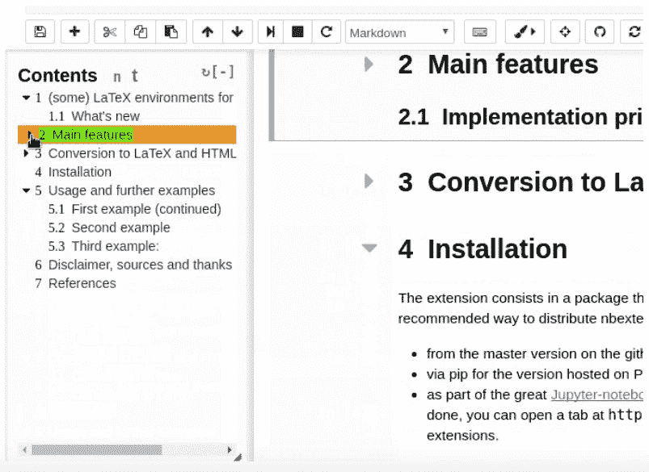
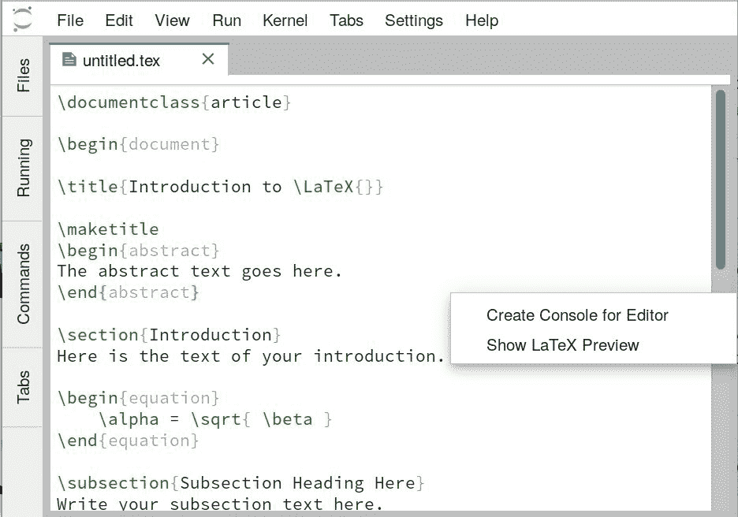
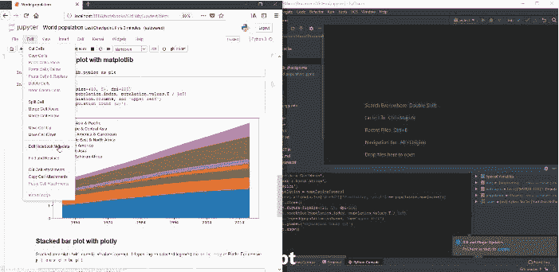
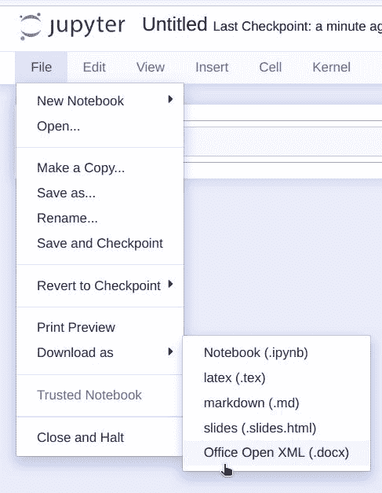

# 只有想不到，「99」种扩展 Jupyter 功能的好方法

> 原文：[`mp.weixin.qq.com/s?__biz=MzA3MzI4MjgzMw==&mid=2650765061&idx=2&sn=2d45c6154fbfcc9ce05c31edeeb48a80&chksm=871ab37bb06d3a6d35d6b2bf7c3302df1528e65bd4d6e30b002fb8cd4c38f768d563d4101593&scene=21#wechat_redirect`](http://mp.weixin.qq.com/s?__biz=MzA3MzI4MjgzMw==&mid=2650765061&idx=2&sn=2d45c6154fbfcc9ce05c31edeeb48a80&chksm=871ab37bb06d3a6d35d6b2bf7c3302df1528e65bd4d6e30b002fb8cd4c38f768d563d4101593&scene=21#wechat_redirect)

选自 Jupyter Blog

**作者：yuvipanda**

**机器之心编译**

**参与：一鸣、思源**

> Jupyter 生态系统非常完善与强大，基本上没有它做不到的，只有你想不到的。在这篇文章中，作者介绍了能扩展 Jupyter 功能的各种方向，也许下一次需要时，就能真正「想到」这类扩展操作。

当有人说：「你可以用 Jupyter 扩展解决这个问题」，他们可能没有说清楚是什么样的扩展。Jupyter 生态系统是非常模块化且具有扩展性的，所以有很多种扩展方式。这个博客希望能总结最常用的 Jupyter 扩展，并帮助你发掘生态系统中的新功能。

**JupyterLab 扩展**

*在 JupyterLab 中用 jupyterlab-drawio 扩展绘图*

JupyterLab 是广受欢迎的 Jupyter Notebook「新」界面。它是一个交互式的开发环境，可用于笔记本、代码或数据，因此它的扩展性非常强。使用相关的扩展，可以添加一整套新功能，或者完全改变界面的运行方式。这些扩展是基于 TypeScript 火 JavaScript 写的，它们在浏览器里运行。

**经典的 Jupyter Notebook 扩展**

*Jupyter Notebook 中的内容列表扩展*

人们总是会想到经典的 Jupyter 笔记本界面，但实际上，你可扩展它的各个模块。这些 JavaScript 客户端可以让你按照自己的想法添加或改变功能，它们和 JupyterLab 扩展是一样的。

**笔记本服务器扩展（serverextention）**

和前两种扩展不同，Jupyter 笔记本的服务器扩展使用 Python 语言编写，并加入了很多服务端的功能，以下有两个主要的例子。

*在 JupyterLab 中预览 LaTeX 内容*

**预览 LaTeX**

第一个是一个为 JupyterLab 或经典的 Jupyter 笔记本提供的后端扩展——jupyterlab-latex。它可以在 JupyterLab 中预览 LaTeX 文件。它有一个和 JupyterLab 文本编辑器集成的扩展，以及一个后端服务器扩展，可以运行 LaTeX 命令，并在前端显示效果。

**集成网络应用**

第二个则是为提供服务端处理提供用户界面的扩展。因为服务网扩展可以作为任意 TornadoHTTP handler，因此任何你想得到的网络应用都可以写成一个 Jupyter 服务扩展。这里的例子是 npgipuller，提供了用户界面，可以将 git 代码仓库发布给用户。

**Jupyter 内核**

你可能已经很熟悉在 Jupyter 笔记本中使用 Python 语言了，其实你可以在其中运行很多语言：R、Julia、JavaScript、Octave、Scala/Spark、C++、bash，甚至是 Matlab。这些都被称作内核。你可以为自己常用的编程语言写一个内核，将 Jupyter 协议直接用在上面，用 metakernel 项目打包，或者用 Xeus 打包成 C++依赖。内核制作好以后，它可以在任何一个 Jupyter 前端运行，包括经典笔记本、JupyterLab、 nteract、Jupyter 命令行等。

**IPython Magics**

如果你在笔记本里写过如%matplotlib inline 这样的命令，那么你已经尝试过 IPython 功能了。这些命令就像是 Python 中的宏（macro）——你可以写定制化的代码，将剩余的代码块独立出来，然后做自己想做的事情。

这种魔术函数从% 开始，然后通过% 后面的代码发挥功能。例如%cd somedirectory 可以切换 Python 运行中的文件目录。代码块功能从%% 开始，并运行后面的整个块。%%timeit 应该是最著名的，它可以提供运行代码块的时间。

你也可以构建自己的魔术函数。例如，ipython-sql (https://github.com/catherinedevlin/ipython-sql) 包提供%%sql 命令，可以和 sql 数据库无缝工作。然而，和之前列出的扩展不同，IPython 的命令只能在有 IPython 内核的环境工作。

**IPython 小工具**

*用 drop down 玩转绘图功能。*

IPython 小工具为 Jupyter 笔记本和 IPython 内核提供了 GUI 工具。这些工具可以让你在共享笔记本时，使用 GUI 调试，而非使用代码。如果和其他工具，如 voila 联用，你可以制作一个类似仪表盘一样的应用，其他人可以直接使用，甚至都不知道这是一个 Jupyter 笔记本。

你可以自己定制一些工具，为其他人提供领域内的动态可视化。例如，你可以用 ipyleaflet 制作动态地图，用 itk-jupyter-widget 动态地研究图像分割/配准任务，或者用 pythreejs 建模 3D 目标。

**内容管理器**

内容管理器决定了你读写文件时的操作。默认情况下，管理器从本地文件系统中读写文件，但是一个定制化的管理器可以从其它地方读写文件，如 Amazon S3 / Google Cloud Storage、PostgreSQL、HDFS 等。你可以通过 web 界面读写它们，就好像文件在本地一样。

我最喜欢的内容管理器是 Jupytext。在你读写.ipynb 的文件时，它会将其转换为.py 文件，并保持文件同步。在你 IDE 中对一个.py 文件进行了很多编辑后，可以自动在笔记本中看到这些更新，这是很神奇的事情。

*Jupytext: .ipynb 或者 .py? 我全都要*

**扩展 JupyterHub**

JupyterHub 是多用户应用，可以使用于教学、实验室或者生产中。这些组织很可能有其它系统，所以 Jupyter 需要和这些系统集成到一起。以下是一些扩展 JupyterHub 的简单方法。

**认证器**

JupyterHub 是一个多用户应用，所以用户需要登录，认证器的工作是对登录用户进行身份验证。现在已经有许多流行的验证器了，如 LDAP、OAuth（Google、GitHub、CILogon、Globus、Okta、Canvas 等）。你可以写一个自己需要的认证器，因此 JupyterHub 可以覆盖各种使用场景。

**生成器（Spawner）**

如果使用一个可插拔的生成器，你可以用很多方法给每个用户提供 Jupyter 笔记本服务器。你可能让他们从一个节点生成 Docker 容器、将它们连接到 Kubernetes 上、让它们使用你的 HPC 集群、或者使用你的 Hadoop 或者 Spark 集群、用 systemd 提供服务、或者直接将这些服务器视为不同的 Linux 用户。这些生成器一般都很容易定制参数，当然你也可以自己写一个。

**服务**

你有时希望给 JupyterHub 用户提供额外服务——在闲置时回收资源，或者让他们发布笔记本。你可以运行一个 JupyterHub Service 来提供这些服务。用户可以发起请求，而服务也可以向 JupyterHub 发起 API 请求。这些可以是直接的请求，或者网络服务。例如，BinderHub (https://github.com/jupyterhub/binderhub) 是 JupyterHub 服务中的一种。

**NBConvert Exporter**

Nbconvert 扩展可以令笔记本格式的文件和其他格式相互转换。如果你导出笔记本到 PDF、LaTeX、HTML 或者 nbviwer 的话，你已经使用了这个扩展。在这个扩展里，对应每一个格式都有一个导出器，你也可以写一个针对自己格式的导出器，或者可以利用已有的定制一个。

在写这篇博客时，我最开心的时刻是发现有 docx 文档（word）导出器。

word 导出器：https://github.com/m-rossi/jupyter-docx-bundler

**Bundler 扩展**

*很容易就能找到 nbconvert 导出器的方法*

Bundler 扩展使你可以在菜单栏添加「下载为」按钮。这个按钮和 nbconvert 导出器联用，使得导出器更容易被找到，尽管你可以写一个定制化的扩展，使笔记本在下载前进行任何操作。例如，nbreport 扩展提供一个 bundler 扩展，可以将笔记本格式导出为 HTML。

**Repo2Docker**

Repo2Docker 扩展将 git 或者其他仓库转换为可重新使用、适合于数据科学的 docker 镜像。网站 mybinder.org（和其他 binderhub 安装包）使用这个扩展构建和运行 Jupyter/RStudio 进程。如下所示，现在有两种扩展 repo2docker 的方式。

**BuildPacks**

Repo2docker 会查看代码库中的内容，并决定如何去构建它。例如，如果里面有 requirements.txt 文件，它会设置一个小型 conda 环境，并把 Python 包安装进去。如果里面有 install.R 文件，扩展则会保证 R/RStudio 已经安装。写一个 BuildPack (https://repo2docker.readthedocs.io/en/latest/architecture.html#buildpacks) 使你可以将这个功能扩展到你喜欢的编程语言中。

**ContentProviders**

Repo2docker 中的 repo 部分有点用词不当——实际上你可以将任何程序打包进一个 Docker 镜像中。现在，它支持 git 本地文件夹和 zenodo (https://zenodo.org/) 代码仓库，但是你可以为自己喜欢的代码源添加支持，并制作一个新的 ContentProvider。

**只有这些了吗？**

当然不是！Jupyter 生态是一个很大的系统，一篇博客无法完全覆盖所有内容。这个博客已经少了一些，如 enterprise gateway 和 TLJH Plugins。Jupyter 的生态是活跃多变的，很快还有更多好用的扩展出现。**********

*原文链接：https://blog.jupyter.org/99-ways-to-extend-the-jupyter-ecosystem-11e5dab7c54*

********本****文为机器之心编译，**转载请联系本公众号获得授权****。**

✄------------------------------------------------

**加入机器之心（全职记者 / 实习生）：hr@jiqizhixin.com**

**投稿或寻求报道：**content**@jiqizhixin.com**

**广告 & 商务合作：bd@jiqizhixin.com**