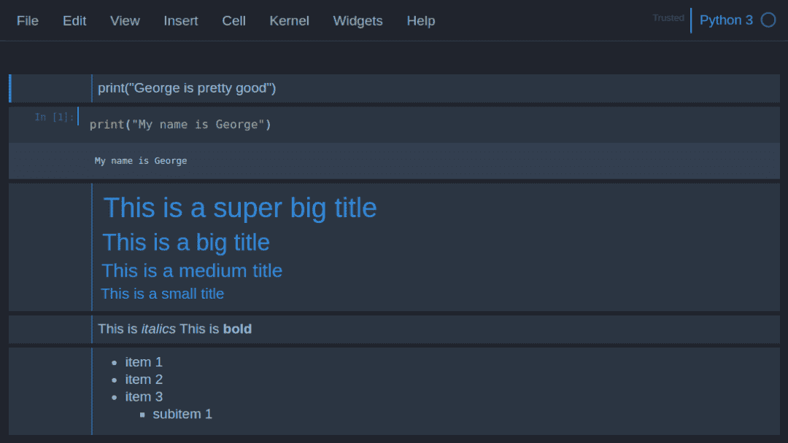
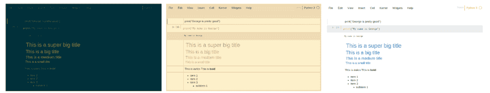
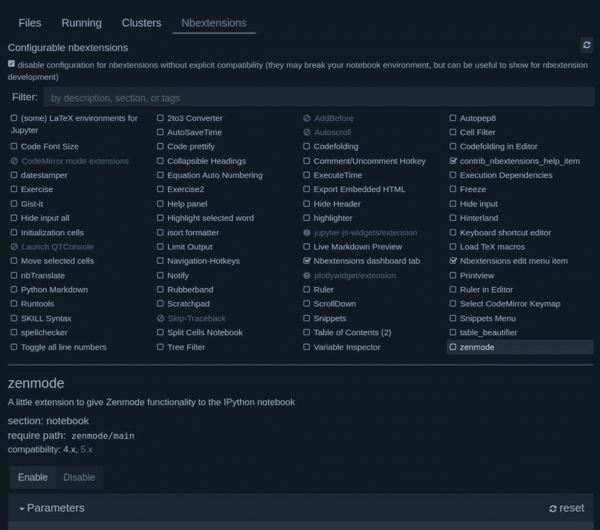
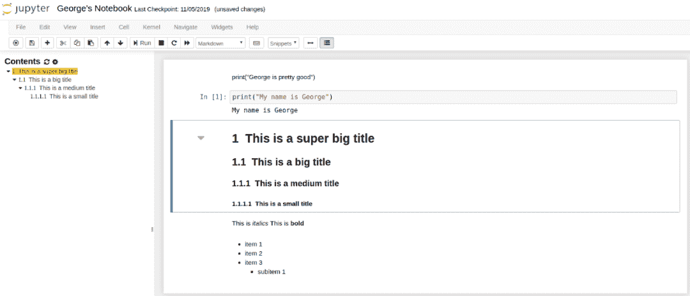
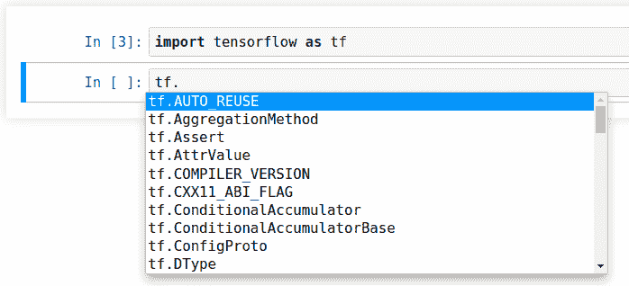
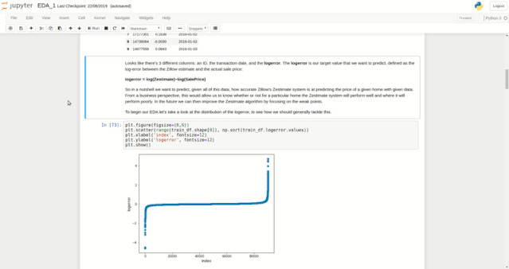
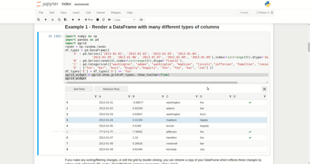

# 增强 Jupyter Notebook 的功能，这里有四个妙招

> 原文：[`mp.weixin.qq.com/s?__biz=MzA3MzI4MjgzMw==&mid=2650770564&idx=3&sn=6b21b4eeb2b3e0f4cbdf0a9ada6766d4&chksm=871a48fab06dc1ecf478d199cd582330a88defcf5cc3ab1ff5a8e0f94f510c5eaaf346ab244d&scene=21#wechat_redirect`](http://mp.weixin.qq.com/s?__biz=MzA3MzI4MjgzMw==&mid=2650770564&idx=3&sn=6b21b4eeb2b3e0f4cbdf0a9ada6766d4&chksm=871a48fab06dc1ecf478d199cd582330a88defcf5cc3ab1ff5a8e0f94f510c5eaaf346ab244d&scene=21#wechat_redirect)

选自 toward data science

**作者：****George Seif**

**机器之心编译**

**参与：****魔王**

> 你对 Jupyter Notebook 了解多少？本文介绍了一些自定义功能，帮助你使用 Jupyter notebook 更高效地写代码。

Jupyter Notebook 是所有开发者共享工作的神器，它为共享 Notebooks 提供了一种便捷方式：结合文本、代码和图更快捷地将信息传达给受众。目前，Jupyter Notebook 已经应用于数据分析和数据科学等领域。然而，大部分开发者仅仅了解其皮毛。开发者使用 Jupyter Notebook 的基本功能来写 Python 代码、展示图。但是你们知道 Jupyter 中还有大量自定义功能吗？这些很酷的选项可以帮助你使用 Jupyter notebook 更高效地写代码、展示图。本文将介绍强化 Jupyter Notebook 功能的 4 种方法。**1\. 执行 Shell 命令**在技术或编程文本中，shell 表示使用文本与计算机进行交互的方式。最流行的 Unix shell 是 Bash（Bourne Again SHell），Bash 是 Linux 机器上终端默认的 shell。在使用 Python 工作时，你会经常在写 Python 代码和使用 shell 命令之间来回切换。例如，你想使用 Python 读取磁盘中的某份文件，而这需要你确认文件名。通常情况下，你需要在终端输入 ls，获得当前目录的所有文件和文件夹列表。但这样来回切换非常繁琐低效。很炫酷的是，Jupyter 能够执行 Shell 命令，你甚至无需离开浏览器。只需要在 shell 命令前加一个感叹号!，Jupyter 会将其转换为 Bash。在任一命令前加感叹号!，它们就可以在 Python Jupyter Notebook 中运行。

```py
# Listing folder contents
>>> !ls
mynotebook.ipynb stuff.txt# Getting the current directory
>>> !pwd
/home/george/github/project_1# Printing from Bash 
>>> !echo "Pizza is delicious!"
Pizza is delicious! 
```

我们还可以将 shell 命令的输出分配给 Python 变量，如下所示：

```py
# Getting the current directory. 
# The variable "X" now contains ["/home/george/github/project_1"]
X = !pwd 
```

**2\. 更换主题**



很多文本编辑器和编程 IDE 都有自定义主题。开发者最喜欢的主题之一是暗黑主题（如 monaki），因为对于整天盯着屏幕的开发者而言，暗黑主题看起来比较舒适。幸运的是，Jupyter 有一个插件，允许用户自行选择主题。要想安装该插件，你只需在终端中运行以下 pip 命令：

```py
pip install jupyterthemes
```

运行以下命令，可得到可用的主题列表：

```py
jt -l 
```

截至本文写作时，可选择的主题包括：

```py
chesterish
grade3
gruvboxd
gruvboxl
monokai
oceans16
onedork
solarizedd
solarizedl 
```

查看这些主题，如下图所示，我们拥有大量不同的颜色选择。

*solarizedd（左），gruvboxl（中），grade3（右）。*

**3\. Notebook 扩展插件**Jupyter Notebook 扩展插件（nbextensions）是一些 JavaScript 模块，你可以使用它们强化 Notebook 的功能以及使用。扩展插件本质上修改了 Jupyter UI，以实现更稳健的功能。我们首先通过 pip 安装 nbextensions：

```py
pip install jupyter_contrib_nbextensions `jupyter contrib nbextension install`
```

安装完成后，启动 Jupyter。你将看到一个新选项——NBextensions。选择它之后，你会看到大量 Jupyter Notebook 扩展插件选项。



通过快速搜索，你可以查看这些扩展插件的功能。下面我将介绍几个最重要的插件。**Table of Contents**正如其名称所描述的那样，Table of Contents 基于 notebook 中 # 创建的标题自动生成目录。例如，我在 notebook 中创建了以下标题：

```py
# This is a super big title
## This is a big title
### This is a medium title
#### This is a small title
```

则左侧会生成目录。双击标题，可链接至对应章节内容。当 notebook 规模很大，选项很多时，这个功能非常方便！



**Hinterland**代码补全是大部分 IDE 都具备的常见功能，比如 PyCharm。开发者喜欢这个功能，因为这使得他们的工作更加简单，开发者无需记住每一个命令，IDE 会准备好一切。Hinterland 可在 Jupyter Notebook 内完成代码补全。在键入过程中，你会看到一些代码补全建议。尤其是当你搜索外部库的命令时（示例如下所示）。这简直太方便了！



**拆分单元格（Split Cells）**拆分单元格允许开发者并排查看 2 个单元格。当你有两个相关单元格时（比如描述及其对应的图示），这个功能非常方便。



**4\. 使用 Qgrid 探索 Dataframes**最后一站是 Qgrid，该工具允许开发者在不使用复杂 Pandas 代码的情况下，探索和编辑数据帧。Qgrid 可在 Jupyter notebook 中以交互的方式渲染 pandas 数据帧，这样你就可以执行一些直观的控制，如滚动、排序和筛选，以及双击单元格编辑数据帧。我们首先安装 Qgrid：

```py
pip install qgrid
jupyter nbextension enable --py --sys-prefix widgetsnbextension
```

要想使用 Qgrid 渲染数据帧，开发者只需导入 Qgrid，然后将数据帧输入到 show_grid 函数：

```py
import qgrid
qgrid_widget = qgrid.show_grid(df, show_toolbar=True)
qgrid_widget
```

这样，你可以对数据帧执行大量交互式操作：

*   添加和删除行；

*   筛选行；

*   编辑单元格。

将更多参数输入 show_grid 函数可以执行其他交互式操作。关于 Qgrid 的全部功能，参见：https://github.com/quantopian/qgrid。



以上就是强化 Jupyter Notebook 功能的 4 种方法。

*原文链接：**https://towardsdatascience.com/4-awesome-tips-for-enhancing-jupyter-notebooks-4d8905f926c5*

********本****文为机器之心编译，**转载请联系本公众号获得授权****。**
✄------------------------------------------------**加入机器之心（全职记者 / 实习生）：hr@jiqizhixin.com****投稿或寻求报道：**content**@jiqizhixin.com****广告 & 商务合作：bd@jiqizhixin.com**