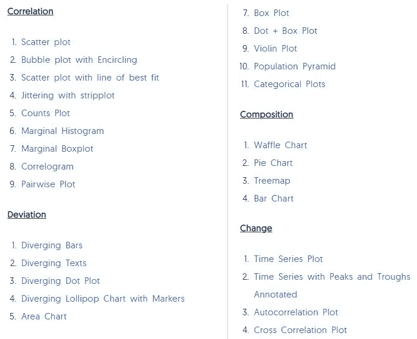
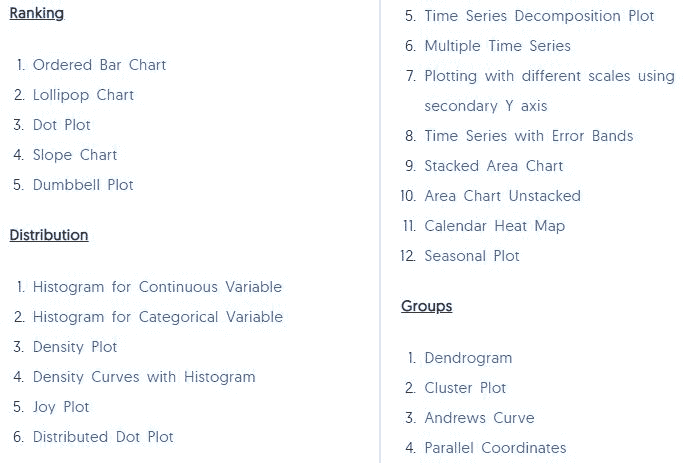
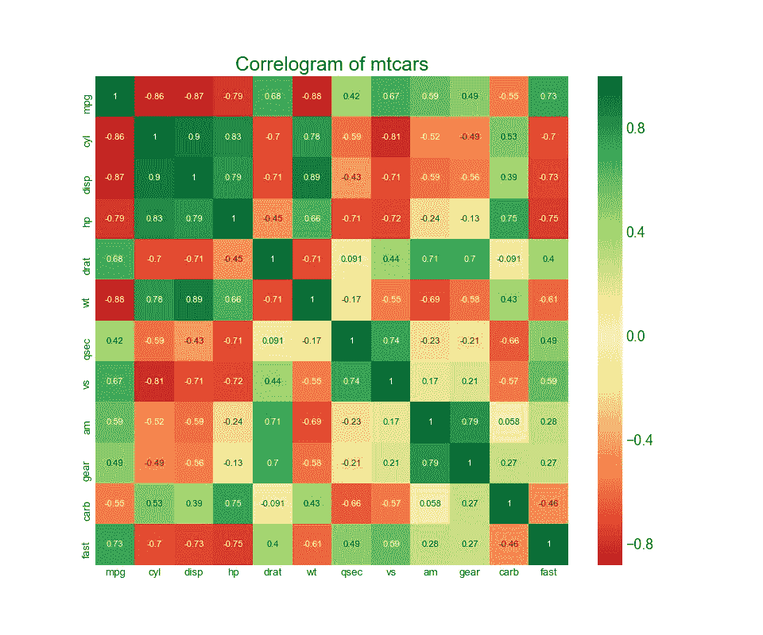
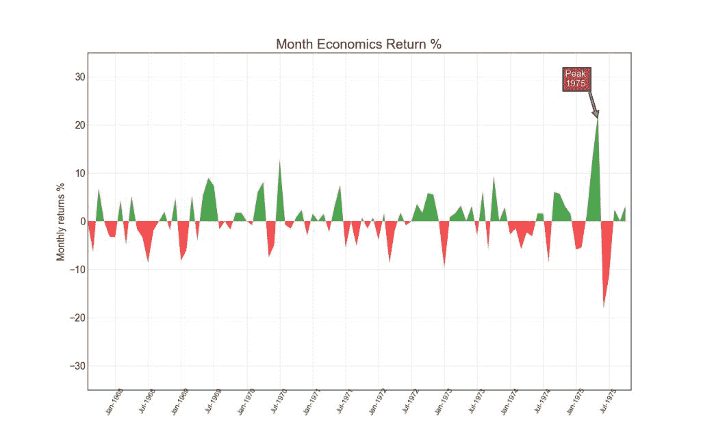
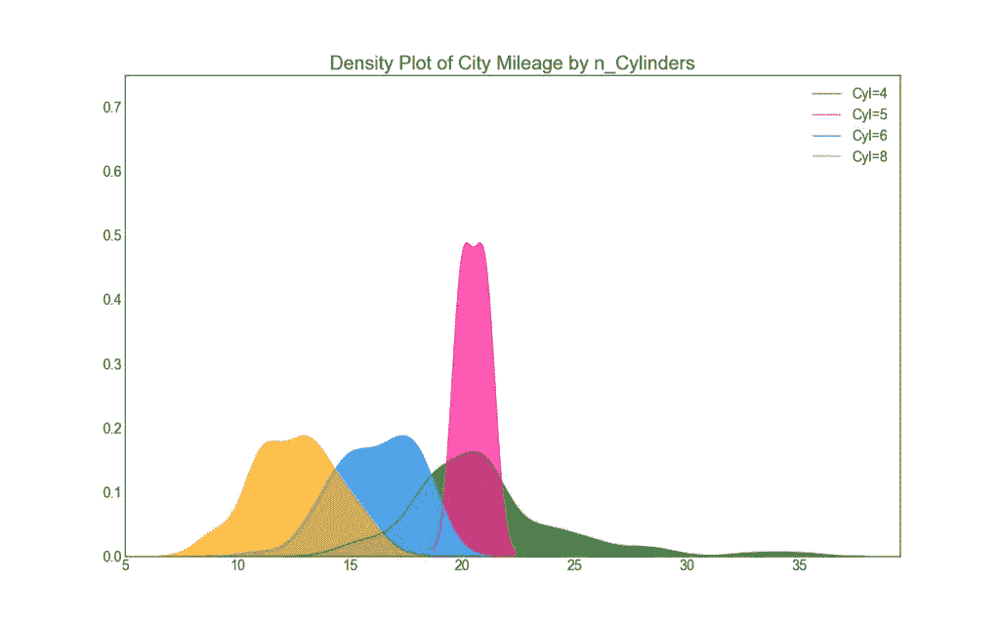
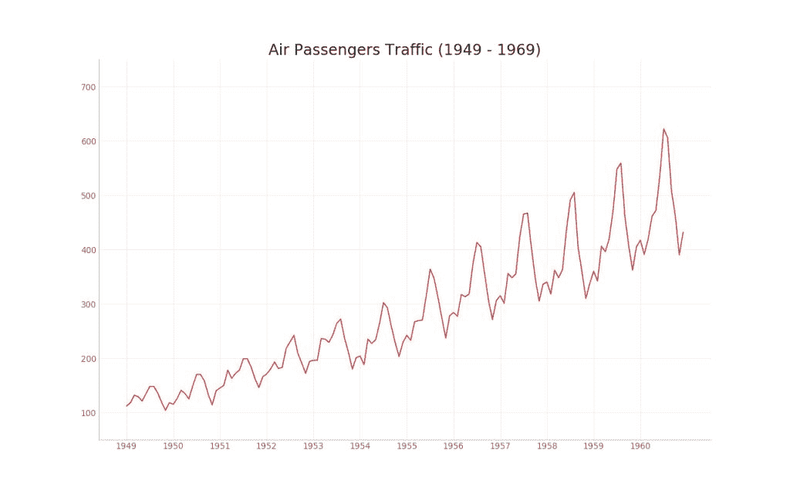
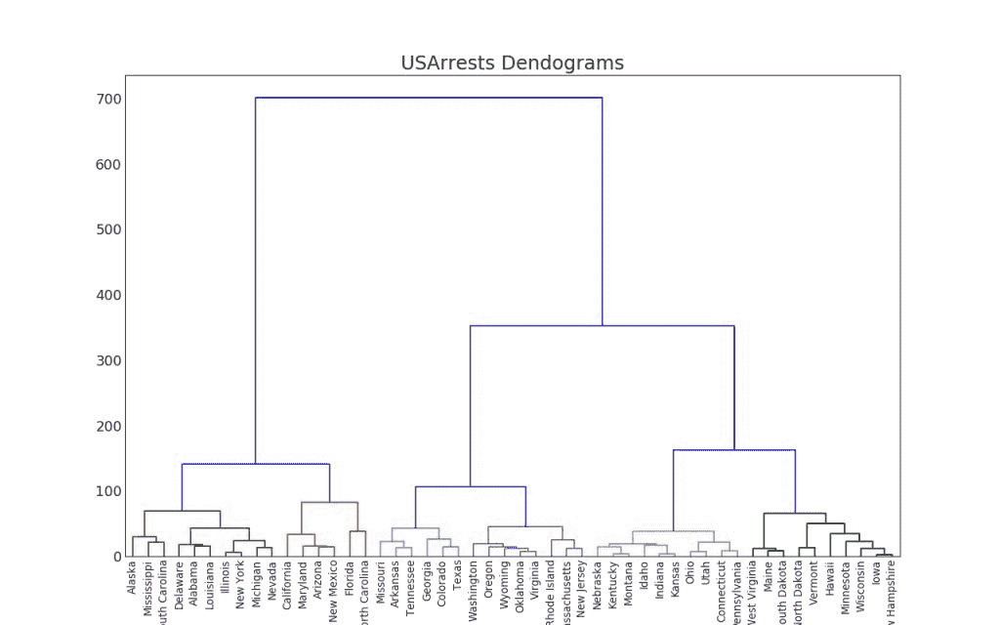

# 五十种常用的 matplotlib 可视化，再也不用担心模型背着我乱跑了

> 原文：[`mp.weixin.qq.com/s?__biz=MzA3MzI4MjgzMw==&mid=2650755443&idx=3&sn=0229c2d8eeb8e07486d6393cd9b983ae&chksm=871a950db06d1c1b9d7a08b38f2f16f974e5a79f994fb44175dab7a3ef5d7ece39e7763c8f49&scene=21#wechat_redirect`](http://mp.weixin.qq.com/s?__biz=MzA3MzI4MjgzMw==&mid=2650755443&idx=3&sn=0229c2d8eeb8e07486d6393cd9b983ae&chksm=871a950db06d1c1b9d7a08b38f2f16f974e5a79f994fb44175dab7a3ef5d7ece39e7763c8f49&scene=21#wechat_redirect)

机器之心报道

**参与：思源**

> 数据分析与机器学习中常需要大量的可视化，因此才能直观了解模型背地里都干了些什么。而在可视化中，matplotlib 算得上是最常用的工具，不论是对数据有个预先的整体了解，还是可视化预测效果，matplotlib 都是不可缺失的模块。最近 Machine Learning Plus 的作者介绍了 50 种最常用的 matplotlib 可视化图表，而本文简要介绍了这篇文章，详细的 50 种可视化需要查阅原文。

50 种可视化图原地址：https://www.machinelearningplus.com/plots/top-50-matplotlib-visualizations-the-master-plots-python

**介绍**

该表格主要介绍了 7 种不同的 matplotlib 可视化类别，读者可根据目的选择不同的图。例如，如果你想要绘制两个变量之间的关系，查看下面 Correlation 部分；或者如果你想展示某个变量的动态变化，查看下面的 Change 部分。

一个美丽的图表应该：

*   提供准确、有需求的信息，不歪曲事实；

*   设计简单，获取时不会太费力；

*   美感是为了支持这些信息，而不是为了掩盖这些信息；

*   不要提供太过丰富的信息与太过复杂的结构。

如下所示为 7 种不同类型的可视化图表：协相关性主要描述的是不同变量之间的相互关系；偏差主要展现出不同变量之间的差别；排序主要是一些有序的条形图、散点图或斜线图等；分布就是绘制概率与统计中的分布图，包括离散型的直方图和连续型的概率密度分布图等。后面还有变量的时序变化图和类别图等常见的可视化制图类别。

**配置**

在绘制这 50 种可视化图之前，我们需要配置一下依赖项以及通用设定，当然后面有一些独立的美图会修改通用设定。如果读者看中了某种可视化图，那么用这些配置再加上对应的可视化代码就能嵌入到我们自己的项目中。

如下所示 pandas 与 numpy 主要用于读取和处理数据，matplotlib 与 seaborn 主要用于可视化数据。其中 seaborn 其实是 matplotlib 上的一个高级 API 封装，在大多数情况下使用 seaborn 就能做出很有吸引力的图，而使用 matplotlib 能制作更具特色的图。

```py
# !pip install brewer2mpl
import numpy as np
import pandas as pd
import matplotlib as mpl
import matplotlib.pyplot as plt
import seaborn as sns
import warnings; warnings.filterwarnings(action='once')

large = 22; med = 16; small = 12
params = {'axes.titlesize': large,
          'legend.fontsize': med,
          'figure.figsize': (16, 10),
          'axes.labelsize': med,
          'axes.titlesize': med,
          'xtick.labelsize': med,
          'ytick.labelsize': med,
          'figure.titlesize': large}
plt.rcParams.update(params)
plt.style.use('seaborn-whitegrid')
sns.set_style("white")
%matplotlib inline

# Version
print(mpl.__version__)  #> 3.0.0
print(sns.__version__)  #> 0.9.0 
```

**制图示意**

前面列出了 7 大类共 50 种不同的可视化图，但我们无法一一介绍，因此我们从协相关性、偏差、分布、时序变化和群组图中各选择了一个示例，它们能展示不同数据在不同情况下的可视化需求。

**相关图（Correllogram）**

若有两种变量，且它们的值为离散的，那么二维相关图可以表示两个变量所有可能组合之间的相关性。当然如果是单变量，那么自身所有可能的组合也可以组成一个相关图：

```py
# Import Dataset
df = pd.read_csv("https://github.com/selva86/datasets/raw/master/mtcars.csv")

# Plot
plt.figure(figsize=(12,10), dpi= 80)
sns.heatmap(df.corr(), xticklabels=df.corr().columns, yticklabels=df.corr().columns, cmap='RdYlGn', center=0, annot=True)

# Decorations
plt.title('Correlogram of mtcars', fontsize=22)
plt.xticks(fontsize=12)
plt.yticks(fontsize=12)
plt.show() 
```

**面积图（Area Chart）**

通过使用不同的颜色表示水平轴和线之间的区域，面积图不仅强调峰值和低谷值，同时还强调它们持续的时间：即峰值持续时间越长，面积越大。

```py
import numpy as np
import pandas as pd

# Prepare Data
df = pd.read_csv("https://github.com/selva86/datasets/raw/master/economics.csv", parse_dates=['date']).head(100)
x = np.arange(df.shape[0])
y_returns = (df.psavert.diff().fillna(0)/df.psavert.shift(1)).fillna(0) * 100

# Plot
plt.figure(figsize=(16,10), dpi= 80)
plt.fill_between(x[1:], y_returns[1:], 0, where=y_returns[1:] >= 0, facecolor='green', interpolate=True, alpha=0.7)
plt.fill_between(x[1:], y_returns[1:], 0, where=y_returns[1:] <= 0, facecolor='red', interpolate=True, alpha=0.7)

# Annotate
plt.annotate('Peak \n1975', xy=(94.0, 21.0), xytext=(88.0, 28),
             bbox=dict(boxstyle='square', fc='firebrick'),
             arrowprops=dict(facecolor='steelblue', shrink=0.05), fontsize=15, color='white')

# Decorations
xtickvals = [str(m)[:3].upper()+"-"+str(y) for y,m in zip(df.date.dt.year, df.date.dt.month_name())]
plt.gca().set_xticks(x[::6])
plt.gca().set_xticklabels(xtickvals[::6], rotation=90, fontdict={'horizontalalignment': 'center', 'verticalalignment': 'center_baseline'})
plt.ylim(-35,35)
plt.xlim(1,100)
plt.title("Month Economics Return %", fontsize=22)
plt.ylabel('Monthly returns %')
plt.grid(alpha=0.5)
plt.show() 
```

**密度图（Density Plot）**

在概率论与统计学习方法中，可视化概率密度就变得非常重要了。这种密度图正是可视化连续型随机变量分布的利器，分布曲线上的每一个点都是概率密度，分布曲线下的每一段面积都是特定情况的概率。如下所示，通过将它们按「response」变量分组，我们可以了解 X 轴和 Y 轴之间的关系。

```py
# Import Data
df = pd.read_csv("https://github.com/selva86/datasets/raw/master/mpg_ggplot2.csv")

# Draw Plot
plt.figure(figsize=(16,10), dpi= 80)
sns.kdeplot(df.loc[df['cyl'] == 4, "cty"], shade=True, color="g", label="Cyl=4", alpha=.7)
sns.kdeplot(df.loc[df['cyl'] == 5, "cty"], shade=True, color="deeppink", label="Cyl=5", alpha=.7)
sns.kdeplot(df.loc[df['cyl'] == 6, "cty"], shade=True, color="dodgerblue", label="Cyl=6", alpha=.7)
sns.kdeplot(df.loc[df['cyl'] == 8, "cty"], shade=True, color="orange", label="Cyl=8", alpha=.7)

# Decoration
plt.title('Density Plot of City Mileage by n_Cylinders', fontsize=22)
plt.legend()
plt.show() 
```

此外值得注意的是，深度学习，尤其是深度生成模型中的分布极其复杂，它们是不能直接可视化的，我们一般会通过 T-SNE 等降维方法可视化。

**时序变化图（Time Series Plot）**

时序变化图也是机器学习中最常见的一种可视化图表，不论是可视化损失函数还是准确率，都需要这种时序变化图的帮助。这种图主要关注某个变量怎样随时间变化而变化，以下展示了从 1949 到 1969 航空客运量的变化：

```py
# Import Data
df = pd.read_csv('https://github.com/selva86/datasets/raw/master/AirPassengers.csv')

# Draw Plot
plt.figure(figsize=(16,10), dpi= 80)
plt.plot('date', 'traffic', data=df, color='tab:red')

# Decoration
plt.ylim(50, 750)
xtick_location = df.index.tolist()[::12]
xtick_labels = [x[-4:] for x in df.date.tolist()[::12]]
plt.xticks(ticks=xtick_location, labels=xtick_labels, rotation=0, fontsize=12, horizontalalignment='center', alpha=.7)
plt.yticks(fontsize=12, alpha=.7)
plt.title("Air Passengers Traffic (1949 - 1969)", fontsize=22)
plt.grid(axis='both', alpha=.3)

# Remove borders
plt.gca().spines["top"].set_alpha(0.0)    
plt.gca().spines["bottom"].set_alpha(0.3)
plt.gca().spines["right"].set_alpha(0.0)    
plt.gca().spines["left"].set_alpha(0.3)   
plt.show() 
```

**树状图（Dendrogram）**

树状图是另一个比较有用的图表，层次聚类或决策树等算法可以使用它完成优美的可视化。树形图是以树的图形表示数据或模型结构，以父层和子层的结构来组织对象，是枚举法的一种表达方式。下图展示了一种神似层次聚类算法的图表：

```py
import scipy.cluster.hierarchy as shc

# Import Data
df = pd.read_csv('https://raw.githubusercontent.com/selva86/datasets/master/USArrests.csv')

# Plot
plt.figure(figsize=(16, 10), dpi= 80)  
plt.title("USArrests Dendograms", fontsize=22)  
dend = shc.dendrogram(shc.linkage(df[['Murder', 'Assault', 'UrbanPop', 'Rape']], method='ward'), labels=df.State.values, color_threshold=100)  
plt.xticks(fontsize=12)
plt.show() 
```



****本文为机器之心报道，**转载请联系本公众号获得授权****。**

✄------------------------------------------------

**加入机器之心（全职记者 / 实习生）：hr@jiqizhixin.com**

**投稿或寻求报道：**content**@jiqizhixin.com**

**广告 & 商务合作：bd@jiqizhixin.com**