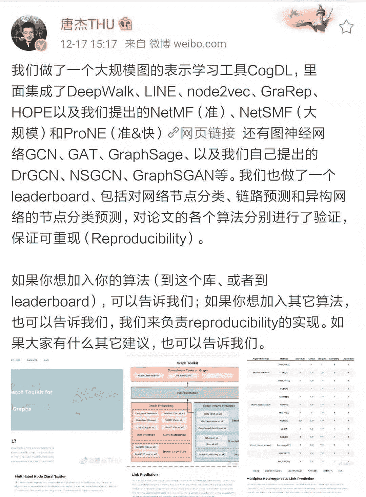
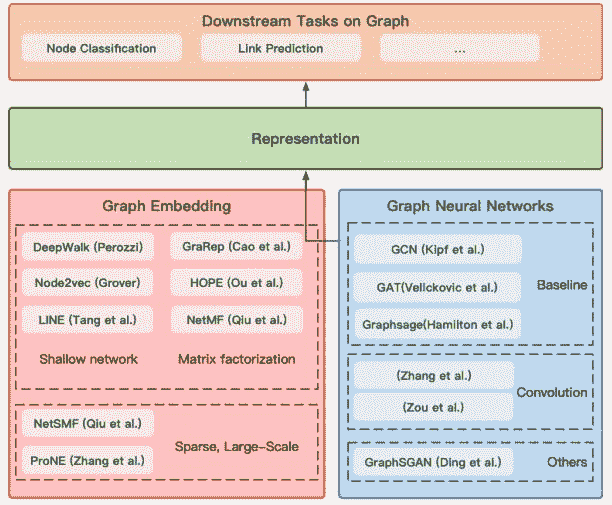
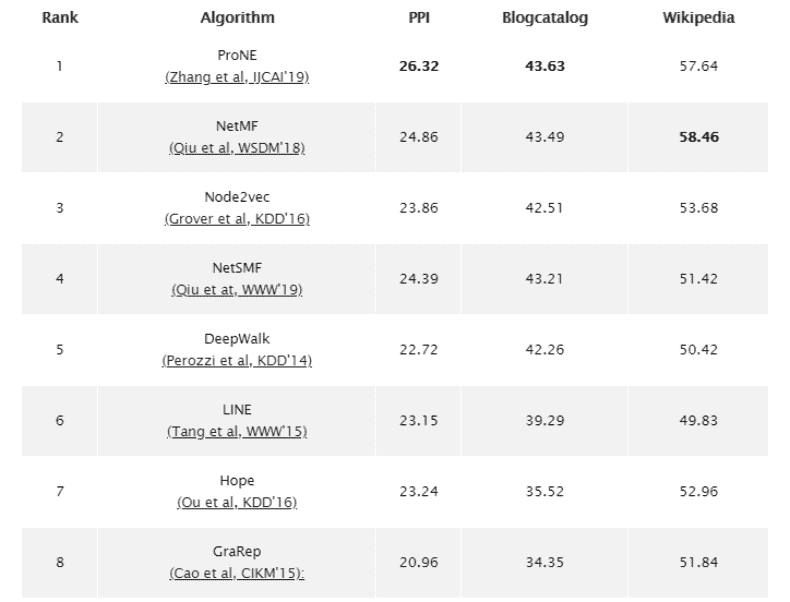
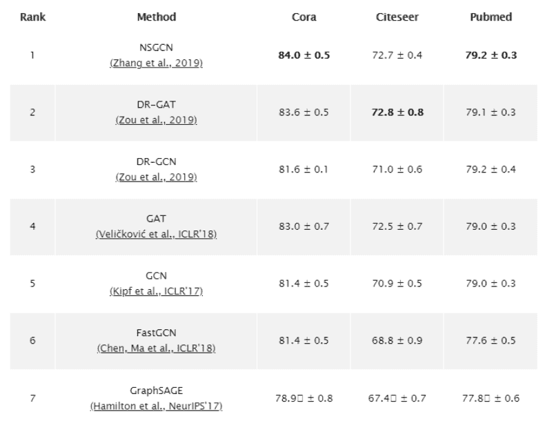
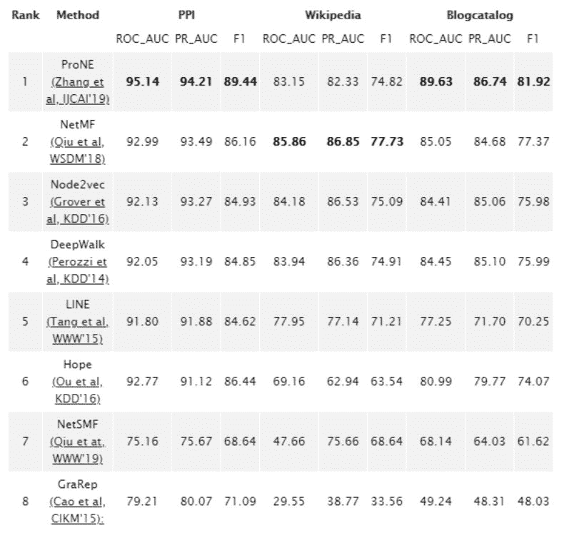
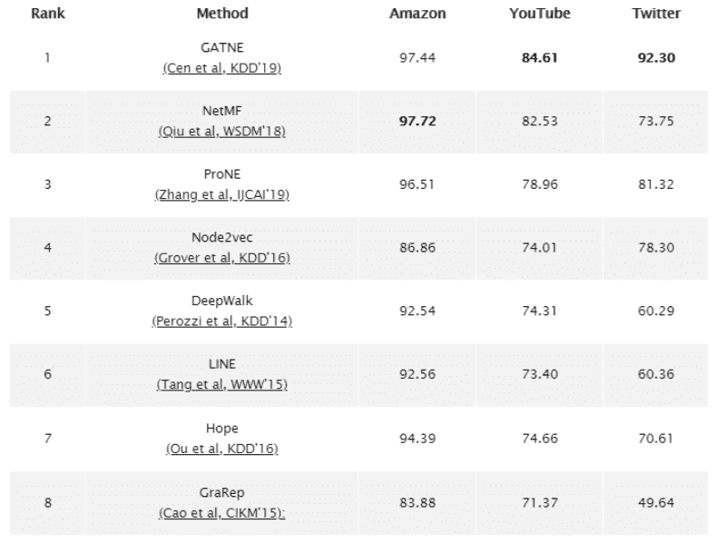
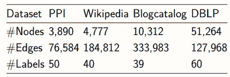
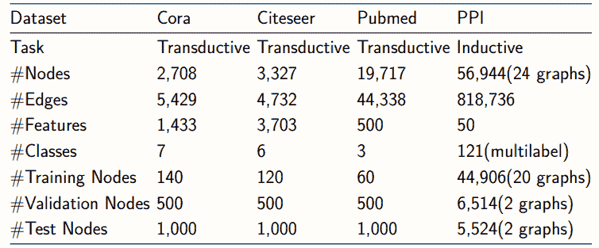
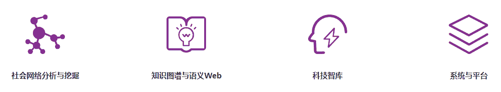

# 集成图网络模型实现、基准测试，清华推出图表示学习工具包

> 原文：[`mp.weixin.qq.com/s?__biz=MzA3MzI4MjgzMw==&mid=2650776657&idx=3&sn=a96b44135f1744da4a5404d24caaf8f7&chksm=871a602fb06de9391e6d1d1fd0f04a658be32f62314237cfc1e89a2839079e02836f81e15023&scene=21#wechat_redirect`](http://mp.weixin.qq.com/s?__biz=MzA3MzI4MjgzMw==&mid=2650776657&idx=3&sn=a96b44135f1744da4a5404d24caaf8f7&chksm=871a602fb06de9391e6d1d1fd0f04a658be32f62314237cfc1e89a2839079e02836f81e15023&scene=21#wechat_redirect)

机器之心报道

**参与：张倩、杜伟**

> 近日，清华大学知识工程研究室（KEG）推出了一个大规模图表示学习工具包 CogDL，可以让研究者和开发者更加方便地训练和对比用于节点分类、链路预测以及其他图任务的基准或定制模型。该工具包集成了 Deepwalk、LINE、node2vec、GraRep、NetMF、NetSMF、ProNE 等非图神经网络和 GCN、GAT、GraphSage、DrGCN、NSGCN、GraphSGAN 等图神经网络基准模型的实现。

*清华大学计算机科学与技术系长聘教授、计算机系副主任、知识工程研究院教师唐杰发微博介绍 CogDL 项目。*

*   项目页面：http://keg.cs.tsinghua.edu.cn/cogdl/index.html

*   GitHub 链接：https://github.com/THUDM/cogdl/

与其他图表示学习工具包相比，CogDL 具有以下特点：

*   稀疏性：在具有数千万节点的大规模网络上实现快速网络嵌入；

*   任意性：能够处理属性化、多路和异构等不同图结构的网络；

*   并行处理：在多个 GPU 上实现不同种子和模型的并行训练并自动输出结果表格；

*   可扩展性：轻松添加新的数据集、模型和任务并在所有现有的模型/数据集上测试。

*CogDL 图表示学习工具包的整体框架。***下游任务的 SOTA 结果和基准方法排行榜**对于节点分类（有无节点属性）、链路预测（有无属性、异构与否）和多路异构链路预测等下游任务，CogDL 提供了在这些任务上 SOTA 结果和基准方法的排行榜。**多标签和有属性的节点分类**如下图所示，这是**无监督多标签节点分类设置**的排行榜，开发者在真实世界的几个数据集（PPI、Blogcatalog 和 Wikipedia）上运行所有的算法并得出了排序后的实验结果。

*ProNE、NetMF 和 Note2Vec 位列前三甲。*下图展示了集中流行图神经网络在内的**监督式节点分类直推设置**的排行榜。

*排名前三的是 NSGCN、DR-GAT 和 DR-GCN。***链路预测**对于链路预测任务，开发者分别采用了 **ROC、AUC 和 F1-score**，这些用来表征随机未观察到链路中的顶点（vertices）比随机不存在链路中顶点更相似的概率。他们对这些指标进行了评估并删除了 PPI、Wikipedia 和 Blogcatalog 三种数据集上 15% 的边缘计算。最后实验重复了 10 次，并按顺序进行排列。

*ProNE 排名第一。***多路异构链路预测**最后，对于多路异构链路预测任务，开发者依然采用了 ROC 评估指标。同样地，他们对该指标进行了评估并删除了 Amazon、YouTube 和 Twitter 三种数据集上 15% 的边缘计算。最后实验重复了 10 次，并按顺序进行排列。

*在此分类中排名前三的方法是 GATNE、NetMF 和 ProNE。***CogDL 怎么用？**开发者在 GitHub 项目中介绍了 CogDL 的详细使用方法。要使用该工具，首先需要安装 Pytorch 和 Python，版本要求分别是：PyTorch version >= 1.0.0；Python version >= 3.6。接下来，可以使用 python train.py --task example_task --dataset example_dataset --model example_method 在 example_data 上运行 example_method，然后通过 example_task 来进行评估。CogDL 中的常规参数包括：

*   -task，评估表示的下游任务，如 node_classification、unsupervised_node_classification、link_prediction multiplex_link_prediction 等；

*   -datasets，支持的数据集包括'cora'、'citeseer'、'pumbed'、'PPI'、'wikipedia'、'blogcatalog'、'dblp'、'flickr'；

*   -models，要运行的模型名称包括『gcn』、『gat』、『graphsage』、『deepwalk』、『line』、 『node2vec』、『hope』、『grarep』、『netmf』、『netsmf』和『prone』。

其他特定参数可以参见 GitHub。除了这种常规用法之外，CogDL 还支持用户将自己表现良好的算法和数据集添加到项目中。具体步骤也可以在 GitHub 页面找到。**支持的数据集**下面两个表格列出了 CogDL 支持的数据集，包括含有属性的数据集和不含属性的数据集。

*没有多标签节点分类属性的数据集。*

*含有多标签节点分类属性的数据集。***清华知识工程研究室（KEG）**清华大学知识工程研究室成立于 1996 年，致力于网络环境下知识工程理论、方法和应用研究。主要研究内容包括：社会网络分析与挖掘、新闻挖掘、语义 Web、知识图谱构建等。研究成果在相关领域的 ACM/IEEE Transaction 以及计算机学会指定的 A 类国际期刊、会议上发表 70 余篇高水平论文。实验室在理论与应用研究结合方面成绩显著，研发的科研人员社会网络挖掘系统 ArnetMiner 是国内最早研发的、也是至今访问量最大的研究者社会网络分析与挖掘系统，系统目前已有 200 多个国家和地区 800 多万独立 IP 的访问。该实验室的负责人是清华大学计算机科学与技术系软件研究所副所长李涓子，授课教师包括计算机科学与技术系长聘教授、计算机系副主任唐杰、清华大学计算机科学与技术系副教授许斌等。此外，研究室还有多位优秀的硕士、博士、博士后及访问学生、工程师等。**[机器之心「SOTA 模型」](http://mp.weixin.qq.com/s?__biz=MzA3MzI4MjgzMw==&mid=2650770891&idx=1&sn=25bde35991047a997337c8dd25350089&chksm=871a49b5b06dc0a36fc3407e3643550ef97f72b007e67c4f4be250bfd60c9fdc5389624569c0&scene=21#wechat_redirect)****：****22****大领域、127 个任务，机器学习 SOTA 研究一网打尽。******

点击阅读原文，立即访问。