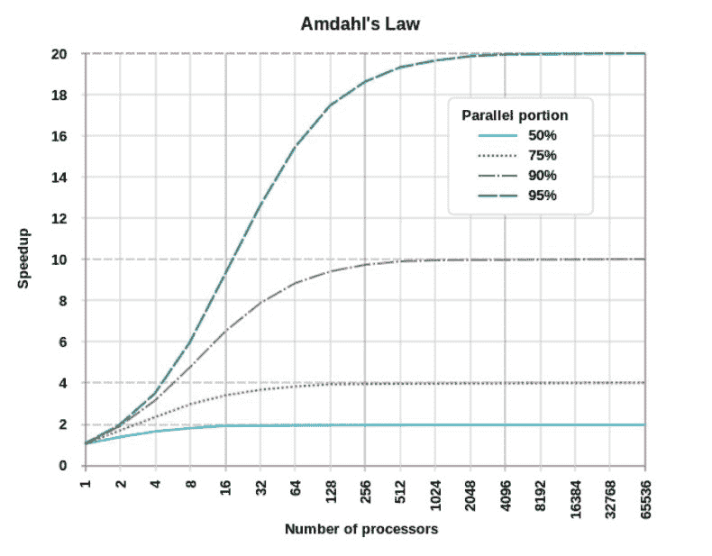
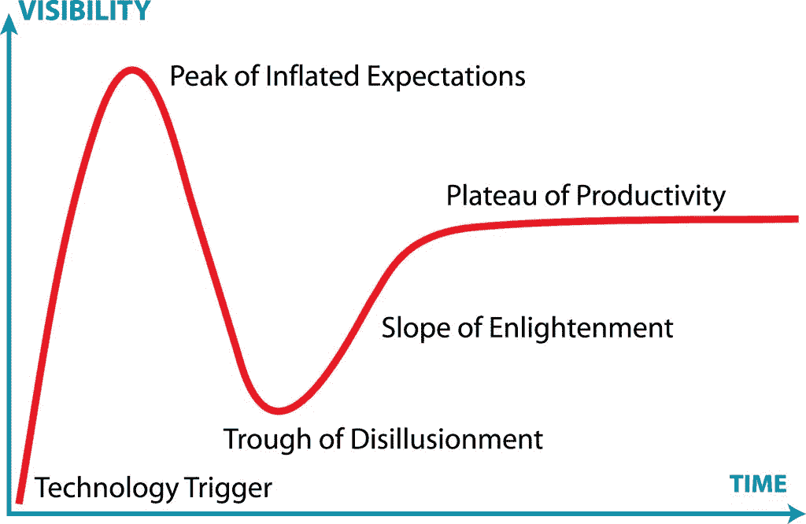

# GitHub 最热！码代码不得不知的所有定律法则

> 原文：[`mp.weixin.qq.com/s?__biz=MzA3MzI4MjgzMw==&mid=2650762092&idx=3&sn=026850612026506f7c5c3c64b6e21b53&chksm=871aaf12b06d2604dba9b34d792986402c4f554317b1ec1d77bf004ef5a91725da902b15c208&scene=21#wechat_redirect`](http://mp.weixin.qq.com/s?__biz=MzA3MzI4MjgzMw==&mid=2650762092&idx=3&sn=026850612026506f7c5c3c64b6e21b53&chksm=871aaf12b06d2604dba9b34d792986402c4f554317b1ec1d77bf004ef5a91725da902b15c208&scene=21#wechat_redirect)

选自 GitHub

**作****者：Dave Kerr**

**机器之心编译**

> 当谈到开发问题时，人们总会谈论各种定律。但对于大多数人来说，总有一些是你不了解的，这个问题就需要使用程序员最喜欢的方法解决了：最近 GitHub 上的一个「定律合集」项目突然登上了趋势榜第二位，Star 数上千，该项目对一些最常见的定律进行了概括，详情见下文。

大家都是资深程序员，以后就不要老念叨「真香定律」了。

*   项目链接：https://github.com/dwmkerr/hacker-laws

本文包含对一些定律、原则和模式的解释，但并不主张其中任何一项。是否要应用哪个定律一直是一个争论性问题，并且很大程度上取决于你在做哪方面的工作。

这些规则目录如下：

定律

*   阿姆达尔定律

*   布鲁克斯法则

*   康威定律

*   侯世达定律

*   炒作周期 & 阿玛拉定律

*   海勒姆法则

*   摩尔定律

*   帕金森定律

*   Putt's Law

*   复杂性守恒定律（泰斯勒定律）

*   抽象漏洞定律

*   帕金森琐碎定律

*   Unix 哲学

*   The Spotify Model

*   Wadler's Law

原则

*   稳健性原则

*   SOLID

*   单一功能原则

*   开闭原则

*   里氏替换原则

*   接口隔离原则

*   依赖反转原则

对于以上如此多的定律和原则，我们选取了其中一些定律和所有的原则进行编译。现在，先简单看一下定律吧↓↓

**定律**

**阿姆达尔定律**

维基百科：计算机科学界的经验法则，因吉恩·阿姆达尔而得名。它代表了处理器并行运算之后效率提升的能力。阿姆达尔定律是固定负载（计算总量不变时）时的量化标准。

举例说明，如果一个程序由两部分（A 和 B）组成，A 必须有单个处理器执行，B 可以并行执行，那么在执行该程序的系统中增加多个处理器带来的好处是有限的。它可能会大大提升 B 的速度，但 A 的速度会保持不变。如下如所示：

从图中可以看出，一个程序如果只有 50%的部分可并行处理，那它使用 10 个以上处理单元时，处理速度将不会有很大的提升。而一个程序如果有 95%的部分可并行处理，即使使用的处理单元超过 1000 个，其处理速度也会显著提高。

**侯世达定律**

维基百科：做事所花费的时间总是比你预期的要长，即使你的预期中考虑了侯世达定律。

当你估计做一件事要花费多长时间时，可能会想到这一定律。软件开发中的老生常谈是，我们往往很难估计交付某个东西所需要的准确时间。

**炒作周期 & 阿玛拉定律**

维基百科：我们总是高估一项技术的短期效益，而低估其长期效果。

此定律被描述为鼓励人们思考科技所能带来的长期影响的言论。同时，阿玛拉定律也被人们称为是对“炒作周期”（技术成熟度曲线）最形象的说明。如下图所示：

简言之，这一周期表明，新技术及其潜在影响通常会引起一阵兴奋。然后很多团队快速投入该技术，然后有时会对结果感到失望。这可能是因为技术还不够成熟，也可能是因为现实应用还没有完全实现。

经过一段时间后，技术的能力增加，使用技术的实际机会也增加，置身其中的团队最终开始受益。

**海勒姆法则**

网络定义：当一个 API 有足够多的用户时，你在约定中承诺什么都无所谓，所有在你系统里面被观察到的行为都会被一些用户直接依赖。

海勒姆法则指出，当你的 API 有非常多的用户时，API 中的所有行为最终都会被某个人所依赖。举个简单的例子：非功能性元素，如 API 的响应时间。稍微复杂一点的例子：依赖对错误消息应用正则表达式来确定 API 错误类型的用户。

**摩尔定律**

该定律认为，集成电路中的晶体管数量大约每两年翻一番。

该定律通常用来表示半导体和芯片技术发展的绝对速度。从上世纪 70 年代到 90 年代末，摩尔的预测一直非常精准。但近年来，该趋势已经发生了细微的变化，部分原因在于组件小型化程度受到的物理限制。然而，并行化的发展以及半导体技术和量子计算领域潜在的革命性变化，可能意味着摩尔定律在未来几十年仍将适用。

**复杂性守恒定律（泰斯勒定律）**

该定律认为每个系统内都有一定的复杂性不可减少。

系统中的某些复杂性是“不经意的”。可能是由结构不良、错误或只是建模不良造成的结果。这些不经意造成的复杂性是可以减少（或消除）的。但是，有些复杂性是“固有的”，是由亟待解决问题的内在复杂性造成的。而这种复杂性可以移动，但无法消除。

这个定律有趣的一点在于，即使简化整个系统，也无法降低内在的复杂性。这种方法只不过是将复杂性转移到了用户一方，然后用户必须以更复杂的方式行事。

**帕金森琐碎定律**

该定律认为，大型组织会花费大量时间和精力来讨论无关紧要的琐事，但是真正重大的决议反而可以轻松过关。

这是因为，在讨论非常专业而且金额庞大的事情时，一般人由于缺乏专业知识，不敢随便发言，以免失言，贻笑大方，因此多半都会肯定（或逃避）该重大方案，而提些与主题无关的鸡毛蒜皮小事。相对的，对于简单的琐碎小事，由于平常大家都会接触到而且有相当的认识，反而意见特别多，帕金森称此现象为琐碎定律。

**Unix 哲学**

Unix 哲学认为，软件组件应该很小，而且应该把注意力放在具体的事件上。将小的、简单的、定义良好的单元组合在一起，而不是使用大的、复杂的、多用途程序，这样可以使构建系统变得更加容易。

像“微服务架构”这样的现代实践就应用了这种哲学。在该架构中，服务很小，且集中做某件事，使得复杂的行为由简单的构件组成。

**Wadler 定律**

该定律认为：在任何语言设计中，讨论这个列表中某个特性所花费的总时间与它位置的幂成正比。

1.语义

2.语法

3.词汇语法

4.注释的词汇语法

（简言之，如果在语义上花 1 小时来讨论，那将在注释语法上花 8 小时）。

与帕金森琐碎定律相似，Wadler 定律认为，当设计一种语言时，花在语言结构上的时间与这些特征的重要性相比很不成比例。

**原则**

在这篇文章中，作者表示原则是指导程序猿开发新应用的一些方针。在码代码的过程中，我们经常会遇到各种困难，当然也有各种约定俗成的规则。例如最简单的命名法，有的默认为使用下划线、使用小驼峰或大驼峰式的命名，只有了解这些规则，编写的代码才是优美的。

**稳健性原则**

在维基百科中，稳健性原则（Robustness Principle）描述为：“写代码要保守，要能接受其它方面的各种信息”。

该原则通常应用于服务器应用的开发，它表示发送的内容应该尽可能少且符合要求。但如果可以处理不符合要求的输入，那么你的目标应该希望允许各种非一致性的输入。

该原则的目标是构建一个稳健的系统，对于输入端，只要对方的意图仍可以理解，那么我们就应该需要处理非标准格式的输入。然而，接受格式错误的输入有潜在的安全影响，特别是当这种输入的处理方式还没有经过良好的测试。

**SOLID**

该原则是一个缩写，即：

*   S：单一功能原则

*   O：开闭原则

*   L：里氏替换原则

*   I：接口隔离原则

*   D：依赖反转原则

如上所示， SOLID 指代了面向对象编程和面向对象设计的五个基本原则。当这些原则被一起应用时，它们使得程序员能开发更容易进行软件维护和扩展的系统。SOLID 常应用在测试的驱动开发上，并且是敏捷开发以及自适应软件开发的基本原则的重要组成部分。下面让我们看看这 5 个基本原则都是什么吧。

**单一功能原则**

在维基百科的描述中，单一功能原则（Single responsibility principle）规定每个类都应该有一个单一的功能，并且该功能应该由这个类完全封装起来。所有它的（这个类的）服务都应该严密的和该功能平行（功能平行，意味着没有依赖）。

这一原则表明模块或类应该只完成一件事。这意味着对程序特性的单个小修正，应该只需要在一个组件中进行更改。例如，更改验证密码的方式应该只需要更改程序特定的某个模块。

保持一个类专注于单一功能点，这样做的重要原因是它会使得类更加稳健。如果我们知道正在修改的组件只有一个功能，那么测试会变得更简单，新的修改也就好处理了。例如上面，修改密码验证应该只影响与密码验证相关的特性，如果我们要对具有多功能的模块进行修改，这样进行推断就要复杂多了。

**开闭原则**

在面向对象的编程中，开闭原则规定：软件中的对象（类、模块、函数等等）对于扩展应该是开放的，但是对已存行为的修改是封闭的。这意味着，一个实体需要允许在不改变源代码的前提下变更它的行为。

该特性在产品化的环境中特别有价值，因为在产品化中改变源代码需要代码审查，例如单元测试等方法确保产品使用的质量。遵循这种原则的代码在扩展时并不发生改变，因此无需上述过程。

举个栗子，假设某个模块能够将 Markdown 文本转换为 HTML。如果模块可以扩展新的特性，即能处理新提出的 Markdown 特性而不修改模块内部，那么这就表示它对扩展是开放的。

这一原则与面向对象的编程特别相关，我们可以设计易于扩展的对象，但也要避免设计不稳定的对象，因为它们的现有行为可能会以意想不到的方式发生改变。

**里氏替换原则**

里氏替换原则（Liskov Substitution principle）是对子类型的特别定义。里氏替换原则的内容可以描述为： 派生类（子类）对象可以在程序中代替其基类（父类）对象。也就是说，如果一个模块依赖于某个类，那么该模块就需要能使用该类的派生类，且不会发生系统错误。

举个栗子，如果我们有一种方法，它可以从表征文件的结构中读取 XML 文本。如果该方法的基类是“file”，那么它能调用从“file”派生的任意类。

这一原则对于面向对象的编程非常重要，我们必须仔细建模类的层次结构，以避免让系统用户感到困惑。

**接口隔离原则**

接口隔离原则（interface-segregation principles）指明用户（client）应该不依赖于它不使用的方法。接口隔离原则拆分庞大臃肿的接口成为更小的和更具体的接口，这样用户将会只需要知道他们感兴趣的方法。这种缩小的接口也被称为角色接口（role interfaces）。接口隔离原则的目的是系统解开耦合，从而容易重构、更改和重新部署。

举个栗子，假设我们有一种能够从表征文件的结构中读取 XML 文档的方法。这种方法只需要读取字节以及在文件中前移或后移即可。如果该方法因为文件结构的一种非相关性特征改变而需要进行更新（如用于表征文件安全的权限模型的更新），则该原则无效。文件最好实现‘seekable-stream’接口并让 XML reader 使用。

该原则与面向对象编程具有特殊的相关性，其中接口、层次和抽象类型用于最小化不同组件之间的耦合。鸭子类型（duck typing）通过消除显式接口来执行该原则。

**依赖反转原则**

在传统的应用架构中，低层次的组件设计用到高层次的组件中，这一点提供了逐步的构建一个复杂系统的可能。在这种结构下，高层次的组件直接依赖于低层次的组件去实现一些任务。这种对于低层次组件的依赖限制了高层次组件被重用的可行性。

依赖反转原则的目的是把高层次组件从对低层次组件的依赖中解耦出来，这样使得重用不同层级的组件实现变得可能。把高层组件和低层组件划分到不同的包/库，该方式也促进了这种解耦。由于低层组件是对高层组件接口的具体实现，因此低层组件包的编译是依赖于高层组件的，这颠倒了传统的依赖关系。众多的设计模式，比如插件、服务定位器或者依赖反转，则被用来在运行时把指定的低层组件实现提供给高层组件。

具体而言，依赖反转原则规定：

*   高层次的模块不应该依赖于低层次的模块，两者都应该依赖于抽象接口。

*   抽象接口不应该依赖于具体实现。而具体实现则应该依赖于抽象接口。

举个栗子，如果我们有一个从网站读取元数据的程序，且主组件包含下载网站内容的组件和读取元数据的组件。如果我们考虑依赖反转原则，那么主组件只能依赖于某些抽象组件，其中某个抽象组件只能获取比特数据、另一个只能从比特流中读取元数据。主组件并不知道任何关于 TCP/IP、HTTP 或 HTML 等协议或格式的相关信息。

这一原则是比较复杂的，因为它似乎反转了系统的依赖性关系。在实践中，该原则意味着独立的编排模块必须确保使用了正确的抽象类型实现。例如在上面的例子中，元数据读取模块还是需要一些抽象类型的实现，即 HTTP 文件下载器和 HTML 元标签读取器。****

****本文为机器之心编译，**转载请联系本公众号获得授权****。**

✄------------------------------------------------

**加入机器之心（全职记者 / 实习生）：hr@jiqizhixin.com**

**投稿或寻求报道：**content**@jiqizhixin.com**

**广告 & 商务合作：bd@jiqizhixin.com**