# 二十六、秒单 GPU 训练 CIFAR10，Jeff Dean 也点赞的深度学习优化技巧

> 原文：[`mp.weixin.qq.com/s?__biz=MzA3MzI4MjgzMw==&mid=2650768421&idx=1&sn=9380e2daf3e776ed373a63be2d3f833a&chksm=871a405bb06dc94d7586569a901c984a421b935db33ad679f0b68a6dc4f546e9496e81269b84&scene=21#wechat_redirect`](http://mp.weixin.qq.com/s?__biz=MzA3MzI4MjgzMw==&mid=2650768421&idx=1&sn=9380e2daf3e776ed373a63be2d3f833a&chksm=871a405bb06dc94d7586569a901c984a421b935db33ad679f0b68a6dc4f546e9496e81269b84&scene=21#wechat_redirect)

选自 myrtle.ai

**机器之心编译****机器之心编辑部**

> 26 秒内用 ResNet 训练 CIFAR10？一块 GPU 也能这么干。近日，myrtle.ai 科学家 David Page 提出了一大堆针对数据预处理、模型架构、训练和测试方面的优化方法，有了它们，加速训练你也可以。

运行速度和算力一直是制约深度学习模型发展的瓶颈。研究人员一直在研究如何能够进一步提升模型的训练和推断速度，并减少对硬件性能的依赖。今日，一位名为 David Page 的 myrtle.ai 科学家和他的团队对 ResNet 训练进行了一系列改造，将在单 GPU 上训练 CIFAR10 数据集并达到 94% 准确率所需的时间减少到了 26 秒，比 DAWNBench 排行榜现在的第一名高了 10 秒以上。这一项目获得了 Jeff Dean 的点赞。

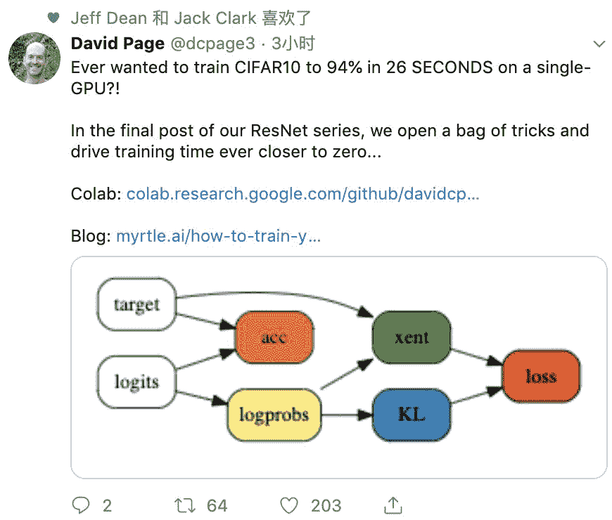

*myrtle.ai 研究科学家 David Page 的推特，获得了 Jeff Dean 的点赞。*

*   colab 地址：https://colab.research.google.com/github/davidcpage/cifar10-fast/blob/master/bag_of_tricks.ipynb

*   博客地址：https://myrtle.ai/how-to-train-your-resnet-8-bag-of-tricks/

DAWNBench 是斯坦福大学提出的一个基准测试，用于衡量端到端深度学习训练和推断的运行时间和。计算时间和消耗是构建深度学习模型中重要的问题，因此提出这一测试的科学家希望能够提供量化评价模型训练时间、训练消耗、推断延迟时间和推断消耗的开支的方法。并根据不同的优化策略、模型架构、软件框架和硬件等指标来进行测算。

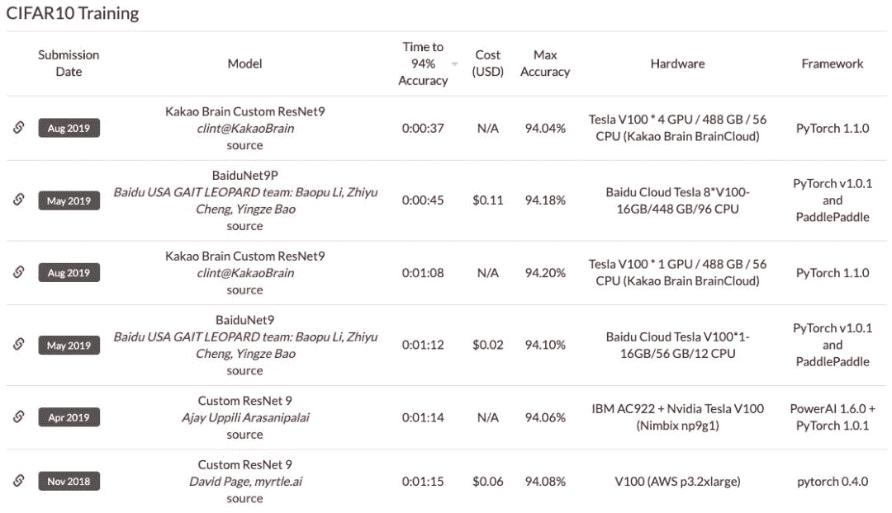

*以上为目前的 DAWNBechmark，排名最高的模型用时 37 秒。*在经过一系列的调优之后，研究者的单 GPU 实现超越了顶级的多 GPU 的训练和推断速度，相比于最初在单 GPU 的 SOTA 水平上实现了 10 倍的改进。现在，研究者已经把时间降至 26 秒了，而目前排名最高的模型训练 CIFAR10 数据集需要 37 秒。作者表示，他们此次发布的主要目标是提供一个用于测试新技术、经过良好调整的基线，允许用户在几分钟内在单个 GPU 上完成统计上数量显著的训练。既然训练只需要 26 秒，那么中间肯定会有一系列操作来降低训练时间。作者在技术博客中公开并分析了这些技巧。每当使用一个，训练的所需的 Epoch 数量就可以减少，在保证准确率为 94% 的情况下，研究者一步步减少了所需的 Epoch 数量，使得模型的训练速度逐渐上升。以下为每个方法使用后训练花费的时间。随着应用的方法越来越多，达到 94% 测试准确率的训练时间也越来越短。

*   GPU 上进行数据预处理 (70s)

*   更换最大池化顺序 (64s)

*   标签平滑化 (59s)

*   使用 CELU 激活函数 (52s)

*   幽灵批归一化 (46s)

*   固定批归一化的缩放 (43s)

*   输入 patch 白化 (36s)

*   指数移动平均时间 (34s)

*   测试状态增强 (26s)

**26 秒训练的 ResNet 效果怎么样**

既然单块 GPU 下训练速度快了这么多，那么效果是不是同样优秀？研究者表示，如果这些技巧能同时强化验证准确度，那么这表示他们也能用来加速更通用的 ImageNet。研究者经过一些调参，并从 24 个 Epoch 到 100 个 Epoch 同时测试了基线模型与实验模型。最终每一次实验都做了 5 组，并得到以下训练曲线：

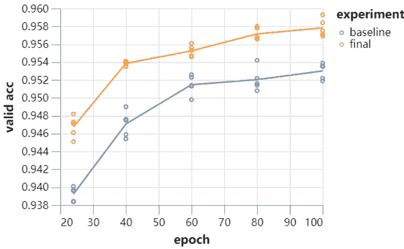

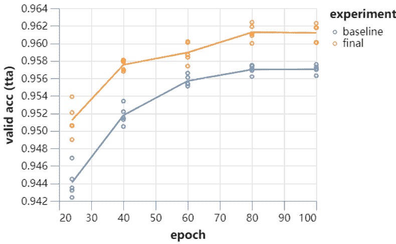由于 DAWNBench 只需要准确度达到 94% 就可以了，因此 26 秒训练的模型已经达到了要求。此外，研究者 9 层的 ResNet 运行 80 个 Epoch 后能达到 96.1%，而且他们还没有进行更多的优化。当然，26 秒只是训练 10 个 Epoch 的时间。研究人员表示，如果继续训练到 70 个 Epoch，那么准确率还能增加到 96%。下文为每一个优化技巧的介绍和带来的速度提升。**在 GPU 上进行数据预处理（70 秒）**研究者首先进行了一些代码优化的工作。根据早期的提交结果日志显示，他们在数据预处理上浪费了 3 秒钟的时间。而将整个数据集（以 uint8 的格式）移动到 GPU 花费的时间可以忽略不计（40ms），而且 GPU 完成整个预处理工作甚至更快（15ms）。所以主要的时间消耗在了将处理过的数据集移动回 CPU，这一过程消耗了半秒钟。因此，尽管之前提升被浪费掉的 3 秒是个进步，但是还是有另外的提升空间。这是因为数据在分批和增强后依然会重新被传回 GPU 上，导致每个 Epoch 都会有些延迟。研究人员认为，他们需要在 GPU 上进行数据增强方面的操作，用于跳过数据传递的步骤。这是可以做到的，但是需要谨慎操作。研究者的操作非常简单，只需要 35 行代码（不依赖 Pytorch DataLoaders）。以下为一些随机图像增强的结果。

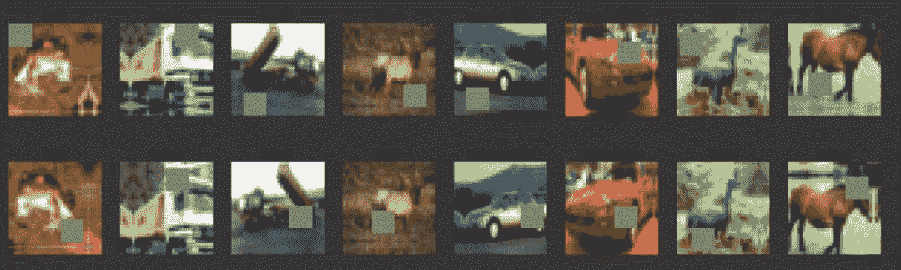

相比以前提供的结果，如果将数据预处理放到 GPU 上，那么总体训练时间可以降到 70 秒以内，相当于让 18 年提交的结果前进了两位。**调整最大池化层（64 秒）**最大池化往往在激活函数（如 ReLU）的后面进行。但是如果首先进行池化会更高效。在一个卷积-池化块中，研究者调换了激活函数和池化的顺序。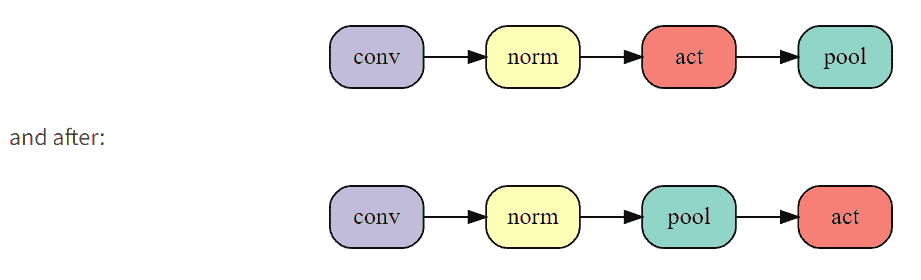改变这一顺序在 24 个 Epoch 训练时间中减少了 3 秒的时间，而且不改变网络计算的所有函数。进一步的，研究人员尝试将池化放在卷积层之后，进一步提升了运算效率。但是由于这样会影响网络的结构，也会造成准确率的降低。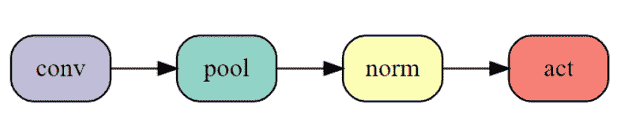尽管准确率降低，但最多只需要训练一个 Epoch 就能达到这个准确率。因此适当减少准确率，减少 Epoch 的情况下，总体上能够降低训练时间。从积极的方面来说，这样减少了 5 秒的训练时间，使得训练时间减少到了 64s，相当于目前排行榜的第三位了。**标签平滑化（59 秒）**标签平滑化是一个很成熟的方法，用于提升训练速度和神经网络在分类问题上的泛化能力。这个方法包括将 one-hot 目标概率和分类标签在交叉熵损失中的均匀分布混合。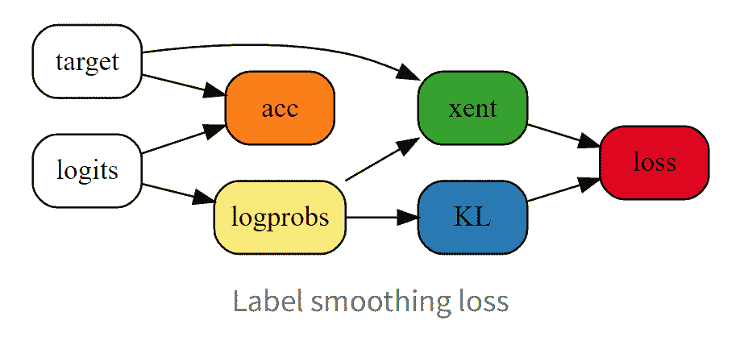测试准确率提升到了 94.2%（50 次运行的平均值）。而减少了 Epoch 的数量后，训练 23 个 Epoch 的准确率就达到了 94.1%，但是训练时间降到了 1 分钟以下。**CELU 激活函数（52 秒）**研究人员希望优化过程能够更好，因此他们使用了一个更为平滑的激活函数，而不是像 ReLU 这样过渡不够平滑的函数。这样可能会帮助模型提升泛化能力.。在这里研究人员使用了 CELU（Continuously Differentiable Exponential Linear Unit）作为平滑的激活函数，而且 PyTorch 有相应的实现。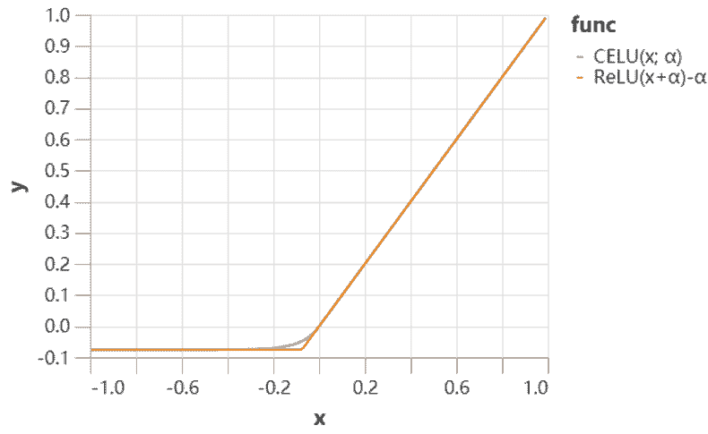这样提升了模型的测试准确率，达到了 94.3%。使得模型进一步地减少了 3 个训练 Epoch，并在 20 个 Epcoh 的时间中（52 秒）达到了 94.1% 的准确率。**「幽灵」批归一化（46 秒）**批归一化（BN）似乎在批量大小为 32 的时候效果最好，而研究者的批大小为 512。此外，如果不想严重影响训练效果，那么他们就不能降低批量大小。因此，研究者将批归一化独立地应用到各批量数据的子集中。这一技术，就被称之为「幽灵」批归一化，它通常用于分布式训练中，但如果单节点运算的批量数据太大，那么也能用这样的技术。该方法在到 20 个 Epoch 能达到 94.2% 的测试准确率。因为训练变得更加短，提升学习率对最终的效果应该是有帮助的。如果研究者将最大学习率增大 50%，他们能实现 94.1% 的准确率，且还只需要 18 个 Epoch，这样训练时间也降低到了 46 秒。**固定批归一化的缩放（43 秒）**如果批归一化的通道缩放尺寸有很大变化，这可能会减少有效的通道数量。让我们来看看这些参数在训练中的动态变化：

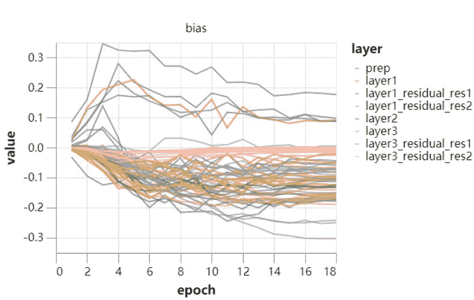

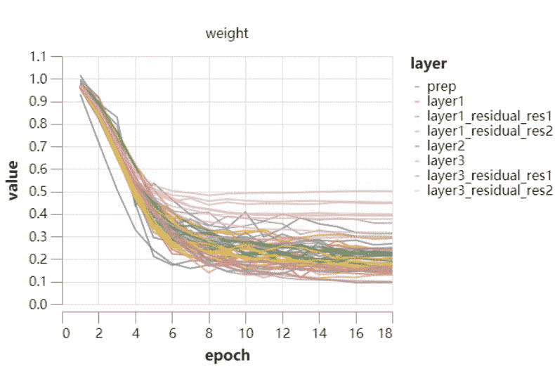这两张图展示了很多信息，但比较重要的是缩放尺寸（scale）并没有太大的变化，这表明它不怎么学习，很大程度上都是根据权重衰减的控制来更新。因此我们可以尝试固定这些变量，采用常数 1/4 来代替它，其中 1/4 表示训练中间点的均值。最后，研究者根据增加的准确率将 Epoch 数量降低到 17，新的测试准确率还保持在 94.1%。现在，该模型已经超过了排名第二的 BaiduNet9P，它的训练时间只需要 43 秒。**输入 patch 白化**控制内层的协方差、利用批归一化的白化版本可能有所帮助，但需要额外的计算和艰难的实现工作。因此，研究者着眼于输入层上较为简单的问题。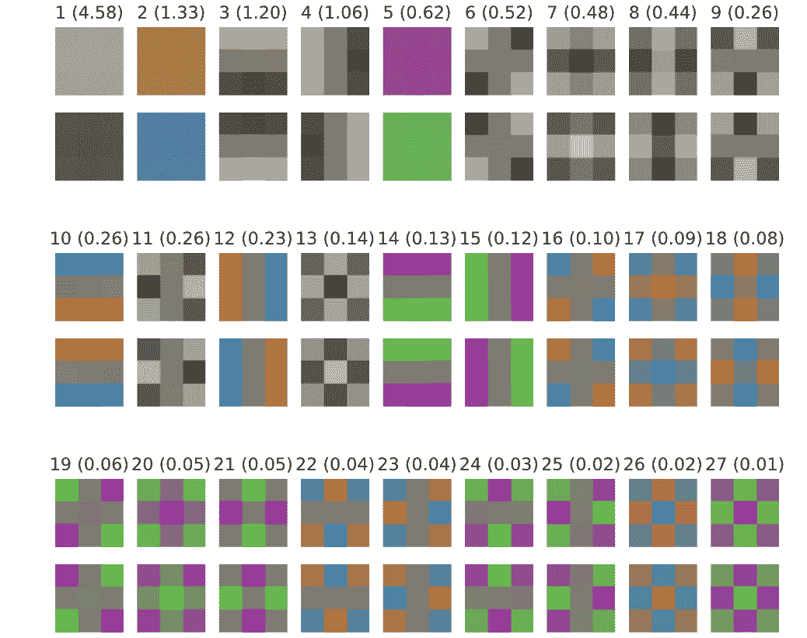17 个 epoch 之后，测试准确率跃升至 94.4%，使得训练时间可以缩短 2 个 epoch。15 个 epoch 在 39 秒内将准确率提升至 94.1%。如果进一步将最大学习率提升 50% 左右，同时将裁剪增强从 8×8 降到 5×5，以弥补高学习率带来的额外正则化，我们可以再缩减一个 epoch，在 36 秒内实现 94.1% 的测试准确率。**指数移动平均操作（34 秒）**为了提高准确率，研究者每 5 个 batch 更新一次移动平均时间，因为他们发现，即使更新地更加频繁，准确率也没有什么提升。他们需要选择一个新的学习率计划，越接近训练结束，学习率越高，同时动量参数也会采用指数移动平均操作。测试准确率提升到了 94.3%，因此可以进一步缩减 epoch。13 个 epoch 训练使得模型的测试准确率达到了 94.1%，训练时间低于 34s，比该系列开始时的单 GPU 水平提高了 10 倍。**降低测试时间（26 秒）**前面主要都是降低训练时间，但最后的测试过程也能做进一步的优化而降低所需时间。这里，研究者主要应用了测试状态增强（Test-time augmentation，TTA）。为了与当前 DAWNBench 提交数值保持一致，研究者将这一技术限制在仅进行水平翻转的操作上，并找到了准确率和推断消耗中间的平衡点。在现有的网络和 13 个 Epoch 的训练下，测试准确率达到了 94.6%。因此研究人员移除了对剩余数据的增强操作，因为这是针对训练而非测试步骤的，因此他们将训练减少到了 10 个 epoch，而且在 26 秒钟达到了测试状态增强准确率——94.1%。

**WAIC 2019 开发者日**将于 8 月 31 日在上海世博中心举办，包含 1 个主单元、4 个分单元、黑客马拉松比赛和开发者诊所互动区。

届时，全球顶尖 AI 专家、技术大牛、知名企业代表以及数千名开发者将齐聚上海，围绕人工智能前沿理论技术和开发实践进行分享与解读。

点击**阅读原文**，立即报名。

