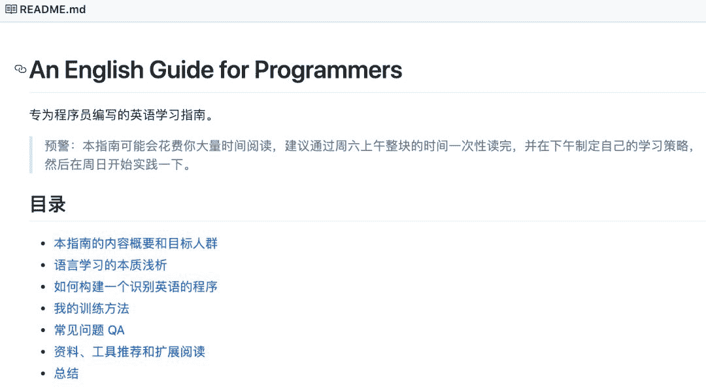

# 这是一份专为程序员编写的英语学习指南

> 原文：[`mp.weixin.qq.com/s?__biz=MzA3MzI4MjgzMw==&mid=2650755443&idx=1&sn=c47c48e34316a5f0547ba3792ecba4bd&chksm=871a950db06d1c1b6710f2a24ddf6ddc77d1fe1ecd488db47caf66f9c60326a01670963070e1&scene=21#wechat_redirect`](http://mp.weixin.qq.com/s?__biz=MzA3MzI4MjgzMw==&mid=2650755443&idx=1&sn=c47c48e34316a5f0547ba3792ecba4bd&chksm=871a950db06d1c1b6710f2a24ddf6ddc77d1fe1ecd488db47caf66f9c60326a01670963070e1&scene=21#wechat_redirect)

选自 GitHub

**作者：于江水**

> 虽然 PHP 是最好的语言，但所有程序员必须学会的只有英语。面对铺天盖地的英文文档和教程，我们能做到的只有以最快的速度学会这门语言了。近日，一名程序员把自己学英语的心路历程发布在 GitHub 上，并很快获得了超过 1900 个 star。

虽然这名程序员此前并没有很好的英语基础，但却曾面临「必须学好」英语的挑战。面对这样的情况，他选择使用程序员思维来解决这个问题。让我们看看他是如何做到的。

项目链接：https://github.com/yujiangshui/An-English-Guide-for-Programmers

**本指南的内容概要和目标人群**

本人上一次正式英语考试大约是五年前大学四级考试，得分 442，大学每学期考试基本是 60 多分过线就好，纯属英语渣底子很差。但是由于一些特殊需求，雅思需要考到 6.5 分及以上，所以自 2018 年 6 月份开始一直在学习英语。在学习过程中，对语言学习从陌生到熟悉，从毫无头绪到了解一些实用的训练方法，从乱看经验经常换方法到总结出自己的学习方法。

经过四个月断续学习 + 接近两个月的全职突击备考，考了 PTE 考试（类似雅思的英语水平测试）并拿到 63 分，对应雅思 6.5 中上，满足大部分学校留学要求以及出国技术移民的要求。备考过程十分艰苦，个人感觉远超高考。虽然离十分流畅的跟 Native Speaker 交流还有一段距离，但是相比四级 442 的水平有了几倍的提升。故此编写教程进行阶段性总结，一来方便自己制定下一步训练计划，二来希望可以对同等水平有需求的朋友有所帮助。

本教程目标人群是想要花一些时间真正掌握英语的人，尤其适合英语渣。对于英语渣来说，网上杂七杂八的英语学习技巧和经验不一定会有很多帮助，甚至会误导。比如这篇回答（https://www.zhihu.com/question/22968875/answer/529514279）就说了，如果别人问答主如何学英语，她顶多给一句「多看美剧，培养语感」，好在这篇回答详细说了答主的水平和长期的努力细节，否则会误导一大片低水平英语渣去拼命的看美剧。所以在英语学习过程中，要注意查看符合自己水平的经验和教程，否则可能会走弯路。

如果你在寻找《21 天掌握英语》、《10 天背会 1000 词》、《10 天搞定英语写作》之类的资料，这份指南并不适合你。尤其是语言学习，学习周期都是以月或者年来计的，你越早明白语言学习没有技巧，就会越少浪费时间和金钱在各种资料和经验上面，走越少的弯路。

由于网上各种英语学习技巧的效果跟学习者的水平相关，所以**本指南会深挖语言学习的本质（主要用中文举例）并用程序员易于理解的方式去思考，并提供自己根据本质推演出来的训练方法和经验做参考****。**重中之重是你要根据本质自己设计适合自己的训练方法，同时可以甄别网上看到学习方法和资料，判断是否适合自己使用。

需要补充的是，由于本人的水平有限而且也在持续学习，后续会经常完善、升级、更新本指南，强烈建议 Watch 并时而回来看看。因此如果转载本指南，请保留出处避免信息过时。如有异议或者建议，也十分欢迎在 Issue 中讨论。还需要注意的是，由于本文是文本形式，不好播放声音，所以用中文来描述一些单词的错误发音，在日常英语学习中应该使用音标而不能使用中文标注发音。

**如何构建一个识别英语的程序**

现在我们不讨论你如何学英语，而是让你构建一个可以识别、交流英语的程序，你会如何设计？

**简单的需求分析**

以中文为例，当你听到一个女人对一个男人说：「你是一个男人吗？」时，你会收集到哪些信息？你需要哪些信息来明确这个女人想表达的确切意思？

首先是听力输入，你需要确保麦克风录入了音频，然后拿到的声波内容是 U*#@&!&&*。之后我们需要将声波内容输入到一大堆分析器中进行分析，并得到比较精准的意图。

第一个可能是性别分析器，通过一定的规则识别出这是一个男性的声音还是女性的声音。因为这句话是男的说出来还是女的说出来表达的意思是不一样的。

第二个就是内容识别器，先是加载粤语匹配引擎和粤语语料库发现声波无法匹配解析，那么换成普通话引擎和语料库。此时如果你的语料库里有「你」、「是」、「一个」、「男人」、「吗」这些声音素材，那么就可以匹配解析出这句话：「你是一个男人吗？」。换言之，如果你没有粤语语料库和解析引擎，即便是给你一段粤语录音你也听不懂。如果这句话有一个生僻单词你语料库里没有，那么也是无法识别出来。

之后还有更多识别器，比如年龄、情绪识别器、重音和疑问语气识别句等，这些因素共同决定了这句话究竟想要传达什么意思。如果是一个女性的激动等感叹语气「你是一个男人吗！」，那么可以推测出这个女的跟男的有一定的关系，这个男的做出了一些伤天害理的事情导致这个女性在质问。如果是一个轻声细语的疑问句「你是一个男人吗？」，可能是一名女性想确认对方的性别。当然更准确表达这个意图的句子应该是「你是男性吗？」。

**比较基础的方案设计**

上面需求分析只是简单的介绍了 声音 -> 听力识别器 -> 意图 的过程，实际上语言交流是听说读写，其中包含两个识别器（听力识别器和视力识别器），一个核心理解器，两个表达器（口语表达器和书写表达器）。通过对应的实际场景，我们可以简单的梳理出对应需要的功能。

# 听力识别器

*   听力能力

*   说明：要求可以输入声音并转换成一种可分析的信号。

*   训练：买个好麦克风，对应人类是保护好耳朵和听力。

*   口音识别器

*   说明：各类方言比如粤语，各种口音比如东北口音、广东口音、英式发音和美式发音。

*   语言特性识别器

*   说明：语言之间会有不同特性，比如中文没有略读，都是一个一个字念出来，而英文会为了说话省劲而略读或者连读，比如「drink it」并不是单个蹦的「准克一特」，而是类似「准 kei 特」。中文的「喝它」就是「喝它」，不会有类似「赫特」之类的变化。

*   训练：扩充特殊语言引擎的匹配规则，扩充语料库，当听到「准 kei 特」可以识别出是「drink it」。

*   音量调节和杂音处理器

*   说明：可以通过算法过滤无用杂音，并将小音量调大使其清晰。人类天然进化出这种能力，无需特殊训练。

*   语气、性别、身份、语速识别器

*   说明：人类天然进化出这种能力，无需特殊训练。

*   上下文缓存器

*   说明：交流过程要有上下文内容缓存，结合输入理解器。

# 视力识别器

*   视力能力

*   图形识别器

*   说明：不同字体、变形（英文大小写、中文繁简体等）都可以识别出来具体字符，同时需要识别标点符号等输入理解器。

*   训练：识别能力、精准度和速度。比如一眼看出 message 和 massage 是不一样的。

*   上下文缓存器

# 理解器

理解器可以说是最重要的部分了，也是最难的部分

*   语料库

*   说明：字母、单词、发音、多重语境含义、历史文化背景、不同形态，同义词反义词相近词。

*   训练：需要长期积累和扩充，需要大量训练。

*   识别引擎

*   说明：单词拼装起来的句型句式、语法、时态含义和规则、标点符号、单复数、惯用表达。

*   训练：单点突破，专项训练，逐步体系化积累。

*   思考和思维能力

*   说明：针对意图结合之前的记忆以及经验得出自己想要表达的意图。

*   训练：结构性表达，思维能力锻炼，思考和总结能力。这个与语言无关。

*   上下文缓存器

# 口语表达器

当理解器思考运算并得到想要表达的意图之后，就需要开始表达传递出去。

*   意图语料组装器

*   说明：将意图结合语料中的单词、句型句式、惯用表达进行匹配组合，挑选出最符合你意图的语句。

*   发音器

*   说明：根据组装出来的内容，结合特殊的连读、略读等语言特性，转换成发声信号。对应人类的话是控制舌头、声带和呼吸系统的肌肉使其变成对应形状，让气流通过声带发出对应声音。

# 书写表达器

*   意图语料组装器

*   书写表达器

*   说明：将语料组装结果以视觉的方式表达，对于人类是控制手部肌肉书写出对应形状。

从上面可以看出，口语听力相对于阅读写作更加困难，主要因为实时性的要求。你必须迅速反馈不经过思考，这要求你要无意识的去用英语表达，所以语言学习没有技巧，只有大量训练。

*图片来自：toggl.com*

**英语能否速成？网上那些快速背单词的方法是否有效果？**

你越早明白语言学习没有技巧，就会走越少的弯路、花越少的冤枉钱。

当然可能也有好的技巧，可以了解他们的方法，分析下是否能真正学到、练到，再决定用他们的方法。不过除非天才，速成基本上是不可能的事情，你也可以看到上面介绍，英语要学习的信息量太大，而且重点是训练成无意识的输入输出。如果你依赖一些思考和技巧，那么肯定会卡顿，导致无法正常交流。

**如何使用这份指南？**

1.  先了解语言学习的本质，即语言学习到底是要学习什么，训练什么。

2.  了解本人的一些有效学习方法，查看我是如何通过本质推断这个方法是否有效。

3.  按照自己的需求定制学习方法，在日后看到某些学习方法时可以有效推断该方法是否有效。

这里举一个反例：有什么相见恨晚的背单词方法？（https://www.zhihu.com/question/48040579/answer/521694493），大概思路就是 10 个随机单词一组，先大体一看，开始编故事串联起来十个单词，通过艾宾浩斯周期回顾这组单词，回顾时遮住汉语意思开始回想，如果想不起来想想小故事，通过故事来回忆起这个单词的意思。

这其实就是联想的记忆技巧，你试一下绝对也好用。但这个过程中有很多问题：

1.  词义损失严重。一个单词几个简单的中文释义，而且还基于部分中文释义来编造离奇小故事，会导致词义理解偏差更严重。

2.  语料库内容不正确。语料库你需要记忆的是 单词 -> 诸多释义、例句、声音等等，但这种方法你记住的是 单词 -> 几个释义，一个故事，故事关联的其他单词。

3.  缺乏当前单词听力和发音的输入、锻炼。

所以知乎上找来的方法不推荐使用，因为投入的成本和收获比比较低。试想：当一个老外对你说一个单词，你会用故事去联想这个单词是什么中文意思，然后再去做出反应吗？而且这个中文意思可能并不是老外想表达的意思。其次，单词你可能说起来磕磕碰碰甚至发音是错的，因为在背的过程中，你并不知道它准确的发音，也没有训练。********

