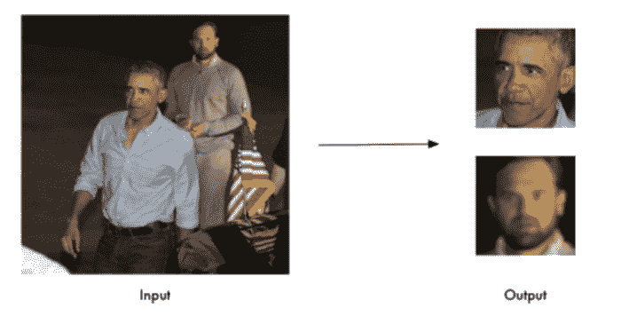
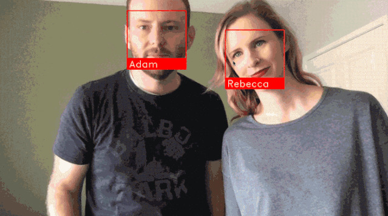
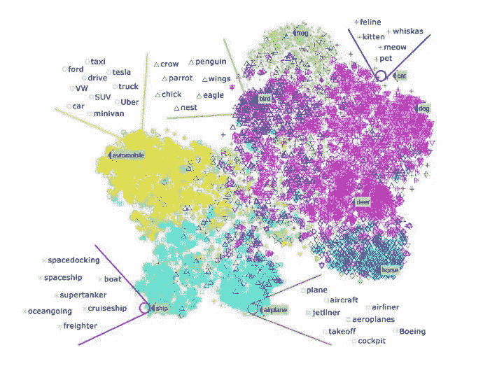
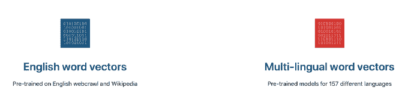
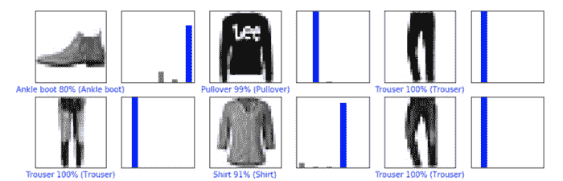
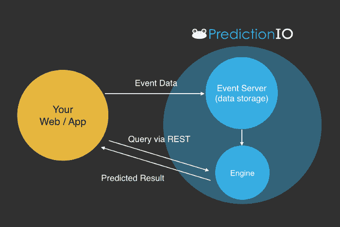

# GitHub 上 Star 量最高的 5 个机器学习项目

> 原文：[`mp.weixin.qq.com/s?__biz=MzA3MzI4MjgzMw==&mid=2650767177&idx=2&sn=70b8e45f5b78cc198d72f55c56cdf3af&chksm=871abb37b06d322113f663c228039109cffee45c04f15a3566c9e22b9ff493af8f2cde0a9638&scene=21#wechat_redirect`](http://mp.weixin.qq.com/s?__biz=MzA3MzI4MjgzMw==&mid=2650767177&idx=2&sn=70b8e45f5b78cc198d72f55c56cdf3af&chksm=871abb37b06d322113f663c228039109cffee45c04f15a3566c9e22b9ff493af8f2cde0a9638&scene=21#wechat_redirect)

选自 towardsdatascience

**作者：****Rishi Sidhu****机器之心编译****参与：Nurhachu Null、Geek AI**

> 本文介绍了 GitHub 上 star 量最高的 5 个机器学习项目，涉及人脸识别、文本处理、机器学习框架等。

机器学习领域正在飞速发展。GitHub 是一张举世瞩目的白板，高质量的代码通常被发布在这张充满智慧的无限大白板上。显然，我们不可能追踪机器学习世界中的所有东西，但是 GitHub 上每个项目都具备自己的 star 量。即，如果你标星了一个仓库，这意味着你对这个项目表达了赞赏，同时也跟踪了你觉得有意思的仓库。星数排名可作为了解最受关注项目的重要指标。本文就介绍了机器学习领域星数排名最高的 5 个项目。

**Face Recognition：26073★**

GitHub 地址：https://github.com/ageitgey/face_recognition?source=post_page---------------------------这是世界上最简洁的人脸识别工具。它提供对 Python 和命令行的应用程序接口（API），其用途是识别以及操作图像中的人脸。它使用 Dlib 最先进的人脸识别算法构建，该深度学习模型在 LFW（Labeled Faces in the Wild）数据集上达到了 99.38% 的准确率。它还提供了 face_recognition 命令行工具，它可以让你在包含图像的文件夹中使用命令行来进行人脸识别！

这个库还可以处理实时人脸识别。

**fastText：18931 ★**
GitHub 地址：https://github.com/facebookresearch/fastText?source=post_page---------------------------fastText 是由 Facebook 团队开发的免费开源库，用于高效词表征学习。它是轻量级的，允许用户学习文本表征和句子分类器。它可以在标准通用硬件上运行，模型甚至可以被压缩到适应移动设备的大小。文本分类是很多应用的核心问题，例如垃圾邮件检测、情感分析或智能回复。文本分类的目标是给文档（例如电子邮件、博客、短信、产品评论等）分配多个类别。

*词类示例（图源：Alterra.ai）*

对自然语言处理（NLP）爱好者而言，这是一款非常有用的工具。

*图源：https://fasttext.cc/?source=post_pag (https://fasttext.cc/?source=post_pag%EF%BC%89)***Awesome TensorFlow：14501★**GitHub 地址：https://github.com/jtoy/awesome-tensorflow 这是一个帮你理解和使用 TensorFlow 的资源集合。该 repo 涵盖一系列资源列表，如很棒的 TensorFlow 实验、库和项目。TensorFlow 是 Google 开发的端到端开源机器学习平台。它有全面的生态系统，包括工具、库和社区资源，允许研究者创建最先进的机器学习算法。使用 TensorFlow，开发者可以很容易地构建并部署由机器学习驱动的应用。

*图源：**https://www.tensorflow.org/tutorials/keras/basic_classification?source=post_page ***Apache predictionio 11866 ★**GitHub 地址：https://github.com/apache/predictionioApache PredictionIO 是供开发者、数据科学家和终端用户使用的开源机器学习框架。用户可使用该框架构建真实的机器学习应用，并进行部署和测试。它甚至支持事件收集、评估，以及查询预测结果。它基于可扩展的开源服务，如 Hadoop、HBase 等。就机器学习而言，该工具减轻了开发人员的思维负担。

*图源：**http://predictionio.apache.org/appintegration/?source=post_page *

**Style2Paints：9860 ★**GitHub 地址：https://github.com/lllyasviel/style2paints 该 repo 与前面 4 个有点不一样，因为缺乏资金，它已经被关闭了！它确实是一个有趣的设想，使用 AI 给图像上色。

创建者称 Style2paints V4 是当前最好的 AI 线稿上色工具。

他们称这个项目与之前的端到端图像转换方法不同，因为它是第一个用真实的人类作业流程为线稿上色的系统。很多艺术家熟悉这个流程。素描-->彩色填充/扁平化-->渐变/细节添加-->阴影处理
[Style2Paints](http://mp.weixin.qq.com/s?__biz=MzA3MzI4MjgzMw==&mid=2650735415&idx=3&sn=e272154488c4e28b18b0c1ceb9f96201&chksm=871ac749b06d4e5f3d0357888ec455cb1b70f5ca405a37a61e09fcaa93766275f0434732d2c0&scene=21#wechat_redirect) 就是根据这个流程设计的。只用两次点击，该流程就可以使下图中最左的图变成中间的图。

*图源：https://style2paints.github.io/?source=post_page*

仅仅点击 4 次，你就能够得到下面这张图：

*图源：https://github.com/lllyasviel/style2paints?source=post_page*

*原文链接：**https://towardsdatascience.com/highest-rated-ml-projects-on-github-694486293512*

********本****文为机器之心编译，**转载请联系本公众号获得授权****。**

✄------------------------------------------------

**加入机器之心（全职记者 / 实习生）：hr@jiqizhixin.com**

**投稿或寻求报道：**content**@jiqizhixin.com**

**广告 & 商务合作：bd@jiqizhixin.com**