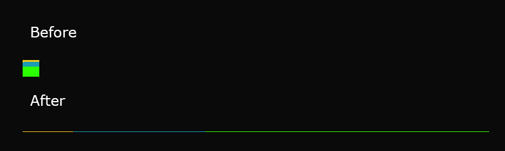
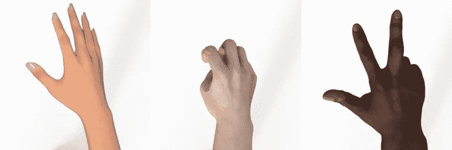
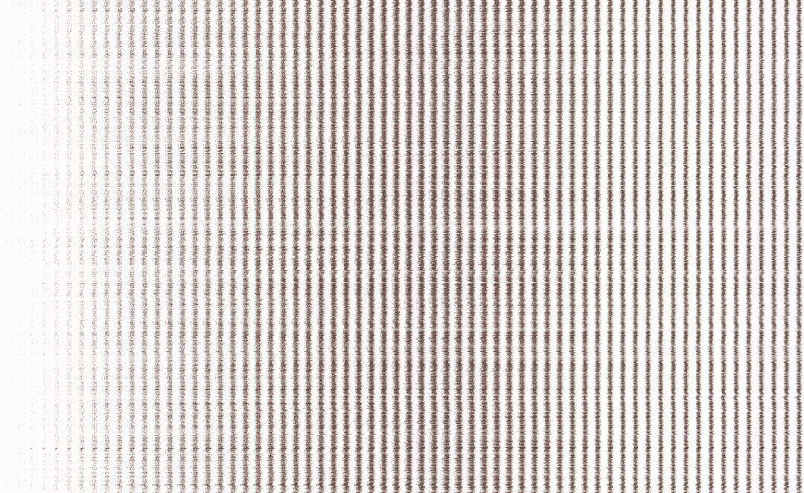
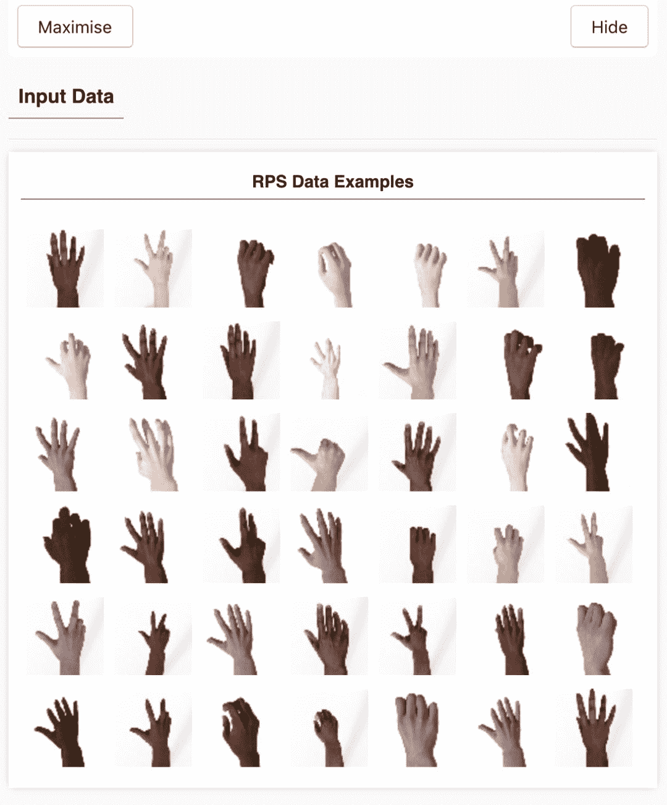
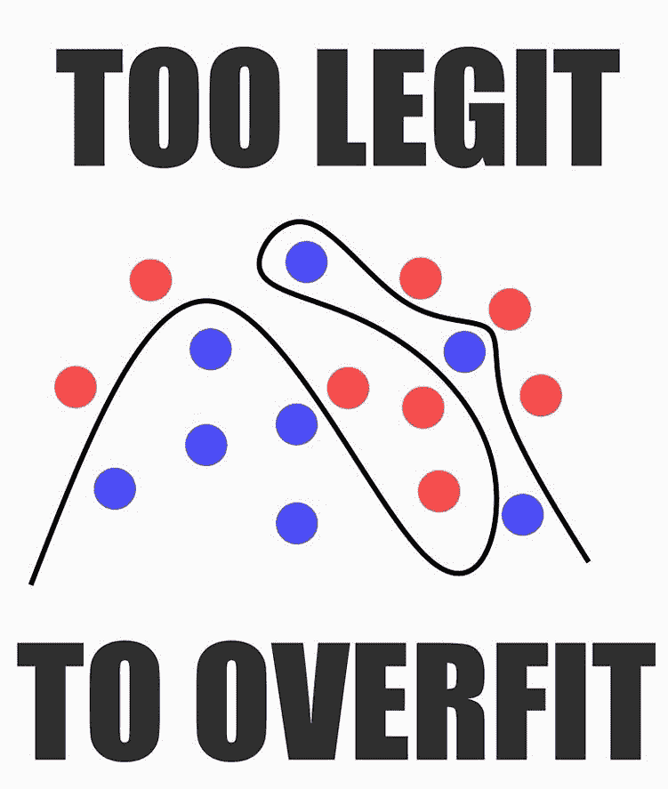
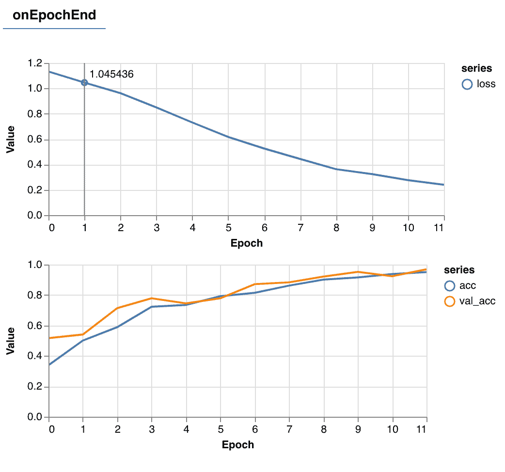
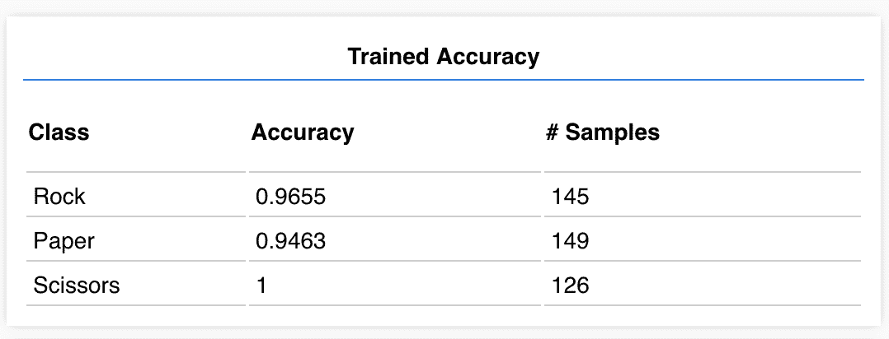
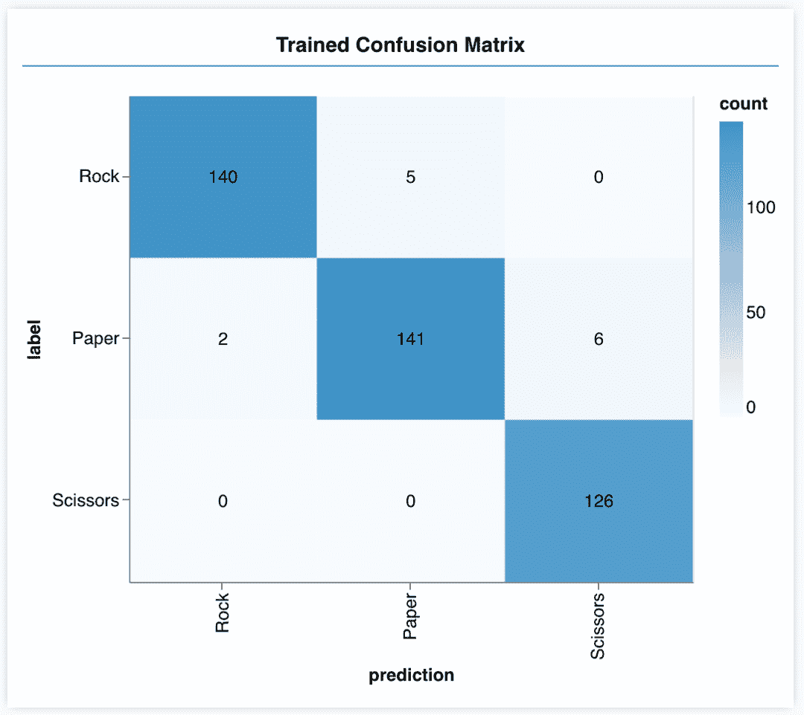
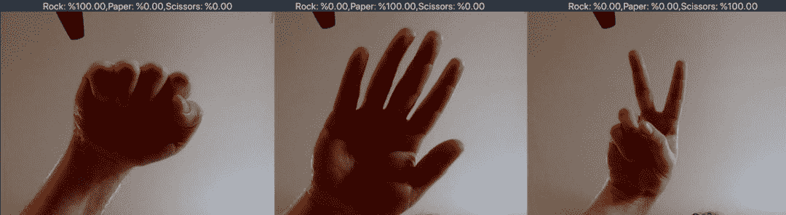
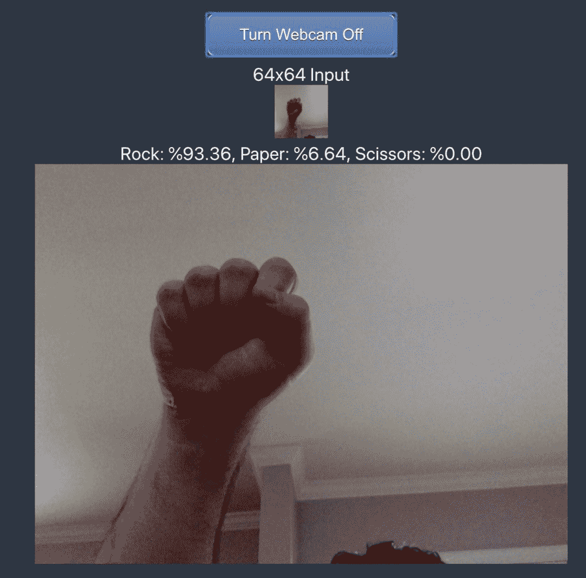

# 在浏览器训练个剪刀石头布探测器，你的小电脑也可以

> 原文：[`mp.weixin.qq.com/s?__biz=MzA3MzI4MjgzMw==&mid=2650768584&idx=4&sn=470eef1f653447cfe61d08d13c228c19&chksm=871a40b6b06dc9a0f241dc1b06b23c300ec38a5d01f60b3520991399bbac0f6a877e0d492544&scene=21#wechat_redirect`](http://mp.weixin.qq.com/s?__biz=MzA3MzI4MjgzMw==&mid=2650768584&idx=4&sn=470eef1f653447cfe61d08d13c228c19&chksm=871a40b6b06dc9a0f241dc1b06b23c300ec38a5d01f60b3520991399bbac0f6a877e0d492544&scene=21#wechat_redirect)

选自 Heartbeat

**作者：Gant Laborde****机器之心编译****参与：韩放**

> 你知道怎样在浏览器中训练并测试机器学习模型吗？本文带你快速训练一个「剪刀石头布」的识别模型，你可以在家向朋友演示你的模型效果。

假设你回到两年前，现在要让我写一个算法，拍摄一只手的图像，并确定它是石头、剪刀还是布。我会说这有可能实现，但需要给我 6 个月时间。现在，如果你再问我这个问题，我可以引导你访问 https://rps-tfjs.netlify.com/，并说：「您可以 10 分钟内在浏览器中训练一个模型。」**什么是网页版「石头剪刀布」**通过这个网站，我们可以在浏览器中准确得完成识别石头剪刀布这一任务，所有计算都在本地完成，速度将取决于本地硬件的好坏。因为该项目使用了 TensorFlow.js，所有繁重的工作都发生在浏览器和 JavaScript 中！机器学习需要数据来训练模型，我们期待经过一段时间的训练后，这个模型变得足够聪明，从而识别以前从未见过的石头、剪刀和布的照片。首先，我们需要一些「石头、剪刀、布」图像的训练数据。先不要急着给所有的朋友打电话收集数据，我们可以使用谷歌 Laurence Moroney 提供的一些优秀数据。数据集地址：http://www.laurencemoroney.com/rock-paper-scissors-dataset/**浏览器怎样加载训练数据**在正常的机器学习工作流程中，我们可以按文件夹组织图像文件，并通过简单的全局变量获取。但是在浏览器中，系统对内存中加载的内容进行了沙盒处理，如果我们要加载 10MB 的图像，那么就会遇到障碍。幸运的是，我们可以利用一个经典的技巧将一组图像传输到浏览器：sprite 表。我们把一组图像粘在一起形成单独的图像。在这种情况下，每一个小图都展开成一个向量，这些向量堆叠在一起就是一张「大图」。通过这种方式，我们就可以创建 10MB 的大图像来保存所有小图像。

*将二维图像展开成一维向量的效果图。*我编写了自己的 sprite 表生成器，并在「石头剪刀布」数据集上运行它。结果看起来很疯狂。您可以看到这样的图像：转换成这样的集合：

*单张小图缩小到 64x64，上图一共 2520 张，产生的图像是（4096x2520）。*Python 源代码在这个项目的 spritemaker 文件夹中，因此如果你要对完全不同的数据集执行类似的操作，可以用它创建自己的 sprite 表。既然所有图像都被组合成单一的图像，我们就可以将图像分割开来进行训练和验证。**单击按钮-准备训练**可能需要一秒钟的时间来加载并解析大图像，并且当你按下网站上的按钮时，信息将被填充到 TensorFlow Visor。它基本上是一个小的滑动菜单，帮助我们在训练时显示信息。在 visor 上，我们将看到从数据集中随机抽取了 42 张图像作为测试数据。所有图像数据是 RGB 的，但是如果我们打开 constants.js，可以将通道数减少到 1。

*加载 42 张随机样本并显示在 vis 中。*

此外，我们将在此侧菜单中看到模型层、未经训练的结果、训练统计信息和训练结果。你创建模型的界面如下：我得到了一个适用于简单数据的简单模型，还有一个高级模型。其中高级模型对多个角度和背景的数据更有效，它的鲁棒性更强。**什么样的「石头剪刀布」模型才算好**你可能会想，我们应该使用高级的模型，这是一个常见的陷阱。如果你选择高级模型，你可能会遇到一些常见的问题。首先，它需要更长的时间来训练，第二，它甚至可能训练地不好。第三，如果训练时间过长，高级模型将出现过度拟合现象。过度拟合意味着该模型在预测训练数据方面非常出色，但是对从未见过的数据非常糟糕，一个好的机器学习模型应该是可以泛化的。在训练模型时，每一次迭代更新一张效果图表，在本例中为 512 个图像迭代一次。并且每个 epoch 更新一次图标（所有 2100 个训练图像）。良好的训练迭代意味着损失减少，准确度提高。

准确率图表中的橙色线是在验证集上的表现，即模型在未经训练的 420 张图像上精确度如何。可以看到橙色线的训练准确率很高！我们的模型应该很好地泛化（只要新的图像在复杂性和样式上与训练数据相似）。如果点击「查看训练后模型」，会看到一些很好的结果！正如你所看到的，剪刀总是准确的，而我们最差的类是布，只有 95% 的准确率。由于训练是随机初始化的，所以每次结果会略有不同。为了进一步挖掘识别效果，我们也得到了一个混淆矩阵。

正如在这里看到的，布被意外地归类为剪刀 6 次。这是有道理的，有时候布看起来有点像剪刀。像上面这样的混淆矩阵可以帮助我们找出需要解决的问题。**最后看看效果吧**现在我们终于可以在现实世界中测试我们的模型了。使用网络摄像头，我们可以检查我们自己的手是否有石头剪刀布！请记住，我们希望我们的照片与我们的训练图像相似，以便正常运行（无旋转和白色背景）。网络摄像头将拍摄并转换为 64x64 图像。你已经在你的浏览器中训练了一个模型，验证测试了它，甚至在现实场景中测试了它。很少有人能做到这一点，在浏览器中完成这一切的人甚至更少。

最后本项目的一些资源：源代码：https://github.com/GantMan/rps_tfjs_demoDemo：https://rps-tfjs.netlify.com/********本****文为机器之心编译，**转载请联系本公众号获得授权****。**
✄------------------------------------------------**加入机器之心（全职记者 / 实习生）：hr@jiqizhixin.com****投稿或寻求报道：**content**@jiqizhixin.com****广告 & 商务合作：bd@jiqizhixin.com**