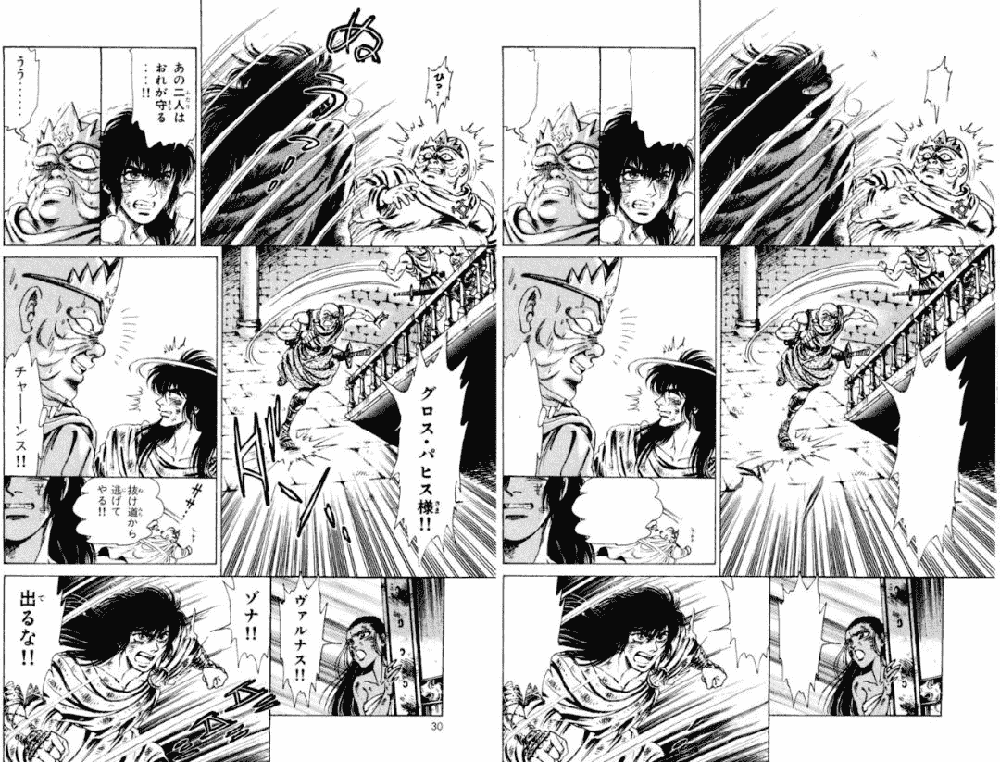

# 漫画汉化组福音：深度学习工具一键抠图

> 原文：[`mp.weixin.qq.com/s?__biz=MzA3MzI4MjgzMw==&mid=2650768532&idx=2&sn=a783bf185cdaed93e21f05c95bf21919&chksm=871a40eab06dc9fc8f79c0292ab81801a54cf8ac43631e94340230ac20ebcd0718d6ff1eca5c&scene=21#wechat_redirect`](http://mp.weixin.qq.com/s?__biz=MzA3MzI4MjgzMw==&mid=2650768532&idx=2&sn=a783bf185cdaed93e21f05c95bf21919&chksm=871a40eab06dc9fc8f79c0292ab81801a54cf8ac43631e94340230ac20ebcd0718d6ff1eca5c&scene=21#wechat_redirect)

机器之心报道

**参与：一鸣**

> 漫画抠图是汉化组翻译中必不可少而又工作量很大的一项工作，主要内容是将漫画中的文字抠去，以便替换成另一种语言。现在，这项工作可以自动化地完成了，一位韩国的开发者开源了一款工具，借助深度学习模型可以一键抠去漫画中的文字，连背景图中的文字都可以被抠去，效果十分惊人。

项目地址：https://github.com/KUR-creative/SickZil-Machine

很多人都喜欢看日本漫画，不少作品已经成为很多人心中的童年回忆。但是对于漫画的翻译人员来说，他们需要去除原有漫画的对话框和背景文字，并将其替换为读者使用的语言。由于一本漫画可能有数万个对话框和对话，因此工作量是很大的。

现在，抠图的工作人员可以基本上解放他们的双手了。只要你有 TensorFlow，就可以快速实现一键抠图，将漫画图像中的所有文字一键去除。**SickZil-Machine，一键抠图**SickZil 是韩文中的作者提供了一个视频，用于展示这一工具的效果。

[`mp.weixin.qq.com/mp/readtemplate?t=pages/video_player_tmpl&action=mpvideo&auto=0&vid=wxv_951162087429079041`](https://mp.weixin.qq.com/mp/readtemplate?t=pages/video_player_tmpl&action=mpvideo&auto=0&vid=wxv_951162087429079041)

作者同时提供了自动工具抠图的案例。

*对话框中的文字可以被完全消除。*

*有时候会有些文字消除不干净的情况，但基本不影响画面（漫画右上角标题符号）。**同时，背景中被去掉文字后，背景画面可以被自动补全，基本不改变画面效果（画面右上角背景文字）。*

从视频中可以看出，这一工具非常的方便。只需要选择待处理的漫画，然后运行工具即可。如果有一些画面被误去除，或者有一些去除不干净的情况下，用户可以手动修改需要被去除的文字。那么，这一工具背后是什么技术呢？**技术****模型架构**

据项目作者介绍，这一工具背后使用了两个模型，第一个是 Seg Net，用于检测漫画中的问题。另一个则是 Compl Net，用于处理漫画图像，去除文字并补全缺失的图像部分。Seg Net 使用的是 U-NET。这是一种编码器-解码器架构。编码器逐渐减少池化层的空间维度，解码器逐步修复物体的细节和空间维度。

*U-Net 的架构，将输入图像逐步池化后进行上采样，从而还原图像细节。*而 Compl Net 使用的是 deepfill v2，这是一个用于对任意被 mask 的图像进行修复的模型，可以适应各种 mask 的方式（块状遮盖或线条遮盖都可以）。deepfill 是 Adobe 等机构提出一系列图像修复工具，机器之心也曾用过 deepfill v1，但是效果似乎没有论文展示的那么好。目前 deepfill v2 并没有官方开源，但 GitHub 上有其他开发者复现。

*deepfill v2 的模型架构，可以进行图像修复。*

有了这两大神器，基本上可以实现漫画文字的检测识别和去除文本后的图像补全。**数据集和训练**有了模型还不够，很多读者想知道，整个系统是怎样训练的。在 Seg Net 上，作者使用了原始的漫画图像和文本内容遮盖数据，用于覆盖原始漫画中所有的文字部分。在 Compl Net 上，模型的输入为被移除了文字的漫画图像。模型使用了 285 个图像-遮盖对和 31500 张漫画图像，其中有将近 12000 张漫画是有文字的，因此训练的数据比较平衡。**安装和使用**作者没有透露训练模型的相关参数，但是提供了开发者需要准备的硬件配置。对于开发者而言，运行代码需要准备 NVIDIA 驱动 410.x，CUDA 10.0，CUDNN >= 7.4.1，TensorFlow 需要大于 1.13 版本。配置代码步骤如下：

1.  首先克隆相关代码：git clone https://github.com/KUR-creative/SickZil-Machine.git; cd SickZil-Machine

2.  下载 zip 文件，地址：https://github.com/KUR-creative/SickZil-Machine/releases。

3.  解压并复制文件：SickZil-Machine-0.1.1-pre0-win64-cpu-eng/resource/cnet 和 SickZil-Machine-0.1.1-pre0-win64-cpu-eng/resource/snet 到文件目录：SickZil-Machine/resource.

4.  进入目录并安装：pip install -r requirements.txt

5.  运行主程序：cd src; python main.py

********本****文为机器之心报道，**转载请联系公众号获得授权****。**

✄------------------------------------------------**加入机器之心（全职记者 / 实习生）：hr@jiqizhixin.com****投稿或寻求报道：**content**@jiqizhixin.com****广告 & 商务合作：bd@jiqizhixin.com**