# 你跳宅舞的样子很专业：不，这都是 AI 合成的结果

> 原文：[`mp.weixin.qq.com/s?__biz=MzA3MzI4MjgzMw==&mid=2650770958&idx=1&sn=d98f569a76bba7ef8dede58478ea5196&chksm=871a4a70b06dc366b5e615a63b1cbbd513f57c4d7fd850ac3924c8799627884dc28eb43a07f7&scene=21#wechat_redirect`](http://mp.weixin.qq.com/s?__biz=MzA3MzI4MjgzMw==&mid=2650770958&idx=1&sn=d98f569a76bba7ef8dede58478ea5196&chksm=871a4a70b06dc366b5e615a63b1cbbd513f57c4d7fd850ac3924c8799627884dc28eb43a07f7&scene=21#wechat_redirect)

选自 arXiv

**作者：Wen Liu、Zhixin Piao 等**

**机器之心编译**

**机器之心编辑部** 

> 对于大多数人来说，跳舞并不是一件简单的事情。但不会跳并不意味着看不到自己跳舞的样子。

想展示自己的完美舞姿吗？你现在只需要一段别人跳舞的视频，和自己的一张照片。最近，来自上海科技大学和腾讯 AI Lab 的新研究着实让很多人跃跃欲试。

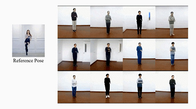

虽然性别不同，身材也相差不少，但 AI 能够做到近乎完美的动作迁移，看来以后在视频网站的舞蹈区，我们也要注意辨别真假了。不仅如此，这项研究还可以实现实时变装，3D 建模等功能，可谓强大。这篇论文已经入选计算机视觉顶会 ICCV 2019。论文：https://arxiv.org/pdf/1909.12224.pdf 作者还开源了 PyTorch 实现：https://github.com/svip-lab/impersonator 擅长代码的同学可以前去尝试。

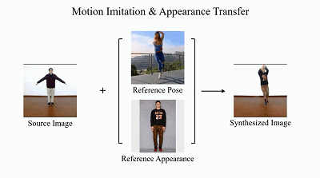*跳舞的同时，你还能换上自己想穿的衣服。*

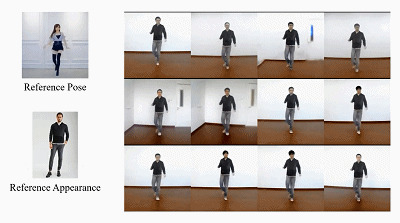

*想怎么跳这么跳，想穿什么穿什么。*

[`v.qq.com/iframe/preview.html?width=500&height=375&auto=0&vid=z300166c45n`](https://v.qq.com/iframe/preview.html?width=500&height=375&auto=0&vid=z300166c45n)

人体图像合成包括人体动作模仿、外观迁移和新视图合成，它们在重演、角色动画、虚拟试装、电影以及游戏制作等领域具有巨大的应用潜力。现有的针对特定任务的方法主要利用 2D 关键点（姿态）来估计人体结构。但是，这些方法只能表达位置信息，既无法表征个人的个性化姿态，也不能对四肢旋转进行建模。具体来说，现有的人体图像合成方法在以下三个方面遇到了挑战：1）衣服在纹理、风格、颜色和深层人脸识别等方面呈现出多样性，所以在网络架构中很难进行捕捉和保留；2）以关节相连以及可变形的人体导致任意姿态操纵出现较大的空间分布和几何变化；3）无法处理多源输入，例如在外观迁移过程中，不同的身体部位可能来自不同的源人物。针对现有方法的局限性，在这篇论文中，研究者通过一个统一的框架实现了人体动作模仿、外观迁移和新视图合成，这意味着训练过的模型可用来执行这三项任务。他们提出利用 3D 人体网格复原模块来分离人体姿态和外形，这样不仅可以对人体衔接位置和旋转进行建模，而且可以表征个性化的人体形态（体型）。为了保留纹理、风格、颜色和身份等源信息，研究者提出了一个具有 Liquid Warping Block（LWB）的 Liquid Warping GAN，它能够在图像和特征空间中传播源信息，并且可以合成类似于参照人物的图像。具体来说，研究者通过对卷积自编码器去噪，从而提取源特征，实现对源身份较好地表征。他们提出的 Liquid Warping GAN 还可以支持来自多源的更灵活的 warping。此外，研究者还构建了一个名为 Impersonator（iPER）的新数据集，用于人体动作模仿、外观迁移和新视图合成的评估。大量的实验结果表明，Liquid Warping GAN 实现了在遮挡情况下的鲁棒性、人脸的保真性、外形的连贯性和衣服的细节。**Liquid Swarping GAN 的实现效果**那么，Liquid Swarping GAN 的实现效果是怎样的呢？

*   如下图 1 上所示，在人体动态模仿过程中，首先给定源人物图像和参照人物姿态，然后生成集合源人物和参照人物姿态的合成图像；

*   如图 1 中所示，在新视图合成过程中，首先给定人体的源图像，然后生成该人体不同角度的合成图像；

*   如图 1 下所示，在外观迁移过程中，首先给定源人物图像和穿着不同衣服的参照人物图像，然后生成源人物穿着参照人物衣服的合成图像。

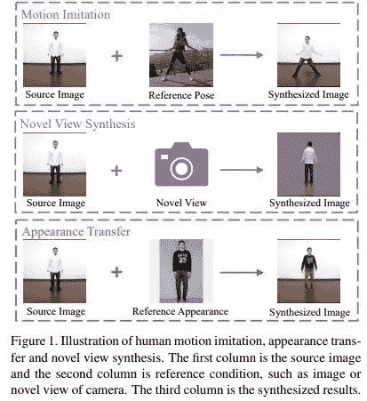*Liquid Swarping GAN 在人体动作模仿、外观迁移和新视图合成三项任务上的实现效果展示。*

那么，Liquid Swarping GAN 具体是如何保留衣服细节和人脸身份等源信息的呢？研究者提出利用 Liquid Warping Block 来从以下三个方面解决源信息损失问题：

1.  对卷积自编码器进行去噪处理，用于提取源信息中纹理、颜色、风格和人脸身份等有用特征；

2.  通过 Liquid Warping Block 将局部源特征混合到全局特征流（global feature stream），以进一步保留源人物细节；

3.  Liquid Warping Block 支持多源 warping，比如在外观迁移过程中，分别提取源人物的头部特征以及参照人物的身体特征，将它们聚合成全局特征流，生成一个新的合成图像。

此外，现有的方法主要依赖 2D 姿态、密集姿态和人体分解。这些方法只关注人体布局位置，而忽略了个性化的外形和四肢（关节）旋转，这些在人体图像合成中更加重要。如下图 6 底部图片所示，在高个子模仿低个子动作的特殊情况下，使用 2D 骨架、密集姿态和人体分解状况将不可避免地改变高个子的身高和尺寸。所以，为了克服这些缺点，研究者使用了一个参数统计人体模型 SMPL，该模型可以将人体分解为姿态（关节旋转）和外形，并输出 3D 网格（去除衣服），而不是人体关节和部位的布局。此外，通过匹配两个 3D 三角网格的对应关系，转换流（transformation flows）可以轻松地计算出来，并且较以前的关键点拟合防射矩阵更准确，误差也更小。基于 SMPL 模型和 Liquid Warping Block，研究者提出的 Liquid Warping GAN 还可以扩展到其他任务中。**Liquid Warping GAN 详解**论文中提到的 Liquid Warping GAN 包含三个步骤：身体网格复原（body mesh recovery）、流组成（flow composition）和带有 Liquid Warping Block 的 GAN 模块。不同任务的训练 pipeline 是相同的，在一个任务上训练的模型也可以用在其他任务中。研究者以动作模仿为例，其训练流程如下图 3 所示：

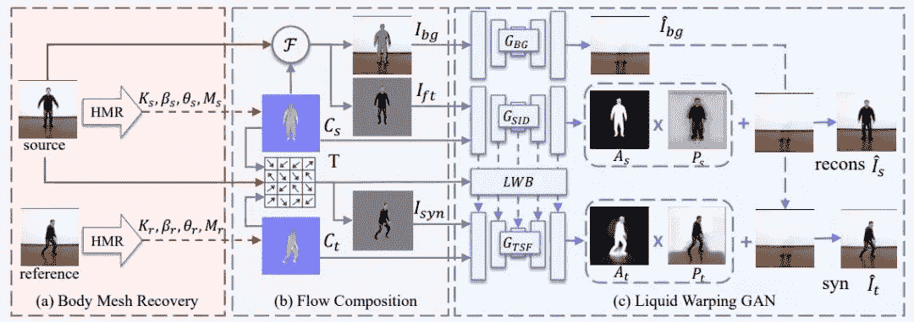*图 3：**Liquid Warping GAN 训练流程。*

Liquid Warping GAN 阶段在所需条件下合成高保真人体图像：1）合成背景图像；2）基于可见部分预测不可见部分的颜色；3）通过对 SMPL 的重构生成衣服、头发及其他部分的像素。**生成器**Liquip Warping GAN 的生成器有三个流：一个是 G_BG，用于将 masked 背景图像 I_bg 和 4 个颜色通道中 C_s 二值化得到的掩码拼接起来，以生成逼真的背景图像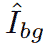，如上图 3 最上方所示。其他两个流分别是源身份流 G_SID 和迁移流 G_TSF。前者是一个去噪卷积自编码器，旨在引导编码器提取出能够保留源信息的特征。它与 一起，将 masked 源前景（foreground）I_ft 和对应图 C_s（总共 6 个通道）作为输入，并重建源前景图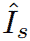。G_TSF 流用来合成最终结果，它通过双线性采样器和对应图 C_t（共 6 个通道）接收扭曲的前景。为了保留纹理、风格、颜色等源信息，研究者提出了一个新的 Liquid Warping Block（LWB），将源流和目标流连接起来。它将来自 G_SID 的源特征融合到迁移流 G_TSF 中，如上图 3c 的第三行所示。Liquid Warping Block 的优势之一是它可以应用于多个源，如人体外观迁移，保留源人物 1 的头部，同时又能穿上源人物 2 的上衣以及源人物 3 的裤子。特征的不同部分则分别通过它们各自的转换流聚合到 G_TSF 中。此处以两个源为例，如下图 4 所示：

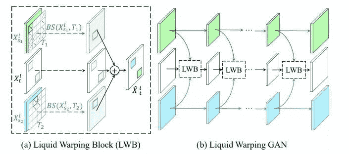*图 4：**Liquid Warping Block 示意图。**（a）LWB 结构；**（b）LWB 架构。*

G_BG、G_SID 和 G_TSF 拥有相似的架构，即 ResUnet，由 ResNet 和 UNet 组合而成，但没有共享参数。对于 G_BG，研究者直接复原了最后的背景图像；而对于 G_SID 和 G_TSF，研究者生成了一个注意力图 A 和颜色图 P，如图 3c 所示。最后的图像可以通过以下公式得到：

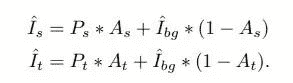

**鉴别器**Liquid Warping GAN 中的鉴别器采用了 Pix2Pix 的架构。详情可以参见论文补充材料。**实验**为了评估 Liquid Swarping GAN 在人体动作模仿、外观迁移和新视图合成三项任务上的效果，研究者构建了一个包含不同风格衣服的 iPER 数据集。该数据集中共有 30 名不同外形、身高和性别的受试者。每位受试者身着不同的衣服，并演示 A 字形姿态以及其他随机动作。**与其他方法的比较**研究者对 Liquid Swarping GAN 和 PG2、DSC 和 SHUP 等现有方法的实现效果进行了比较。他们在 iPER 数据集上训练这些方法，并应用到了 SSIM、LPIPS、IS 和 FReID 四种指标。具体结果如下表 1 所示：

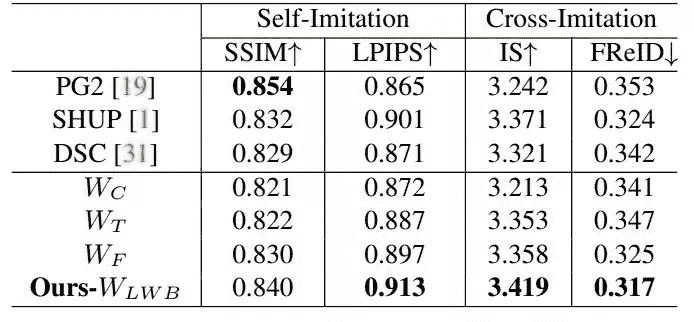*表 1：**在 iPER 数据集上不同方法的人体动作模仿结果，↑表示数值越大效果越好，↓表示数值越小效果越好。**此外，SSIM 数值越大并不代表图像质量越高。*

由此可见，Liquid Swarping GAN 优于 PG2、DSC 和 SHUP 等其他人体图像合成方法。此外，在下图 6 中，研究者还对生成图像进行分析，并对比了自身方法和其他方法的最终合成效果。

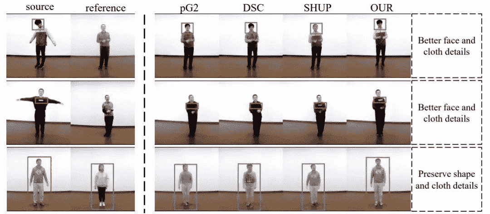*图 6：**在 iPER 数据集上对比 Liquid Swarping GAN 和其他动作模仿方法。**由最终效果图（红色和蓝色边框）可见，PG2、DSC 和 SHUP 等 2D 姿态导向方法无法保留源图像的衣服细节、清晰人脸和外形连贯性。*

如下图 7 所示，Liquid Swarping GAN 还可以在交叉模仿设置下生成高保真图像。

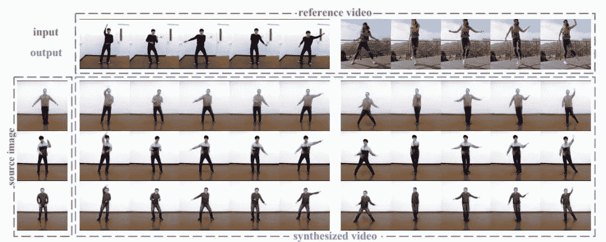*图 7：**在 iPER 数据集上利用 Liquid Swarping GAN 的人体动作模仿示例。**Liquid Swarping GAN 可以生成保留源人脸身份、外形连贯性和衣服细节的高保真图像，源图像有遮挡也不影响合成效果。*

**人体外观迁移效果**值得强调的是，训练过的模型可以直接应用到人体动作模仿、外观迁移和新视图合成三项任务中。下图 8 是研究者随机挑选的一些示例。

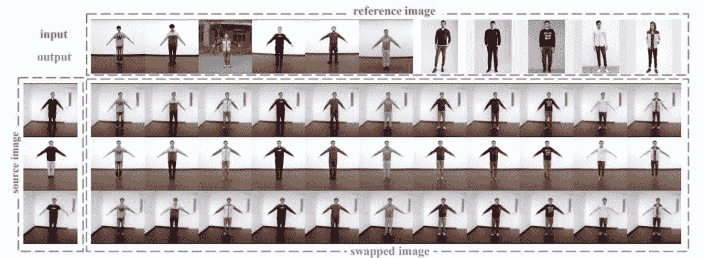*图 8\. 在 iPER 测试集中人类外观迁移方法的示例。**新的方法可以生成具有高保真度的图像，其保持了源图像中面部和身体的一些特征，并迁移到参考图像中新衣着上形成了逼真的细节。*

**新视图合成的效果**研究人员从 iPER 的测试集中随机抽取图片，并将视图从 30°调整为 330°，其结果如下图所示：

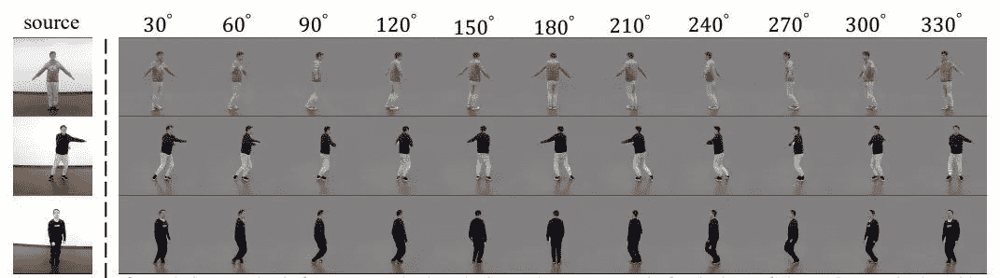*图 9\. 使用新方法在 iPER 数据集上和成全新视图的示例。**新的方法可以在不同摄像机视角下实现逼真的结果，而且即使在有自我遮挡的情况下（如手和腿），也可以保留源信息。*

********本****文为机器之心编译，**转载请联系本公众号获得授权****。**
✄------------------------------------------------**加入机器之心（全职记者 / 实习生）：hr@jiqizhixin.com****投稿或寻求报道：**content**@jiqizhixin.com****广告 & 商务合作：bd@jiqizhixin.com**