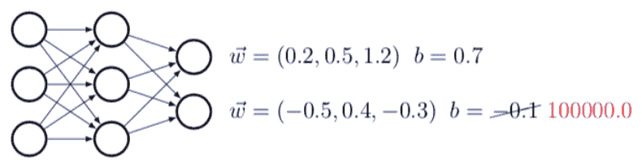
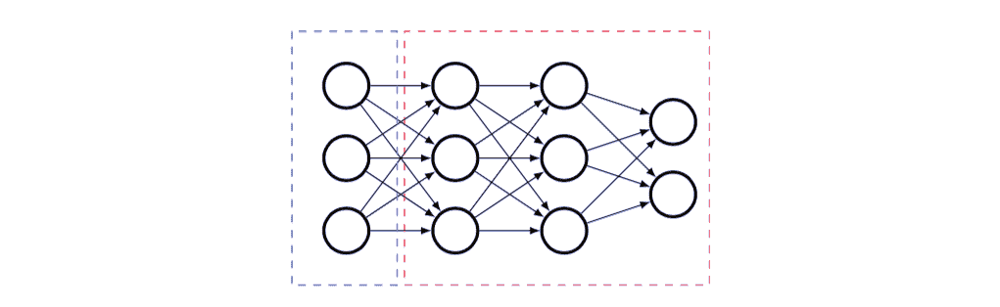

# 破解神经网络、攻击 GPU，AI 黑客教程来了，已登 GitHub 热榜

> 原文：[`mp.weixin.qq.com/s?__biz=MzA3MzI4MjgzMw==&mid=2650774446&idx=2&sn=ffac9cda388a33a081e80e8c1284f410&chksm=871a5fd0b06dd6c6eca1fc8736bd10825a68d5acdf5f4ce4bc4ba73288e15699097f77b8a92c&scene=21#wechat_redirect`](http://mp.weixin.qq.com/s?__biz=MzA3MzI4MjgzMw==&mid=2650774446&idx=2&sn=ffac9cda388a33a081e80e8c1284f410&chksm=871a5fd0b06dd6c6eca1fc8736bd10825a68d5acdf5f4ce4bc4ba73288e15699097f77b8a92c&scene=21#wechat_redirect)

机器之心报道
**参与：一鸣**

> 深度学习的广泛使用也让很多黑客跃跃欲试，想利用 AI 的弱点发起攻击。本项目总结了很多相关的方法和经验，用于教学示范，目前已登 GitHub 热榜，今天获得了 200 多赞。

随着深度学习的发展，各行各业都在考虑将相关新技术引入业务场景中，网络安全领域也不例外。近一段时间以来，很多网络安全公司都尝试用神经网络去检测病毒、发现程序后门等，而一些数据公司也使用了神经网络发现和检测恶意爬虫程序。但是，神经网络真的在软件层面上是安全吗？今日的 GitHub 趋势榜上有一个「骇入神经网络指南」项目。作者提供了一系列教学资料和代码，告诉了我们黑客会怎样对神经网络发起攻击。和对抗样本攻击不同，这些攻击都是从软件层面进行的，和使用对抗样本混淆模型能力的攻击不同。项目地址：https://github.com/Kayzaks/HackingNeuralNetworks**安全攻防战蔓延到 AI**在项目中，作者主要介绍了几种利用神经网络弱点对其发动攻击的方法，包括从使用神经网络的应用中找到漏洞，进行信息窃取、恶意程序注入和后门入侵等。此外还有利用深度学习训练中的内存加速，从 GPU 攻入系统的方法。项目具体分为多个章节，每个章节都提供了对应的代码和练习教程。除此以外，作者还提供了一篇文章，详细介绍了攻击原理和思路。教程文章地址：https://github.com/Kayzaks/HackingNeuralNetworks/blob/master/Article.pdf**课程目录**项目分为 8 个章节，目录如下：

1.  最后一层攻击

2.  寻找神经网络后门

3.  信息窃取

4.  暴力破解

5.  神经溢出

6.  恶意软件注入

7.  神经混淆

8.  寻找漏洞

9.  攻击 GPU

**如何攻击 AI 系统**作者在教程文章中提供了一个例子：攻击使用神经网咯的虹膜识别系统。假设黑客可以部分地进入到某虹膜识别系统中，但是该系统的识别认证是由一个神经网络组成的，黑客无法获取完整代码，仅有模型文件「model.h5」，怎样才能进行攻击？具体而言，这种 HDF5 文件几乎存储了模型所有的相关信息，包括架构和权重等。因此，作者认为修改文件中的权重等信息，特别是在模型的最后一层上。以一个二分类问题为例，模型的最后一层可能有两个神经元，正样本得到一个权重，而负样本则是另一个。黑客可以改变负样本的权重，使其也对本应当识别为陌生人的人授予进入的权利。

*修改神经网络权重以改变识别结果。*此外，神经网络也可以被修改，以窃取输入数据。例如，黑客可以在网络的输入层前加入一层，让这个层根据反向传播调整自身权重（其他层不参与训练），最后根据特定的标签获得对应的层和权重。这样一来，如果需要一个能够绕过虹膜识别 AI 的数据，只需要利用这样的神经网络生成一个对应的输入即可。

*研究者将一个新层加在已有层上。**这时候只需要训练新层，旧层不训练。***攻击 GPU 缓存**除了这些以外，作者还谈到了如何让深度学习中使用的 GPU 发生缓存溢出，以便于获取控制系统权限的方法。在一个图像任务中，为了对图片进行预处理并分配给模型，系统可能会将图像和模型加载到 DRAM 中并使用两个不同的核进行处理。由于预训练需要处理图像，而模型本身也很大，如果同时对两者使用全局内存（global memory），就可能使得分配给图像的内存发生溢出。溢出后，黑客就有了可以修改模型的能力。通过修改模型，则可以进一步控制整个系统。**安装依赖和使用**作者表示，本项目需要 Python 和相关依赖。项目相关代码是在 VS Code 上完成的。具体需要的依赖包包括：

1.  Keras

2.  Numpy

3.  SciPy

4.  PyCuda

5.  NLTK 

安装后就可以使用教程了。在每个章节的代码目录中都附有具体的说明信息，读者可参考说明和代码研究实现。**[机器之心「SOTA 模型」](http://mp.weixin.qq.com/s?__biz=MzA3MzI4MjgzMw==&mid=2650770891&idx=1&sn=25bde35991047a997337c8dd25350089&chksm=871a49b5b06dc0a36fc3407e3643550ef97f72b007e67c4f4be250bfd60c9fdc5389624569c0&scene=21#wechat_redirect)****：****22****大领域、127 个任务，机器学习 SOTA 研究一网打尽。******