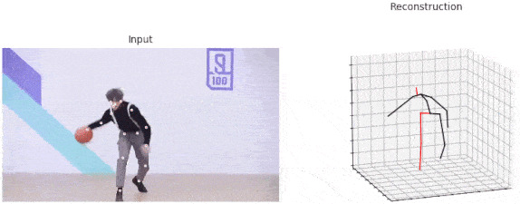
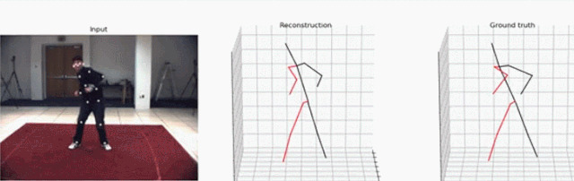
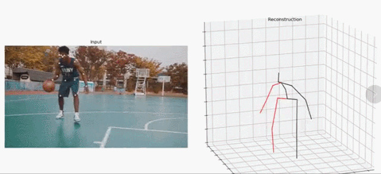
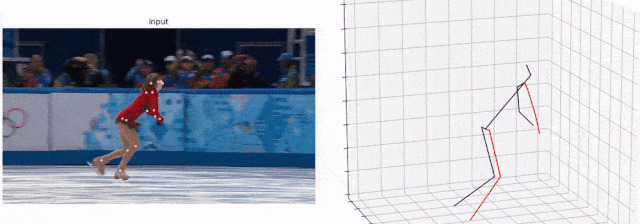
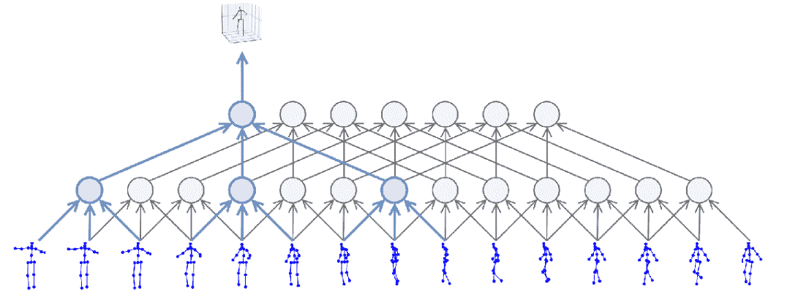
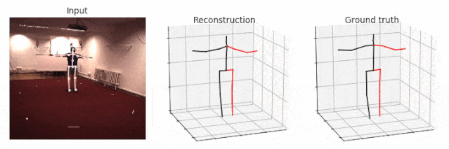
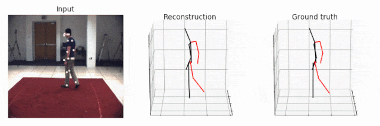

# 三、D 模型学会了「唱、跳、Rap、篮球」，GitHub 网友也沉迷「鸡你太美」

> 原文：[`mp.weixin.qq.com/s?__biz=MzA3MzI4MjgzMw==&mid=2650775876&idx=1&sn=eca28ba3a05cf9a54d477b372810e0e8&chksm=871a653ab06dec2c3ee5a16738ddd1c2029d9de19af72a32082cb46c3347f3be1cbcf932dd7c&scene=21#wechat_redirect`](http://mp.weixin.qq.com/s?__biz=MzA3MzI4MjgzMw==&mid=2650775876&idx=1&sn=eca28ba3a05cf9a54d477b372810e0e8&chksm=871a653ab06dec2c3ee5a16738ddd1c2029d9de19af72a32082cb46c3347f3be1cbcf932dd7c&scene=21#wechat_redirect)

机器之心报道

**机器之心编辑部**

> 继 B 站之后，GitHub 网友也开始沉迷「鸡你太美」，让 3D 姿态也学会了「唱、跳、Rap、篮球」，而且动作准确度和连贯性似乎一点也不输练习时长两年半的练习生。



‍看了这段 demo 之后，网友戏称，「你的律师函已经在路上了」。这段「看到停不下来」的 demo 来自一位用户名为「zh-plus」的 GitHub 网友。他用 CVPR 2019 接收论文中的一项技术实现了这种效果。实现地址：https://github.com/zh-plus/video-to-pose3D 这项技术是 3D 人体姿态预测的一种，项目作者利用该技术从原版视频中预测出了人物的 3D 姿态，无需昂贵的拍摄设备，也不需要在人物身体的关键点上贴标签。该技术的论文作者是来自苏黎世联邦理工学院、Facebook 和谷歌大脑的团队，相关论文《3D human pose estimation in video with temporal convolutions and semi-supervised training》发表在 2019 年的 CVPR 会议上。在该论文中，研究者提出了一个用于 3D 人体姿态预测的全卷积模型，只需基于 2D 的关键点执行时间卷积，就可以对视频中的人体实现精准的 3D 姿态预测。此外，他们还介绍了一种简单、高效的半监督训练方法——反向投影（back-projection），可以利用没有标注的视频数据。具体步骤可以概括为：为没有标签的视频预测 2D 关键点→预测 3D 姿态→将其反向投影到输入的 2D 关键点上。在有监督的情况下，这个全卷积模型在 Human3.6M 数据集上将误差降低了 11%，在 HumanEva-I 数据集上也实现了很大的改进。在标注数据稀缺的半监督情况下，这种反向投影的方法也优于之前的 SOTA 结果。论文地址：https://arxiv.org/abs/1811.11742 当然，除了唱、跳、Rap 和篮球，你也可以自己动手做出各种「专业选手」的 3D 模型。

*拳击。*

*打篮球。*

*优雅的「冰场公主」。*

**模型概括**研究者提出的这一方法聚焦于视频中的 3D 人体姿态预测。他们以 SOTA 方法为基础，将问题定义为 2D 关键点检测和 3D 姿势估计。虽然把问题分开可以降低任务的难度，但由于多个 3D 姿态可以映射到一个 2D 关键点上，因此处理起来依然是模糊的。之前的研究通过利用循环神经网络（RNN）建模时间信息来处理这种模棱两可的问题，但卷积网络在建模任务中的时间信息方面已经非常成功。卷积模型支持多帧的并行处理，而这是循环网络所做不到的。在这项研究工作中，研究者提出了一个全卷积架构（fully convolutional architecture）。该架构可以在 2D 关键点上执行时间卷积，以实现精准的视频 3D 姿态预测，如下图 1 所示。



*图 1：**研究者提出的时间卷积模型以 2D 关键点序列（下）为输入，生成 3D 姿态预测（上）。*这一方法兼容所有 2D 关键点检测器，并且可以通过扩大卷积来高效处理大型语境。与依赖 RNN 的方法相比，该模型非常准确、简洁和高效，在计算复杂度和参数量上都是如此。有了这种准确、高效的架构，研究者将目光转向缺乏标注数据的领域，引入了一个利用无标注视频数据进行半监督训练的新范式。缺乏标注数据的领域对于需要大量标记训练数据的神经网络模型尤其具有挑战性，而收集用于 3D 人体姿态估计的标记需要昂贵的动作捕捉设置和冗长的记录 session。本文研究者所提方法的灵感来自于无监督机器翻译的循环一致性（cycle consistency），在此过程中，中间语言和原语言之间的双向翻译应接近于恒等函数。具体来说，研究者先使用 2D 关键点检测器来预测一个无标签视频的 2D 关键点，然后预测 3D 姿态，最后将其映射回 2D 空间。与单帧基线相比，该模型可以利用时间来解决模糊问题并减少抖动/噪声。与现有的 SOTA 方法相比，该方法在监督和半监督设置下都超越了之前表现最好的模型。研究者提出的监督模型优于其他模型，即使后者利用额外的标记数据进行训练。**3D 姿态预测的实现**现在，就让我们动动手指，将视频中的人物一键转为 3D 姿态。你可以同时指定「--evaluate」和「--render」来渲染视频。这个脚本会生成一个可视化的效果，包含三个可视窗口：2D 关键点输入、3D 重建和 3D ground truth。注意，当你指定视频时，2D 检测仍然会通过既定参数从数据集中加载。你既可以选择正确的视频，也可以可视化未标注的视频，这样的话 ground truth 就不会显示了。下面是一份可视化相关的命令行参数列表：

*   --viz-subject: 渲染对象, e.g. S1；

*   --viz-action: 渲染动作, e.g. Walking 或者 Walking 1；

*   --viz-camera: 要渲染的摄像机, 对于 Human3.6M 来说从 0 到 3，对于 HumanEva 来说从 0 到 2。默认值: 0；

*   --viz-video: 需要呈现的 2D 视频路径。如果指定，该脚本将在视频顶部呈现骨架叠加。如果未指定，则将呈现黑色背景（但仍将显示 2D 检测）；

*   --viz-skip: 跳过指定视频的前 N 帧（在 HumanEva 时有意义）默认值： 0；

*   --viz-output: 输出文件名 ( .mp4 或者.gif 格式)；

*   --viz-bitrate: 设置 MP4 视频的比特率。默认值: 3000；

*   --viz-no-ground-truth: 默认情况下，视频包含三个可视图层：2D 动作输入，3D 重建和 3Dground truth。这里的意思是删除最后一个；

*   --viz-limit: 仅渲染前 N 帧。默认情况下，将渲染所有帧；

*   --viz-downsample: 按指定因子对视频进行下采样，即降低帧频。例如，如果设置为 2，则帧速率从 50 FPS 降低到 25 FPS。默认值：1（不进行下采样）；

*   --viz-size: 输出分辨率乘数。较高=较大图像。默认值：5；

*   --viz-export: 将 3D 节点坐标（在摄影空间中）导出到指定的 NumPy 存档。

**示例 1：**

```py
python run.py -k cpn_ft_h36m_dbb -arc 3,3,3,3,3 -c checkpoint --evaluate pretrained_h36m_cpn.bin --render --viz-subject S11 --viz-action Walking --viz-camera 0 --viz-video "/path/to/videos/S11/Videos/Walking.54138969.mp4" --viz-output output.gif --viz-size 3 --viz-downsample 2 --viz-limit 60
```



从摄像头 0 中生成 Walking（走路）的可视化图，并将前几帧（first frames）输出到帧率为 25 FPS 的 GIF 动画中。如果你删除--viz-video 参数，则人体动作线条将呈现在空白背景上。Human3.6M 数据集上的可视化效果图可以立即实现，但 HumanEva 数据集上的可视化相对较为困难，因为必须对输入的原始视频进行手动分割。此外，无效帧和软件同步也使可视化变得更复杂。尽管如此，通过选取验证序列中的数据块 0 以及利用--viz-skip 丢弃前几帧，你依然可以获得良好的可视化效果。如果想要了解可以跳过的帧数，请查看 data/prepare_data_humaneva.py 上的 sync_data。**示例 2：**

```py
python run.py -d humaneva15 -k detectron_pt_coco -str Train/S1,Train/S2,Train/S3 -ste Validate/S1,Validate/S2,Validate/S3 -c checkpoint --evaluate pretrained_humaneva15_detectron.bin  --render --viz-subject Validate/S2 --viz-action "Walking 1 chunk0" --viz-camera 0 --viz-output output_he.gif --viz-size 3 --viz-downsample 2 --viz-video "/path/to/videos/S2/Walking_1_(C1).avi" --viz-skip 115 --viz-limit 60
```

未标注视频的可视化更加容易，因为这些视频不需要与 ground truth 保持一致。在这种情况下，即使对于 HumanEva 数据集而言，可视化也是可以立即实现的。

**示例 3：**

```py
python run.py -d humaneva15 -k detectron_pt_coco -str Train/S1,Train/S2,Train/S3 -ste Validate/S1,Validate/S2,Validate/S3 -c checkpoint --evaluate pretrained_humaneva15_detectron.bin  --render --viz-subject Unlabeled/S4 --viz-action "Box 2" --viz-camera 0 --viz-output output_he.gif --viz-size 3 --viz-downsample 2 --viz-video "/path/to/videos/S4/Box_2_(C1).avi" --viz-limit 60
```

更多实现细节可以参见该论文的 GitHub 项目。项目地址：https://github.com/facebookresearch/VideoPose3D

第三届机器之心**「Synced Machine Intelligence Awards」**年度奖项评选正在进行中。本次评选设置**六大奖项****，**重点关注人工智能公司的产品、应用案例和产业落地情况，基于真实客观的产业表现筛选出最值得关注的企业，为行业带来实际的参考价值。

**参选报名日期**：2019 年 10 月 23 日~2019 年 12 月 15 日**评审期**：2019 年 12 月 16 日~2019 年 12 月 31 日**奖项公布**：2020 年 1 月


点击**阅读原文**，查看更多详情并报名参选。