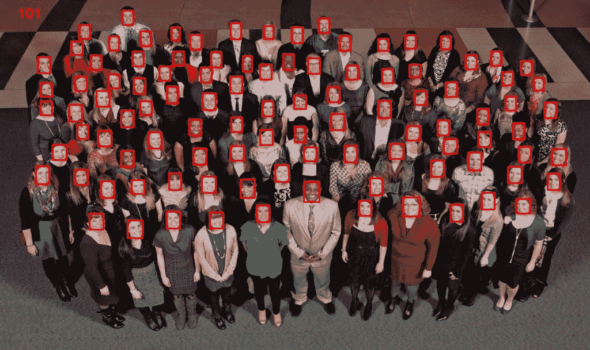
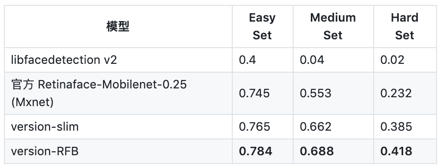
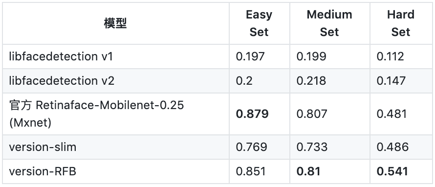
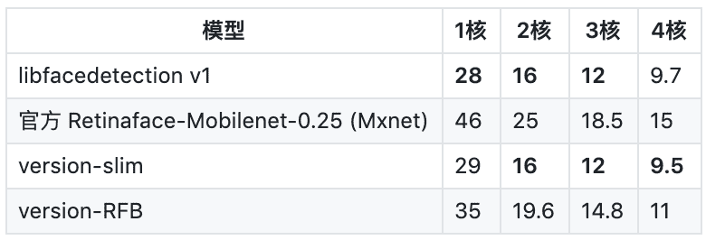
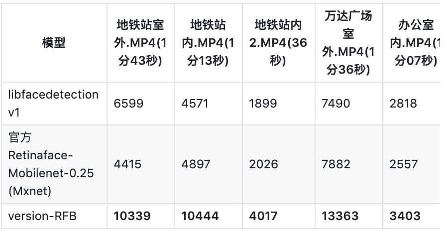
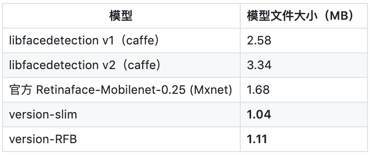
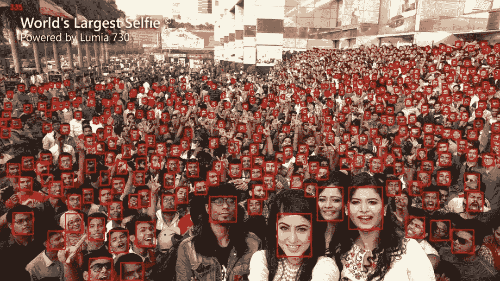

# 大小仅 1MB，超轻量级通用人脸检测模型登上 GitHub 趋势榜

> 原文：[`mp.weixin.qq.com/s?__biz=MzA3MzI4MjgzMw==&mid=2650771706&idx=2&sn=fa58a8735dc6876c4f1c62994e3f953f&chksm=871a5484b06ddd92e4a5bdb8c8b73d1b9f60633889e628108693f1d29b6294a59b0eb7e852d2&scene=21#wechat_redirect`](http://mp.weixin.qq.com/s?__biz=MzA3MzI4MjgzMw==&mid=2650771706&idx=2&sn=fa58a8735dc6876c4f1c62994e3f953f&chksm=871a5484b06ddd92e4a5bdb8c8b73d1b9f60633889e628108693f1d29b6294a59b0eb7e852d2&scene=21#wechat_redirect)

机器之心报道

**项目作者：Linzaer**

> 近日，用户 Linzaer 在 Github 上推出了一款适用于边缘计算设备、移动端设备以及 PC 的超轻量级通用人脸检测模型，该模型文件大小仅 1MB，320x240 输入下计算量仅 90MFlops。项目推出不久即引起了大家的关注，登上了今天的 Github trending。

项目地址：https://github.com/Linzaer/Ultra-Light-Fast-Generic-Face-Detector-1MB

以下是作者对此项目的介绍：该模型设计是针对边缘计算设备或低算力设备 (如用 ARM 推理) 设计的一款实时超轻量级通用人脸检测模型，旨在能在低算力设备中如用 ARM 进行实时的通用场景的人脸检测推理，同样适用于移动端环境（Android & IOS）、PC 环境（CPU & GPU )。有如下几个特点：

*   在模型大小方面，默认 FP32 精度下（.pth）文件大小为 1.1MB，推理框架 int8 量化后大小为 300KB 左右。

*   在模型计算量方面，320x240 的输入分辨率下仅 90~109 MFlops 左右，足够轻量。

*   模型设计有两个版本，version-slim(主干精简速度略快)，version-RFB(加入了修改后的 RFB 模块，精度更高)。

*   提供了 320x240、640x480 不同输入分辨率下使用 widerface 训练的预训练模型，更好的工作于不同的应用场景。

*   无特殊算子，支持 onnx 导出，便于移植推理。

**测试过正常的运行环境**

*   Ubuntu16.04、Ubuntu18.04、Windows 10

*   Python3.6

*   Pytorch1.2

*   CUDA10.0 + CUDNN7.6

**精度、速度、场景测试、模型大小比较**训练集是使用 Retinaface 提供的清理过的 widerface 标签配合 widerface 数据集生成 VOC 训练集（PS:以下测试结果均为本人测试，结果可能有部分出入）。**Widerface 测试**在 WIDER FACE test 集测试精度（单尺度输入分辨率：320*240）

在 WIDER FACE test 集测试精度（单尺度输入分辨率：VGA 640*480）

**终端设备推理速度**树莓派 4B MNN 推理测试耗时 (单位：ms)（ARM/A72x4/1.5GHz/输入分辨率 : 320x240 /int8 量化）

**场景测试**若干不同场景视频大致有效人脸检出数量测试（单位：个）（分辨率：VGA 640*480，阈值 0.6）：

**模型大小比较**若干主流开源轻量级人脸检测模型大小比较 ：

此外，如果读者希望复现这些测试，或者亲自试试训练效果，那么可以直接下载 widerface 官网数据集或者下载作者提供的训练集。这些数据集都需要放到./data 文件夹，且需要过滤掉 10×10 像素以下的人脸。如果从官网下载的数据集，那么还需要运行一个脚本过滤太小的人脸，因此最好的方法就是直接下载作者提供已过滤的数据集。

*   下载地址：https://pan.baidu.com/share/init?surl=m600pp-AsNot6XgIiqDlOw

*   提取码：x5gt

*在移除了 10*10 像素以下的极小人脸后，这个超轻量人脸检测模型能识别该图中的 335 张人脸。*至此 VOC 训练集准备完毕，项目根目录下分别有 train_mb_tiny_fd.sh 和 train_mb_tiny_RFB_fd.sh 两个脚本，前者用于训练 slim 版本模型，后者用于训练 RFB 版本模型，默认参数已设置好，参数如需微调请参考 ./train.py 中关于各训练超参数的说明。********本****文为机器之心报道，**转载请联系本公众号获得授权****。**
✄------------------------------------------------**加入机器之心（全职记者 / 实习生）：hr@jiqizhixin.com****投稿或寻求报道：**content**@jiqizhixin.com****广告 & 商务合作：bd@jiqizhixin.com**