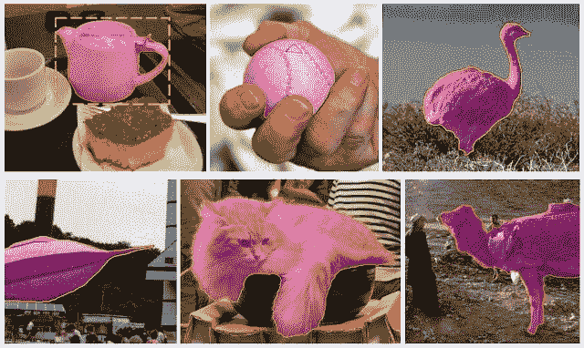
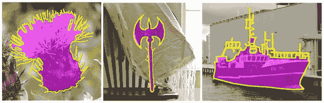
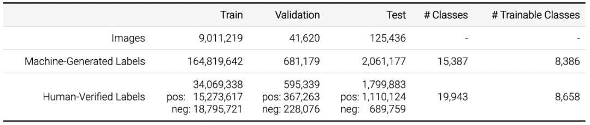

# 二百八十、万分割掩码，谷歌 Open Images 数据集再更新

> 原文：[`mp.weixin.qq.com/s?__biz=MzA3MzI4MjgzMw==&mid=2650762375&idx=3&sn=12d2d6319251ca1659b97f3f02731755&chksm=871aa8f9b06d21efe1b8601471cd9733733413b249d5146f539c4cece5e234cf7cec72579adf&scene=21#wechat_redirect`](http://mp.weixin.qq.com/s?__biz=MzA3MzI4MjgzMw==&mid=2650762375&idx=3&sn=12d2d6319251ca1659b97f3f02731755&chksm=871aa8f9b06d21efe1b8601471cd9733733413b249d5146f539c4cece5e234cf7cec72579adf&scene=21#wechat_redirect)

机器之心编辑

**参与：陈韵莹、路雪**

> 近日，谷歌开源 Open Images V5 数据集。相比于 V4 版本，新版数据集包含 280 万个物体实例的分割掩码，覆盖 350 个类别。新增 640 万个经过人工验证的图像级标签，标签总数高达 3650 万。此外，谷歌还将基于这个新数据集启动第二届 Open Images Challenge 挑战赛，该赛事新增了实例分割赛道。

2016 年，谷歌推出了图像数据集 Open Images，合作发布了约 900 万张标注图像，覆盖数千个物体类别。之后该数据集有过几次更新，最后一次更新是 2018 年的 Open Images V4。该版本共包括 600 个物体类别及 1540 万个边界框，这使其成为目前具备物体位置标注的最大数据库。此外，Open Images V4 还为 57 个类提供了 375000 个视觉关系标注。

近日，谷歌发布 Open Images V5 版本数据集（该版本在标注集上添加了分割掩码），并宣布启动第二届 Open Images Challenge 挑战赛，挑战赛基于 Open Images V5 数据集增加了新的实例分割赛道。

**Open Images V5**

Open Images V5 包含 280 万个物体实例的分割掩码，覆盖 350 个类别。与仅标注物体所在区域的边界框不同，分割掩码标记物体的轮廓，以更高层次的细节描述其空间范围。谷歌研究者确保不同物体之间的标注一致性（例如：所有猫的掩码都包括它们的尾巴；骆驼或人携带的包袋都包括在骆驼或人的掩码中）。重要的是，与以往任何数据集相比，这些掩码覆盖更广的物体类别范围和实例总数都更多。

*以上是 Open Images V5 训练集的掩码样例。这些都通过谷歌的交互式分割方法生成。第一个样例同时标注了边界框作为对比。*

训练集中的（268 万个）分割掩码都是通过谷歌提出的当前最优交互式分割方法生成。在该过程中，专业的标注人员反复修正分割神经网络的输出结果。这比单纯手工绘制更高效，同时还能提供准确的掩码（交并比达 84％）。

此外，谷歌在验证集和测试集上发布了 9.9 万个非常注重质量的手工标注掩码。它们近乎完美，甚至捕捉到了复杂物体边界的细微细节（例如：带尖刺的花朵和人造物体中的细长结构）。训练集和验证+测试集的标注都提供了比大多数现有数据集的多边形标注更准确的物体边界。

*以上为 Open Images V5 验证集和测试集的掩码样例，完全由手工绘制。*

除了掩码之外，谷歌还为该数据集增加了 640 万个经过人工验证的图像级标签，标签总数高达 3650 万，覆盖近 2 万个类别。最后，谷歌还改进了验证集和测试集上 600 个物体类别的标注密度，添加了超过 40 万个边界框，以匹配训练集的密度。这样可以确保能够更精确地评估目标检测模型。

表 1 概述了该数据集中所有子集的图像级标签。所有图像的图像级标签都由类似于 Google Cloud Vision API 的计算机视觉模型自动生成。此外，该视觉模型已经进行了升级，以适应 V5 数据集版本的较高标签质量。这些自动生成的标签有相当高的假正例率。

*表 1：图像级标签。*

此外，验证集和测试集以及部分训练集具备经过人工验证的图像级标签。大部分验证是由谷歌内部的标注人员完成的。一小部分由外包人员完成。此验证过程实际上消除了假正例（但不能消除假负例：图像中可能缺少某些标签）。得到的标签基本上是正确的，谷歌推荐将其用于计算机视觉模型的训练中。谷歌使用多个计算机视觉模型来生成样本（而不仅仅是用于生成标签的模型），使得类别得到显著扩展（表 1 中的 #classes 列）。

总体而言，数据集包含 19,949 个具备图像级标签的不同类别。请注意，此数字略高于表 1 中经过人工验证的标签数量，原因是由机器生成的集合中有少量标签未出现在人工验证的集合中。可训练类别（Trainable classes）指在 V5 训练集中至少含有 100 个人工验证正类的类。基于这个定义，可训练类别有 8658 个，而机器生成的标签覆盖了其中的 8386 个。

**Open Images Challenge 2019**

谷歌将在 ICCV 2019 上举行第二届 Open Images Challenge 挑战赛。该挑战赛将基于上述数据增加一条新的实例分割赛道。此外，与 2018 年的挑战赛一样，它将包括一个大规模目标检测赛道（500 个类别，1220 万个训练边界框），以及一个视觉关系检测赛道，用于检测成对物体中的特定关系（329 个关系三元组，37.5 万个训练样本，如「弹吉他的女人」或「桌上的啤酒」）。

现在包含所有标注的训练集已经可以使用了：https://storage.googleapis.com/openimages/web/challenge2019_downloads.html

测试集与 2018 年挑战赛的 10 万张图像相同，将于 2019 年 6 月 3 日在 Kaggle 上开放。用于评估目标检测和视觉关系赛道的服务器将于 6 月 3 日开放，评估实例分割赛道的服务器将于 7 月 1 日开放。提交结果的截止日期为 2019 年 10 月 1 日。

****本文为机器之心编辑，**转载请联系本公众号获得授权****。**

✄------------------------------------------------

**加入机器之心（全职记者 / 实习生）：hr@jiqizhixin.com**

**投稿或寻求报道：**content**@jiqizhixin.com**

**广告 & 商务合作：bd@jiqizhixin.com**