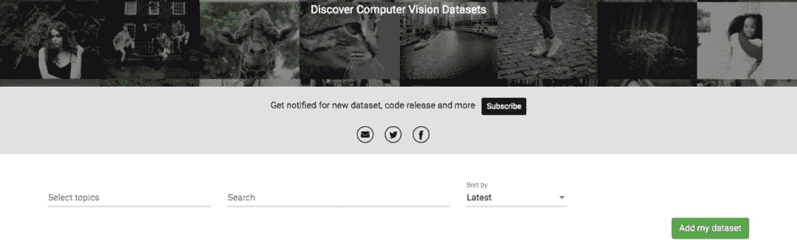
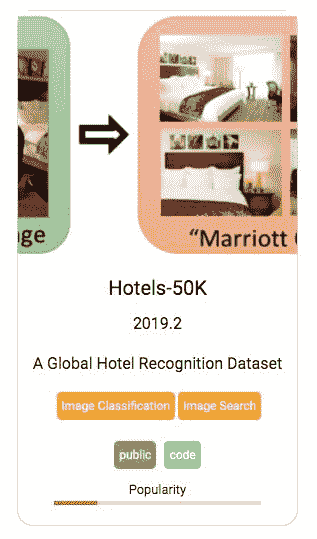
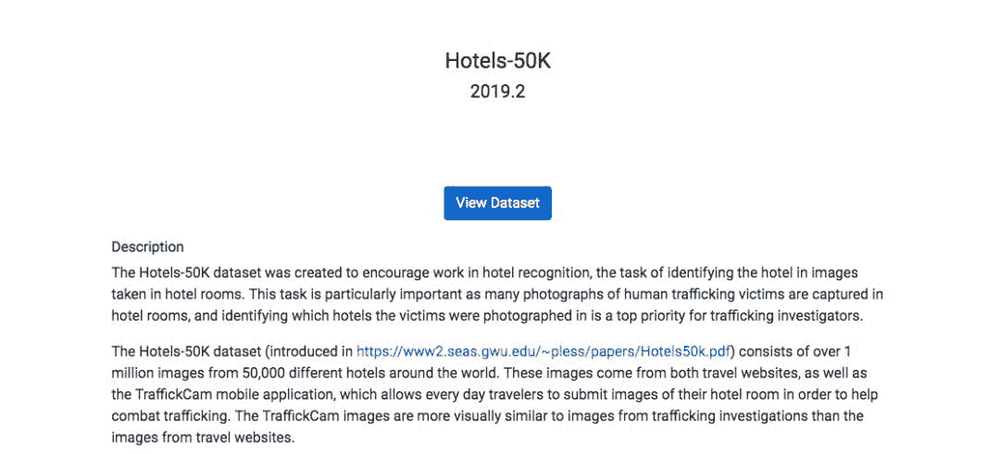

# 找不到合适的数据？这里有 281 个计算机视觉数据集任你选

> 原文：[`mp.weixin.qq.com/s?__biz=MzA3MzI4MjgzMw==&mid=2650763195&idx=3&sn=5e06c2d4879b107c0ee7b1d400812192&chksm=871aabc5b06d22d3b31d13211b219062dc3920d3532dd4c53a3dbe41a99dca39c497ad2181c0&scene=21#wechat_redirect`](http://mp.weixin.qq.com/s?__biz=MzA3MzI4MjgzMw==&mid=2650763195&idx=3&sn=5e06c2d4879b107c0ee7b1d400812192&chksm=871aabc5b06d22d3b31d13211b219062dc3920d3532dd4c53a3dbe41a99dca39c497ad2181c0&scene=21#wechat_redirect)

机器之心编辑

**参与：路**

> 这里有数百个计算机视觉数据集。

数据对于模型训练而言非常重要，但寻找合适自己项目的数据集却并不简单。计算机视觉社区经常出现新的数据集，但研究者很难追踪新型数据集。

于是，哥伦比亚大学博士冯捷在 2017 年 8 月创建了一个专用于搜索计算机视觉数据集和代码／模型的搜索引擎 VisualData。

VisualData 网站地址：https://www.visualdata.io/

该网站现已收集 281 个计算机视觉数据集，用户可以在该网站上通过简单的搜索找到适合自己项目的数据集。

用户注册网站后可以实时收到新数据集、代码发布的消息，还可以点击「Add my dataset」贡献自己的数据集。

此外，每个数据集都有多个标签，如图像分类、目标检测、图像搜索、3D 重建等，还标注了数据集的公开状态、是否已有代码，以及数据集的流行度。

*VisualData 网站上数据集示例。* 

用户可以点击数据集，查看数据集详情。点击「View Dataset」跳转链接，查看该数据集相关链接，比如 GitHub 项目等。

每个数据集的流行度得分就是根据用户查看数据集详情以及点击数据集链接的频率来计算的。

**收集方法**

VisualData 网站创建者冯捷 2017 年获得哥伦比亚大学博士学位，现任亚马逊应用科学家，研究兴趣为计算机视觉和机器学习。

他在 reddit 上表示，他首先写脚本来监控大量数据源（如 arXiv、实验室主页、社交媒体等），然后手动评估这些自动收集到的数据集，再更新到 VisualData 网站上。

**其他数据集资源网站**

VisualData 是专门提供计算机视觉数据集信息的网站，当然还有其他一些数据集资源网站。比如：

*   Kaggle 数据集：https://www.kaggle.com/datasets（目前包括 16484 个数据集）

*   [Papers With Code](http://mp.weixin.qq.com/s?__biz=MzA3MzI4MjgzMw==&mid=2650756694&idx=1&sn=4d24091c015786a5321e8e8cb7691564&chksm=871a9228b06d1b3e4c1eacdcf33daafbce2753f4927d01e283d81332183c132411a9b000fa15&scene=21#wechat_redirect)：https://paperswithcode.com/sota（目前包括 910 个数据集）

更多数据资源，参见：[20 个安全可靠的免费数据源，各领域数据任你挑](http://mp.weixin.qq.com/s?__biz=MzA3MzI4MjgzMw==&mid=2650761726&idx=3&sn=9e59299bda1cc1bd4d7b81b7c00ed273&chksm=871aad80b06d24964a5b684ebeff6a0255e3984391c56f8ce561b4b7b6d5661b1e043a10291b&scene=21#wechat_redirect)

****本文为机器之心编辑，**转载请联系本公众号获得授权****。**

✄------------------------------------------------

**加入机器之心（全职记者 / 实习生）：hr@jiqizhixin.com**

**投稿或寻求报道：**content**@jiqizhixin.com**

**广告 & 商务合作：bd@jiqizhixin.com**