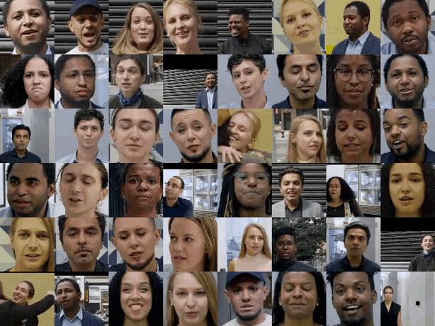
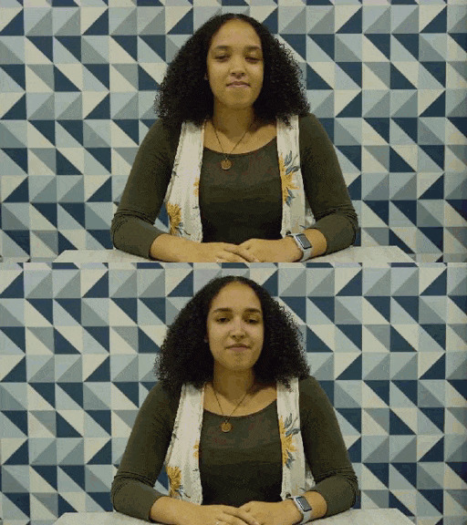

# 打击换脸技术滥用，谷歌发布大型数据集对抗 deepfake

> 原文：[`mp.weixin.qq.com/s?__biz=MzA3MzI4MjgzMw==&mid=2650771379&idx=5&sn=748c7e4678d8f1c521093c5cf8d5cedb&chksm=871a4bcdb06dc2db6a223a06956395515aecbe970db2cb6dccb2c0e31ed6d7bf101688d616c3&scene=21#wechat_redirect`](http://mp.weixin.qq.com/s?__biz=MzA3MzI4MjgzMw==&mid=2650771379&idx=5&sn=748c7e4678d8f1c521093c5cf8d5cedb&chksm=871a4bcdb06dc2db6a223a06956395515aecbe970db2cb6dccb2c0e31ed6d7bf101688d616c3&scene=21#wechat_redirect)

选自 googleblog

**作者：Nick Dufour**

**机器之心编译**

**参与：路雪**

> deepfake 出现以来引发了大量争议，也带来了诸多伦理和社会问题。最近，Facebook、微软等巨头已开始着手打击 deepfake 滥用，斥资 1000 多万美元举办 deepfake 检测挑战赛。谷歌也不甘落后，近日，这家科技巨头宣布开源大型 deepfake 视频数据集，以支持社区对 deepfake 检测的研究。

深度学习催生出许多几年前难以想象的技术。现代生成模型（modern generative model）就是其中一例，它能够合成超逼真的图像、语音、音乐甚至视频。这些模型已被广泛应用于大量用途，[包括直接基于文本生成类人语音](http://mp.weixin.qq.com/s?__biz=MzA3MzI4MjgzMw==&mid=2650734959&idx=4&sn=2094dc7aed9c2500039e7cfa58f9b5ab&chksm=871ac511b06d4c07a3fe4777ced0101935c3e31224009150739de755c9e5cd9be0607591b55e&scene=21#wechat_redirect)、为医疗影像研究生成训练数据等。和其他革新性技术一样，生成模型也带来了新的挑战，如「deepfake」。2017 年底，deepfake 首次亮相，之后出现了很多开源 deepfake 生成方法，导致合成视频片段大量涌现。尽管很多此类视频的制作初衷是搞笑，但还是有一些 deepfake 视频对个人和社会造成了恶劣影响。谷歌严肃地考虑了这些问题。去年，谷歌发布了「AI 准则」，承诺探索 AI 最佳实践，以减轻 AI 滥用和 AI 危害。去年 1 月，谷歌发布了一个合成语音数据集，用于支持 ASVspoof 2019 挑战赛，帮助开发高性能的假音频检测器。作为赛事的数据库，该数据集已被 150 多个研究机构和工业界组织下载，目前该数据集已向公众免费开放。近日，谷歌 AI 与 Jigsaw（原 Google Ideas）合作发布了大型视觉 deepfake 数据集，该数据集已被纳入慕尼黑工业大学和那不勒斯腓特烈二世大学创建的 FaceForensics 基准（由谷歌联合赞助）。FaceForensics 基准数据集地址：https://github.com/ondyari/FaceForensics/

*谷歌此次发布的 deepfake 数据集中的视频示例。**在其生成过程中，随机选择一对演员，深度神经网络对其执行换脸操作。*

为了制作该数据集，谷歌在过去一年中与多名有偿和无偿演员合作拍摄了数百个视频。然后，谷歌使用公开可用的 deepfake 生成方法，基于这些视频创建出数千个 deepfake 视频。这些真假视频共同构成了该数据集，谷歌创建此数据集的目的是支持 deepfake 检测方面的研究。作为 FaceForensics 基准的一部分，该数据集目前已开源，研究社区可免费获取并用于开发合成视频检测方法。

*在多种场景中对演员进行拍摄。**上图为真实演员，下图是对应的 deepfake 示例，二者的差异程度取决于创建 deepfake 所用的另一位演员。*

deepfake 技术发展迅速，谷歌表示将继续增加该数据集中的数据，并在该领域中持续开展合作。谷歌坚定地支持研究社区减轻合成媒介滥用所带来的潜在危害，而该数据集的发布就是其中的重要一步。*原文链接：**https://ai.googleblog.com/2019/09/contributing-data-to-deepfake-detection.html*********本****文为机器之心编译，**转载请联系本公众号获得授权****。**
✄------------------------------------------------**加入机器之心（全职记者 / 实习生）：hr@jiqizhixin.com****投稿或寻求报道：**content**@jiqizhixin.com****广告 & 商务合作：bd@jiqizhixin.com**