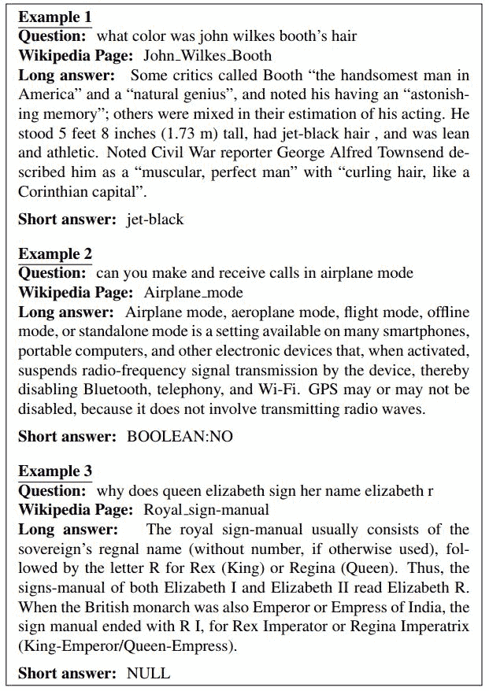
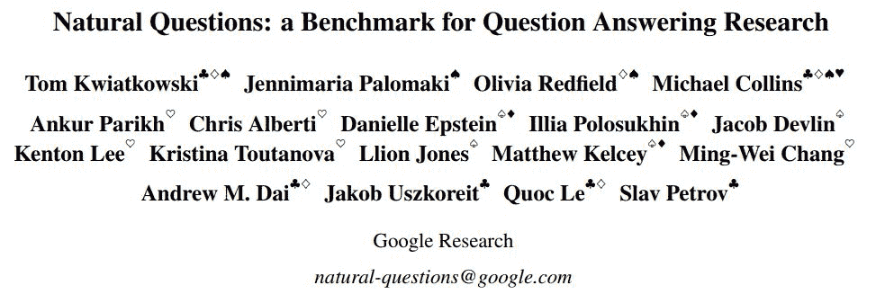
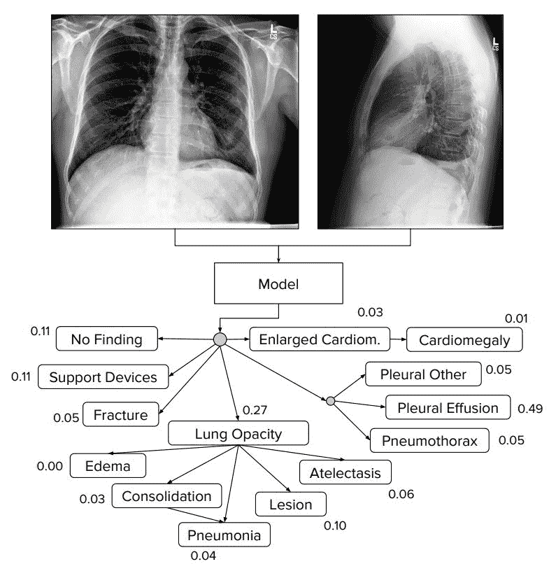
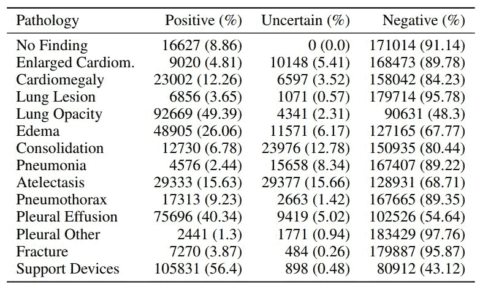
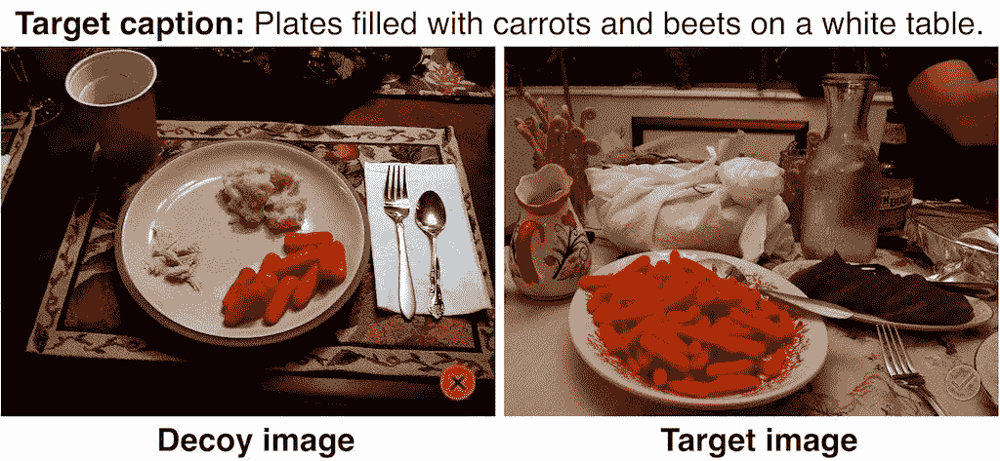
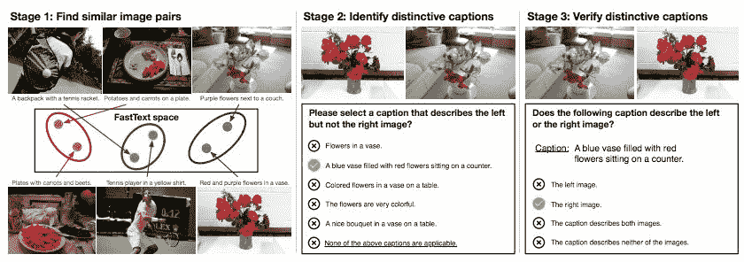

# 开放的一天，吴恩达、谷歌、Facebook 纷纷开源数据集

> 原文：[`mp.weixin.qq.com/s?__biz=MzA3MzI4MjgzMw==&mid=2650756020&idx=4&sn=437a0ac0fe75de524d2a0745da397d8c&chksm=871a97cab06d1edcd6ba93a652c1be901851705101d59b58f49de8084bcab0c039d1b97eed12&scene=21#wechat_redirect`](http://mp.weixin.qq.com/s?__biz=MzA3MzI4MjgzMw==&mid=2650756020&idx=4&sn=437a0ac0fe75de524d2a0745da397d8c&chksm=871a97cab06d1edcd6ba93a652c1be901851705101d59b58f49de8084bcab0c039d1b97eed12&scene=21#wechat_redirect)

机器之心整理

**参与：机器之心编辑部**

> 从计算机视觉到自然语言处理，这几天很多研究者都提出了新的数据集以期解决新的问题。吴恩达几个小时前开源的「胸片」数据集希望借助 CV 辅助疾病诊断；Facebook 几天前开源的「BISON」希望借助 CV 与 NLP 学习文字与图像的内在联系；而几个小时前谷歌更是开源了大型「自然问答」数据集，他们希望借助 NLP 学习人们谷歌问题并搜索答案的过程。

在这篇文章中，我们将介绍这几天开源的三种数据集，它们与已有的通用数据集都不太一样，且更关注精细化的任务。例如在谷歌开源的 QA 数据集中，它里面都是真实的搜索问题，答案也都是从维基百科查找的。这种大型的真实数据集更适合训练一个不那么「低智商」的 QA 对话系统，也更符合成年人实际会问的一些问题。

其它如吴恩达等研究者开放的胸部影像数据集和 Facebook 开源的新型图像描述数据集都很有特点，也许以后年年体检的「胸片」就能使用 DL 辅助诊断了，也许文本内容和图像内容以后就能相互转换了。

**谷歌提出自然问答数据集 Natural Questions（NQ）**

开放性的问答任务一直是衡量自然语言理解的好标准，QA 系统一般能阅读网页并返回正确的答案。然而目前并没有比较大的自然问答数据集，因为高质量的自然问答数据集需要大量实际问题以及寻找正确答案的人力成本。为了解决这一问题，谷歌近日开放了一个大规模数据集 Natural Questions（NQ），它可以用来训练并评估开放性问答系统，并且再现了人类寻找问题答案的端到端过程。

NQ 数据集非常大，包含 30 万条自然发生的问题，以及对应的回答标注，其中每一条回答都是由人工从维基百科页面找到的。此外，这个自然问答数据集还包括 1.6 万个特殊样本，其中每一个样本的答案都由 5 个不同的标注者标注，因此这种多样性的回答更适合评估 QA 系统的效果。

因为回答 NQ 中的自然性问题比回答「小问题」有更高的要求，模型需要对提问有更深的理解，因此这样的模型会更复杂，也会更贴近真实问答场景。所以谷歌在发布这个数据集的同时，还提出了一项挑战赛，它希望挑战赛能激励研究者基于这个数据集做出更好的问答系统——更能理解自然语言的问答系统。

NQ 数据集的论文中展示了标注的过程与结果。简而言之，谷歌的标注过程可以分为以下几个步骤：向标注者呈现问题和维基百科页面；标注者返回一个长回答与短回答。其中长回答（I）可以为维基百科页面上的 HTML 边界框，一般可以是一段话或一张表，它包含回答这些问题的答案。当然，如果没有合适的答案或者答案太分散，标注者也可以返回 I=NULL。短回答（s）可以是 I 中的一个或一组实体，它们可回答问题。如下展示了数据集的样本示例：

*图 1：数据集中的样本标注。* 

**论文：Natural Questions: a Benchmark for Question Answering Research**

论文地址：https://storage.googleapis.com/pub-tools-public-publication-data/pdf/b8c26e4347adc3453c15d96a09e6f7f102293f71.pdf

**摘要**：我们提出了 Natural Questions（NQ）语料库，它是一种新型问答数据集。问题都是提交到谷歌搜索引擎的匿名搜索请求。标注者会收到一条问题以及对应的维基百科页面，该维基百科页面通过问题的谷歌搜索结果（Top 5）确定。标注者会标注一个长回答（通常是段落）和一个短回答，其中如果页面有明确答案，短回答是单个或多个实体，如果没有答案，短回答和长回答标注为 NULL。

目前数据集包含 307373 对训练样本，它们有单个标注；7830 对开发或验证样本，它们有 5 种标注；还有 7842 对测试样本，它们也有 5 种标注。我们还提出了验证数据质量的实验，并分析了 302 个样本的 25 种标注，从而充分了解标注任务中的人工差异。为了评估问答系统，我们提出了鲁棒性的度量方法，并表示这些指标有非常高的人类上边界；我们同样使用相关文献中的竞争性方法建立了基线结果。

**吴恩达提出胸部放射影像数据集 CheXpert** 

胸部放射影像是全球最常见的影像检查，对很多威胁终身的疾病的筛查、诊断和治疗至关重要。在本文中，作者介绍了一种用于解释胸部放射影像的大型数据集——CheXpert (Chest eXpert)。该数据集包含来自 65,240 个病人的 224,316 张胸部放射影像，这些影像中标注了 14 种常见的胸部放射影像观察结果。作者设计了一个标注工具（labeler），它能够从放射报告文本中提取观察结果并使用不确定性标签捕捉报告中存在的不确定性。

*图 1：CheXpert 任务旨在根据多视角胸部放射影像预测不同观察结果的概率。*

CheXpert 任务要根据多视角胸部放射影像（见图 1）来预测 14 种不同观察结果的概率。作者尤其关注数据集中的不确定性标签，并研究了结合这些不确定性标签来训练模型的不同方法。然后在包含 200 项标记的验证集上评估了这些不确定性方法的性能，这些标注真值由 3 位放射科医生一致确定，他们用放射影像注释了该验证集。作者根据病理的临床意义和在数据集中的流行程度，在 5 个选定的观察结果上评估其方法，发现不同的不确定性方法能够用于不同的观察结果。

*表 1：CheXpert 数据集包含 14 个标记的观察结果。作者报告了训练集中包含这些观察结果的研究数量。*

**论文：CheXpert: A Large Chest Radiograph Dataset with Uncertainty Labels and Expert Comparison**

论文地址：https://arxiv.org/abs/1901.07031v1

**摘要**：大型的标记数据集使得深度学习方法在诸多医疗影像任务上获得了专家级的表现。我们要展示的 CheXpert 是一个大型数据集，它包含来自 65,240 个病人的 224,316 张胸部放射影像。我们设计了一个标注工具（labeler）来自动检测影像报告中的 14 种观察结果，并捕捉影像解释中固有的不确定性。我们研究了使用不确定性标签训练卷积神经网络的不同方法，该网络在给定可用正面和侧面放射影像的情况下输出这些观察结果的概率。在一个包含 200 项胸部放射影像研究的验证集上，我们发现不同的不确定性方法可以用于不同的病理，这些研究由 3 位经过认证的放射科医生手工注释。然后，我们在包含 500 项胸部放射影像研究（这些研究由 5 位经过认证的放射科医生一致注释）的测试集上评估我们的最佳模型，并将模型的表现与另外 3 位放射科医生检测 5 种选定病理的表现进行比较。对于心脏肥大、水肿和胸腔积液三种疾病，ROC 和 PR 模型曲线位于所有 3 个放射科医师操作点之上。我们将该数据集作为评估胸部放射影像解释模型性能的标准基准公开发布。

该数据集可从以下地址免费获取：

https://stanfordmlgroup.github.io/competitions/chexpert

**Facebook 提出新型视觉定位数据集 BISON**

为系统提供关联语言内容和视觉内容的能力是计算机视觉领域的一大成就。图像描述生成和检索等任务旨在测试这种能力，但是复杂的评估指标也同时带来了一些其它能力和偏差。Facebook 近日发表论文，介绍了一种替代性视觉定位系统评估任务 Binary Image SelectiON (BISON) ：给出图像描述，让系统从一对语义相似的图像中选择与图像描述最匹配的图。系统在 BISON 任务上的准确率不仅可解释，还能够衡量系统关联图像描述中精细文本内容与图像中视觉内容的能力。Facebook 研究者收集了 BISON 数据集，它补充了 COCO Captions 数据集。研究者还使用 BISON 数据集对图像描述生成和基于描述的图像检索系统进行辅助评估。图像描述生成的度量指标表明视觉定位系统已经优于人类，但 BISON 表明这些系统与人类表现还有距离。

*图 2：COCO-BISON 数据集收集过程图示：研究者使用 COCO captions 数据集进行 BISON 数据集收集工作。首先利用描述相似度寻找相似图像，然后标注者选择对图像对中其中一个图像的描述，最后研究者让多个标注者分别基于描述选择正确的图像，从而验证标注的准确性。*

该研究由美国南加州大学博士 Hexiang Hu 和 Facebook 研究者合作完成。目前已开源了验证数据和评估代码。

*   验证数据：https://raw.githubusercontent.com/facebookresearch/binary-image-selection/master/annotations/bison_annotations.cocoval2014.json

*   评估代码：https://github.com/facebookresearch/binary-image-selection

*   论文地址：https://arxiv.org/abs/1901.06595

****本文为机器之心整理，**转载请联系本公众号获得授权****。**

✄------------------------------------------------

**加入机器之心（全职记者 / 实习生）：hr@jiqizhixin.com**

**投稿或寻求报道：**content**@jiqizhixin.com**

**广告 & 商务合作：bd@jiqizhixin.com**