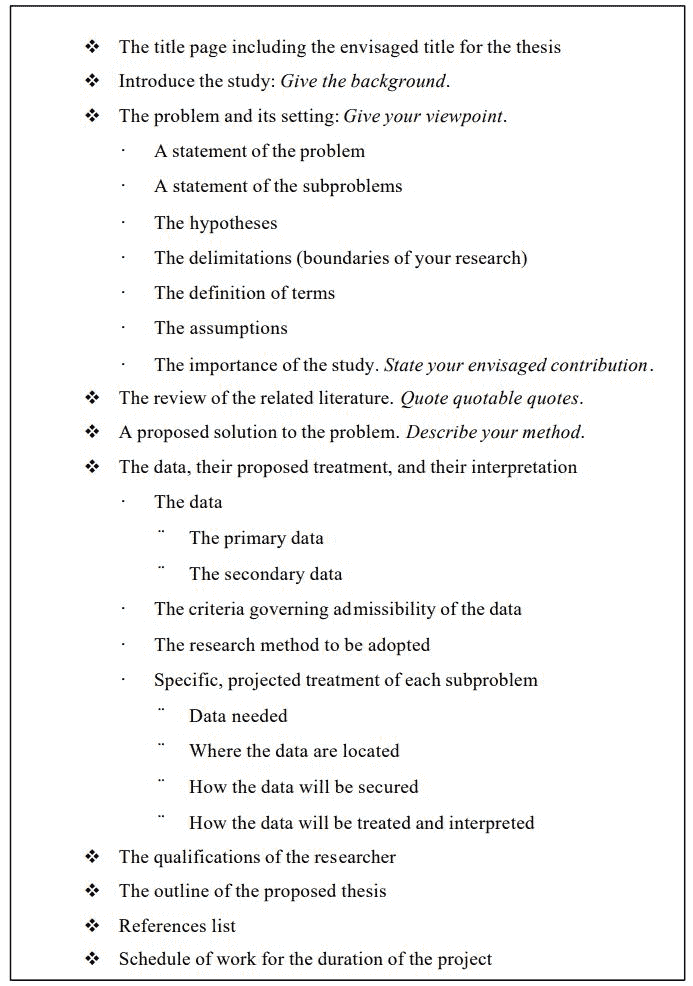

# 毕业论文无从下手？一文帮你理清头绪

> 原文：[`mp.weixin.qq.com/s?__biz=MzA3MzI4MjgzMw==&mid=2650756837&idx=2&sn=99f8a7983d319fe2a038d8a2b9effe0a&chksm=871a929bb06d1b8dcb9cc66c7f7780d3f26d8569664a578b3cfa616f18cf6e8f495177568bae&scene=21#wechat_redirect`](http://mp.weixin.qq.com/s?__biz=MzA3MzI4MjgzMw==&mid=2650756837&idx=2&sn=99f8a7983d319fe2a038d8a2b9effe0a&chksm=871a929bb06d1b8dcb9cc66c7f7780d3f26d8569664a578b3cfa616f18cf6e8f495177568bae&scene=21#wechat_redirect)

选自 jdl.ac.cn

**机器之心编译**

**参与：****Tianci Liu、张倩**

> 离毕业季还有几个月的时间，你的研究论文写好了吗？面对这项「好像完不成」的任务，本文作者给出了一些自己的建议。

作为一名研究生，对于开展自己独立的研究工作，你可能会感到有些焦虑，产生「自己没有办法完成论文所需工作」的想法。这很正常，因为完成一篇论文需要做的工作非常多。你很可能花费很多个漫长的夜晚和周末完成并记录自己的研究。不过，只要有合适的方法和指导，完成研究论文并不是一件可怕的事情。本文希望能够帮助你更系统地开展研究工作。文中包含一些有用的信息和技巧，但不是一份严格意义上的详细研究指南。

**研究是什么？**

在《实证研究：计划与设计》（Practical Research：Planning and Design）一书中，作者 Paul Leedy 将「研究」描述为「搜集并分析信息（数据）的系统化过程，旨在提升人们对所关注/感兴趣现象的理解水平。」Leedy 认为，「研究」一词被赋予了太多意义，以至于「很少有人理解其真正含义」。正如 Leedy 所定义的，正式研究最关键的特点是引入对数据的解读来得出结论。因此，研究并不仅仅是重述先前的已知事实（如本科阶段已经做过的学期论文）或通过搜寻信息来获取新知识的过程（如买车时搜集的资料）。对于我们所感兴趣的「正式研究」过程，Leedy 定义出了以下八个明确的特点：

*   起源自某个问题

*   需要明确的目标陈述

*   遵循特定的过程规划

*   通常将主要问题拆分为更可控的子问题

*   由具体的研究问题或假设所指导

*   接受特定的关键假设

*   需要搜集并解读数据，尝试借此解决先前所提出的问题

*   建立在先前已有的研究成果之上

Leedy 所提出的这八个特点也可以作为研究的方法论。

**应该如何开始？**

1.  思考一个你希望开展研究的大的领域（如交通运筹、运输管理、遥感、货物运输等）

2.  确定评审会成员。对于硕士而言，需要三位成员，其中至少一名是非本系教授。三位之一将作为论文导师。这是一个非常重要的决定，因为论文导师会指导、审阅并批准你所有的工作。导师可能有、也可能没有你所研究课题领域的专业经验。

3.  开始阅读感兴趣领域的相关文献：行业出版物、在线文章、研究报告，最重要的是，相关期刊。阅读之前或现在学生的论文也会有些帮助。在阅读的同时，开始明确自己的想法。用笔记本把思考时想到的研究课题记录下来，方便以后和评审会成员沟通交流。

4.  在硕士第一学期结束之前或之后的短时间内，和硕士项目主任预约面谈，不要犹豫等待。和项目主任探讨对研究方向有所帮助的课程。同时，还要确认计划选修的课程符合系里的毕业要求。在学习计划（POS）评估中，你的导师会最终确定完成后续硕士研究所需选修的课程。除此之外，在学习计划评估中，做好准备和评审会讨论你可能的研究课题。他们会提供指导建议。在评估之后，为确定论文研究课题所做的准备就更加充分了。

**为研究计划讨论做准备**

在和评审会一起确定了更具体的研究课题后，尽快开始收集此课题的相关文献。第一步，请评审会推荐需要阅读的关键文献。你要彻底了解在你的目标领域中前人已经取得的成果。对已经读过的文献，记笔记或整理成资料库是一个好习惯。仔细研究你的课题，如果你忽略了一些关键资源，那说明你并没有很好地理解材料。整合网上的资源，并查阅本校及外校图书馆的相关类目资料。

在完成相关文献的综述研究后，需要开始考虑你的研究计划讨论了。讨论至少应在论文初版提交前 6 个月进行（具体取决于你的评审会）。在 Locke 等人的《Proposals that work ：A Guide for Planning Dissertation and Grant Proposals》一书中，研究计划应该：

「给出所要研究问题的确切性质，详细说明将使用的研究方法。此外，研究计划通常要包含能够说明所选课题的重要性及所用研究方法的优越性的相关材料。」

研究计划应该是一篇完整的文章，并符合 Locke 等人所提出的这些要点。它应该能表明你已经确定了某个问题，为了全面有效地讨论该课题，已经充分阅读了相关文献，同时也有了完成相关研究的策略。总体而言，Locke 等人认为，研究计划将向你的评审会传达你的意图，成为你和评审会的规划，最终成为你和评审会之间的联系（如果你按描述完成了相关工作，你就应该毕业了）。

从评审会处了解研究计划的规定格式。绝大多数都会要求一个文字版计划，以及口语形式的陈述报告（向你的首席教授确认）。如果没有得到任何建议，就将文字版计划保持在 6 页的长度。以下是根据 Kennedy 修改得到的、可作为研究计划提纲的模板（可能会比要求的更细）。

**撰写论文**

*   完成你已计划好的实际研究。定期与你的论文导师沟通论文的进度和困难（这一点包含了很多工作）

*   阅读项目论文的指导教程。同时也包含毕业所要求的待做事项和时间进度表。

*   如果已经写了一个优秀的研究计划，那它可以作为你论文开始章节的基础。在撰写你的研究结果时，记住：评审会希望你的论文展示出你已经满足了他们预先提出的要求。********

*参考原文：http://www.jdl.ac.cn/how_to_research/doc/Research%20Primer%20for%20Graduate%20Students.pdf*

****本文为机器之心编译，**转载请联系本公众号获得授权****。**

✄------------------------------------------------

**加入机器之心（全职记者 / 实习生）：hr@jiqizhixin.com**

**投稿或寻求报道：**content**@jiqizhixin.com**

**广告 & 商务合作：bd@jiqizhixin.com**