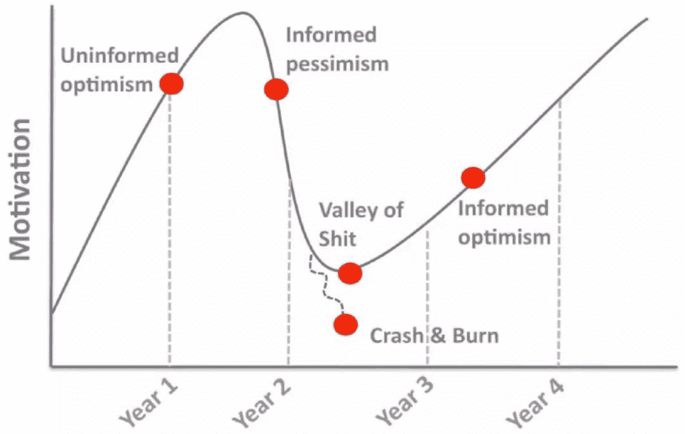

# 读博熬不住了，拿个硕士学位投身业界如何？看过来人怎么说

> 原文：[`mp.weixin.qq.com/s?__biz=MzA3MzI4MjgzMw==&mid=2650762696&idx=1&sn=848bdc234660cd672730c6376ae0857b&chksm=871aa9b6b06d20a0b12db05db49c981aad6198ca4cd79e2caf8d86bcc8bb6df8041f36a310a4&scene=21#wechat_redirect`](http://mp.weixin.qq.com/s?__biz=MzA3MzI4MjgzMw==&mid=2650762696&idx=1&sn=848bdc234660cd672730c6376ae0857b&chksm=871aa9b6b06d20a0b12db05db49c981aad6198ca4cd79e2caf8d86bcc8bb6df8041f36a310a4&scene=21#wechat_redirect)

选自 reddit

**机器之心编译**

**机器之心编辑部**

> 机器学习硕士毕业后，读博或工作，这是一个忧桑的人生抉择。

67% 的研究生说他们在过去一年里至少有一次感到绝望；54% 的人情绪低落，无法正常工作。对于许多人来说，读研究生并不是一种乐趣或个人的充实。它可能受很多因素影响，例如可怜的薪资和不确定的就业条件等等。但是在读研，尤其是博士生期间，我们又会遭受各种打击、遇到各种问题，甚至怀疑到底值不值得花那么多时间读博。所以，在硕士毕业后，我们到底是继续读博还是直接工作？

*博士期间「心跳」波动图，第二年到第三年是心态最接近「崩溃」的时间。*

**读博还是投入业界的怀抱？**

一位博士三年级的学生表示，Ta 敢肯定几乎每一位机器学习博士生在做项目中都会萌生这样的想法，就 Ta 自己而言，在完成第三年博士课程后，Ta 认真考虑要投入业界。

虽然与研究团队成员相处愉快，但节奏太慢了，Ta 觉得自己学不到任何东西了。过去三个暑假，这位博士生一直都在实习（一次是在一家较大的工业研究实验室，另外两次是在两家较小的创业公司从事工程师相关研究工作），并发现相较于单纯的研究，Ta 更享受创业公司的工作环境。Ta 称自己更喜欢构建一个能够在现实世界运行的系统，而不是想出一个性能在 CIFAR100 数据集上提升 0.5% 的架构。

Ta 宁愿从事研究性工程，而不是「数据科学」或通用软件工程，但 Ta 不认为自己能够进入一家研究实验室。最好的情况是，在度过 6 年博士生涯后顺利毕业，然后有可能从事那些只要求工科硕士学位的研究工程师工作。一方面，Ta 觉得自己会后悔没有拿到博士学位并因此错失了一些工作机会，但另一方面，虽然放弃了再熬三年获得高薪的机会，但可以在一个更有趣的地方度过青春年华（这位博士生的大学在一个无聊的大学城中）。

看着 Ta 的那些本科毕业即开始工作的朋友们正在职业之路（工程师）上大展宏图，而 Ta 自己只能苦逼地一天天呆在实验室赶制一篇又一篇论文，这真是太丧了！

Ta 想问问大家，你们当中那些拿到工科硕士学位后即认真考虑投身业界的朋友有没有后悔呢（或者那些继续选择读博的有没有后悔呢？）

**大神们怎么看**

**观点 1：支持继续读**

一位即将毕业的 PHD 表示，Ta 也因为这个问题挣扎过很长时间，很多次都想拿个硕士学位走人。但有一个信念一直支撑着 Ta——Ta 觉得读博就像开一家创业公司：你投入了很多，并希望收获丰厚的回报。这么想的话，写论文就不单单是为了发表，而是为了解决真正重要的问题。对于 ML 研究者来说，这是一个很好的时代，许多刚出校门的 PhD 就得到了不错的职位和薪水。因此，如果坚持读下去，即使志在业界，你也会往前迈进一大步。这位准 PhD 自己也在业界找到了很好的工作，所以 Ta 认为博士学位在未来还是很有帮助的。

另外，对于「实战经验更好」或「PhD 只是一纸文凭」之类的论调，这都是太想当然了，因为有很多具有丰富经验的博士在和你竞争相同的职位。对于谷歌之类的大公司，如果不是 PhD，甚至都不会有面试的机会。而且对于博士生来说，实习的机会有很多，因为它们想在毕业后雇佣你。

一位过来人表示，对于工科博士和硕士而言，薪水、待遇、升职空间的确存在很大差异。博士的额外收入和能够拿到的项目的确和硕士不一样。大家对硕士的要求可能是「做出昨天需要的东西，立刻、马上」；而对博士的要求可能就是「尝试做出 10 年后还能卖出去的东西」。另外，尽管薪水可能相差无几，但博士在时间管理上更加自由，可以在家办公等。

有人在工作之后才看到这些差异，于是决定回去继续读书。一位重返学界的硕士工程师表示，尽管在工作中已经拼尽全力，但还是有人跟 Ta 说，「如果有博士学位，你会有更多选择（薪水、职责范围等）」。因此，他觉得自己被学历限制住了，所以痛下决心重返学界，本着赶早不赶晚的心态继续读书。

尽管读博之路可能非常辛苦，但有人觉得，职业生涯是一场长达 35 年的马拉松，现在不应该贪图压力较小的生活，而应该将这种生活留到以后。「尽管职业生涯已经过半，我还在考虑回去读博。」

如果硕士毕业后就离开学界，这没什么问题，但你需要做更多才能展示你的价值。如果你是在博士期间辍学，那么就需要在简历上解释这一段经历，解释为什么没能完成博士学业。这对于公司而言是一个很重要的信息，也会引起很多顾虑。所以先准备好硬着头皮走下去，那么就继续读博吧。

**观点 2：不读博影响不大**

当然，也有人表示学历对自己的影响不大。一位 ML 的资深从业者表示，自己读大学的时候就已经开始核心机器学习工作了。幸运的是，Ta 刚入行时，这个领域还没有那么火。Ta 觉得业界经验更加重要，你可以在业界学到关键的沟通和业务逻辑技巧，公司也更加注重这些。而且，积累模型部署整个流程的上手经验比拿到数据科学领域的硕士或博士学位更有价值。Ta 回忆说，自己之所以放弃攻读硕士学位，是因为 Ta 看到周围都是这样的人，并很快意识到，只要你工作出色，无论学历高低，公司都会欣赏你。Ta 告诉自己，「你的工作很出色」，而且 Ta 也不喜欢纯研究环境的节奏，因此选择去了私企。Ta 表示，这也许是自己做的最好的决定。

当然，Ta 也不否认博士学位的好处，尤其是在数据科学领域。因为在这一领域，没有正规第二学历的人确实在写文档、做研究方面存在短板。

Ta 建议题主问一下自己。你真的喜欢做研究、发表论文吗？还是愿意躬身从基层做起，构建系统并解决问题。

对于不读博就进不了大公司的说法，有人也提出了反驳。Ta 表示，谷歌的很多团队都会雇佣软件工程师来做 ML 工作，即使这些人没有博士学位。Ta 个人认为相关的实习/工作经验比学术研究更加有吸引力。有人说博士候选人可能拥有更好的批判性思维能力、交流技巧，也可以用一两篇已发表的论文来展示自己的工作。但发表过优质论文的硕士毕业生差不多也有这些东西。博士毕业生可能起点和薪资都比较高，但硕士能早几年起步，利用这几年升到相同的职位，所以最后的差距就看不出来了。

至于放弃读博对于公司来说是不是一个危险信号，有人提出了另一种看法。Ta 认为，6 年是一段很长的时间，因此利用这六年同时了解业界和学界也很有价值。题主想要转战业界只是想弄清楚自己究竟最喜欢什么，而不是无能为力的表现。

当然，每个人关于是否继续读博都有自己的理由，但前提是想清楚自己到底喜欢什么、想要什么，愿不愿意为选择所带来的机会成本买单。

如果选择继续读博，那么在身体和心理上都要做好准备。一周多前，Nature 发表了一篇社论，表明现在许多博士生和博士后都处于身体过于疲劳、精神过度紧张的状态，这已经严重影响了他们的心理健康。

**Nature 社论：读博有害健康？**

Nature 表明，过去很多研究都揭示了这种趋势，比利时 Flanders 的一些 PhD 学生发现，他们出现心理健康问题的风险是受过高等教育学生的两倍以上。这群博士生中有三分之一目前已经出现心理问题，或者有患上心理疾病的风险。对美国亚利桑那大学博士生进行的一项调查发现，约四分之三的博士生承受着「高于平均水平」的压力。

这些研究都揭示了一些明显的问题：

1）短期博士和博士后合同，会让雇主和导师根本不重视博士生的心理健康问题，而这本来就是学校与导师的义务。而且目前学术界经常会对长时间工作持鼓励态度，这会极大助长过度劳动的状态和气氛。

2）职业生涯刚刚起步的研究者和他们导师之间的权利平衡是有问题的。资深科学家既需要充当学生的强力支持者，同时还需要成为独立的评估者。这两者之间的矛盾关系将阻碍学生分享潜在的健康问题，因为学生也会担心影响专业上的进步。

总之会有很多因素影响博士生的压力与心理状态，所以很多博士/博士生都会告诫学弟学妹们，读博之前一定要有完善的准备。那么有什么办法能减轻读博期间的心理问题吗？Nature 表明，目前也有很多基金在帮助研究机构建立心理辅导机制，很多研究在积极探讨合理的解决方案。

Nature 表示，其实解决方案就在眼前，导师需要有一个全面、强制性的培训，从而识别、帮助和理解面临心理健康问题的研究生。此外，学生也可以不止有一个导师，这样他们就能在不担心职业生涯受阻的情况下得到支持。大学校园也需要确保为本科生提供的精神健康服务，能帮助研究生和博士后远离心理健康问题。当然还有一点也非常重要，研究社区应该尊重研究者寻找生活与研究之间的平衡点。

对于很多人而言，读博确实面临着巨大的挑战，还不如拿到硕士文凭后就加入产业界。但是我们应该相信，以后读博并不会或很少影响健康，我们能在「适当」的压力下学会做最前沿的研究工作。********

拓展阅读：

[想要入坑机器学习？这是 MIT 在读博士的 AI 心得](http://mp.weixin.qq.com/s?__biz=MzA3MzI4MjgzMw==&mid=2650741405&idx=1&sn=899bc0b9725f408046bccb2329ab3432&chksm=871adee3b06d57f5f00d154e1e60866104da5f068362728daadd155587530fab252e182cc951&scene=21#wechat_redirect)

*   [我的八年博士生涯——CMU 王赟写在入职 Facebook 之前](http://mp.weixin.qq.com/s?__biz=MzA3MzI4MjgzMw==&mid=2650752712&idx=1&sn=475d83da34374ab7bb9041c882892e52&chksm=871a82b6b06d0ba005dd0c1bb7417e1850795c4c85da721d8e1d96349bd33cafa3febe389dda&scene=21#wechat_redirect)

*   [观点 | 机器学习博士生的基本素养：除了硬技能，还要学会与导师相处](http://mp.weixin.qq.com/s?__biz=MzA3MzI4MjgzMw==&mid=2650743406&idx=4&sn=63aefb6b205c6106dfc0134907e88718&chksm=871ae610b06d6f0601d72cbc95f252b1e3f33331416c231396e698e42907371b9c24f5360ace&scene=21#wechat_redirect)

*   [求生之路：博士生涯的 17 条简单生存法则](https://mp.weixin.qq.com/s?__biz=MzA3MzI4MjgzMw==&mid=2650743916&idx=1&sn=2f399e50d80aeb5a8734001c5229c10e&scene=21#wechat_redirect)

*   [专栏 | UC Berkeley 刘畅流博士：湾区五年博士路](http://mp.weixin.qq.com/s?__biz=MzA3MzI4MjgzMw==&mid=2650745105&idx=4&sn=4795d4852589caa840459a9a705fd0f7&chksm=871aed6fb06d64794149f44b14f0cb50c6c3d2dec11662cccd0220d1f7474a66d2b1ed1f397a&scene=21#wechat_redirect)

*   [观点 | 博士离开学术界算不算失败？牛津大学博士有话要说](http://mp.weixin.qq.com/s?__biz=MzA3MzI4MjgzMw==&mid=2650746674&idx=3&sn=aec6f9bff3e215244d22a7b95268d256&chksm=871aeb4cb06d625ad2ec09f41a80d1317cf3ab5b4cee1cf3f74c12a330937c0f49d08c45fedd&scene=21#wechat_redirect)

*   [Nature：刚入校门的 PhD 们还可以抢救一下](http://mp.weixin.qq.com/s?__biz=MzA3MzI4MjgzMw==&mid=2650751922&idx=2&sn=cb9ee0b18ec48c92d353872e41267a2d&chksm=871a87ccb06d0eda2ccd289573720b40362fd5c85cb8a879baece4ed28aaf24b583ff63e678f&scene=21#wechat_redirect)

*   [写在博士旅程之前——前大疆创新技术总监杨硕](http://mp.weixin.qq.com/s?__biz=MzA3MzI4MjgzMw==&mid=2650747620&idx=1&sn=c5c81fe973df0f659b34fa08e9bcd26c&chksm=871af69ab06d7f8cf220327cb6d6a7fa1f00a97d110bfbc0b688bde4f898d237bd1d765430df&scene=21#wechat_redirect)

*   [观点 | 读博有风险，入坑需谨慎](http://mp.weixin.qq.com/s?__biz=MzA3MzI4MjgzMw==&mid=2650747841&idx=3&sn=0102209ab14695e7b3eaaeb7709b77b9&chksm=871af7bfb06d7ea959e1efa3d5e35dc6ebc6481326e1209e05e5008820f112948e1ddfe17872&scene=21#wechat_redirect)

*   [我收到了斯坦福、UCL、CMU、NYU、UW 的博士 offer，这是我的经验](http://mp.weixin.qq.com/s?__biz=MzA3MzI4MjgzMw==&mid=2650753041&idx=1&sn=fa9ed60e127e01586e0cc1f92c7011cd&chksm=871a8c6fb06d057904e6e303750e8761b4545d93c72d95c7597f11a0ddd94c5762155fc0bca2&scene=21#wechat_redirect)

*参考链接：https://www.reddit.com/r/MachineLearning/comments/bt0m8v/d_to_finish_or_to_master_out/*

*https://www.nature.com/articles/d41586-019-01492-0*

****本文为机器之心编译，**转载请联系本公众号获得授权****。**

✄------------------------------------------------

**加入机器之心（全职记者 / 实习生）：hr@jiqizhixin.com**

**投稿或寻求报道：**content**@jiqizhixin.com**

**广告 & 商务合作：bd@jiqizhixin.com**