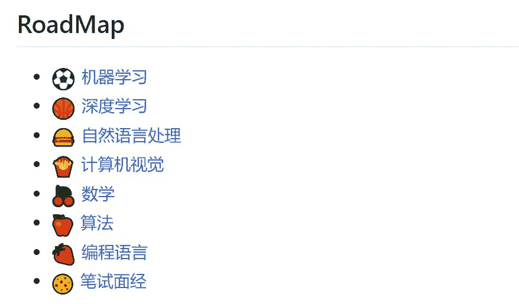
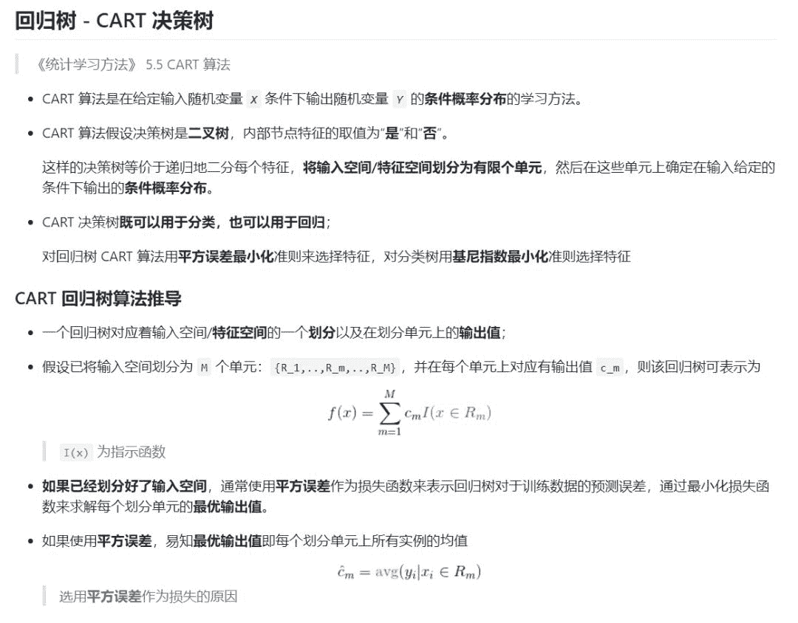
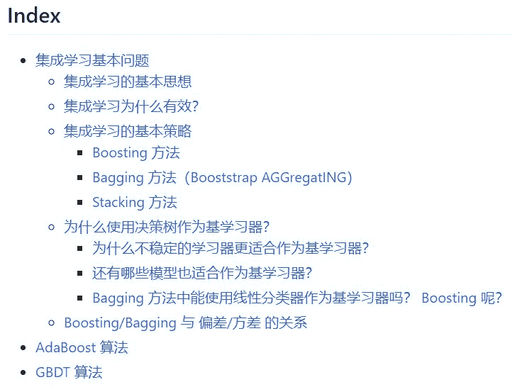
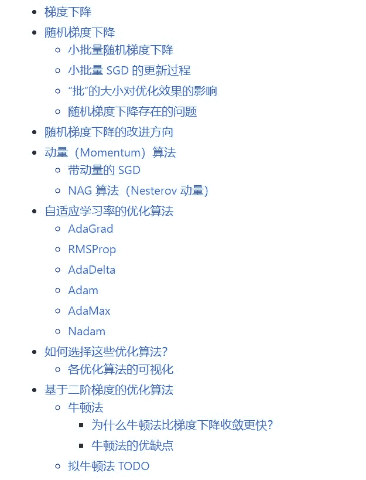
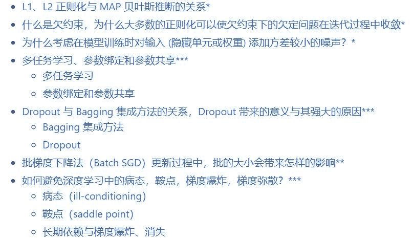
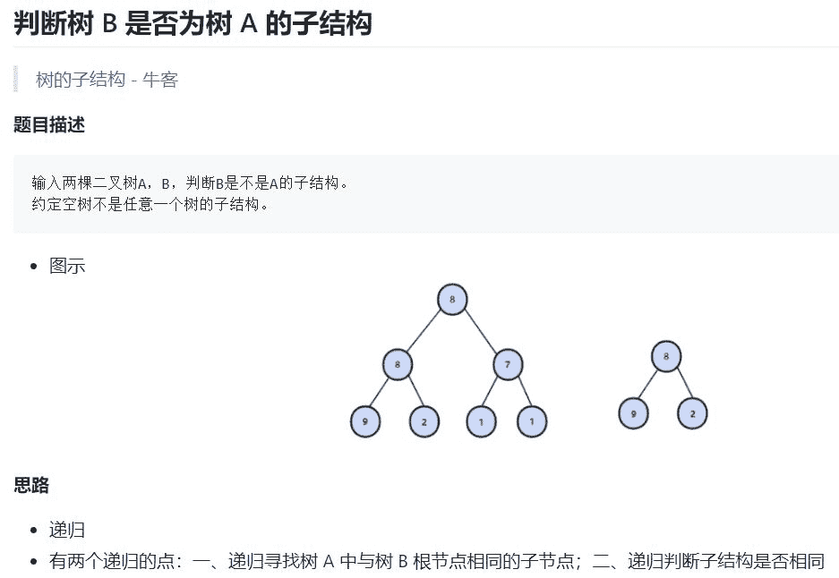
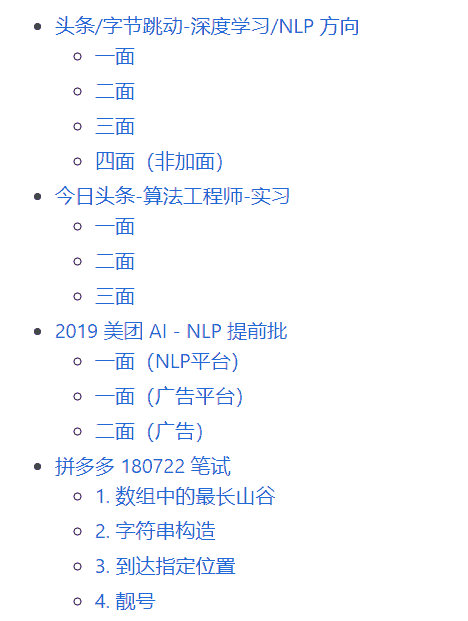
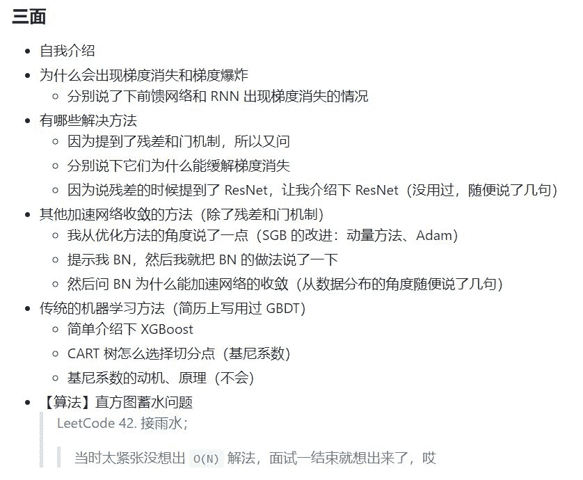
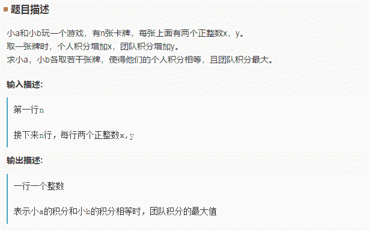

# 春招已近，这份 GitHub 万星的 ML 算法面试大全请收下

> 原文：[`mp.weixin.qq.com/s?__biz=MzA3MzI4MjgzMw==&mid=2650757466&idx=1&sn=b35dbfbb30c52c40cc4a91589c73937e&chksm=871a9d24b06d14326b88b65dda8c3c745fa88930cd3c537337b1bbb576eb8b97f7d904daecbd&scene=21#wechat_redirect`](http://mp.weixin.qq.com/s?__biz=MzA3MzI4MjgzMw==&mid=2650757466&idx=1&sn=b35dbfbb30c52c40cc4a91589c73937e&chksm=871a9d24b06d14326b88b65dda8c3c745fa88930cd3c537337b1bbb576eb8b97f7d904daecbd&scene=21#wechat_redirect)

机器之心整理

**项目作者：HUA Yang**

**机器之心编辑部**

> 春季到来，春招不久也会开始。在本项目中，作者为大家准备了 ML 算法工程师面试指南，它提供了完整的面试知识点、编程题及题解、各科技公司的面试题锦等内容。目前该 GitHub 项目已经有 1 万+的收藏量，想要跳一跳的同学快来试试吧。

*   项目地址：https://github.com/imhuay/Algorithm_Interview_Notes-Chinese

如下所示为整个项目的结构，其中从机器学习到数学主要提供的是笔记与面试知识点，读者可回顾整体的知识架构。后面从算法到笔试面经主要提供的是问题及解答方案，根据它们可以提升整体的解题水平与编程技巧。



**面试知识点**

面试题多种多样，但机器学习知识就那么多，那么为了春招或春季跳槽，何不过一遍 ML 核心知识点？在这个 GitHub 项目中，作者前一部分主要介绍了机器学习及各子领域的知识点。其中每一个知识点都只提供最核心的概念，如果读者遇到不熟悉的算法或者遇到知识漏洞，可以进一步阅读相关文献。

项目主要从机器学习、深度学习、自然语言处理和数学等方面提供详细的知识点，因为作者比较关注 NLP，所以并没有提供详细的计算机视觉笔记。

**机器学习**

首先对于机器学习，项目主要从基础概念、基本实践、基本算法和集成学习专题这四个方面概括 ML 的总体情况。其中基础概念可能是最基本的面试问题，例如「偏差方差怎么权衡？」、「生成模型和判别模型的差别是什么？」、「先验和后验概率都是什么，它们能转换吗？」。

这些知识点一般是入门者都需要了解的，而对于 ML 基本实践，主要会从如何做好传统 ML 开发流程的角度提问。例如「你如何选择超参数，能介绍一些超参数的基本搜索方法吗？」、「混淆矩阵、准确率、精确率、召回率或 F1 值都是什么，如何使用它们度量模型的好坏？」、「你能介绍数据清洗和数据预处理的主要流程吗，举个例子？」。

这些问题都能在前两部分的知识点中找到答案。后一部分的基本算法就非常多了，从最简单的 Logistic 回归到复杂的梯度提升树，这一部分总结了主流的机器学习算法：

*   信息论

*   逻辑斯蒂回归

*   支持向量机

*   决策树

*   集成学习

*   梯度提升决策树 GBDT

*   随机森林

其中每一种算法都提供了最核心的概念，例如对于决策树中的 CART 算法，笔记主要引用了李航《统计学习方法》中的描述：



最后机器学习还有一个关于集成方法的专题。除了支持向量机，集成方法相关的问题在 ML 中也比较重要，因为像 XGboost 和随机森林等方法在传统 ML 中效果应该是顶尖的，被问到的概率也大得多。



**深度学习**

深度学习的内容就相对比较多了，目前也有非常多的笔记或资料，但是我们可能会感觉深度学习的问题并没有机器学习难。顶多会让我们手推一个反向传播算法，不会像手推支持向量机那样让我们从表达式推一下卷积网络。如果要为深度学习打基础，其实最好的办法是学习 Ian Goodfellow 的《Deep Learning》，我们只要阅读这本书的前两部分：应用数学与机器学习基础；深度网络：现代实践。第三部分因为涉及大量前沿研究的东西，我们暂时可以不急着学。

该项目主要从以下几个方面介绍深度学习面试知识点：

*   深度学习基础

*   深度学习实践

*   CNN 专题

*   RNN 专题

*   优化算法专题

*   序列建模专题

*   《Deep Learning》整理

前面 6 个专题都是介绍的笔记，每一个专题都有非常多的具体内容，其中序列建模专题还引用了机器之心综述的[从循环到卷积，探索序列建模的奥秘](http://mp.weixin.qq.com/s?__biz=MzA3MzI4MjgzMw==&mid=2650740767&idx=1&sn=e66508400834c854478aa4fc2cb5d727&chksm=871adc61b06d5577f16aa8dd7adf6b6a7462e7fc1e7cb03a2bd9197e94b7566eb2cf8cdb82d0&scene=21#wechat_redirect)。如下展示了优化算法专题所包含的内容：



在最后的《Deep Learning》整理中，项目作者给出了五十多道深度学习问题，并根据这些问题介绍《Deep Learning》中的知识点。如下为问题示例，不同的星号表示问题的难度：

**自然语言处理与数学**

后面的自然语言处理也是最近在重点更新的，目前介绍的方面主要有；

*   自然语言处理基础

*   NLP 发展趋势

*   词嵌入专题

*   句嵌入专题

*   多模态专题

*   视觉问答综述

*   深度理解查询

NLP 很多知识点其实都不算基础内容，这需要根据我们自己学习的领域收集复习内容。不过像 NLP 基础或词嵌入等知识点，项目作者介绍得很详细，它们也是 NLP 面试必备知识。

最后还有一些数学知识点，它们是算法工程师面试所需要具备的基础。例如今日头条算法工程师的实习生面试会问：「在圆环上随机选取 3 个点，这 3 个点组成锐角三角形的概率？」，或者其它算个积分之类的。项目作者主要为面试准备了以下几方面的知识点;

*   概率论

*   微积分本质

*   深度学习核心

其中深度学习核心主要包含非线性激活函数、梯度下降和反向传播。

**算法题和笔试题**

对于编程面试，基础算法是必不可少的，它们一般体现在笔试题上，例如数据结构、动态规划或排列组合等。很多开发者可能感觉笔试解题会很难，因为题目并不会告诉你需要用什么样的基础算法来解决，全靠我们自己一步步解析题目。这就要求我们对各种基础算法都比较熟悉，项目作者提供了以下基本算法专题：

*   字符串

*   数据结构

*   高级数据结构

*   动态规划

*   双指针

*   区间问题

*   排列组合

*   数学问题

*   Shuffle、采样、随机数

*   大数运算

*   海量数据处理

这些算法题会介绍具体的问题、解题思路以及对应的解题代码。例如在数据结构中，我们如何判断树 B 是不是树 A 的子树。

如下所示为解题代码，注意基本上各基础算法的题解都是用 C++写的，作者会引用剑指 Offer 题解和 Leetcode 题解等的解决方案。

```py
class Solution {
public:
    bool HasSubtree(TreeNode* p1, TreeNode* p2) {
        if (p1 == nullptr || p2 == nullptr)  // 约定空树不是任意一个树的子结构
            return false;

        return isSubTree(p1, p2)    // 判断子结构是否相同
            || HasSubtree(p1->left, p2)      // 递归寻找树 A 中与树 B 根节点相同的子节点
            || HasSubtree(p1->right, p2);
    }

    bool isSubTree(TreeNode* p1, TreeNode* p2) {
        if (p2 == nullptr) return true;        // 注意这两个判断的顺序
        if (p1 == nullptr) return false;

        if (p1->val == p2->val)
            return isSubTree(p1->left, p2->left)    // 递归判断左右子树
                && isSubTree(p1->right, p2->right);
        else
            return false;
    }
}; 
```

此外，该项目还提供了 IO 模板和必备算法模板。作者表示不少笔试不像 LeetCode 那样可以自动完成 I/O，我们需要手动完成数据 I/O，而且如果我们没有 ACM 经验，很可能会在这上面浪费很多时间。因此这里总结的几种常见 IO 模板对于编程面试有很大的帮助，另外的算法模板同样也是。

例如如果我们输入不定数量个 Input，且以某个特殊输入为结束标志，那么用 C 语言实现的模板为：

```py
// 示例 1
int a, b;
while (scanf("%d %d", &a, &b) != EOF && (a != 0 && b != 0)) {
    // ...
}

// 或者
while (scanf("%d %d", &a, &b) != EOF && (a || b)) {
    // ...
}

// 示例 2
int n;
while (scanf("%d", &n) != EOF && n != 0) {
    // ...
} 
```

用 C++实现的模板为：

```py
// 示例 1
int a, b;
while (cin >> a >> b) {
    if (a == 0 && b == 0)
        break;
    // ...
}

// 示例 2
int n;
while (cin >> n && n != 0) {
    // ...
} 
```

**面试真题**

最后，项目作者还收集了十多家科技企业面试真题，并介绍从一面到三面的内容与经验。



例如以下是头条/字节跳动-深度学习/NLP 方向的三面概览：



具体的面试题也会提供，如下所示为字节跳动 18 年 8 月的笔试题：积分卡牌游戏。



当然给了题目，对应的解决方案也会提供：

```py
# 输入处理
n = int(input())
x, y = [], []
for i in range(n):
    _x, _y = list(map(int, input().split()))
    x.append(_x)
    y.append(_y)

xy = list(zip(x, y))
xy = sorted(xy, key=lambda t: t[1])

ret = 0
if sum(x) % 2 == 0:  # 如果所有 x 的和为偶数
    print(sum(y))    # 直接输出所有 y 的和
else:
    for i in range(len(xy)):
        if xy[i][0] % 2 == 1:  # 去掉 x 中为奇数的那一项
            ret = sum([xy[j][1] for j in range(len(xy)) if j != i])
            print(ret)
            break 
```

****本文为机器之心整理，**转载请联系本公众号获得授权****。**

✄------------------------------------------------

**加入机器之心（全职记者 / 实习生）：hr@jiqizhixin.com**

**投稿或寻求报道：**content**@jiqizhixin.com**

**广告 & 商务合作：bd@jiqizhixin.com**