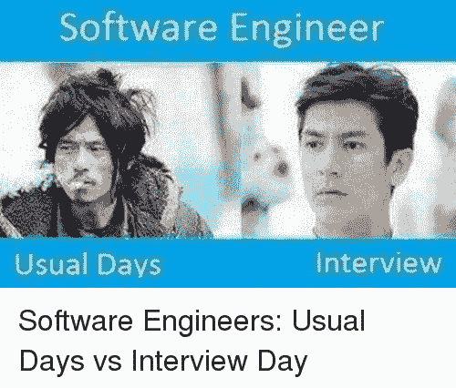
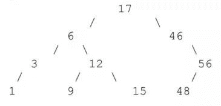
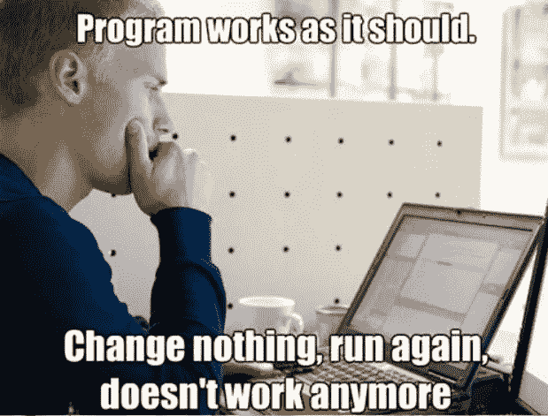
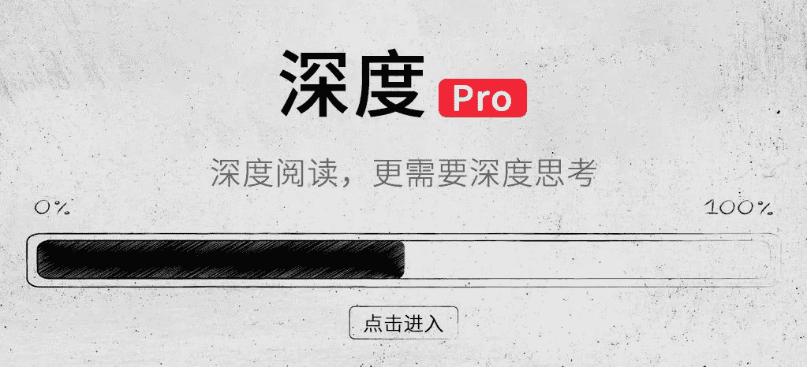

# 二千零一十九、高考编程卷：谷歌面试编程题及解题技巧（MIT 版）

> 原文：[`mp.weixin.qq.com/s?__biz=MzA3MzI4MjgzMw==&mid=2650763415&idx=1&sn=41a19ee10b27dd9967c4cf005f939965&chksm=871ab4e9b06d3dff22e8c026b3fed004bc92d775c134a79a7ad8598bab09d46f84f5ebc680b7&scene=21#wechat_redirect`](http://mp.weixin.qq.com/s?__biz=MzA3MzI4MjgzMw==&mid=2650763415&idx=1&sn=41a19ee10b27dd9967c4cf005f939965&chksm=871ab4e9b06d3dff22e8c026b3fed004bc92d775c134a79a7ad8598bab09d46f84f5ebc680b7&scene=21#wechat_redirect)

机器之心整理

**机器之心编辑部**

> 想要去谷歌、Facebook、苹果这样的公司工作吗？很多时候它们的面试会让人望而却步。不用害怕，我们已经掌握了它们的常规面试题。近日，麻省理工学院（MIT）计算机科学和人工智能实验室（CSAIL）的新版「程序员面试课程」资料已被公开。无论你是初级程序员还是经验丰富的专家，这门课程都适合你。

*   课程链接：http://courses.csail.mit.edu/iap/interview/index.php

本课程重点介绍科技公司在面试时经常出现的计算机科学问题，其中包括时间复杂度、哈希表、二进制树搜索，以及 MIT「算法设计与分析」（MIT 6.046）课程中会出现的内容。但是，大部分时间都会专注于你不会在课堂上学到的内容，例如刁钻的按位逻辑和解决问题的技巧。

**面试锦囊**

被问到一个问题时，要和面试官展开对话，让对方知道你在思考。例如，你可能会提供一个较慢或能解决部分问题的方案（让他们知道这个方案并不完美），提到一些关于这个问题的观察结果，或者说一下任何有可能对解决问题有帮助的想法。如果你卡住了，面试官通常会给你点提示。

面试期间，你通常会被要求写一个程序。出于某种原因，面试官通常让人在黑板或纸上写，而不是给你一台电脑。所以，有必要在面试之前练一下在板子上写代码，以备不时之需。

以下是编程面试中的一些注意事项：

这些事要做：

*   如果对问题有哪里不理解或有歧义，一定要问清楚；

*   让面试官知道你在想什么；

*   针对问题提出多个解决方案；

*   与面试官交流想法（如关于数据结构和算法的想法）

*   如果你卡住了，不要害怕让他们知道，可以礼貌地寻求提示。

这些事不要做：

*   不要放弃！放弃对你展示自己的问题解决技巧没有任何帮助；

*   思考期间不要只是安静地坐在那里。面试官要在有限的时间内尽可能多地了解你，不和他们交流无法向他们传递任何信息；

*   如果你已经知道问题的答案，不要脱口而出！不然他们会觉得你提前看过这个问题并记下了答案。至少要在给出答案之前假装思考一阵儿。

好了，如果你对自己的备考情况很有信心，以下是其中的一些经典问题：

**问题 1：硬币难题**

**假设你有 8 枚大小相同的硬币，但其中 1 枚硬币要比其他 7 枚稍重一点（但你不知道具体是哪一枚）。同时，你还有一个老式天平可以称重，从而得出哪枚硬币稍重（或是否重量相同）。那么，最少要称多少次才能找出那枚稍轻的硬币？**

优秀答案：从 8 枚硬币中取出 6 枚，天平左右盘各放 3 枚。结果会出现三种情况：天平左盘 3 枚硬币重于右盘，则较重的 1 枚在左盘；天平右盘的 3 枚硬币重于左盘，则较重的 1 枚在右盘；天平左右盘重量相等，则称剩下的 2 枚硬币，得出稍重的这枚硬币。

不太好的答案：分别取 4 枚硬币放置于天平左右盘，找出较轻的一组（4 枚），将该组硬币继续分为两组放入天平左右盘，找出较轻的一组（2 枚），再次重复此步骤找到最轻的一枚。

**问题 2：在数组中进行查找**

**给定一个已排序的整数数组，如何找出特定整数 x 的位置？**

优秀答案：使用二分搜索法。将数组中间的数字与 x 进行比较。如果相同，则找出了 x。如果数组中的数字较大，则需要查看数组后半部分。如果数字较小，则需要查看数组前半部分。通过比较数组中间元素和 x，我们可以重复搜索该数组的前后部分，从而再次将搜索范围缩小 2 倍。我们重复这一过程直至找出 x。这种算法花费的时间为 O(log n)。

不太好的答案：按顺序查看数组的每个数字，与 x 进行比较。这种算法花费的时间为 O(n)。

**问题 3：A to I**

**编写一个函数将字符串转换为整数（这个函数被称为 A to I 或者 atoi()），因为我们要将一个 ASCII 字符串转换为整数。**

优秀答案：从头到尾查看整个字符串。如果首个字符为负号，记下来。从 0 开始进行累计求和。每得到一个新数字，总数乘以 10 并加上这个新数字。当计算结束时，返回当前总数，或者如果出现负号，返回该数字的倒数。

凑合的答案：另一种方法也是从头到尾查看整个字符串，再次进行累计求和。记住表示当前你所在数字的数字 x，x 最开始为 1。针对每个字符，将当前数字乘以 x 并添加到累计总数中，同时将 x 乘以 10。当你到达字符串起点时，返回当前总数，或者如果出现负号，返回该数字的倒数。

注意：面试官可能会询问你自身方法的局限性。你应该回答：只有字符串在每个数字前都包含可选负号时，该方法才能生效。同时，你还应提到：如果数字太大，则结果会因为溢值原因而不正确。

**问题 4：颠倒字符串中的单词顺序**

**编写一个函数将字符串中的单词顺序进行颠倒。**

答案：交换第一个与倒数第一个、第二个与倒数第二个字符的顺序，以此类推，颠倒整个字符串。之后，查看整个字符串，找出空格，这样就可以发现每个单词的位置。再次交换第一个与倒数第一个、第二个与倒数第二个单词的顺序，以此类推，颠倒你所遇到的每个单词的顺序。

**问题 5：最近邻**

**假设你有一个包含 n 个人信息的数组。每个人分别用一个字符串（他们的名字）和一个数字（他们在数轴上的位置）表示。每个人有三个朋友，即数字和他本人最接近的三个人。请写出一个可以找出每个人的三个朋友的算法。**

优秀答案：按每个人数字的升序对数组进行排列。查看每个人前后紧邻的三个人，他们的朋友将出现在这六个人当中。这一算法花费的时间为 O(n log n)，因为将人进行分类也会花费那么多时间。

**问题 6：洗牌问题**

**给定一组不同的整数数组，给出一个算法对这些整数进行随机排序，使每个重排序方法的可能性相等。换句话说，给定一副牌，你要如何洗牌才能确保牌的每种排列方法有相同的可能？**

优秀答案：按顺序排列这些元素，用数组中不先于某个元素出现的随机元素与该元素进行交换。需要的时间为 O(n)。

注意，这个问题有多个可能的答案，也有几种看似不错但实际上并不正确的答案。例如，对上面的算法做一个小小的修改，即，将每个元素与数组中的任意一个元素交换并不能确保每种重排顺序等概率出现。这里给出的答案（在作者看来）是最佳答案。如果想了解其他答案，可以在维基百科上搜一下「Shuffling」。

**问题 7：单链表中的循环**

**如何确定单链表是否有循环？**

优秀答案：跟踪链表中的两个指针，并在链表的开始处启动它们。在算法的每轮迭代中，将第一个指针往前移一个节点，把第二个指针往前移两个节点。如果两个指针始终相同（不是在算法起点处），那么就有一个循环。如果指针在两个指针相同之前就达到链表的末端，链表中就没有循环。其实，指针不需要一次移动一到两个节点；指针也不需要以不同的速率移动。这个过程需要的时间为 O(n)。这是一个巧妙的回答，面试官会莫名喜欢。

凑合的回答 1：对于你在逐一浏览链表时遇到的每个节点，将指向该节点的指针放入 O(1) 中——查找时间数据结构，如散列集。接下来，当你遇到一个新的节点时，要看看指向那个节点的指针是否已经存在于你的散列集中。这一过程花费的时间为 O(n)，但占用的空间也是 O(n)。

凑合的回答 2：浏览链表中的元素。「Mark」你到达的每个节点。如果在抵达末端之前你到达了一个 mark 过的节点，列表中就有循环，否则就没有循环。这一过程花费的时间也是 O(n)。

注意，这个问题在技术上是不恰当的。一个普通的链表不会有循环。他们的意思是让你决定能否从一个图中的节点到达循环，该图包含最多有一条输出边的节点。

**问题 8：计算 2^x**

**如何快速计算 2^x？**

优秀答案：1 << x (1 left‐shifted by x)

**问题 9：二叉搜索树**

二叉搜索树是一种排序保存项目的数据结构，它由二叉树组成。每个节点都有一个指向两个子节点的指针（可能为 null），一个指向其父节点的可选指针（也可以为 null），以及一个存储在树中的元素（可能是一个字符串或一个整数）。要使二叉搜索树有效，每个节点的元素必须大于其左子树中的每个元素，并且小于其右子树中的每个元素。例如，二叉树可能如下所示：

要检查元素是否出现在二叉搜索树中，只需要遵循父对子之间的相应连接。例如，如果我们想在上面的树中搜索 15，我们从最上方的 17 开始。由于 15<17，我们移动到左边的节点 6。由于 15> 6，我们移动到右边的节点 12；由于 15>12，我们再次移动到正确的节点 15，最终找到了需要的数字。

要将元素加入二叉搜索树，我们就要像搜索元素一样，遵循从父节点到子节点的正确连接。当所需的子项为 null 时，我们将该元素添加为新的子节点。例如，如果我们要在上面的树中添加 14，我们就需要不断往下寻找添加的位置。当我们到达 15，就会看到该节点没有左子节点，因此我们将 14 添加为左子节点。

要从二叉搜索树中删除一个元素，我们首先要找出包含该元素的节点。如果该节点没有子节点，直接删除即可。如果该节点有一个子节点，则用这个子节点替代它。如果该节点有两个子节点，我们通过一种算法确定树中下一个更小或下一个更大的元素。为简单起见，这里就不赘述所使用的算法了。我们将节点中存储的元素设定为该值。之后，我们从树中拼接包含该值的节点。这个过程相对较容易，因为节点最多有一个子节点。例如，为了从树中删除 6，我们首先将节点值更改为 3。之后，我们删除原本值为 3 的节点，并将原本值为 6 的节点的左子节点值设定为 1。

在二叉搜索树上做小小的修改，就可以使用它将键与值关联起来，就像在散列表中一样。我们不需要在每个节点上存储单个值，而是存储一个键值对。该树将根据节点的键进行排序。

面试官有时会问到二叉搜索树的问题。此外，二叉搜索树往往在回答面试问题时也很有用。需要记住的重要一点是，插入、删除和查找需要的时间为 O(log n)，其中 n 是树中的元素数量，因为一个平衡良好的二叉搜索树的高度是 O(log n)。尽管在最糟糕的情况下，一个二叉搜索树的高度可能为 O(n)，「自平衡」二叉搜索树可以周期性地重组一个 BST 来确保其高度为 O(log n)。许多自平衡 BST 保证这些操作花费的时间为 O(log n)。

**问题 10：排除 bug**

**描述一种从程序中找出 bug 的方法。**

答案：这个问题有多个可能的答案，也是面试官经常会问的开放性问题。优秀答案可能包括：根据程序的行为判断可能出现 bug 的部分；使用断点和 stepper 逐步执行程序。任何试图找到 bug 源头和缩小 bug 搜索范围的方法都是好答案。

以上是谷歌程序员面试时可能出现的编程题及解题技巧。当然，只是其中很小的一部分。

*   想要了解更多问题和答案请点击：http://courses.csail.mit.edu/iap/interview/materials.php

*   MIT《算法设计与分析》课程资料：https://ocw.mit.edu/courses/electrical-engineering-and-computer-science/6-046j-design-and-analysis-of-algorithms-spring-2015/

最后祝大家取得一个理想的高考成绩！**********

**深度****Pro**

**理论详解 | 工程实践 | 产业分析 | 行研报告**

机器之心最新上线深度内容栏目，汇总 AI 深度好文，详解理论、工程、产业与应用。这里的每一篇文章，都需要深度阅读 15 分钟。

**今日深度推荐**

万字综述，核心开发者全面解读 PyTorch 内部机制

这所让华为砸钱，被苹果自动驾驶频繁挖人的学校，应该被你所熟知

专访院士张钹：AI 奇迹难再现，深度学习技术潜力已近天花板

点击图片，进入小程序深度 Pro 栏目

PC 点击阅读原文，访问官网

更适合深度阅读

www.jiqizhixin.com/insight