# 准备程序员面试？你需要了解这 14 种编程面试模式

> 原文：[`mp.weixin.qq.com/s?__biz=MzA3MzI4MjgzMw==&mid=2650763742&idx=3&sn=bc9df21e027dfdd2da6b7297c0245933&chksm=871ab5a0b06d3cb65174762b624eefc67f1d46ab0a7477fa8c477c435a68c0b005f61bdb2605&scene=21#wechat_redirect`](http://mp.weixin.qq.com/s?__biz=MzA3MzI4MjgzMw==&mid=2650763742&idx=3&sn=bc9df21e027dfdd2da6b7297c0245933&chksm=871ab5a0b06d3cb65174762b624eefc67f1d46ab0a7477fa8c477c435a68c0b005f61bdb2605&scene=21#wechat_redirect)

选自 Medium

**作者：Fahim ul Haq**

**机器之心编译**

**参与：Panda**

> 在面试程序员岗位时，我们往往需要经历一个编程面试过程，雇主会借此考验面试者的技术实力。然而，这些技术问题有时候却和我们的实际工作并无太大关系，也由此可能给我们的编程面试准备阶段带来很大的压力。曾在 Facebook 和微软工作过的 Educative.io 创始人 Fahim ul Haq 近日发文总结了编程面试所遇到的问题的 14 种最常见的模式，也许能帮你看清各种编程面试问题「背后的真相」。机器之心也在文末补充了我们曾经发布过的另外几篇有关面试的文章，相信能给即将进入职场的程序员带来帮助。

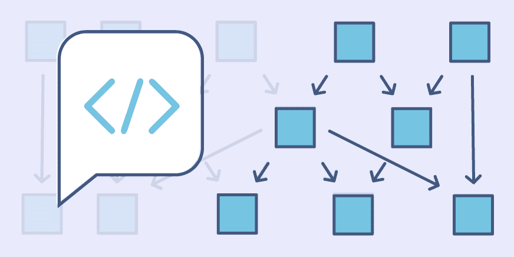

对很多开发者来说，编程工作的面试准备很容易让人焦虑。面试要涉及的东西实在太多，其中很多还往往与开发者的日常工作无关，只会额外增添压力。

这种现状导致了一个后果：现在的开发者往往需要花费数周时间在 LeetCode 等网站上了解综合数百个问题。与我谈过的开发者在面试前的一个常见焦虑问题是：我是否已经解决过足够多的实际问题？我本可以做到更多吗？

这就是我想要帮助开发者了解每个问题背后的底层模式的原因——这样他们就不必担忧解决数百个问题以及被 LeetCode 整得疲惫不堪了。如果你理解面试的通用模式，你就可以将其用作模板，从而解决各种层级的稍有不同的问题。

这里我将列出最常见的 14 种模式，它们可被用于解决任何编程面试问题。另外我还会说明如何识别每种模式，并会为每种模式提供一些问题示例。这些内容都只是蜻蜓点水——我强烈建议你看看课程《Grokking the Coding Interview: Patterns for Coding Questions》，里面提供了全面的解释、示例和编程实践。

下面的模式说明假设你已经知悉了数据结构。如果你还不了解，可以通过这些课程复习一下数据结构：https://www.educative.io/m/data-structures

我们今天将说明以下 14 种模式：

1．滑动窗口
2．二指针或迭代器
3．快速和慢速指针或迭代器
4．合并区间
5．循环排序
6．原地反转链表
7．树的宽度优先搜索（Tree BFS）
8．树的深度优先搜索（Tree DFS）
9．Two Heaps
10．子集
11．经过修改的二叉搜索
12． 前 K 个元素
13． K 路合并
14．拓扑排序

我们开始吧！

**1．滑动窗口**

滑动窗口模式是用于在给定数组或链表的特定窗口大小上执行所需的操作，比如寻找包含所有 1 的最长子数组。从第一个元素开始滑动窗口并逐个元素地向右滑，并根据你所求解的问题调整窗口的长度。在某些情况下窗口大小会保持恒定，在其它情况下窗口大小会增大或减小。

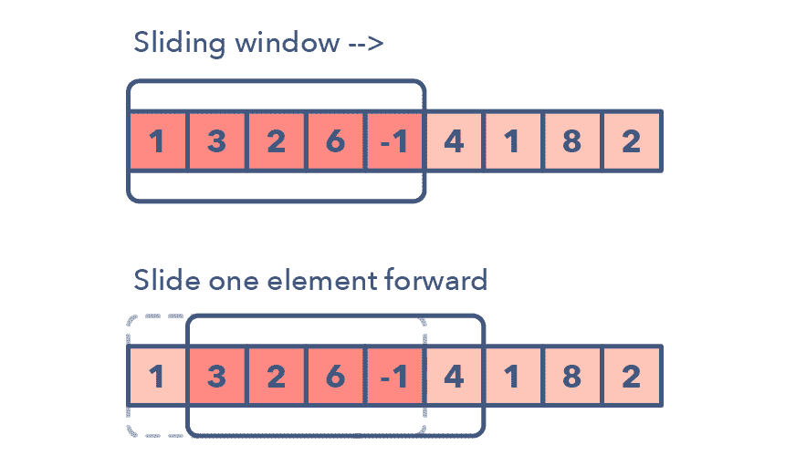

下面是一些你可以用来确定给定问题可能需要滑动窗口的方法：

*   问题的输入是一种线性数据结构，比如链表、数组或字符串

*   你被要求查找最长/最短的子字符串、子数组或所需的值

你可以使用滑动窗口模式处理的常见问题：

*   大小为 K 的子数组的最大和（简单）

*   带有 K 个不同字符的最长子字符串（中等）

*   寻找字符相同但排序不一样的字符串（困难）

**2．二指针或迭代器**

二指针（Two Pointers）是这样一种模式：两个指针以一前一后的模式在数据结构中迭代，直到一个或两个指针达到某种特定条件。二指针通常在排序数组或链表中搜索配对时很有用；比如当你必须将一个数组的每个元素与其它元素做比较时。

二指针是很有用的，因为如果只有一个指针，你必须继续在数组中循环回来才能找到答案。这种使用单个迭代器进行来回在时间和空间复杂度上都很低效——这个概念被称为「渐进分析（asymptotic analysis）」。尽管使用 1 个指针进行暴力搜索或简单普通的解决方案也有效果，但这会沿 O(n²) 线得到一些东西。在很多情况中，二指针有助于你寻找有更好空间或运行时间复杂度的解决方案。

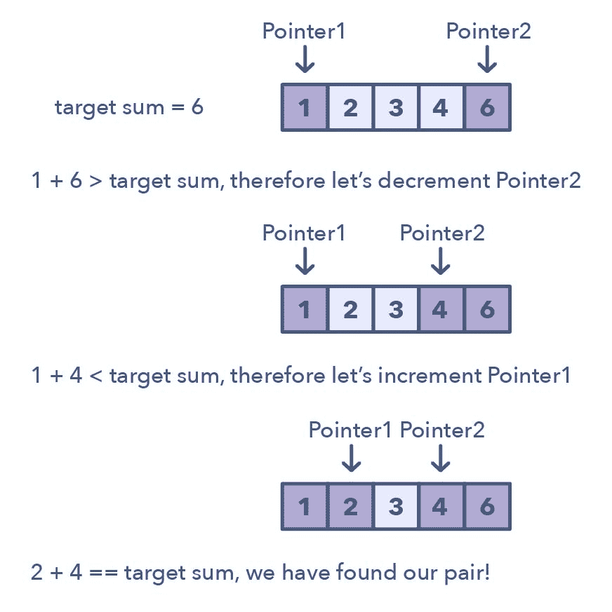

用于识别使用二指针的时机的方法：

*   可用于你要处理排序数组（或链接列表）并需要查找满足某些约束的一组元素的问题

*   数组中的元素集是配对、三元组甚至子数组

下面是一些满足二指针模式的问题：

*   求一个排序数组的平方（简单）

*   求总和为零的三元组（中等）

*   比较包含回退（backspace）的字符串（中等）

**3．快速和慢速指针**

快速和慢速指针方法也被称为 Hare & Tortoise 算法，该算法会使用两个在数组（或序列/链表）中以不同速度移动的指针。该方法在处理循环链表或数组时非常有用。

通过以不同的速度进行移动（比如在一个循环链表中），该算法证明这两个指针注定会相遇。只要这两个指针在同一个循环中，快速指针就会追赶上慢速指针。

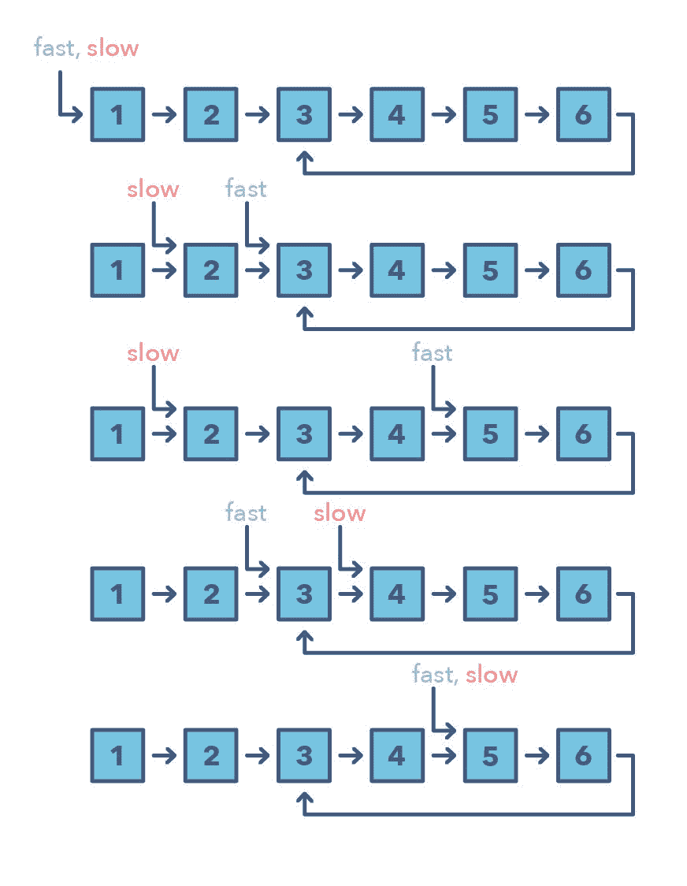

如何判别使用快速和慢速模式的时机？

*   处理链表或数组中的循环的问题

*   当你需要知道特定元素的位置或链表的总长度时

何时应该优先选择这种方法，而不是上面提到的二指针方法？

*   有些情况不适合使用二指针方法，比如在不能反向移动的单链接链表中。使用快速和慢速模式的一个案例是当你想要确定一个链表是否为回文（palindrome）时。

下面是一些满足快速和慢速指针模式的问题：

*   链表循环（简单）

*   回文链表（中等）

*   环形数组中的循环（困难）

**4．合并区间**

合并区间模式是一种处理重叠区间的有效技术。在很多涉及区间的问题中，你既需要找到重叠的区间，也需要在这些区间重叠时合并它们。该模式的工作方式为：

给定两个区间（a 和 b），这两个区间有 6 种不同的互相关联的方式：

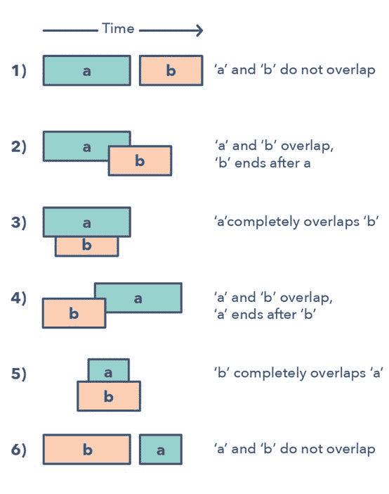理解并识别这六种情况有助于你求解范围广泛的问题，从插入区间到优化区间合并等。

那么如何确定何时该使用合并区间模式呢？

*   如果你被要求得到一个仅含互斥区间的列表

*   如果你听到了术语「重叠区间（overlapping intervals）」

合并区间模式的问题：

*   区间交叉（中等）

*   最大 CPU 负载（困难）

**5\. 循环排序**

这一模式描述了一种有趣的方法，处理的是涉及包含给定范围内数值的数组的问题。循环排序模式一次会在数组上迭代一个数值，如果所迭代的当前数值不在正确的索引处，就将其与其正确索引处的数值交换。你可以尝试替换其正确索引处的数值，但这会带来 O(n²) 的复杂度，这不是最优的，因此要用循环排序模式。

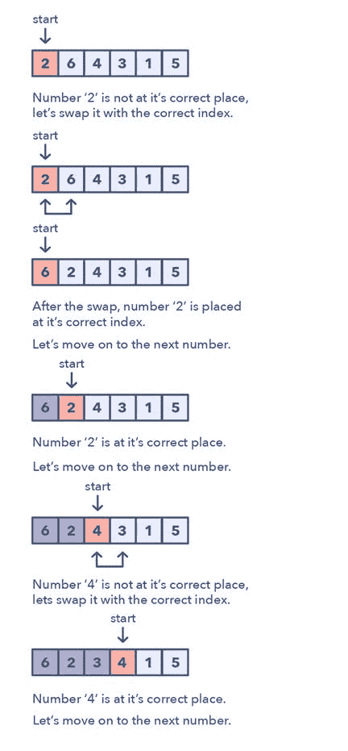如何识别这种模式？

*   涉及数值在给定范围内的排序数组的问题

*   如果问题要求你在一个排序/旋转的数组中找到缺失值/重复值/最小值

循环排序模式的问题：

*   找到缺失值（简单）

*   找到最小的缺失的正数值（中等）

**6．原地反转链表**

在很多问题中，你可能会被要求反转一个链表中一组节点之间的链接。通常而言，你需要原地完成这一任务，即使用已有的节点对象且不占用额外的内存。这就是这个模式的用武之地。该模式会从一个指向链表头的变量（current）开始一次反转一个节点，然后一个变量（previous）将指向已经处理过的前一个节点。以锁步的方式，在移动到下一个节点之前将其指向前一个节点，可实现对当前节点的反转。另外，也将更新变量「previous」，使其总是指向已经处理过的前一个节点。

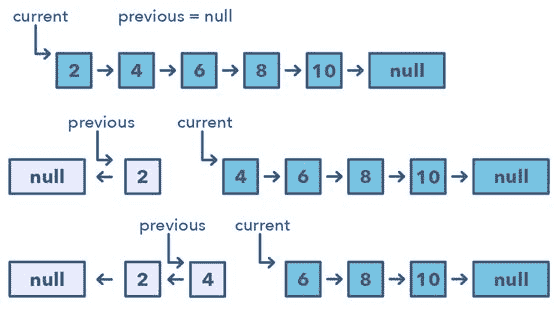如何识别使用该模式的时机：

*   如果你被要求在不使用额外内存的前提下反转一个链表

原地反转链表模式的问题：

*   反转一个子列表（中等）

*   反转每个 K 个元素的子列表（中等）

**7．树的宽度优先搜索（Tree BFS）**

该模式基于宽度优先搜索（BFS）技术，可遍历一个树并使用一个队列来跟踪一个层级的所有节点，之后再跳转到下一个层级。任何涉及到以逐层级方式遍历树的问题都可以使用这种方法有效解决。

Tree BFS 模式的工作方式是：将根节点推至队列，然后连续迭代知道队列为空。在每次迭代中，我们移除队列头部的节点并「访问」该节点。在移除了队列中的每个节点之后，我们还将其所有子节点插入到队列中。

如何识别 Tree BFS 模式：

*   如果你被要求以逐层级方式遍历（或按层级顺序遍历）一个树

Tree BFS 模式的问题：

*   二叉树层级顺序遍历（简单）

*   之字型遍历（Zigzag Traversal）（中等）

**8．树的深度优先搜索（Tree DFS）**

Tree DFS 是基于深度优先搜索（DFS）技术来遍历树。

你可以使用递归（或该迭代方法的技术栈）来在遍历期间保持对所有之前的（父）节点的跟踪。

Tree DFS 模式的工作方式是从树的根部开始，如果这个节点不是一个叶节点，则需要做三件事：

1．决定现在是处理当前的节点（pre-order），或是在处理两个子节点之间（in-order），还是在处理两个子节点之后（post-order）

2.  为当前节点的两个子节点执行两次递归调用以处理它们

如何识别 Tree DFS 模式：

*   如果你被要求用 in-order、pre-order 或 post-order DFS 来遍历一个树

*   如果问题需要搜索其中节点更接近叶节点的东西

Tree DFS 模式的问题：

*   路径数量之和（中等）

*   一个和的所有路径（中等）

**9\. Two Heaps**

在很多问题中，我们要将给定的一组元素分为两部分。为了求解这个问题，我们感兴趣的是了解一部分的最小元素以及另一部分的最大元素。这一模式是求解这类问题的一种有效方法。该模式要使用两个堆（heap）：一个用于寻找最小元素的 Min Heap 和一个用于寻找最大元素的 Max Heap。该模式的工作方式是：先将前一半的数值存储到 Max Heap，这是由于你要寻找前一半中的最大数值。然后再将另一半存储到 Min Heap，因为你要寻找第二半的最小数值。在任何时候，当前数值列表的中间值都可以根据这两个 heap 的顶部元素计算得到。

识别 Two Heaps 模式的方法：

*   在优先级队列、调度等场景中有用

*   如果问题说你需要找到一个集合的最小/最大/中间元素

*   有时候可用于具有二叉树数据结构的问题

Two Heaps 模式的问题：

*   查找一个数值流的中间值（中等）

**10\. 子集**

很多编程面试问题都涉及到处理给定元素集合的排列和组合。子集（Subsets）模式描述了一种用于有效处理所有这些问题的宽度优先搜索（BFS）方法。

该模式看起来是这样：

给定一个集合 [1, 5, 3]

1． 从一个空集开始：[[]]
2．向所有已有子集添加第一个数 (1)，从而创造新的子集：[[], [1]]
3．向所有已有子集添加第二个数 (5)：[[], [1], [5], [1,5]]
4．向所有已有子集添加第三个数 (3)：[[], [1], [5], [1,5], [3], [1,3], [5,3], [1,5,3]]

下面是这种子集模式的一种视觉表示：

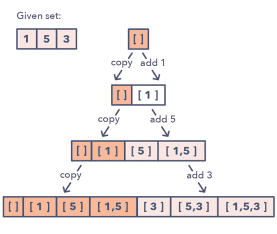如何识别子集模式：

*   你需要找到给定集合的组合或排列的问题

子集模式的问题：

*   带有重复项的子集（简单）

*   通过改变大小写的字符串排列（中等）

**11\. 经过修改的二叉搜索**

只要给定了排序数组、链表或矩阵，并要求寻找一个特定元素，你可以使用的最佳算法就是二叉搜索。这一模式描述了一种用于处理所有涉及二叉搜索的问题的有效方法。

对于一个升序的集合，该模式看起来是这样的：

1．首先，找到起点和终点的中间位置。寻找中间位置的一种简单方法是：middle = (start + end) / 2。但这很有可能造成整数溢出，所以推荐你这样表示中间位置：middle = start + (end — start) / 2。
2．如果键值（key）等于中间索引处的值，那么返回这个中间位置。
3．如果键值不等于中间索引处的值：
4．检查 key < arr[middle] 是否成立。如果成立，将搜索约简到 end = middle — 1 5．检查 key > arr[middle] 是否成立。如果成立，将搜索约简到 end = middle + 1

下面给出了这种经过修改的二叉搜索模式的视觉表示：

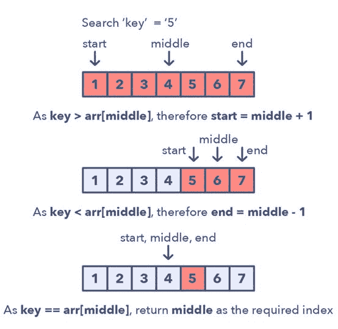经过修改的二叉搜索模式的问题：

*   与顺序无关的二叉搜索（简单）

*   在经过排序的无限数组中搜索（中等）

**12\. 前 K 个元素**

任何要求我们找到一个给定集合中前面的/最小的/最常出现的 K 的元素的问题都在这一模式的范围内。

跟踪 K 个元素的最佳的数据结构是 Heap。这一模式会使用 Heap 来求解多个一次性处理一个给定元素集中 K 个元素的问题。该模式是这样工作的：

1． 根据问题的不同，将 K 个元素插入到 min-heap 或 max-heap 中
2．迭代处理剩余的数，如果你找到一个比 heap 中数更大的数，那么就移除那个数并插入这个更大的数

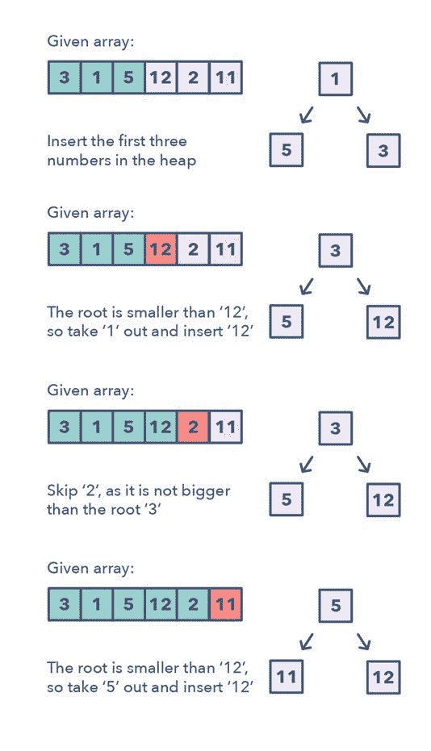这里无需排序算法，因为 heap 将为你跟踪这些元素。

如何识别前 K 个元素模式：

*   如果你被要求寻找一个给定集合中前面的/最小的/最常出现的 K 的元素

*   如果你被要求对一个数值进行排序以找到一个确定元素

前 K 个元素模式的问题：

*   前面的 K 个数（简单）

*   最常出现的 K 个数（中等）

**13\. K 路合并**

K 路合并能帮助你求解涉及一组经过排序的数组的问题。

当你被给出了 K 个经过排序的数组时，你可以使用 Heap 来有效地执行所有数组的所有元素的排序遍历。你可以将每个数组的最小元素推送至 Min Heap 以获得整体最小值。在获得了整体最小值后，将来自同一个数组的下一个元素推送至 heap。然后，重复这一过程以得到所有元素的排序遍历结果。

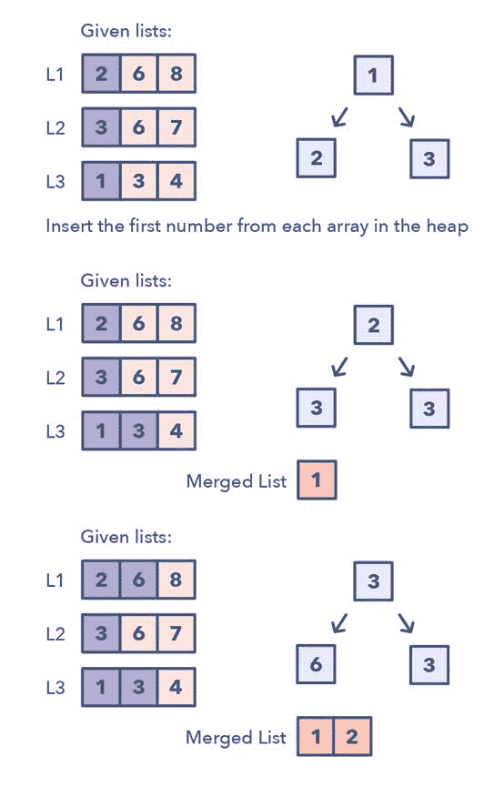该模式看起来像这样：

1．将每个数组的第一个元素插入 Min Heap
2．之后，从该 Heap 取出最小（顶部的）元素，将其加入到合并的列表。
3．在从 Heap 移除了最小的元素之后，将同一列表的下一个元素插入该 Heap
4．重复步骤 2 和 3，以排序的顺序填充合并的列表

如何识别 K 路合并模式：

*   具有排序数组、列表或矩阵的问题

*   如果问题要求你合并排序的列表，找到一个排序列表中的最小元素

K 路合并模式的问题：

*   合并 K 个排序的列表（中等）

*   找到和最大的 K 个配对（困难）

**14\. 拓扑排序**

拓扑排序可用于寻找互相依赖的元素的线性顺序。比如，如果事件 B 依赖于事件 A，那么 A 在拓扑排序时位于 B 之前。

这个模式定义了一种简单方法来理解执行一组元素的拓扑排序的技术。

该模式看起来是这样的：

1．初始化。a）使用 HashMap 将图（graph）存储到邻接的列表中；b）为了查找所有源，使用 HashMap 记录 in-degree 的数量
2．构建图并找到所有顶点的 in-degree。a）根据输入构建图并填充 in-degree HashMap
3．寻找所有的源。a）所有 in-degree 为 0 的顶点都是源，并会被存入一个队列
4．排序。a）对于每个源，执行以下操作：i）将其加入到排序的列表；ii）根据图获取其所有子节点；iii）将每个子节点的 in-degree 减少 1；iv）如果一个子节点的 in-degree 变为 0，将其加入到源队列。b）重复 (a)，直到源队列为空。

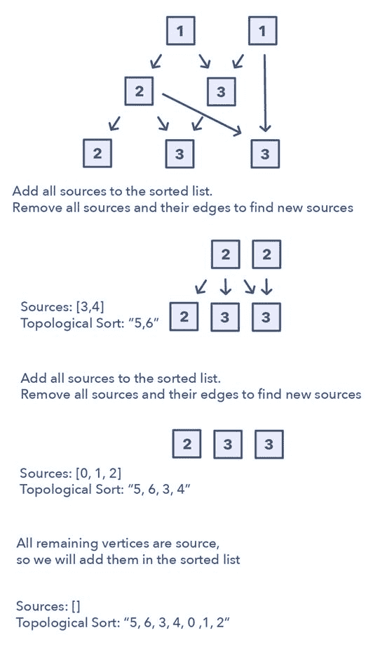如何识别拓扑排序模式：

*   处理无向有环图的问题

*   如果你被要求以排序顺序更新所有对象

*   如果你有一类遵循特定顺序的对象

拓扑排序模式的问题：

*   任务调度（中等）

*   一个树的最小高度

**接下来？**

在 LeetCode 上殚精竭虑？学习过这 14 种模式之后，你能对各种问题的解决方案有一个更全面的认知。

如果你有兴趣更深入地了解以上模式或各个模式下的示例，可以去看看课程《Grokking the Coding Interview: Patterns for Coding Questions》：https://www.educative.io/collection/5668639101419520/5671464854355968。这是 Grokking 面试系列的最新课程，已被两万多名学习者用于寻找顶级科技公司的工作岗位。

我能给出的最高推荐语是：我真希望我曾经在准备编程面试时就有这个课程。

其它有关面试的文章

*   [2019 高考编程卷：谷歌面试编程题及解题技巧（MIT 版）](https://mp.weixin.qq.com/s?__biz=MzA3MzI4MjgzMw==&mid=2650763415&idx=1&sn=41a19ee10b27dd9967c4cf005f939965&scene=21#wechat_redirect)

*   [技术面试中，当面试官「套路」你时，怎么「反套路」回去？](https://mp.weixin.qq.com/s?__biz=MzA3MzI4MjgzMw==&mid=2650759406&idx=2&sn=00ae312046f5270cff21b3d24553f214&scene=21#wechat_redirect)

*   [春招苦短，我用百道 Python 面试题备战](https://mp.weixin.qq.com/s?__biz=MzA3MzI4MjgzMw==&mid=2650758099&idx=1&sn=f4e62a185013c445ee3fbb4630cd89f7&scene=21#wechat_redirect)

*   [准备好春招了么？上科大小哥的面试题与复习资料祝你寒假无忧](https://mp.weixin.qq.com/s?__biz=MzA3MzI4MjgzMw==&mid=2650755184&idx=1&sn=dd3a2007c02544a724c64f8d56ad6b33&scene=21#wechat_redirect)

*   [如何把薪资谈高一倍？请看大厂 offer 拿到手软的 ML 大神自述](https://mp.weixin.qq.com/s?__biz=MzA3MzI4MjgzMw==&mid=2650760180&idx=1&sn=27398d16c2ea56ef6873499993c6d0c3&scene=21#wechat_redirect)

****本文为机器之心编译，**转载请联系本公众号获得授权****。**

✄------------------------------------------------

**加入机器之心（全职记者 / 实习生）：hr@jiqizhixin.com**

**投稿或寻求报道：**content**@jiqizhixin.com**

**广告 & 商务合作：bd@jiqizhixin.com**