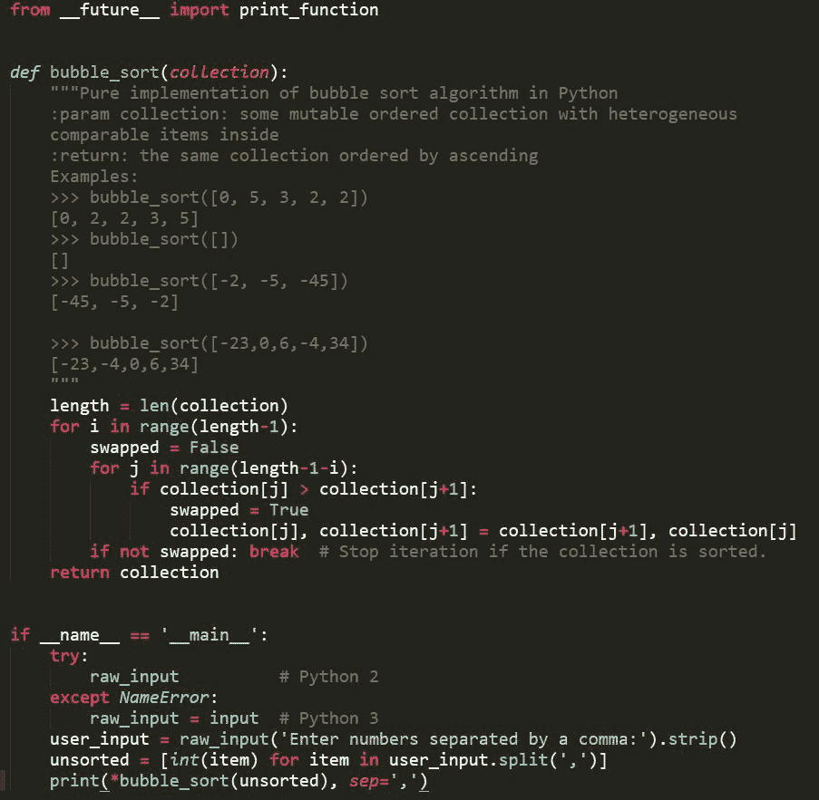

# 百道 Python 面试题实现，搞定 Python 编程就靠它

> 原文：[`mp.weixin.qq.com/s?__biz=MzA3MzI4MjgzMw==&mid=2650760293&idx=2&sn=19410375879e09761af062fdef44ad7a&chksm=871aa01bb06d290d81dd211cc05b0be06af77bde304cbabb148af249b6eb655c771ade508fcf&scene=21#wechat_redirect`](http://mp.weixin.qq.com/s?__biz=MzA3MzI4MjgzMw==&mid=2650760293&idx=2&sn=19410375879e09761af062fdef44ad7a&chksm=871aa01bb06d290d81dd211cc05b0be06af77bde304cbabb148af249b6eb655c771ade508fcf&scene=21#wechat_redirect)

机器之心报道

**机器之心编辑部**

> 想要备战 Python 面试，这两个项目有千道 Python 问题与实现。

昨天机器之心介绍了 [PHD 大牛的求职之路](http://mp.weixin.qq.com/s?__biz=MzA3MzI4MjgzMw==&mid=2650760180&idx=1&sn=27398d16c2ea56ef6873499993c6d0c3&chksm=871aa78ab06d2e9c5660df67906607abd325efbeddd638e6664bcb0dbb0964541b4249746300&scene=21#wechat_redirect)，很多读者感觉这位大牛太厉害了，他的经历对我们帮助不大。对于一般的机器学习求职者而言，最基础的就是掌握 Python 编程技巧，随后才是相关算法或知识点的掌握。在这篇文章中，我们将介绍一个 Python 练习题项目，它从算法练习题到机试实战题提供了众多问题与解决代码。

在春招之前，我们就曾介绍过 [GitHub 万星的 ML 算法工程师面试指南](http://mp.weixin.qq.com/s?__biz=MzA3MzI4MjgzMw==&mid=2650757466&idx=1&sn=b35dbfbb30c52c40cc4a91589c73937e&chksm=871a9d24b06d14326b88b65dda8c3c745fa88930cd3c537337b1bbb576eb8b97f7d904daecbd&scene=21#wechat_redirect)，它提供了完整的面试知识点、编程题及题解、各科技公司的面试题锦等内容。读者可查阅该项目了解机器学习面试需要准备哪些知识。

项目地址：https://github.com/imhuay/Algorithm_Interview_Notes-Chinese

在这个 2W+ 收藏量的 GitHub 项目中，作者前一部分主要介绍了机器学习及各子领域的知识点。其中每一个知识点都只提供最核心的概念，如果读者遇到不熟悉的算法或者遇到知识漏洞，可以进一步阅读相关文献。后一部分则重点介绍了怎样搞定编程面试题，包括各种数据结构和排列组合相关的题目。

一般而言，第一部分的基础知识是长期积累的结果，但对于后面的 Python 面试题，我们可以通过刷题快速提升解题水平。这篇文章重点在于介绍两个 Python 面试题项目，它们提供了大量 Python 问题与解题代码。

**面试怎么做**

在进入 Python 题海之前，我们还是先要了解了解面试流程。面试形式和过程大致如下：

*   电话筛选（隐形的现场面试）：这个过程一般由 HR 完成，如果是技术人员负责，这个过程一般都很短。

*   技术面试：你将和实际开发人员进行这一轮面试，在这期间他们会深入了解你的知识背景。

*   技术评估/homework 编程/结对编程：一般而言，如果一家公司的面试有结对编程环节，那绝对是加分的。homework 编程也能理解，但绝大多数情况下这都是在浪费每个人的时间，也无法正确评估技术水平。

*   最终面试：和团队其他成员见面，如果这是一家小公司的话，这一轮面试你面对的可能是创始人（们）。

*   发放 offer。

当然，每家公司都会有所不同，这只是你在找工作的过程中可能经历的大致过程。一般技术面试考察的是我们的背景知识，而技术评估则需要语言解决实际问题了。本文的这两个项目，可以让你搞定公司的技术评估，当然其实目前很多书籍与网站都在解决这个问题，例如剑指 Offer 和 LeetCode 等等。

**Interview-code-practice-python**

首先在第一个项目中，作者给出了 2017 校招真题、剑指 offer、华为机试、机试题和直通 BAT 算法题等各种 Python 实现，它们共计 200 道左右。

项目地址：https://github.com/leeguandong/Interview-code-practice-python

如下展示了剑指 offer 文件夹包含的实现文档，每一个问题都是单独的 Python 文件：

整个项目有很多有意思的题目，例如「变态青蛙跳.py」包含的题目与题解代码为：

「合唱团.py」内的代码如下：

**The Algorithms - Python**

第二个项目是更流行的一个 Python 代码库，它目前有 2.4W+的星。该项目实现的各种算法都是用纯 Python 完成的，它希望更简介地展示这些问题怎样解决，因此相比 Python 标准库中实现的方法可能效率不那么高。

项目地址：https://github.com/TheAlgorithms/Python

目前该项目展示的解决方案主要有：

*   排序

*   搜索

*   图

*   数学

*   算法分析

*   二元树

*   数据结构

*   图像处理

*   动态规划

*   线性代数

*   机器学习

*   哈希

*   ……

这个项目的算法实现非常多，我们可以根据实际需要选择具体的类别，并查看给出的解决方案。如果我们希望了解排序算法，那么选择排序后我们大概能看到近 30 种不同的排序实现：

其中，在算法入门第一课「bubble_sort.py」中，该项目给出的冒泡排序解决方案为：

该项目提供的实现很多都非常底层，在「Math」中，我们可以了解到如何实现绝对值求解、求最大最小值等等，当然也可以了解到矩阵乘法是如何实现的。该项目其实对面试很有帮助，虽然它并不是直接解决特定的某个问题，但是复现一般的 Python 函数或者基本问题对于理解 Python 很有帮助。

综合以上两个 Python 实现项目，不论是解题技巧，还是对 Python 的理解，我们的实战能力都会有很大的提升。就像理解神经网络最好的方法是用纯 NumPy 实现一遍，理解 Python 的最好方法即过一遍基本函数与结构。有了充足的理解，再看看面试真题或在 LeetCode、牛客网就比较简单了。****

****本文为机器之心报道，**转载请联系本公众号获得授权****。**

✄------------------------------------------------

**加入机器之心（全职记者 / 实习生）：hr@jiqizhixin.com**

**投稿或寻求报道：**content**@jiqizhixin.com**

**广告 & 商务合作：bd@jiqizhixin.com**