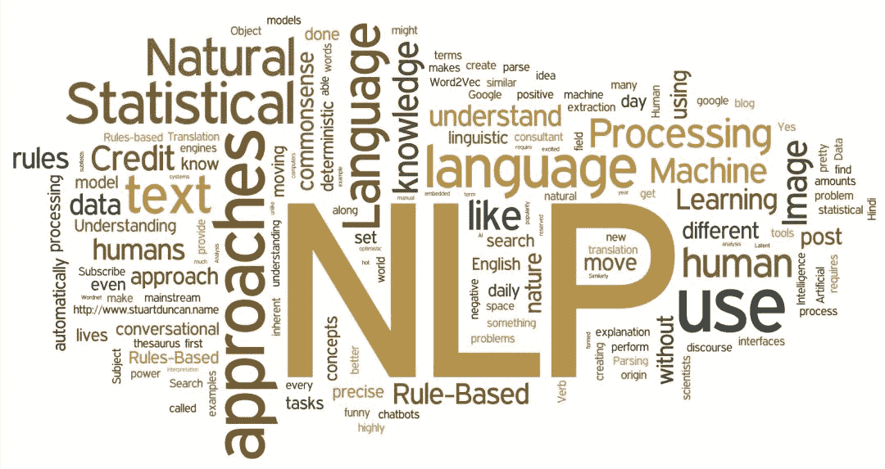

# 香侬科技李纪为：初入 NLP 领域的一些小建议

> 原文：[`mp.weixin.qq.com/s?__biz=MzA3MzI4MjgzMw==&mid=2650758606&idx=4&sn=19df01973134f60e1d014bb50daa7f41&chksm=871a99b0b06d10a623c2fdb7923495b1b2f7c135cc85bc2ace3b22a884948ad3fac49642659b&scene=21#wechat_redirect`](http://mp.weixin.qq.com/s?__biz=MzA3MzI4MjgzMw==&mid=2650758606&idx=4&sn=19df01973134f60e1d014bb50daa7f41&chksm=871a99b0b06d10a623c2fdb7923495b1b2f7c135cc85bc2ace3b22a884948ad3fac49642659b&scene=21#wechat_redirect)

机器之心经授权转载

**作者：李纪为**

> ACL2019 投稿刚刚落幕，投稿数超过了 2800 篇，可以说是历史以来最盛大的一届 ACL。在深度学习的推动下，自然语言处理这个子领域也逐渐被推上人工智能大舞台的最前列。

最近在跟同学的邮件、或者知乎留言中的交流中，不少同学尤其是刚入（jin）门（keng）的同学，提到了深度学习背景下做 NLP 科研的很多迷茫。基本可以归纳为如下几点：如今一个模型，几十行 TensorFlow 或者 PyTorch 就可以解决掉，大家不厌其烦地刷数据集的 benchmark，但是因为如今实现模型的门槛低一些，SOTA 很难再刷的上去；就算好不容易刷上去了，因为模型千篇一律无非修修补补，文章投出去了因为 novelty 受限，文章中不中看天；即便是文章中了，似乎并无太大新意，灌水中已然迷茫。

深度算法的风靡会让研究者过度关心这些算法本身，而层出不穷模型结构的调整和改进又让我们眼花撩乱。当侃侃而谈深度学习网络结构变成一个很 cool 的事情的时候，人们的虚荣心会使得不约而同地忽略了几个重要点。基于我自己多年来曾经走过的弯路，踩过的坑，这篇文章做一点点小的总结。希望会对刚刚进入 NLP 领域的同学有所帮助。

**1、了解 NLP 的最基本知识**：Jurafsky 和 Martin 的 Speech and Language Processing 是领域内的经典教材，里面包含了 NLP 的基础知识、语言学扫盲知识、基本任务以及解决思路。阅读此书会接触到很多 NLP 的最基本任务和知识，比如 tagging, 各种 parsing，coreference, semantic role labeling 等等等等。这对于全局地了解 NLP 领域有着极其重要的意义。书里面的知识并不需要烂熟于心，但是刷上一两遍，起码对于 NLP 任务有基本认识，下次遇到了知道去哪里找还是非常有意义的。另外 Chris Manning 的 introduction to information retrieval 也是一本可以扫一下盲的书，当然我认为依然不需要记住所有细节，但轮廓需要了解。IR 里面的很多基本算法跟 NLP 有不少的重合。说说我自己曾经走过的弯路。Stanford NLP 的 qualification 考试的一部分就是选一些 jurafsky 和 manning 书里面的一些 chapter 来读，然后老师来问相关问题。开始我一直对里面的东西懒得看，所以 qualification 考试一拖再拖。但博士最后一年没办法拖的时候，才发现如果早知道这些东西，博士早年可以少走很多弯路。

为什么了解 NLP 基础知识的重要，我给大家举几个例子。

最近跟同学一起做语言模型 language modeling 相关的事情，很多同学用 LSTM 或者 transformers 做 language model 随手就能实现，但是实现一个 bigram 或者 trigram 的 language model（LM）却因为里面的 OOV 的平滑问题卡了大半天（熟悉的同学可能知道，需要拉普拉斯平滑或者更 sophisticated 的 Kneser-Ney 平滑）。为什么 bigram 或者 trigram 的 LM 很重要呢？去做一个语言模型的问题，实现深度模型之前，第一步其实就要去写一个 bigram 或者 trigram 的 LM。为什么呢？因为这些 N-gram 模型实现简单，并且 robust。通过这样简单的实现，可以告诉你这个数据集的 LM 模型的下限。这样我们心里会有数，神经网络模型至少不应该比这个模型差的。神经网络模型因为其超参数、梯度爆炸等问题，有时候我们不太容易决定是真的模型不行、参数没调好还是代码有 bug。那么通过 N-gram LM 的给出的下限，我们就可以直观地知道神经网络是有 bug 还是没调好参数。

第二个例子就是涉及发文章了，不知道有没有同学想过，BERT 里面训练 LM 的随机替换为什么就使结果变好，随机替换是什么鬼，怎么结果就好了。其实在 BERT 之前，斯坦福的吴恩达组的 Ziang Xie 的 Data Noising as Smoothing in Neural Network Language Models ICLR2017 就首次提出了此方法，而且给出了理论解释。这种 random 替换其实本质上属于 language modeling 里面基于 interpolation 的平滑方式，而基于 interpolation 的 LM 平滑，就躺在 jurafsky 那本书的第 3.4.3 节。

**2\. 了解早年经典的 NLP 模型以及论文**：相比简单粗暴的神经网络模型，早年的 NLP 算法确实比较繁琐复杂，但里面确实有很多早年学者在硬件条件艰苦情况下的智慧结晶。熟悉了这些模型，可以在现在神经网络里面融会贯通。去年在人民大学做 seminar。Seminar 有大概 30-40 位同学参加。Seminar 中，我问了一个问题，有谁知道机器翻译中的 IBM 模型大概是干嘛的，举手的同学大概有五分之一。我再问，谁能来手写（或者大概手写）一下 IBM model1，一个人都没有。仅仅从基于 IBM 模型的 Hierarchical Phrase-based MT, 近几年就有很多篇引用量很高的文章是基于里面的思想的。例子数不胜数： 

1) chris dyer 组的 Incorporating structural alignment biases into an attentional neural translation model (NAACL16) 提出用双向 attention 做 neural 机器翻译的约束项，意思是如果在英语翻译法语生成的 target 中的一个法语词 attend 到了一个 source 中的英语词，那么反过来，法语翻译英文 target 中相同这个英语词应该也 attend 到 source 中的这个英语词。其实这个思想就是完完全全相似 Percy Liang 曾经的成名作之一，早在 NAACL06 年 Alignment by Agreement，大家通过题目的意思就可以猜到文章的内容，正向翻译与反向翻译中的 对齐 (alignment) 要 一致 (agree)。如今做 neural MT 的同学，有多少同学读过 Percy 的这篇大作呢（大家知道 Percy 最多的应该是 Squad 吧）。

2) 处理对话系统的无聊回复，用反向概率 p(source|target) 做 reranking 现在应该已经是标配。再比如 Rico Sennrich 的成名作之一将 Monolingual data 跟 seq2seq 模型结合。其实这连个思想在 phrase-base MT 里面早就被广发的使用。Neural 之前的 MT，需要对一个大的 N-best list 用 MERT 做 reranking，反向概率 p(source|target) 以及语言模型概率 p(target) 是 reranking 中 feature 的标配。

3) Harvard NLP 组, Sam Wiseman 和 Alex 发表的 EMNLP16 best paper runner-up, Sequence-to-Sequence Learning as Beam-Search Optimization, 基本上传承了 Daume´ III and Daniel Marcu 2005 年的 LaSO 模型，将其思想 adapt 到 neural 里面。

如果再准本溯源，诞生于 neural MT 的 attention，不就是 IBM 模型的神经网络版本嘛。

**3\. 了解机器学习的基本模型**：神经网络的简单暴力并且有效。但是从科研的角度讲，熟悉基本的机器学习算法是必修课。比如吴恩达的 machine learning 就是必要之选。记得前段时间我面试一个小伙子，一看就是很聪明的同学，而且很短的时间就有一篇 NAACL 在投。我就问小伙子，EM 算法是什么，小伙子说没有听说过 EM，而且自己的科研也用不到 EM。我认为这其实是一个挺大的误区。当我想起我自己，曾经就吃过很多类似的亏。因为早期数学基础偏弱，也没有决心恶补一下数学，所以早年每次看到跟 variational inference 相关的算法就头大，这种偏科持续了很久，限制了科研的广度。相比粗暴的神经网络，CRF 等模型的 inference 确实相对复杂（当年我自己也看了很多次才彻底搞明白）。但搞懂这些，是一个 NLP researcher 的基本素养。Pattern Recognition and Machine Learning 那本书，尤其是某些小节确实比较难（又暴露了数学基础差的事实），即便是只是为了过一遍，也需要很强的耐力才能看完，更不用说完全看懂了。我自己也曾经半途而废很多次，如今依然有很多章节是不太懂的。但是其中的很多基础 chapter，我认为还是很值得一读的。其实可以组成那种两三个人的学习小组，不需要有太雄伟的目标，用个一年哪怕两年的时间，把几个重要的 chapter 过一遍。

NLP 相对是应用科学，并不是特别的数学。但是我们天天用的算法的基本数学逻辑我认为还是需要搞懂，比如 dropout, 比如天天用到的优化 (SGD, momentum, adaboost, adagrad)，比如各种 batch, layer normalization。这样其实可以省去很多浪费的时间，磨刀不误砍柴工。这些年来，在帮同学调 bug 的过程中，我至少遇见过 3-5 个同学 training 的时候开 dropout, test 的时候没有对每个 cell 用 (1-dropout) 去 scale（大家不要笑，这是真的）。然后画出 dropout 曲线就是 dropout 值越大，结果越差。在讨论的时候，同学一脸茫然并且不清楚 test 时候需要 scale。其实本质就是并不了解 dropout 背后的数学原理。

**4\. 多看 NLP 其他子领域的论文**：NLP 有很多子领域，MT，信息抽取，parsing，tagging，情感分析，MRC 等等。多多熟悉其他子领域的进展是必要的。其实不同子领域所运用的模型不会相差太大。但是最开始看不熟悉领域的问题可能会有一点难，原因是对问题的 formalization 不是很了解。这可能就需要多花一些时间，多找懂的同学去问。其实了解不同问题的 formalization 也是对领域知识最好的扩充。

**5\. 了解 CV 和 data mining 领域的基本重大进展**：当熟悉了上面所说的点之后（当然可能至少也需要一年的时间）。熟悉 CV 领域的基本任务、基本算法我认为对于打开科研视野很重要。但是不可否认，因为领域不用，写作风格、术语表达相差很大，又因为缺乏背景知识（文章中会省略一些基础知识，默认大家都懂。但是跨领域的人可能不懂），第一次想读懂跨领域的文章其实并不容易。我就出现过竟然在讨论班上直接把 faster-RCNN 讲错了的情况，以为自己看懂了，然后就讲错了（至今昱先天天还在因为这个事情调侃我）。不过重要的是，NLP 领域里面一些重要的文章其实或多或少借鉴了 CV 里面的思想，当然也同样出现 CV 借鉴 NLP 的情况。NLP 神经网络可视化、可解释性的研究，时间上还是落后于 CV 里面对 CNN 的可视化。所以很多工作大量借鉴了 CV 里面的类似工作。NLP 运用 GAN 其实也是借鉴 CV 的。其实两个领域很多是很相通的。比如，如果不考虑 question query, vision 里面 detection 中的 region proposal（在一个大的图片背景下找一个特定区域）, 大家想是不是跟 MRC 里面的 span extraction（在一大堆文字里面找一个 span）有异曲同工之妙。更不用说 image caption generation 与 sequence-to-sequence 模型了，本质上几乎没什么太大的区别。强化学习在生成领域 generation，发完了 MT(Ranzato et al., ICLR2016) 再发 image caption generation, 再回到 summarization. Actor-critic 模型也是类似的，还是很多做 generation diversity 的文章。因为跨领域不好懂，所以第一次推荐看 tutorial, 如果有 sudo code 的 tutorial 那就更好了。另外看看扫盲课的视频，比如 Stanford CS231n 也是个好办法。另外，一个 NLP 组里面有一个很懂 CV 的人也很重要（拜谢昱先），and vise versa。

graph embedding 近两年崛起于 data mining 领域。目测会在（或者已经在）NLP 的不少任务得到广泛应用。想到几年前，deep walk 借鉴了 word2vec, 开始在 data mining 领域发迹，然后似乎又要轮转回 NLP 了。

当然啦如何写论文也是极其重要的一环，但不是这篇文章的主题，强烈推荐[清华大学刘知远老师的相关文章](http://mp.weixin.qq.com/s?__biz=MzA3MzI4MjgzMw==&mid=2650758382&idx=1&sn=94343b3015615bba868b6dd741060b8a&chksm=871a9890b06d1186a41df21f864fbe81d4de0bb583ca1a0d521d04a2bd82145fb98a49864e19&scene=21#wechat_redirect)。 

先写到这儿，欢迎大家补充拍砖。

香侬科技 李纪为 2019 年 3 月 11 日

*知乎原文链接：**https://zhuanlan.zhihu.com/p/59184256*

****本文为机器之心经授权转载，**转载请联系原作者获得授权****。**

✄------------------------------------------------

**加入机器之心（全职记者 / 实习生）：hr@jiqizhixin.com**

**投稿或寻求报道：**content**@jiqizhixin.com**

**广告 & 商务合作：bd@jiqizhixin.com**