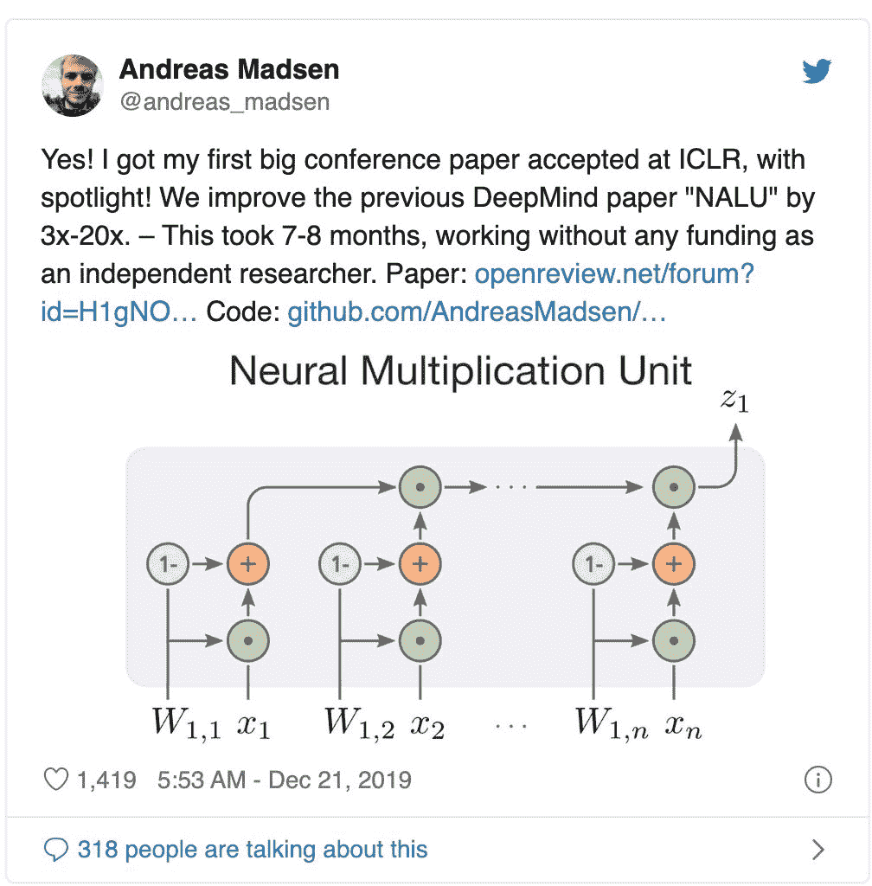
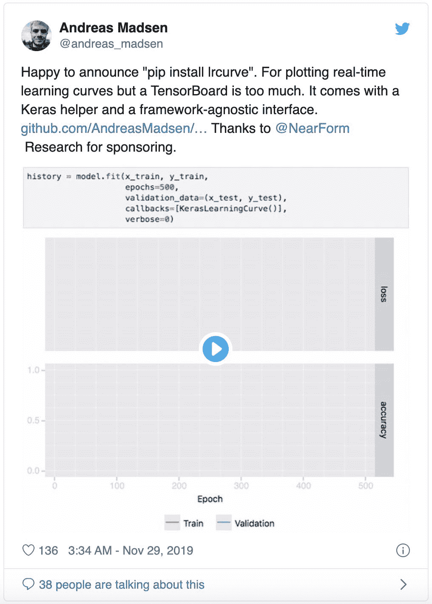

# 独立研究中顶会 Spotlight，从读博就业无门到一举成名，这位小哥的经验分享火了

> 原文：[`mp.weixin.qq.com/s?__biz=MzA3MzI4MjgzMw==&mid=2650777786&idx=2&sn=fe011832dc20782741c08843a657ad7f&chksm=871a6cc4b06de5d28ab744435277137aa4ba9e376b9433b3dc087115ca25799b577fb5709477&scene=21#wechat_redirect`](http://mp.weixin.qq.com/s?__biz=MzA3MzI4MjgzMw==&mid=2650777786&idx=2&sn=fe011832dc20782741c08843a657ad7f&chksm=871a6cc4b06de5d28ab744435277137aa4ba9e376b9433b3dc087115ca25799b577fb5709477&scene=21#wechat_redirect)

选自 Medium

**作者：****Andreas Madsen**

**机器之心编辑部**

> 我成为了一名独立研究者，我不推荐你也这样做。但如果你坚持要「作死」的话……你可能最终能中一个顶会 Spotlight paper。

这是一段「激励人心」的故事：一位名叫 Andreas Madsen 的小哥自北欧名校丹麦科技大学本科+硕士毕业之后（成绩是 top3%），却发现自己找不到一个研究工程师的工作。而在最近无业的这段时间里，他写的论文中了 ICLR 2020，还是 Spotlight。

*2018 年 11 月，我完成了自己第一篇论文《Visualizing memorization in RNNs》的发表。**我当时以为手握论文和机器学习硕士学位就可以找到软件工程师的工作，这实在是大错特错！*

2019 年 4 月，我决定成为一名独立研究者，目标就是在 AI 顶会上发表论文。经过近八个月没有任何资助的工作之后，我做到了。我的论文中了 ICLR 2020，而且不是 Poster，是一篇 Spotlight！在把这事公之于众之后，我立刻就成了网红一样的研究者。我收到了近 100 条私信，人们都在问我如何成为一名独立研究者。在这篇文章中，我会给你一些建议。不过首先要明白：我成为独立研究者是一个艰难的决定。在 7 个月的时间里没有工资，更没有资助可不是开玩笑，请慎重考虑一下。

*我中了 ICLR 2020！**在那之后，我收到了近 100 条私信，人们在询问如何成为一名独立研究**者**。*

**独立研究者？****为什么要作死**在 2018 年 3 月，我在 distill.pub 平台上发表了自己的第一篇机器学习论文《Visualizing memorization in RNNs》，我是唯一作者。这篇论文介绍了两个准确度相似的模型在 NLP 上的显著交互可视性有很大不同。

那时我还觉得，有了这篇论文以及丹麦科技大学的机器学习硕士学位，我就可以申请到 PhD、研究工程师、实习项目或者机器学习工程师职位了。所以我就开始向谷歌、微软、Rakuten、ElementAI、英伟达、Hypefactors、英特尔、京东、亚马逊、三星、Shift Technology、Corti 等等公司投去简历——竟一个面试邀请都没收到！单说谷歌的研究软件工程师，我甚至找到了一名谷歌的资深研究员，他鼓励我申请他们部门的职位，并进行了正式推荐。为了保证成功，我还向另一名谷歌资深软件工程师要到了推荐，后者曾经与我在开源工具 Node.js 上有过很多合作——尽管如此，我还是没有收到任何面试邀请，也没有 HR 来联系我，啥都没有！**「你得有一两篇顶会论文啊」**一位与某 QS 全球排名 Top 100 大学的教授有点关系的朋友帮我得到了这样的答案：

> 非常感谢你的邮件，它们看起来超级有趣。然而通常来说，现在想要申博士学位有点困难，没有一两篇顶级机器学习/NLP 论文是没什么说服力的，Distill 平台的发表和你在工业领域的经验部分弥补了这一点。不幸的是，我现在没有可供申请的空缺职位。

另一名来自 QS 全球排名 Top 5 大学的朋友说到：

> 现在的顶级人工智能 PhD 项目需要有顶会论文才能申请了。我曾经在某大学待过，如果你连一篇 ACL/EMNLP/CVPR/ICCV/NeurIPS/ICML 论文都没有的话，你几乎就不可能成功申请到某大学了。

当然，我也收到了其他一些邮件（绝大多数情况下根本没有回复），那些教授说得没有这么直白，不过总体而言就是对于我的申请没什么兴趣。我怀疑他们也是想要一两篇顶会论文，但只是没有明说罢了，因为这种标准本身就显得有些不公平——在我从本科念到硕士的大学里，教授们并不鼓励我们发表论文。而丹麦的硕士学位其实并不差。

> 所以，想要在没有内部推荐的情况下成功申请博士学位，你需要近乎拿到半个博士学位的资历。

那就发顶会论文呗！为了实现我自 2011 年以来的梦想，我需要一两篇顶会论文。于是在 2019 年 4 月，我决定全身心投入到科研工作当中，力争在 NeurIPS 或者 ICLR 上发个论文。如果最终做不到的话，我就当个 JavaScript 程序员吧。**没钱怎么办**目标是远大的，现实是骨感的，没有工资怎么活得下去？到目前为止这是我被问最多的问题。虽然值得一提，但我觉得它其实没有那么重要。条条道路通罗马，如果你没有什么债务，那就有很多办法节省开支。享受「孤独地生活，但不放弃希望」的状态吧。自 2017 年 9 月至 2018 年 10 月，我一直都是自由职业者。当 NearForm 跟我接触时，我就已经开始作为自由职业者了。这时，我的朋友 Emil Bay 向我推荐了一个他们一直想做的新项目 clinic.js。该项目不仅需要详细了解 Node.js 的内部构件，还要有统计学背景和网页可视化技术。这个项目真是太适合我了，因为我做过大量的可视化工作，也深入了解 Node.js 长达 6 年的时间，并且刚刚完成了自己的机器学习硕士课程。所以，我加入了这个项目，他们也支付我非常高的薪水。如果我能将自己的开支消费控制在低水平，这笔薪水足以支撑 3 到 4 年。

> 因此，可以说我在获得资金方面非常幸运。但是，丹麦是一个消费很高的国家，在另一个国家资助自己或许会更加容易。

2019 年，他们还邀请我开发 IoT 智能手表/胸牌（它们是在 NodeConf EU 2019 大会上推出的）的 TensorFlow 部分。虽然这笔收入不足以支撑全年的所有开支，但确实对我帮助很大。

**好的想法从何而来**正如我所说，获得一个好想法可以有很多种方法，所以不要邯郸学步，要充分发挥自己的创造性。2019 年 2 月，我参加了母校一个 AI 学生社团的开幕式活动，希望与之前的导师谈谈申请博士的事情。但遗憾的是，他无法成为我的博士导师。但幸运的是，我遇到了 Alexander R Johansen，他是一位助理研究员，并想要寻找科研上的合作伙伴。2019 年 3 月下旬，我写信给他，他告诉我他的几名学生尝试复现 DeepMind 的论文「NALU」，但都失败了。所以，他问我是否愿意对此进行研究，研究结果或许能够成为一篇 NeurIPS 论文。我的硕士学位论文和在 Distill 上发表的论文都是对其他人夸大其词或误导性的作品提出批评，然后对它们进行修正改善。并且，复现论文的难点在于优化，而该领域正是我所擅长的。所以，我觉得自己可以接受 Alexander R Johansen 的研究任务。

> 几乎所有发表的论文都会对效果夸大其词，所以修正改善他人的论文内容是一种可行的研究策略。

就是这样。这并不是一种非常具有启发意义的研究思路和策略，也会遇到一些重大的挑战（只需要深入解读即可），但的确可行。**生活孤独，但不要失去理智或希望**作为一名独立研究者，你不太可能获得来自任何人的鼓励。我知道许多的博士生导师也都不会鼓励他们自己的学生，但是他们可以从有类似遭遇的同门那里获得慰藉。这也是我不建议大家成为独立研究者的首要原因。在苦苦挣扎着写论文的时候，你得不到任何安慰，这确实是我不建议成为独立研究者的第一要素。每个人都多多少少需要一些鼓励。别觉得没人鼓励，你自己也能撑过 7 个月。当时的我一直在担心：找不到解决方法、遭遇不公正的评审、得不出有用的结果、发现某个重要缺陷……甚至担心即便发表了也会因为课题过于小众而被淹没。同时，7 个月的研究经费支持也是压力山大。如果最终没有发表，这些钱就打水漂了。事实上作为独立研究者，我的机会是低于平均水平的，仅仅是因为我得到的反馈更少。

*作为一个独立研究者发表论文，很可能遇到解决不了的问题，我也预料到会失败，但不管怎么样尽力就好。**—在日本某地的感想。*

然而，你可能没有一个后援团来帮助度过难关，他们之前可能存在和你相同的经历。不过，下面两件事还是可以做到的：

1.  我通常会与 Alexander 开周会，讨论一下新的想法。虽然 Alexander 并没有 Ph.D. 学位，但他是非常杰出的批判性思考者。我并不认为必须和那些有很多一作发表经历，或者有多年论文指导经验的人交流。重要的是，我们需要和那些能质疑我们研究工作的人交流。不然的话，我们可能会变得懒惰，从而对那些论文中的错误视而不见。与他们讨论你的论文，这会给你更大的压力，从而避免找一些「捷径」。

2.  我会做多个子项目，如果把所有时间都分配给相同的工作，那么这样的风险太大。我们可以花些时间做那些有用的小项目。写个开源工具、复现个知名论文都非常有帮助。有时候，把视线从研究移开、放松一些也是非常有必要的。即使研究项目失败了，但至少完成了某些小项目。在我的经历中，有这些业余项目，其它研究者会更认同你，这对你是非常好的一种鼓励。

*三天完成的业余项目示例，其它研究者会向你表示感谢，这是非常有价值的鼓励。*

**写一篇好论文**大约只有 20% 的论文会被接收，你的同行审议会尽力寻找原因以拒绝你的研究。「足够好」并不能满足要求，你需要一篇让人感叹「great」的论文。然而，你并没有任何导师能帮你，此前你也没有发表论文的经历，那么你该怎样写一篇让人惊叹的论文呢？在我的经历中，我的第一份论文放到了 distill.pub 期刊上，当时是非常幸运的。Distill 特别关心书写风格，他们需要展示和解释，而不是通过同行审议的肯定。对于我来说，写一篇用于展示与解释的文章，要比写一篇送给同行审议的文章容易，因此在 Distill 上发文章是很好的起步。然而，我投给 Distill 的第一篇文章被编辑拒绝了，他们弄不清楚该研究的贡献体现在哪。那篇论文到底是对 Nested LSTM 的批判，还是提出了一项新的 NLP 任务「自动补全」，或者就是一种交互式的可视化？一篇论文中可能有一到两条主要信息，如果它们被误解了，那么读者对整项研究都会感到困惑，从而拒绝该研究。所以，不要害怕复述某些重要信息，它能避免这些问题。在我的 Distill 论文中，它传递的信息是：「可视化能给模型提供重要信息，而准确率度量并不能。然而，你需要任何人都能感受到的直观问题，中文诗歌生成并不是这样的问题。」在 ICLR 的论文中，它是：「异构单元之间的门控看起来非常困难，但在这之前还有其他问题需要解决，所以我们会在未来的研究里解决门控的问题。」仅仅这样写还不够，他们还需要在整篇论文中高亮显示这一观点，让最懒惰的评审也能看到。我对论文进行了重大修改，再一次提交到了 Distill，这一次他们更加开放一些。Distill 上的 Chris Olah 和 Ludwig Schubert 在论文进入同行评审环节之前给出了非常有用的反馈。我不太确定，如果没有从他们那里得到的经验，我还能否进入 ICLR。大家可以读一下小说家 McCarthy 关于如何写科学类文章的技巧，里面涵盖了我学到的大部分东西。最后，我想提一句，Alexander 和我花了很长时间去润色这篇论文，尤其是在摘要和引言部分，他所提供的帮助非常有价值。**被 NeurIPS 2019 拒绝**我们将论文提交给了 NeurIPS 2019，但被拒了。当时我的内心几乎是崩溃的，因为投入了很长时间却一无所获。感觉自己再也不能实现梦想，再也不能继续搞 ML 的研究了。

> 让命运掌握在审稿人的手中真的太艰难了。

*拿到 NeurIPS 2019\. 审稿意见的我本人。**——「Red Ink」绘画 byJorge Cham*

所以我是因为什么被拒绝的呢？我总结如下：

*   一些审稿人不相信我们成功地复现了 NALU 的结果（即那篇我们声称进行了改进的论文）。「为什么原始论文中的结果比你们提交论文的结果要好很多？」，这个质疑反复出现过多次。

*   一些审稿人要求我们在提交的论文中做到 NALU 论文声称做到的所有事情。即使我们已经提供了明确的证据来说明 NALU 模型并没有达到令人满意的程度。如果你看过这个论文，这恰恰就是我们没有去花时间解决的问题。但是我们也进行了改进。

第二点也是，一些审稿人不相信我们的结果和复现。这就是想改进别人「夸张性结果」时的难点。**审稿人更偏向已经发布的研究成果。****他们更容易对你新提交的论文保持批判性眼光，而不是去批判以前的论文，尤其是 DeepMind 发表的论文。**我想说明一下的是，DeepMind 的结果并不是假的，它们是可以复现的。但这个结果对于主要目标「外推任务」（extrapolation task）来说却不是以最合适的方式去构建的。而且，NALU 这篇论文只展示了单个 seed 的结果，而我们的论文展示的是 100 个 seed 的结果。关于这些我们有一篇 workshop 论文：https://arxiv.org/abs/1910.01888**提交给 ICLR 2020，有什么不同？**在给 NeurIPS 2019 回复 rebuttal 之前，我们已经对论文进行了一些改进。提交 ICLR 时我们补充了更多的证据和实验去支持我们的表述观点。我们还把 NALU 的实验设置和复现结果发表成了 NeurlIPS 2019 的 SEDL 研讨会论文。我们发了个推特，艾特了 NALU 的一作，他还回复了：「Great Work！有了好的基准，我们才能继续提升（模型的性能）」这件事很有意思，我们不必再去争论实验设置和新模型了，而是可以专注于我们提出的模型。

真希望我能告诉你我们的改进起了很大作用，但事实是，我觉得我们只是比较走运，遇到了一位杰出的评审。他在 OpenReview 上评论为我们带来了更积极的讨论、更深入的批判性思维以及更少的辱骂性评论。我们得到了四位评审的意见，这意味着我们的领域主席非常投入。其中一位评审在 NeurIPS 上也审阅过我们的论文（可能是 reviewer #3），同时他/她也是我们的 NeurIPS 投稿最具建设性的审稿人。经过所有的修改，这位审稿人的意见从 NeurIPS 的 Weak Reject 提升到了 ICLR 的 Weak Accept，最后又改成了 ICLR 的 Accept，他/她甚至还对其他审稿人的意见评论道，「the contributions presented in this paper are too incremental.」

*评审意见。*

这个评审意见让我为之振奋。彼时，我们的论文还有两个 Weak Reject，所以还是有可能被拒绝。但即使被拒绝，我也会觉得这不是自己的问题，而是评审流程有问题。**费这么大劲值得吗？**最终，我们的论文被接收。我希望我能肯定地说，这件事能帮助我找到一份研究工作，但说实话，我现在还不知道。我刚刚看到一封邮件，上面说我需要「2 篇顶会论文，而且最好是和著名研究者合著，才能进入一所顶级大学读博，」但作为一名独立研究者，这一点我是做不到的。希望只是这所大学有这种要求。

*机器学习研究之路是漫长的。**但如果你一步都没迈出，一切都会变成不可能。**如果你真想去做，那就付诸努力去寻找其他方法。**——Vancouver, Canada*

**问答环节**前面的内容并没有回答我收到的所有问题，所以我在下面做了一些补充：

*   Q：你这些漂亮的图是什么做的？

*   A：我所有的图都是用 R 库的 ggplot2 绘制的。

*   Q：你的工作没有什么用，你就是个笑话。

*   A：谢谢你，你有想过成为一名评审者吗？

*   Q：你花了多长时间？

*   A：在这篇论文上，我每周大约花 48 个小时，有时候达到 100 个小时。但要记住一点，我也在做业余项目和自由工作。

*   Q：你的计算资源来自哪里？

*   A：Alexander 可以为我们提供计算资源，因为他是一名助理研究员。

*   Q：我的导师要给我一个读博的机会，我是否应该接受？

*   A：如果你真的想做研究，也许你应该接受。现在竞争很激烈，我认为你应该接受你所能得到的。

*   Q：我现在正在实习，但我感觉什么都学不到，因为我的导师不管我。

*   A：你要对自己负责，不要指望你的导师主动来找你。很高兴你能得到实习机会，我之前没有得到。可以开始着手安排会面，但也要记住，除了导师，你还可以向别人请教。

*   Q：我是硕士在读，要怎么为发论文做准备？

*   A：如果你能找到一位对此持开放态度的导师，那就尝试发表。同时，注意在学习期间找实习工作。大多数实习工作只对学生开放。我曾经得到过实习机会但却去不了，因为我已经毕业了。

*   Q：我要如何提升自己的编程技巧？

*   A：我多年来一直在坚持写开源代码，在此过程中受到了一些优秀程序员的指导。

*   Q：要发一篇 Spotlight 还需要什么？

*   A：说实话，还需要运气吧。

*   Q：我看到一些人拿到硕士学位就进了谷歌当研究员，他们是怎么做到的？

*   A：是有这种情况，而且黄金时期是 2013 年到 2015 年。如果当时你拿到了硕士学位并且足够幸运，你就可以走得很远。

**总结**最后，我想再强调一下写给其他独立研究者的建议。

1.  与他人协作。这个人不一定是论文写作方面的专家，只要能对你的研究提出建设性意见即可。此外，在大学里找一个能接触大量算力资源的人可能很有必要。

2.  做好失败的心理准备，但无论如何都要试一试。你要知道，只有 20% 的论文被接收了。作为一名独立研究者，被接收的概率可能更小。不要在被拒绝一次后就垂头丧气，做一些业余项目，即使你失败了，也不完全是在浪费时间。

3.  避免成为独立研究者。如果有更好的选择，实在是不必踏上独立研究者之路。也许你的导师对你不上心，但至少有同门的博士生可以交流。如果做了独立研究者，你就失去了相互扶持和勉励的关系网络。

*成为一个独立研究者将会非常艰难、孤独。**但如果幸运，也可能在转角处遇见璀璨星光。**——拍摄于加拿大温哥华*

**机器学习圈也有阶级固化问题**最后，我去参加了 NeurIPS 2019，因为我们有一篇论文被研讨会接收。在会上，我有幸与几位招聘者、教授、研究者交谈，结果发现招聘者的要求、研究人员的要求和教授的要求之间存在着巨大的差距。我想让研究者们知道的是，在过去的两年里，形势已经发生了翻天覆地的变化。如今，得到一个读博机会似乎比拿到博士学位还要难。如果你是在 2017 年或更早之前拿到了一个硕士学位，那么进入名校读博还是可以实现的目标。但如今，这些机会都要求你在顶会（NeurIPS/ICLR/ICML）发表 1-2 篇论文，而且最好是与著名研究者合著。我希望研究者、教授、委员会成员以及大会组织者都能够帮助遏制这种迅速崛起的新精英主义。它只会加重这一领域已经存在的固有偏见。*原文链接：**https://medium.com/@andreas_madsen/becoming-an-independent-researcher-and-getting-published-in-iclr-with-spotlight-c93ef0b39b8b*

**近日，基于腾讯天美工作室开发的热门 MOBA 类手游《王者荣耀》，腾讯 AI Lab 公布了一项用深度强化学习来为智能体预测游戏动作研究成果，在机器之心最新的一期 AAAI 2020 线上分享中，我们邀请到了论文一作、腾讯 AI Lab AI+游戏领域高级研究员叶德珩博士为大家做解读。**

