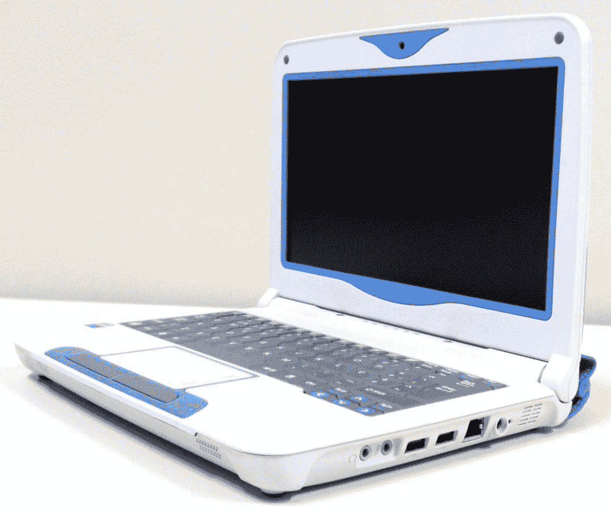
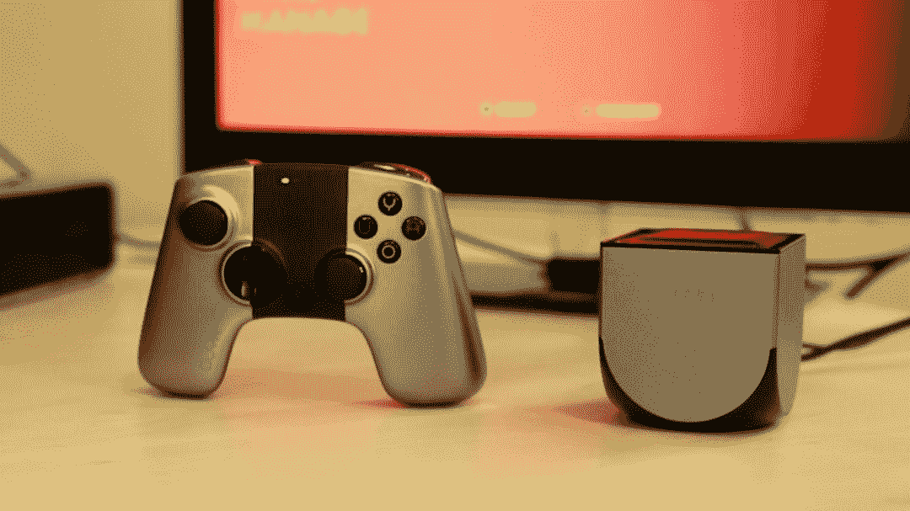
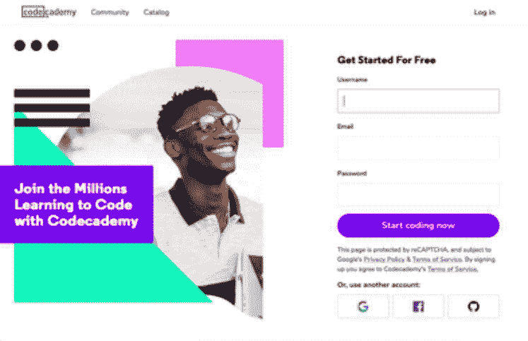

# 十六岁成为全栈开发者：我从开发游戏到写加密货币投资机器人的心路历程

> 原文：[`mp.weixin.qq.com/s?__biz=MzA3MzI4MjgzMw==&mid=2650770115&idx=1&sn=1ccfcf48e5d3f3962e5bdc005671b48a&chksm=871a4ebdb06dc7ab558a7822f3686845edc1da01fff149da5881f3350629305ef9d308204ed7&scene=21#wechat_redirect`](http://mp.weixin.qq.com/s?__biz=MzA3MzI4MjgzMw==&mid=2650770115&idx=1&sn=1ccfcf48e5d3f3962e5bdc005671b48a&chksm=871a4ebdb06dc7ab558a7822f3686845edc1da01fff149da5881f3350629305ef9d308204ed7&scene=21#wechat_redirect)

选自 Medium

**作者：****Nuno Martins**

**机器之心编译**

**参与：****Luo Sainan、一鸣**

> 全栈开发者听起来是个很高大上的程序员岗位，似乎没有几年工作经验是 Hold 不住的。但是，有个葡萄牙少年 16 岁就成为了全栈开发者，这是他从接触编程开始经历的故事。

我叫 Nuno，今年 16 岁，来自葡萄牙。今天我想跟大家聊聊我是如何成为一名全栈开发者的。
我一点也不觉得在我这个年纪成为一名程序员是一件很奇怪的事情。首先，我看到许多人说他们喜欢创造像侠盗猎车手 5 这样的电子游戏或者是像部落冲突：皇室战争这样的手机游戏，他们中的一些人确实在追逐这一梦想。他们学习编程，喜欢编程，然后他们开发属于自己的独立电子游戏。其次，随着市场上越来越多的 APP 出现，年轻人用看似简单的想法就成为了千万富翁（比如马克·扎克伯格和埃文·斯皮格尔），一个十几岁的小朋友可能就会想，「为什么我不能试一试呢？」但是也有人看到代码就害怕。比如说，当我向我的兄弟姐妹们展示一些我正在开发的代码时，他们看着这些代码会说，「我看不懂你刚才写的都是些什么」。再比如，我妈妈看到我用 C# 编程的时候会问我是不是在制作炸弹。哈哈，当然了，她只是在开玩笑（因为她最后笑了），但是我必须告诉她我只是在编程。又比如，我爸爸不知道 Python 是什么。我就给他写了一个简单的 Python 脚本用于一些自动化操作，但是当我向他说明必须要点击文件才能让脚本跑起来的时候，他只是看着我并问我那是什么。无论如何，尽管一堆代码可能看起来很吓人，但是我想年轻人也会对它感兴趣的。并且代码正在变得越来越简单，看看网上可用的那些庞大的框架和库，它们就是用于简化一切的。代码并不无聊，但是学习它......**我是如何开始我的开发旅程的**我一直都很喜欢互联网和技术。我生于 2003 年，所以在我开始接触电脑的第一年，我用的是 Windows XP 系统。天呐，我太喜欢了。说真的，这真是太棒了。我花了好几个小时玩系统自带的例如桌面弹球这种游戏，也用微软的画图软件画了许多杰作哈哈。我也常常玩其它的游戏，比如疯狂出租车，模拟人生，等等。我一直对技术很感兴趣，总是想知道事物是如何运行的。嗯，当我 7 岁的时候，我拿到了只属于我的第一台电脑。在葡萄牙，孩子们通常会在上二年级的时候得到一台叫作「麦哲伦」（葡萄牙探险家斐迪南·麦哲伦）的笔记本电脑，这是那个年龄的孩子最想要的东西。里面有很多教育项目，对于一个 7 岁的孩子来说真的很棒。Windows 7 系统运行在上面，对我来说，它是宇宙中最美妙、最珍贵的东西。*葡萄牙麦哲伦 2 - 2010/2011 年 7 岁的孩子最想要的东西*后来，这台电脑坏了。我父亲把他送去维修，但是最终还是因为运行速度太慢不能用了。（我说的能用是指玩电子游戏，当时我很喜欢这些东西）我又得到了另外一台电脑，那时我记得我父亲买了一台坏的麦哲伦只是为了上面的一些零件，也许他可以通过这些零件修复我原来的那台麦哲伦。但是这已经没那么重要了。因为我有了一台台式机，它比以前的那台麦哲伦运行速度更快，尽管没有那么有趣。随后，一个惊人且改变一生的想法出现在了我的脑海，既然我父亲没能修好我的麦哲伦，我觉得我能用他买的那些零件来创造属于我自己的电子游戏机。*OUYA，我的开发旅程中最大的灵感*我那时是那么天真...我了解到一个叫做 OUYA 的游戏机，它的设计方案给我留下了深刻的印象：一个全新的基于 Android 的游戏机，可以自由地修改和创建游戏。所以，我想要仅用麦哲伦的零件去制作这样的一个游戏机。毋庸置疑的是，我那时没有足够的知识来创建这样一个大项目，而且现在也没有，但我对此感到非常兴奋。在阅读了网上的一些文章之后，我决定我只需要学习 C 语言和 Assembly 来构建我的运行系统。这很简单，我想……你猜怎么着？当我看到 Assembly 的第一行代码时，我就哭了。不是字面意思的哭，你懂的。控制台项目，再见 (╯°Д°)╯︵┻━┻时间快进到几年以后。我和一个朋友决定，如果我们创办一家像微软或者苹果这样的公司就好了（那时我们只有 13 岁）。我们会开发出很多程序和应用，会出名，能在钱堆成的海里游泳。*我们的梦有点像这样...——照片来自 Chiara Daneluzzi, Unsplash*让我们开始吧，我们想。创建一家大公司并赚取百万欧元的第一步是什么？没错——创建一个 Facebook 或者 Twitter 那样的页面。在那之后，我们必须要开始创建我们的 app 和程序，但是我们都不会编程，一点都不会，连一行 Python，Java，PHP 的代码都不会，甚至包括我的老朋友 C 语言我也不会。那你可能会问，我们做了什么。准确地来说....我们并没有学习如何敲代码。相反，我们那时觉得跟着一些不太靠谱的关于如何用 Visual Basic 开发 web 浏览器的 YouTube 视频学习将会很好。

对我们的大公司来说真的很有创意，对吧？

你猜怎么着？我们开发了自己的浏览器！我甚至在 Weebly 上建立了一个网站（带有.com 的地址——我真的不知道我是怎么成功说服我父亲给我买一个的）来和全世界分享这一杰作。也许没有一个人在乎这件事情。但这件小事，是我开发旅程的开始，这是今天的我成为一名开发者的原因。是和 Visual Basic 的第一次接触（尽管我更早的时候试图学习 Java，但后来放弃了），是真正开始编程（尽管我只是把视频里的那个家伙所讲的进行复制粘贴）。**我是如何真的开始我的开发之旅的**现在我们可以用正确的方式来讨论编程了！在这些愉快的经历之后，我意识到我必须学习如何正确地编写代码，而不是基于一些教我如何构建一个可疑网页浏览器的随机出现的 YouTube 视频。不，朋友们，我想要的不止这些！

*这个网站对我的帮助很大：* *Codecademy (https://www.codecademy.com/)!*

Codecademy 是迄今为止整个互联网上最令人惊叹的学习编程的网站之一。这让我想到 freeCodeCamp (https://www.freecodecamp.org/)（我去年才知道它，它真的很棒），我相信在某些事情上它甚至更好。我的第一次编程冒险是使用 Python 语言。Python 简单、快速，学习和编程起来很有趣！它几乎就像英语一样（如果我从所有的英语老师那里听到的都是真的，那么我的英语相对来说还是很好的）。过了一段时间，我想要会得更多。出于好玩儿，我开始学习 PHP（因为我甚至不想做网站，觉得它们太... 无聊了——看看我现在的样子，真香）。我有一个朋友是 PHP 天才，我开始学 PHP 也是因为他推荐我去学。在很短的时间内，我了解了 PHP 和 Python 的基础知识。但是后来我发现了一个 YouTube 频道，从此永远地改变了我的开发者之路。它的名字是 Curso em Vídeo (https://www.cursoemvideo.com/)，一个很棒的巴西人的频道，有许多免费的编程课程，由一名叫做 Gustavo Guanabara 的非常好的大学老师讲授。发现这一频道是发生在我身上的最好的事情（当然，从专业角度来说）。我参与了他们的第一门课程：算法和编程逻辑（抱歉，这是我能想到的最好的翻译，我不确定这是不是这门课的名字）。学习编程逻辑是我做过的最重要的事情之一；它对于我理解很多编程基础的帮助很大。然后我的开发之旅就正式开始了。在那之后，我专心学习 PHP（面向对象程序设计），Java（我最大的梦想，因为我一直想做 Android app），HTML/CSS，JavaScript（现在很重要）... 差不多就是这些。我也尝试学习了一点 C 语言（只是基础），但是它让我感到困惑。比如，我很难理解指针的概念。但是现在我觉得我已经了解了最基本的东西，我可以写一 个基本的 C 语言程序。**我开始学习许多编程语言并得到一份「工作」**做了这么多工作之后，我并不开心。当我开始学习编程的时候，我最大的梦想就是能够开发桌面和移动应用程序。出于某种原因，我不喜欢网站，我不知道为什么，直到今天仍旧如此。我的一个朋友（就是那个帮我成立大公司的那个人——他也学了 PHP），告诉我他认识一个人，那个人有一个很大的项目，有很大的发展前景并且能够成立一个正经公司。这个项目就是做一个网站。包括前端和后端。但是当你 13-14 岁的时候你是不在乎那些事情的。如果我的朋友参加了一个这么大的项目，我肯定也想加入进来。因为即使我知道一些事情，我仍旧是个孩子。孩子们通常单纯并且有点小小的嫉妒心。我做了什么？我和我朋友的朋友谈过，我以一些股份的价格（大约 10%）加入了他的项目。他们的项目，他们的提议，都给了我灵感。所以这就是我如何得到第一份「工作」的故事：那时我 14 岁，在 PHP、HTML/CSS 还有 JavaScript 方面是个菜鸟，并且我有点嫉妒我的朋友。**现在怎么样了呢？**好吧，我现在 16 岁了，我的旅程并没有结束（当然了）。在意识到 web 开发和移动端开发是我的专长之后，我开始学习更多 PHP，数据库（MySQL 和 MongoDB）、API、JSON、HTML/CSS 和它们的框架（Bootstrap, Sass/Less...）最后还有一些 Javascript（ES6, Node.js...）在 AngularJS, Vue.js 和 React 之间我犹豫了很久，决定先去学 React。这是有史以来最好的事情，因为我能够学习一些 React Native，实现我成为一个移动应用开发者的梦想。现在，我可以说我了解下面的这些技术：

*   HTML/CSS（还有一些框架）

*   JavaScript (MERN stack (https://mern.io/), NodeJS, 等等)

*   PHP (不是 Laravel (https://laravel.com/) 我还有点后悔，我只用过 CodeIgniter (https://www.codeigniter.com/))

*   Databases (MySQL, MongoDB)

*   Java

*   Python

*   C# (只了解一点儿。和 Java 比较像。)

*   C (也只懂一点儿。我平常不用这个，只是在我觉得需要玩 Arduino 的时候才用。)

*   APIs (如何开发一个 REST API 并使用它)

现在，我不再像以前那样专注于编程。我喜爱编程，仍旧每天编程，但是现在我更加关注加密货币，商业和人工智能这些我想了解的。我现在最大的项目是一个用 Python 写的加密货币投资机器人，我认为它很有发展潜力。我也对学 UI/UX 设计给我的网站开发好的主题和设计感到非常兴奋。

**总结**

我真的希望你喜欢这篇文章。对于那些和我年龄相仿并且正在考虑成为一名程序员的人来说，不要只想，而是要去做！这是迄今为止我在知识和职业方面所做的最令人惊讶的事情，你开始得越早就会做得越好。*原文链接：**https://medium.com/better-programming/how-i-became-a-16-year-old-full-stack-developer-10af18a8f6c7*********本****文为机器之心编译，**转载请联系本公众号获得授权****。**
✄------------------------------------------------**加入机器之心（全职记者 / 实习生）：hr@jiqizhixin.com****投稿或寻求报道：**content**@jiqizhixin.com****广告 & 商务合作：bd@jiqizhixin.com**