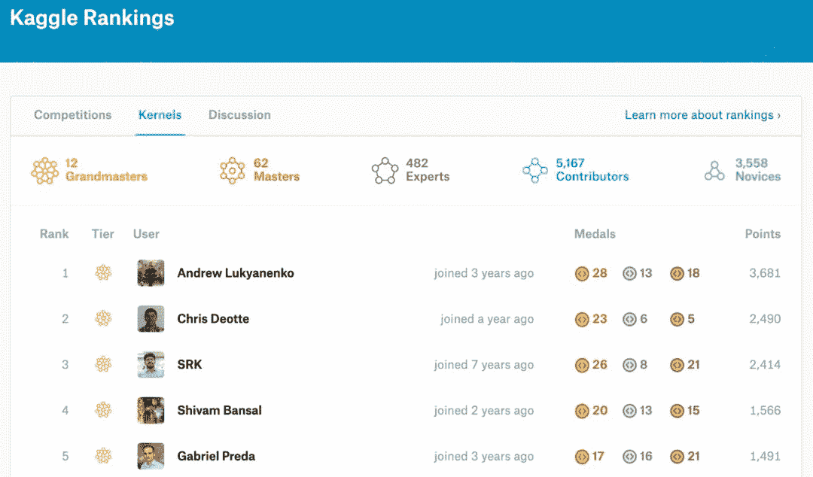
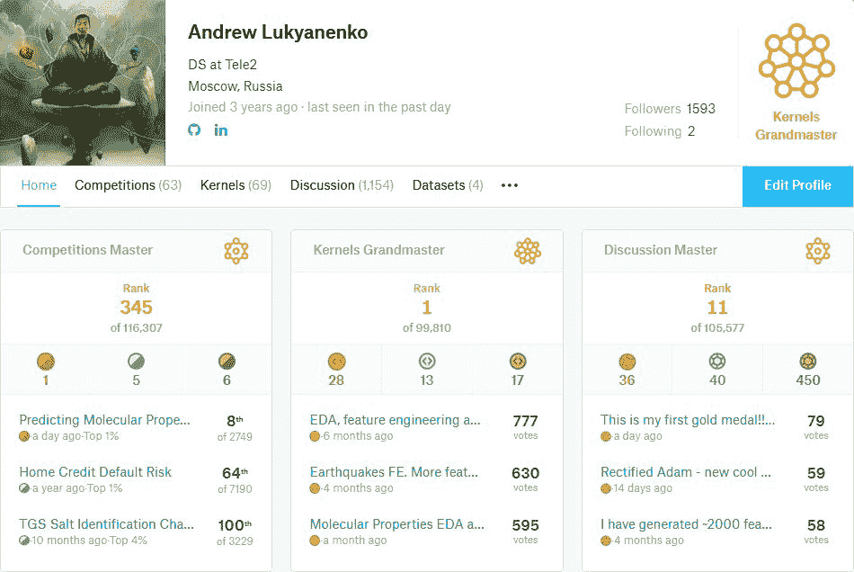
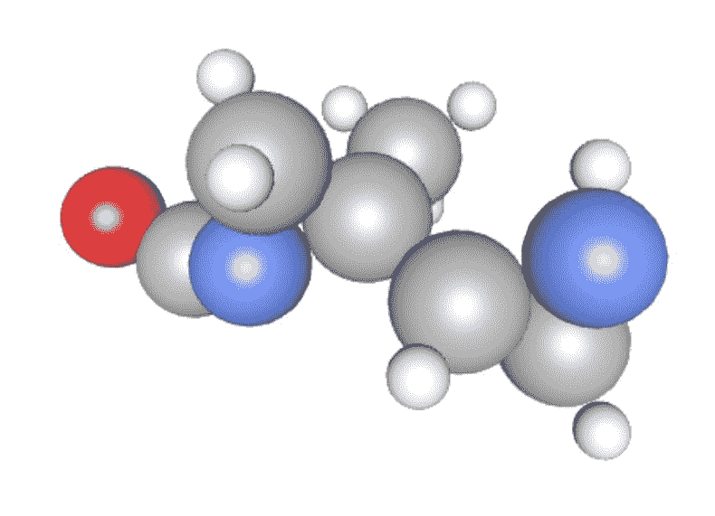
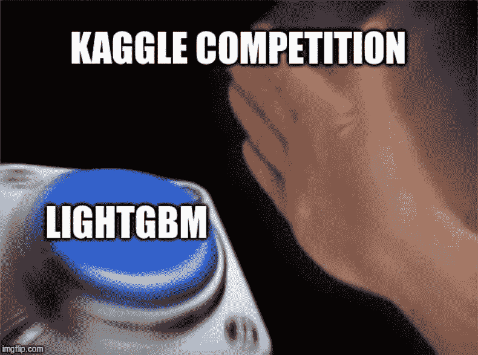
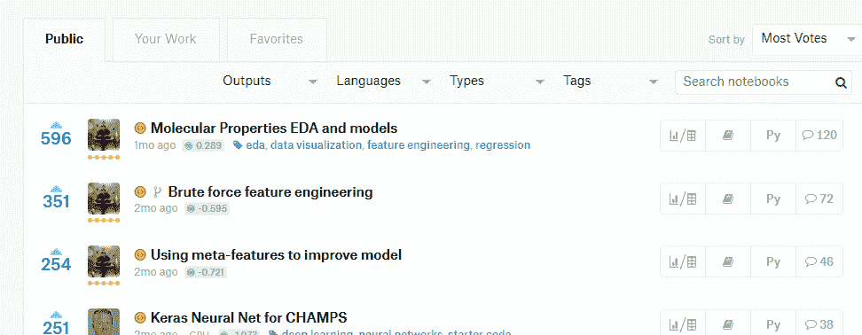
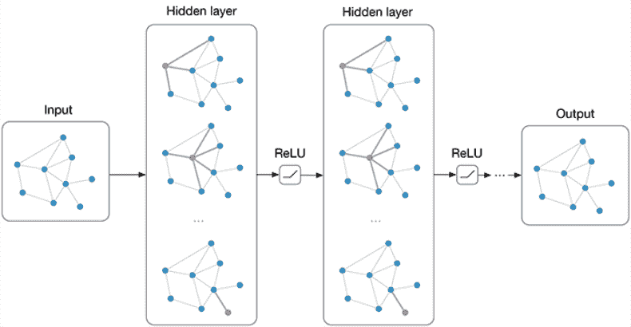
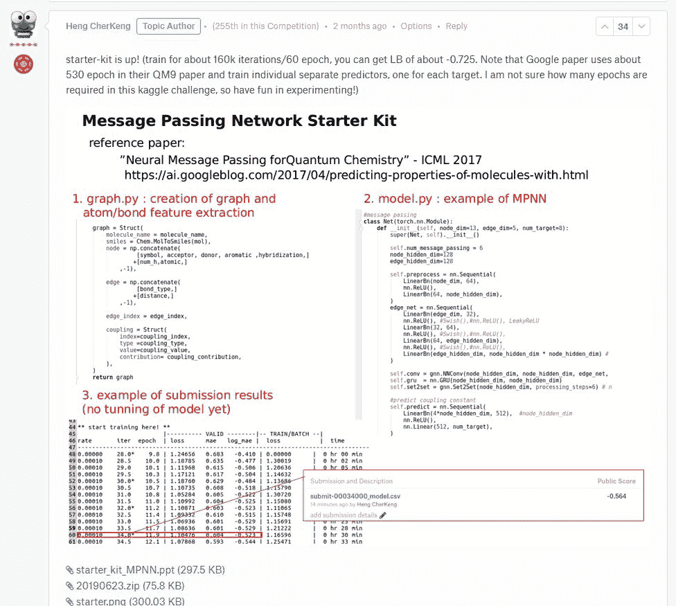
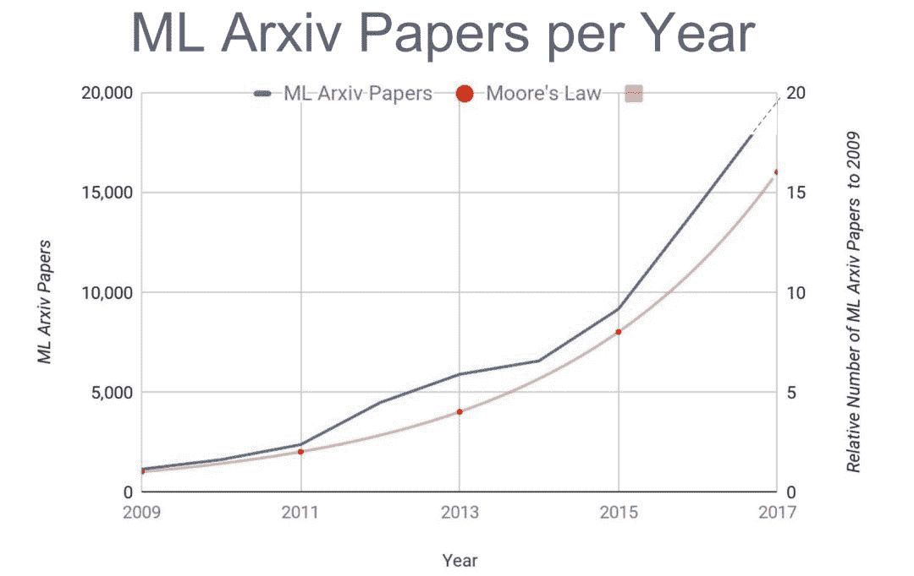
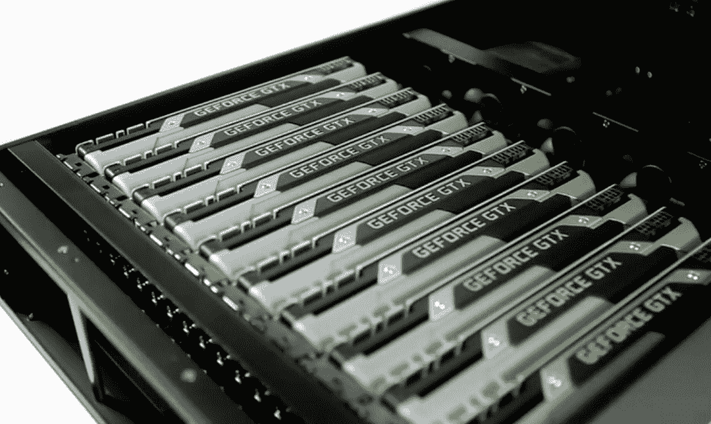
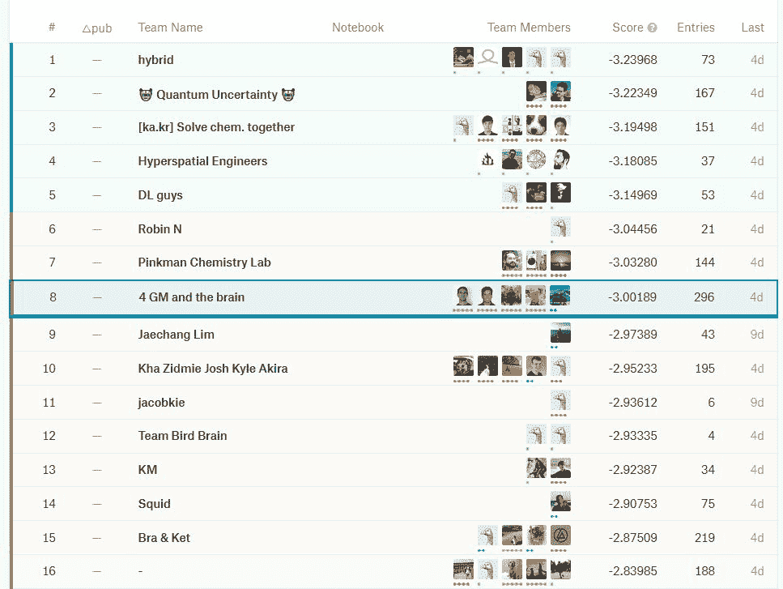

# 年轻人的第一块金牌：我是如何成为 Kaggle 全网第一的

> 原文：[`mp.weixin.qq.com/s?__biz=MzA3MzI4MjgzMw==&mid=2650769171&idx=1&sn=1ccfb3f41b16041895f06c7046b6c5df&chksm=871a436db06dca7b438115da78064349f093306739b4cbc934366d04e43caa2c32ae3d628395&scene=21#wechat_redirect`](http://mp.weixin.qq.com/s?__biz=MzA3MzI4MjgzMw==&mid=2650769171&idx=1&sn=1ccfb3f41b16041895f06c7046b6c5df&chksm=871a436db06dca7b438115da78064349f093306739b4cbc934366d04e43caa2c32ae3d628395&scene=21#wechat_redirect)

选自 towardsdatascience

**作者：****Andrew Lukyanenko****机器之心编译****机器之心编辑部**

> 能在 Kaggle 竞赛中取得金牌已经是一项挑战了，而成为 Kernel Grandmaster 甚至是可遇不可求。而近日，毕业于莫斯科国立大学的数据科学家 Andrey Lukyanenko 在一次竞赛中达成 Kaggle 金牌，并在 Kernel Grandmaster 排名全网第一。本文是他的心路历程。

参加 Kaggle 竞赛对于任何人来说都是一项严峻的挑战。你需要花费大量时间和精力来学习新知识、尝试新技巧，努力获得高分。但这些往往还是不够，因为你的竞争对手可能拥有更多经验、更多空闲时间、更多硬件甚至其他莫名其妙的优势。

但是，获得 Kaggle 金牌，甚至取得全网第一的排名似乎也不是完全不可能。一位来自俄罗斯的数据科学家就写下了他的心得，供读者参考。
以下为原文内容：
*虽然刚刚在竞赛中拿下第一块金牌，但 Lukyanenko 已经在 Kernel 上排名第一了。*

以前，我能在一些竞赛中获得银牌，有时归功于运气，有时得益于自己做了大量工作。但尽管我花费了大量时间，还是只能在很多竞赛中获得铜牌（甚至一无所获）。
**竞赛回顾**
当看到一场新的竞赛将于 5 月底启动时，我就立即对它产生了兴趣。这是一场特定领域的竞赛，旨在预测分子中各原子之间的相互作用。
众多周知，核磁共振（NMR）技术利用类似于 MRI 的原理来了解蛋白质和分子的结构与动态。全世界的研究人员进行 NMR 实验来进一步了解跨环境科学、药物科学和材料科学等领域的分子的结构与动态。

在此次竞赛中，选手们试图预测一个分子中两个原子之间的磁相互作用（标量耦合常数）。当前量子力学最先进的方法可以计算这些耦合常数，并且只需要一个 3D 分子结构作为输入即可。但这些计算会耗费大量资源，所以不常使用。

因此，如果机器学习方法可以预测这些值，则能够真正地帮助药物化学家洞见分子结构，并且速度更快、成本也更低。
**竞赛之初**
就自身而言，我通常会为新的 Kaggle 竞赛编写 EDA 内核，所以这次也不例外。在这一过程中，我发现这次竞赛非常有意思，也非常特别。我们获得了有关分子及其内部原子的信息，所以可以使用图来表征分子。Kaggle 竞赛中常见的表格数据处理方法是利用大量的特征工程和构建梯度提升模型。

在最初的尝试中，我也使用了 LGB，但知道还有更好的方法来处理图。这种挑战令我着迷，所以决定认真参与到竞争之中。
我没有一点相关领域知识（上一次看化学式还是在学校时），所以我决定完全使用机器学习技术：大量特征工程、创建折外元特征（out-of-fold meta-feature）等等。和往常一样，我在 Kernels 上公开了自己的工作。从下图中你可以看到，它们很受欢迎。

这次，该方法在 leaderboard 上取得了相当好的得分，我也得以保持白银段位。

此外，追踪当前一些最新的 Kaggle Kernels 和论坛观点也非常重要。

其中真正帮到我的是论坛和 Kaggle Kernels。从竞赛开始直至结束，我浏览了所有的 Kernels 和论坛帖子，这其中包含很多不容错过的有用信息。即使是一些不太流行的 Kernels 也会包含有趣的新功能。论坛帖子里会有其他人的一些观点，这也有助于提高竞赛分数。
**组建团队**

几乎从一开始，我就意识到，领域专业知识将为团队带来很大优势，因此我寻找每一条这样的信息。当然，我关注了几个活跃的专家并拜读了他们撰写的文章以及创建的 kernels。

有一天，我收到了 Boris 的一封邮件，他是这一领域的专家，认为我们的技能可以实现互补。通常来说，我喜欢在比赛中单打独斗，但这一次，团队合作似乎是更好的选择。事实证明的确如此。
**合并方法**
起初，我们的方法存在很大分歧。我用的是特征工程技术，而 Boris 则致力于创建描述符。一段时间之后，我们发现我的模型在一些原子对类型上表现更好，而他的模型在其他情况下表现更佳，因为我们为不同的类型训练了不同的模型。

幸运的是，Psilogram 加入了我们的团队。没过多久，他的模型就表现出了优于我们模型的性能。另一名成员 Bojan 帮助我们进一步改进了结果。他们都是很棒的机器学习专家。
**图神经网络**

那时我们已经看到了神经网络在此次竞赛中的潜力：著名的 kaggle 大师 Heng 发布过一个 MPNN 模型的例子。

一段时间之后，我甚至可以在自己的 PC 上运行这个模型，但是结果并不如 LGB 模型。但无论如何，现在我的团队知道了，如果想达到更高的目标，我们需要使用这些神经网络。

我们让 Christof 加入我们的团队，他能很快构建出一个新的神经网络。因此，我们停止训练 LGB，因为 LGB 远远比不上 Christof 构建的神经网络。
**神经网络的时代**
从那时起，我在团队中的角色就变成了辅助。我用我们的神经网络进行了多次实验：尝试使用不同的超参数和不同的架构，对训练计划和损失进行微小的调整等。有时，我会基于我们的预测进行 EDA，以发现好的和不好的例子，然后利用这些信息进一步改进模型。
**寻找新的方法是我的主要贡献之一**

*   我看了很多关于神经网络架构的论文，包括 EAGCN、3DGNN 等；

*   我尝试了不同的损失函数，如 Huber。我甚至找到了一篇用于回归的焦点损失函数论文，但实现起来并不可行；

*   当然，我还尝试了 RAdam、Ranger 等新的热门优化器，但简单的 Adam 在此次竞赛中更加好用。

*   但最后，还是 Christof 实现了架构，这给我留下了非常深刻的印象，也令我颇受启发。

**硬件**
好的硬件对于训练这些神经网络来说非常重要。我们用到了很多硬件，但我们也经常用 kaggle kernels：你可以用 P100 以相同的时间在 4 个 kaggle kernels 中训练模型，所以即使没有额外的硬件，我们也可以拿到金牌。
**结果和结论**
我们最后的解决方案拿到了第八名，赢得了金牌。

值得一提的是，我们的团队可以获得比-3 Imae 更好的分数（平均所有类型的绝对值误差对数）。在这个帖子中，楼主表示达到-3 是一个惊人的成就：https://www.kaggle.com/c/champs-scalar-coupling/discussion/98375#569312

事实上，我们做到了！
**总结**
从这次竞赛中我学习到了很多东西，总体来说，想要在 Kaggle 上成功我们需要：

*   浏览 Kernel 和论坛，其中会提供大量有用的信息；

*   准备好屡败屡战。当你试图找到一种可以提高分数的方法时，大多数是行不通的，但不要气馁；

*   不断寻找新的想法、新的论文和核心的文章。你永远不会知道下一个神奇工具会从哪里出现；

*   在团队内构建一个验证效果的机制，从而令工作结果更加直观；

*   一个强大的团队是由很多不同特长的人组成的，我们应该涵盖不同领域；

*   Kaggle 比赛非常具有挑战性，当然在这个过程中我们也可以收获诸多乐趣：）

我很幸运可以和这些了不起的人一同工作，感谢他们！

*原文链接：https://towardsdatascience.com/a-story-of-my-first-gold-medal-in-one-kaggle-competition-things-done-and-lessons-learned-c269d9c233d1*

‍

********本****文为机器之心编译，**转载请联系本公众号获得授权****。**
✄------------------------------------------------**加入机器之心（全职记者 / 实习生）：hr@jiqizhixin.com****投稿或寻求报道：**content**@jiqizhixin.com****广告 & 商务合作：bd@jiqizhixin.co**