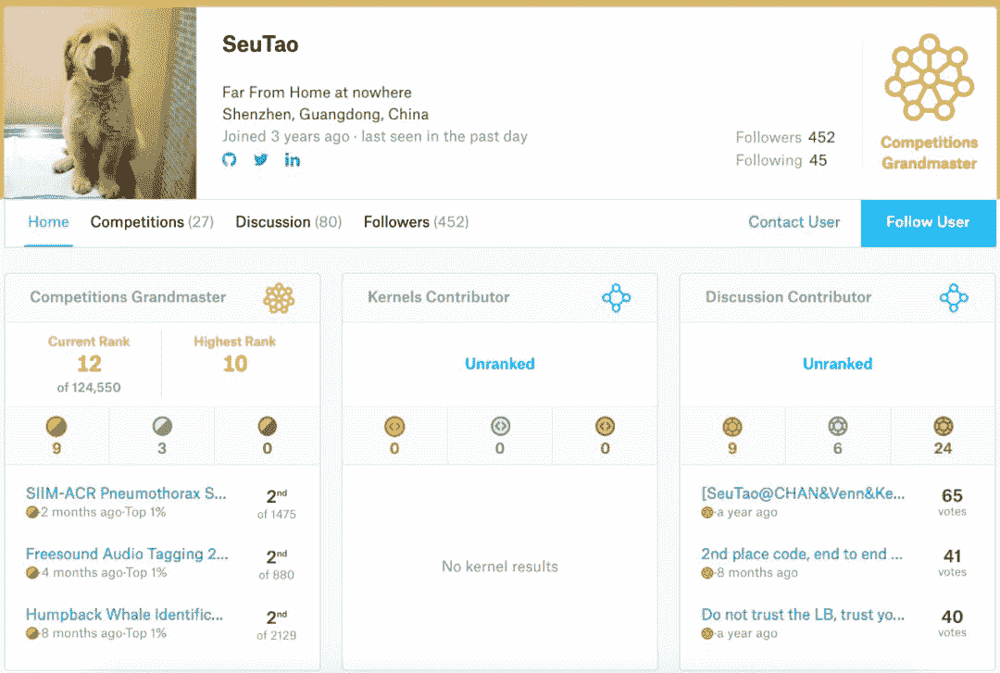

# 半年 5 战 5 金：Kaggle 史上最快 GrandMaster 是如何炼成的

> 原文：[`mp.weixin.qq.com/s?__biz=MzA3MzI4MjgzMw==&mid=2650773084&idx=2&sn=e21a700f6fbe230d4526d61b8a398e69&chksm=871a5222b06ddb3416334e122d1ba8ea1de6a7594f16e2fb6b2f179dba080cff8149d5302696&scene=21#wechat_redirect`](http://mp.weixin.qq.com/s?__biz=MzA3MzI4MjgzMw==&mid=2650773084&idx=2&sn=e21a700f6fbe230d4526d61b8a398e69&chksm=871a5222b06ddb3416334e122d1ba8ea1de6a7594f16e2fb6b2f179dba080cff8149d5302696&scene=21#wechat_redirect)

机器之心专栏

**机器之心经授权转载**

> 这是 Kaggle 你问我答 (AMA) 的第一期活动，本期请到的嘉宾是 SueTao，他研究生毕业于东南大学，目前是腾讯的一名算法工程师。

*   Kaggle profile：https://www.kaggle.com/shentao

SueTao 擅长计算机视觉（Computer Vision），半年 5 战 5 金，也许是史上最快的 GrandMaster。截至目前共斩获 9 金 3 银，kaggle 最高排名全球第 10。

以下是本期活动的问答集锦：**Q1：****如何搭建 kaggle data pipeline?**A1：我目前的比赛还是集中在 cv，也做过语音，还有前段时候的 PMP，都是 DL 相关的竞赛。数据的 pipeline 其实是可以积累并且优化的。我觉得可以参考一些前人的代码，尤其是蛙神的 code。可以在蛙神的 code 基础上，慢慢优化跟积累出自己的数据 pipeline。DL 数据 pipeline 中还有个很重要的部分就是数据增强，这块针对不同比赛可能有不同的做法。**Q2：****自己曾经努力拿过银牌，但是觉得金牌好难，特别是 solo 的情况，请问金牌和银牌的差距在哪里，如何突破？**A2：我还是从我参与比较多的 cv 竞赛角度出发哈。首先，如果你是 cv 新人，在 kaggle 竞赛上觉得拿金牌很困难，其实是很正常的。目前 cv 赛基本被 cv 高手霸榜了。如果你是已经比较熟悉 cv 各个方向的模型，那你可能需要一个竞赛好手来给你带路。毕竟竞赛还是有很多套路的。如果是新人，我的建议是坚持，通过几个 cv 竞赛来积累对这个方向的认识。了解不同模型不同任务。我觉得可以参考 padue，大家如果看他竞赛的成绩的话，开始他也只是银牌水平，但是从前段时间的 protein 开始，他现在在 cv 赛的水平基本就是 solo gold 了。deep learning 实践的积累还是很重要，一口吃不成胖子。**Q3：****private sharing 这个问题时不时被人提起，请问根据你的观察，它是否已经严重到影响 kaggle 的公平性？**A3：private sharing 太坏了。这个我觉得大家都深有感触，X5 事件。我也不发表过多的评论了哈，这块确实 kaggle 平台也需要多关注下。**Q4：****新出的 3d object 比赛是不是一种趋势，请问涛神对 computer vision 的发展有什么观察和展望？**A4：cv 的话 3d 绝对是一个趋势，包括学术界和工业界；sensor 的成本越来越低，性能也越来越好；就人脸识别来说，用 3d 来说安全性和可靠性就更高了。其实我目前也算是退坑 computer vision 了，也谈不上对 cv 有深入的认识。大家从 kaggle 上 cv 赛的数量上可以发现，cv 对企业的价值还是非常高的。前景是非常好，例如工业检测之类的，又谈到了 steel。**Q5：****怎么判断该改进网络结构还是调学习率？**A5：学习率和学习策略可能是搭建 baseline 里面最重要的部分。这块需要在比赛的前期优化到最好，建议使用简单的网络作为 baseline，然后仔细优化学习策略。没有提升空间之后再考虑别的方向的优化。**Q6：****是否应该从分类错误的 sample 中提取灵感继续改进？****如果是该怎么做？**A6：cv 最好的一点是可以看图，非常直观。举个例子：比如之前的鲸鱼竞赛，baseline 模型的 bad case 大多是一些姿态较大，分辨率较差的图像。那么我们就可以考虑增加对应的数据增强。效果也很显著。再举个反面例子：刚刚结束的 nips 的 cellsignal 竞赛，是细胞的荧光成像。整个比赛我完全没有看 bad case。因为没有 domain 知识，图像非自然，很难观察。但是也不妨碍比赛能拿名次，只看 log 来调参。**Q7：****请评价 cv 各项任务中 state of the art 模型的实用性，有何推荐？**A7：「试过才有发言权」，这是我做 kaggle 之后的一个经验。没做 kaggle 之前，我工作集中在轻量级的模型，对于 sota 的大模型几乎没有尝试。所以我在竞赛中会尽量去尝试各种 sota，最终会有很多有意思的结论。会发现 kaiming 的 resnet 为什么强，unet 为什么就是好用。有些很 fancy 的模型真的只是过拟合特定的数据集。我也没有尝试过所有的 sota，但是我觉得 paper 里的内容看看就好，去伪存真，实践出真知。**Q8：****作为一个新人从头开始拿到金牌的最佳策略？****比如选择比赛的类型？**A8：哈哈 因为我 cv 一把梭，只能给到 cv 的经验。如果新人想拿金牌的话，最好就是找一个蛙神 all in 的比赛，step by step follow 蛙神！只要比所有人都肝，有足够计算资源，对齐 discussion report 出来的模型精度，solo gold 就有希望！其实我第一个比赛 TGS 就是这么做的。**Q9：****在 kaggle 学到的东西是否有应用到别的地方？****能否举例说明？**A9：非常多。举个例子：模型集成（ensemble）。可能有些人说模型集成在实际工作中用不了；工作中的场景有效率的要求；在计算资源受限的情况下，3 个小模型集成的效果可能远好于 1 个大模型的效果。我之前的参与的人脸项目，其实就用了这样的策略，很好用。但是如何去集成，怎么增大模型间 diversity，这些技巧大家可以从 kaggle 上学习。**Q10：****回头看自己的经历，对刚入坑的新人，有什么想提醒的经验和教训？**A10：教训到没有，做比赛一年感触还是蛮多的，投入越多收获越大吧。希望大家坚持。真的只有投入去做了，才会有收获。**Q11：CV 比赛假如遇到瓶颈会往哪些方向尝试？**A11：数据层面绝对是提分收益最大的方向；还是要多看数据，多分析 bad case；不看数据就调网络结构是不可取的。数据层面有些线索之后，可以指导你对模型结构本身做一些改进。另外最重要的：多看 paper，paper 是 idea 的来源。**Q12：一般会用哪种方式平时积累知识？**A12：过去很长一段时间内，我积累的方式还是来自比赛 通过一个比赛，我可以验证很多 paper 的方法，实践在工作中无法使用的模型；帮助我深入理解一些数据上和模型上的问题 感觉从我个人而言，比赛和工作相辅相成，给我工作提供了非常好的积累和储备。**Q13：****想知道打比赛的节奏是什么，比如比赛结束前一个月，一周，几天主要干什么？**A13：基本上最后一周前，最终方案就要定了。考虑最终的集成。**Q14：有复现比赛 top solution 的习惯吗？有的话是一种怎样的方式呢？**A14：会看，但是很少会跑。因为一直忙着做新的比赛。其实应该仔细去研究下的。**Q15：分类比赛中的最后的 sub 的阈值应该根据什么来选取呢，有什么选取技巧呢？**A15：我只能说可靠的 local validation 是最重要的，所有涉及模型选择，调参；其实都需要一个依据，local validation 就是这个依据。这样问题就变成如何建立可靠的 local validation 了。**Q16：分类比赛中最后的两个 sub 一般会怎么样选择呢，不同的方案的模型，还是其他？**A16：这个问题比较好。前期几个比赛的 sub 一般都是我选的，有幸抽中过金牌。我个人的建议是，差异一定要大，一个激进一个保守。就 dl 比赛来说，集成最稳的是 weight ave，简单有效，一般来说我会选一个这个；然后一些存在过拟合风险的方法，但是 lb 和 cv 都很可观的方案，我也会选择一个。**Q17：请问经常看到各位大佬同时参加好几个比赛，还能拿到很好的名次，这是怎么做到的？**A17：其实 kaggle 上的 top CVer 都会有自己积累下来的 pipeline。竞赛任务无非是这几种，迅速搭建一个可靠的 baseline，对 top 选手很容易；看似在做多个竞赛，可能跑的是一套代码。真的要最终比赛冲刺了，会有针对性地去理解数据和优化。**Q18：图像比赛有什么通用的技巧吗？厉害的选手一次提交就可以进到绿圈，细节处理上有什么独到之处？**A18：DL 调参的细节太多了，需要很长时间的积累。同样的数据+网络，不同人的训练结果可能相差巨大。这是 top CVer 的核心竞争力 通用技巧的话，paper 上带着「bag of tricks」的 都需要仔细阅读 bag of tricks for image classification，bag of tricks for object detection。**Q19：想问下之前说没法做 bad case 的时候通过 log 调参是怎么调的，另外一般 bad case 怎么样比较好的分析？**A19：其实很简单: bias-variance trade off，只看 log 的话，拿捏好这个。比如 nips cellsignal 比赛，baseline 效果是，training 拟合的非常好，test 却非常差。其实是一种 train test consistency。从 1）数据层面；2）网络层面，去分析可能的情况。1）数据层面:数据分布的问题，2）网络层面：batchnorm。针对性地去做实验，确定问题所在，继续观察 bias-variance，要得出可靠结论，再进行下一步。**Q20：我这边自己写了个基于 pytorch 的轮子, 每次基本上能跟上 public kernel 的步伐, 但是就是很难超越. 我估计是训练资源和调参问题. 那么: 调参大部分用已经训练好的模型来调, 还是每次改变参数都重新训练个几天, 哪种方法对 top CVer 比较实际?**A20：建议解决计算资源问题，保证快速学习 训练资源很重要，其实最优的实验周期我个人感觉在半天。半天能出一个实验结果最好，中间可以干别的。结果出得太快也不好，要及时总结和记录实验。**Q21：之前看到有新闻说模型会用贴纸识别面包机，用肤色识别罪犯的这种过拟合的情况，还有 aptos 存在模型通过图片尺寸 leak 发现 lable，有没有什么好办法避免这种情况？**A21：我感觉过拟合问题其实比大家想象的更严重，之前做活体检测基本就是这么个情况，难以范化。目前的 DL 还比较『蠢』，要说办法的话，加数据算不算？**Q22：问一个技术性问题，碰到一些受阈值影响的 metrics 时，训练的时候取最好的模型应该依据 val-metrics 还是 val-loss 呢？valid 的时候如果遍历阈值，可能会极大的影响效率。不同模型/不同 epoch，用不同阈值取得的 metrics 比较，会不会『不公平』？**A22：其实我也没有很好的答案。是我的话，最优的 val-metrics 和 val-loss 模型我都会存。其实最担心的是优化的 loss 和 metrics 不一致。**Q23：还想问下对 warmRestart 这类的循环式的 scheduler 有什么看法？和传统的 ReduceLROnPlateau 相比有什么优劣？**A23：最近发现这个真的很好用。如果用 step LR 的话，很可能下降的位置就不够好。循环的学习策略，我的感受是既不会有太多过拟合，也不需要很仔细调参，基本会有个不错的结果。

*原文链接：**https://zhuanlan.zhihu.com/p/89476481*

第三届机器之心**「Synced Machine Intelligence Awards」**年度奖项评选正在进行中。本次评选设置**六大奖项****，**重点关注人工智能公司的产品、应用案例和产业落地情况，基于真实客观的产业表现筛选出最值得关注的企业，为行业带来实际的参考价值。

**参选报名日期**：2019 年 10 月 23 日~2019 年 12 月 15 日**评审期**：2019 年 12 月 16 日~2019 年 12 月 31 日**奖项公布**：2020 年 1 月

点击**阅读原文**，查看更多详情并报名参选。