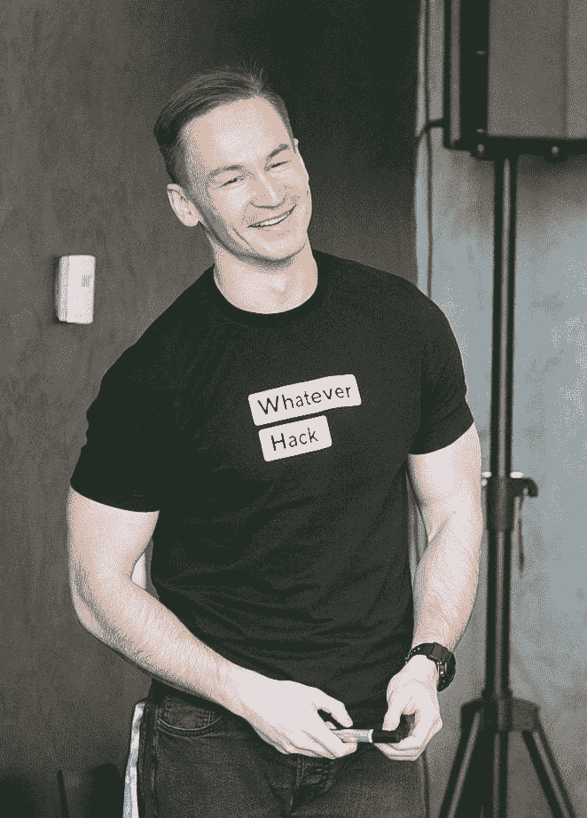
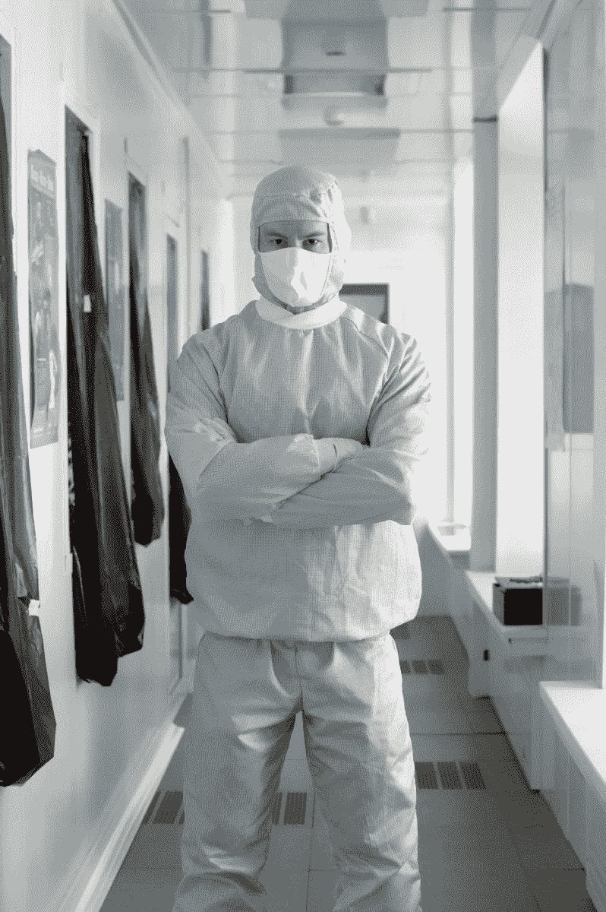
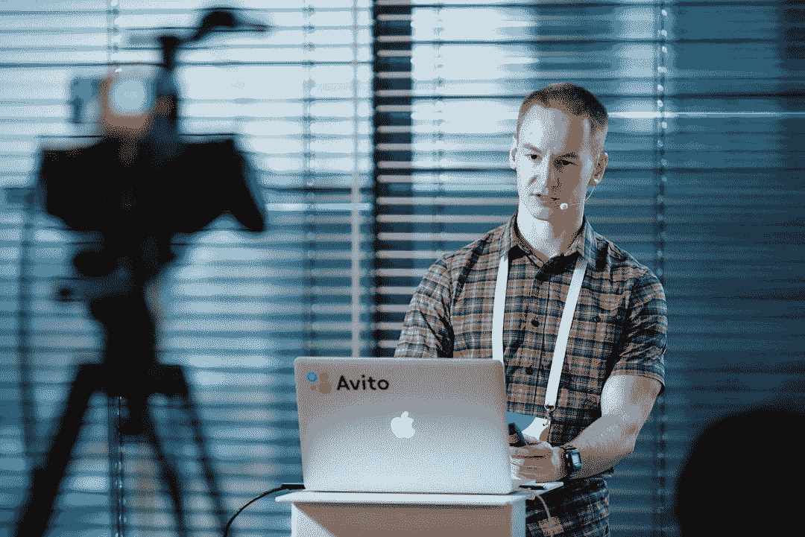

# 想在 Kaggle 中脱颖而出？先听听这位 GrandMaster 怎么说

> 原文：[`mp.weixin.qq.com/s?__biz=MzA3MzI4MjgzMw==&mid=2650757990&idx=3&sn=4c7de62268ccb56849d099eac1f984c9&chksm=871a9f18b06d160e62d8330ec80e7912d69e1cfde79ec79a698f385b97fc92065a82772a7392&scene=21#wechat_redirect`](http://mp.weixin.qq.com/s?__biz=MzA3MzI4MjgzMw==&mid=2650757990&idx=3&sn=4c7de62268ccb56849d099eac1f984c9&chksm=871a9f18b06d160e62d8330ec80e7912d69e1cfde79ec79a698f385b97fc92065a82772a7392&scene=21#wechat_redirect)

选自 Medium

**作者****：Sanyam Bhutani**

**机器之心编译** 

**参与：Geek AI、张倩**

> 本文作者 Sanyam Bhutani (https://hackernoon.com/@init_27) 是一名机器学习和计算机视觉的自由职业者、数据科学家。自 2018 年以来，他对自己心目中的一些 AI 领域「英雄」进行了采访，如 Ian Goodfellow、Richard Socher 等。本文的采访对象是在 Kaggle 排行榜上排名第 29 位的 GrandMaster Autue Kuzin。在本次采访中，他就如何组队、如何取得好成绩等问题给出了自己的建议。

Autue Kuzin（Kaggle ID: @drn01z3）来自 ods.ai 社区，拥有物理和应用数学的硕士学位背景，目前在 X5 零售集团（俄罗斯最大的多业态零售商）担任计算机视觉主管。在供职于 X5 集团之前，他在 Dbrain（Dbrain.io）担任首席数据科学家，也曾在 Avito（全球第二大分类信息网站，隶属于 OLX 集团）担任数据科学家。

以下为采访内容：

*Sanyam Bhutani：您好！Artur 大师，感谢您百忙之中接受我的采访。现在，您是一名 Kaggle 竞赛大师，也是 Kaggle 的讨论专家及 Kernels 论坛专家。实际上，您拥有物理学和应用数学的学术背景。那么，您当初是如何对机器学习和 Kaggle 产生兴趣的呢？*

**Artur Kuzin**：当我还是一名学生的时候，我在实验室工作的同时尝试参与了许多不同的活动。当时，我的几个朋友被拉去一家陌生的初创公司工作，从事人工智能的开发。时至今日，我仍然想不通我当时是如何被说服的，因为在那个时候，这样的工作与我原本的生活相去甚远。这些任务大多与计算机视觉有关。

这家初创公司很有趣，也很多元化。但现在看来，我觉得那时我的成长速度还是太慢了。当我开始参加 Avito 组织的机器学习竞赛时，我感觉自己才得到了真正的提升。在我第一次参与的关于汽车分类的比赛中，我获得了第三名。为此，我感到很激动，也充满了动力。在接下来的 Avito 组织的比赛中，我获得了第一名。正因为如此，我被他们录用了。

*Sanyam Bhutani：您目前在 X5 零售集团担任计算机视觉主管，过去几年一直在数据科学领域工作。Kaggle 在您的职业生涯中的意义何在呢？这和您的其他项目有关吗?*

**Artur Kuzin**：在 Avito 比赛中获胜后，我意识到这些机器学习比赛是一项非常酷的活动，有着独特的氛围。从那以后，我一直努力参与有趣的比赛。在这段时间里，我一直有一份全职工作，而 kaggle 看起来就像是第二份没有报酬的工作（是的，实际上一些 kaggle 比赛会设置一定的奖励，但它们很难称得上是稳定的工作）。

在 Kaggle Dstl 卫星图像特征检测大赛发布后，Vladmir Iglovikov（Kaggle: @iglovikov）鼓励我和其他许多顶级团队的参赛者参与到这项赛事中，我十分感谢他！这是一场艰苦卓绝但又妙趣横生、令人激动的比赛。从那时起，我意识到自己已经对 Kaggle 比赛上瘾了！时至今日，比赛本身并没有促使我开展自己的项目。但是，我经常接触到一些向我提供有趣的工作机会的人。

*Sanyam Bhutani：您能介绍一下您在当前的工作中所扮演的角色吗？您现在在做什么项目，您在其中的角色是什么？*

**Artur Kuzin**：X5 零售集团最近成立了视频分析部门。该部门的任务是使用计算机视觉技术开发和实现解决方案，任务包括对货架上的商品是否可以获得进行分析、队列控制、客户分析、员工分析等。我领导着一个由 10 名工程师和研究人员组成的团队。团队的任务包括机器学习和计算机视觉领域的研发，以及封装从塑造硬件架构到与数据仓库集成的整套解决方案。

*Sanyam Bhutani：您在许多比赛中都取得了惊人的战绩。能告诉我您最喜欢的挑战赛是什么吗？*

**Artur Kuzin**：对我来说，最重要、最有意义的比赛经历莫过于在第二届 Kaggle IEEE camera 大赛中获得第二名。在职业生涯的那个阶段，我曾经考虑过担负起一个团队领袖的角色，但是我并不确定自己是否能够胜任。于是，我决定在 kaggle 比赛中试着扮演该角色。通常，团队中的每个人都会从头到尾开发自己的解决方案。然后有人负责将这些方案整合起来或建立二级模型。我们却选择了另一条道路。Arthur Fattakhov 负责收集数据，Ilya Kibardin 负责训练模型。而我只是给他们提供硬件、想法和建议。我自己动手完成的唯一的部分就是过滤数据、并在截止日期前 5 分钟将最终用于提交的结果混合起来。结果是，我们从 public leaderboard 上的第六名进步到了 private leaderboard 上的第二名。这让我有了坚定的信心领导团队。

你可以查看下面的两个资源链接，获取该竞赛解决方案的相关信息：

*   一个带有英文字幕的视频（https://youtu.be/ETh8bJ_xKGA）

*   一篇博文（https://hackernoon.com/ieees-camera-identification-challenge-different-approach-to-teaming-up-28da44dfe635）

*   我们最后也决心在排行榜上获得较高的排名。我们与 Vladimir Iglovikov 以及他的研究生合作撰写了一篇论文，并在 2018 IEEE 国际大数据会议上展示了相关工作（摘要链接：https://ieeexplore.ieee.org/abstract/document/8622031）

*Sanyam Bhutani：您在单人比赛和团队比赛中都取得了骄人的成绩。对于 kaggler 新人，您在组建团队方面有何建议？*

**Artur Kuzin**：如果你是第一次参赛，我强烈推荐你参加一个团队。此外，你十分需要找到一个有经验的参与者（至少在 Master 水平）。他不会犯愚蠢的错误，也不会太紧张。同时，对于团队来说，最好有一个熟悉开发实践的人，并且能够调整开发进度，将其拆分为常见的数据折叠、git、交换数据的位置和讨论的位置。

事实上，即使是对于经验丰富的参赛者来说，加入一个团队也会更好。我认为组建一个拥有不同水平技能的团队很有价值。年轻人和没有经验的人通常会极具热情，所以如果你正确地激励他们，你可以让他们甘愿做一些「无聊」的事情，比如清理数据和测试重要的假设。Middles / kaggle 大师可以在高级团队成员的督促下编写出良好的代码。Senior/ Kaggle 特级大师可以成为解决方案架构师，并将工作完全委托给其他人。

*Sanyam Bhutani：您现在期待什么样的挑战？如何才能让您决定参与一项新的竞赛？*

**Artur Kuzin：**现在，我面临的主要挑战是在 X5 零售集团推出一个大型项目，我全身心专注于此。然而，我仍然认为参加竞赛是很有价值的（特别是如果他们与工作相关）。例如，目前有一个关于鲸鱼的竞赛，该任务非常类似于定义货架上的商品。

*Sanyam Bhutani：如果给他足够的时间，您认为 Kaggle 能够给参赛新人带来什么样的机会？*

**Artur Kuzin：**Kaggle 让你能够非常快速地提升一些特定的技能。通过正确的方法，这些技能可以转化为工作所需的特质。此外，这些竞赛让你可以尝试很多不同的任务，大大扩展你的知识面。最后，如果你能找到一个像 ODS.ai 这样友好的技术社区，那将会非常有趣。

如果我们谈论的对象是更有经验的大师或特级大师级别的参赛者，那么对他们来说，这是一个试着成为团队领导者的机会。在工作中，仅仅因为你想成为一个团队领导者，你就能成功地做到这一点的情况是非常罕见的。但如果能够在这种竞赛中有很成功的领导表现，那么通往领导生涯的道路就会容易一些。

就我个人而言，我用 kaggle 来寻找有智慧的人。例如，我与 Ilya Kibardin 和 Miras Amir 一起参加了多项比赛。所以他们是我在 X5 零售集团团队的候选人名单上的首选。

最后需要强调的一点是，Ilya 和 Miras 在 kaggle 上的成就是让他们获得高薪的原因之一（尽管他们还是学生）。

*Sanyam Bhutani：对于想在深度学习比赛中取得好成绩的初学者，你有什么好的建议（他们自己往往没有强大的 GPU 集群系统）？他们怎样才能战胜数不胜数的对手呢？*

**Artur Kuzin：**我认为可以采取下列策略：

1\. 寻找计算资源。这些计算资源可以是 Kaggle GPU kernels，也可以是谷歌云的积分，或者是学术用的 AWS。

2\. 尽早开始参与。计算资源的缺乏可以通过时间和尝试次数来弥补。

3\. 当你得到一个不错的结果时，你可以与具有计算资源的更有经验的参赛者合作。

4\. 奋战到底。

Valery Babushkin 亲自实现了这样的策略。他根本没有任何显卡，然而他却能够在 Kaggle Carvana 竞赛中取得不错的结果。因此，我与他组队并最终得到了金牌。

*Sanyam Bhutani：当你开始从事一项新的比赛时，你要做的第一步技术准备是什么？*

**Artur Kuzin：**下面给出的套路很典型：

1\. 我会阅读任务描述，逛逛论坛。如果没有发现数据泄露，那么你可以决定参与其中。

2\. 探索性数据分析

3\. 将数据折叠，并考虑一些局部验证方案

4\. 准备对比基线

5\. 接下来的步骤取决于具体竞赛

*Sanyam Bhutani ：对于读者们以及像我这样想成为更优秀的 Kaggler 的新人来说，您对我们有什么好的建议吗？*

**Artur Kuzin：**也许我的观点有些独特。但我坚信，最重要的是有能力去渴望和痴迷于某件事。这是一种对事物感兴趣的能力，不要半途而废，要坚持到底，奋战到最后一秒。如果你有这种愿景，那么你就会明白如何做到最好。

*Sanyam Bhutani：如今机器学习技术飞速发展，请问您如何才能紧跟该领域最新的进展？*

**Artur Kuzin：**机器学习领域几乎所有最近发生的事件和结果都在 ODS.ai 中有所讨论。但我对学术上的发现并不感兴趣，我感兴趣的是实用的技术，这些技术可以让我训练出一种准确、轻量级的模型用于生产。在这方面，你可以关注在比赛结束后给出的解决方案的概述。一些参与者甚至会将源代码和他们的解决方案一起分享给大家，这是非常值得尊敬的。

*Sanyam Bhutani：您认为该领域最激动人心的发展是什么？*

**Artur Kuzin：**我仍然对 AlphaStar 印象深刻。我们生活在一个非常有趣的时代。我认为这是将很快改变我们生活方式的重大发现的开始。

*Sanyam Bhutani：你对机器学习这一领域有什么看法，会不会认为它被过度炒作了？*

**Artur Kuzin：**我认为机器学习肯定是被炒作过头了。但这并非无缘无故。在我看来，这个领域的成功并不是虚假的，因为现在很多公司都在大量不同的应用程序中使用机器学习。劳动力市场似乎也仍然不稳定。但是随着时间的推移，机器学习的能力水平将会提高，并且一切都将得到平衡，就像在通常的软件开发中发生的那样。

*Sanyam Bhutani：在采访结束前，你对于那些渴望有一天像你一样成功，但却对如何开始比赛感到不知所措的新手有什么建议吗？*

**Artur Kuzin：**现在就开始吧！想做就做！事在人为。我不认为自己有什么非凡的才能，也不认为自己有多聪明或精明。我有一群朋友，他们在各方面都比我好。但我确信，勤能补拙！

*原文链接：https://hackernoon.com/interview-with-kaggle-grandmaster-lead-data-scientist-at-dbrain-artur-kunzin-28f516a91e3*

****本文为机器之心编译，**转载请联系本公众号获得授权****。**

✄------------------------------------------------

**加入机器之心（全职记者 / 实习生）：hr@jiqizhixin.com**

**投稿或寻求报道：**content**@jiqizhixin.com**

**广告 & 商务合作：bd@jiqizhixin.com**