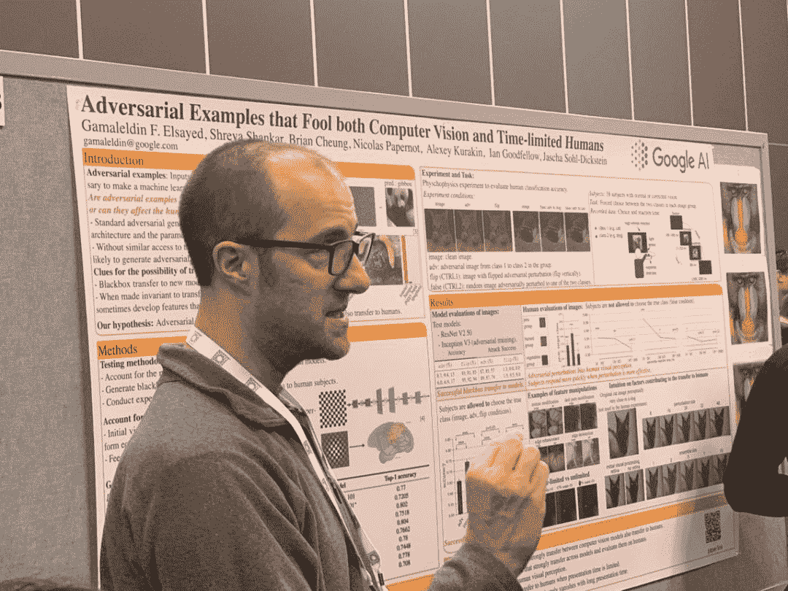

# 如何在 9000 多人的 NeurIPS 会场优雅地展示 Poster

> 原文：[`mp.weixin.qq.com/s?__biz=MzA3MzI4MjgzMw==&mid=2650755702&idx=2&sn=3e3da0d1a62473aa510115d9e4f7aac8&chksm=871a9608b06d1f1eb83408b74c94c27bb728b81fae48920071f3b65860e37d62d8878388e6bb&scene=21#wechat_redirect`](http://mp.weixin.qq.com/s?__biz=MzA3MzI4MjgzMw==&mid=2650755702&idx=2&sn=3e3da0d1a62473aa510115d9e4f7aac8&chksm=871a9608b06d1f1eb83408b74c94c27bb728b81fae48920071f3b65860e37d62d8878388e6bb&scene=21#wechat_redirect)

选自 The Exclusive Or

**作者：Charles Sutton**

**参与：姜悦、张倩**

> 随着人工智能会议热度的持续增加，到场参会的人数也屡创新高。今年，NeurIPS 的参会人数更是突破了 9000 人。那么如何在嘈杂的会场展示自己的 poster 论文？本文作者有三个成熟的小建议。

*机器之心小编拍摄自 NeurIPS 2018 现场*

很多学术交流发生在 poster 展示期间。浏览 poster 是了解这个领域、和具有相同研究兴趣的人交流的良好途径，也是能够在诺大的学术圈中被注意到的好方式。在学术会议中贴 poster 的机会和 25 分钟的 oral 同样重要，也需要很多专业技能。在写这篇博客之前，我为如何讲好 poster 提了几点建议。当我开始参加学术会议的时候，这样的建议在我看来足够用了。

但是最近，我觉得我们在讲 poster 的时候需要多一点的技巧。最近我喜欢的一个会议 NeurIPS，今年有 9000 多人参加，所以会场非常吵。讲 poster 的人身边围 20 个人的情况并不罕见。如果参加的会议规模这么大，你就要改变展示 poster 的方式。我曾看见在讲 poster 的过程中，有的展示者面对着 poster，很细心、很小声地给一个人解释，完全不顾身后的 10 个人。如果你是那个 poster 展示者，请不要这样做！

如果遇到这样的情况，可以参照 Sutton 给大型会议中 poster 很受欢迎的人提出的三条规则：

1\. 时刻注意你周围的情况。你在讲解 poster 的过程中，人是流动的，有新的人加入，也有人离开。你需要注意到这些情况，这样就可以意识到谁刚刚加入了，在介绍 poster 内容的时候和他们对视，微笑一下或者点个头，表示欢迎。（必须承认的是，尽管我试着这样欢迎每个加入的人，但是当加入的是熟悉或者有名气的人的时候，我更可能这样做。）另外，注意到周围环境的变化可以帮助你调整介绍的方式。因为和两三个人讲话是有别于和 15 个人讲话的。为什么呢？请参照下面两条规则。

2\. 使用肢体语言。首先要恭喜你能吸引这么多人，而且你也成功地注意到了他们的加入。那现在该怎么办呢？你要像之前一样继续简短地介绍论文。只是要清楚现在听你讲的不是一个人，而是一群人。你可以用肢体语言帮助表达。首先要自信地面向整个人群。双脚分得开一点，肩膀抬高，手臂舒展，手势做得幅度大一点，这样大家都能看到你。展示的时候环顾人群。如果这方面做得好的话，你会发现 poster 被一个大的半圆形包围起来，而你处在一个非常醒目的位置。

3\. 你需要提高嗓门。如果人们听不到你说什么，他们就会离开去下一个 poster。在嘈杂的会场里，你需要将嗓门提高到人就算在 15 英尺开外都能听到。我天生属于大嗓门，但在 NeurIPS 上我也需要尽力提高声音才能被听到。除了提高声音，也有其他一些技巧可以帮到你。如果你的职业需要演讲（在学术界很常见），那么推荐阅读 Patsy Rosenberg 的《The Right to Speak》。

在讨论研究的同时做到以上所有方面的确是非常困难的。所以你需要练习，熟悉自己的 presentation 内容。这样你就能空出一部分思考空间关注听众（其实这对所有演讲都适用）。

从「人数少的 poster talk」过渡到「人数多的 poster talk」可能有些不适，但相信你可以做到。你可以对之前的听众说，「我要为新来的听众调整一下我的 presentation，但如果你想到更多问题请随时提问。」

有一次，我正开始向一个人展示我的 poster，突然不知道从哪里冒出一群人来。我看着最初的那个忠实听众说，「你可能想往后退一步，因为我要提高嗓门了。」然后我加大了音量，他也往后退了一步。我没有从头开始讲，而是见缝插针地加入了一些背景信息，以便后来的听众理解上下文。********

****本文为机器之心编译，**转载请联系本公众号获得授权****。**

✄------------------------------------------------

**加入机器之心（全职记者 / 实习生）：hr@jiqizhixin.com**

**投稿或寻求报道：**content**@jiqizhixin.com**

**广告 & 商务合作：bd@jiqizhixin.com**