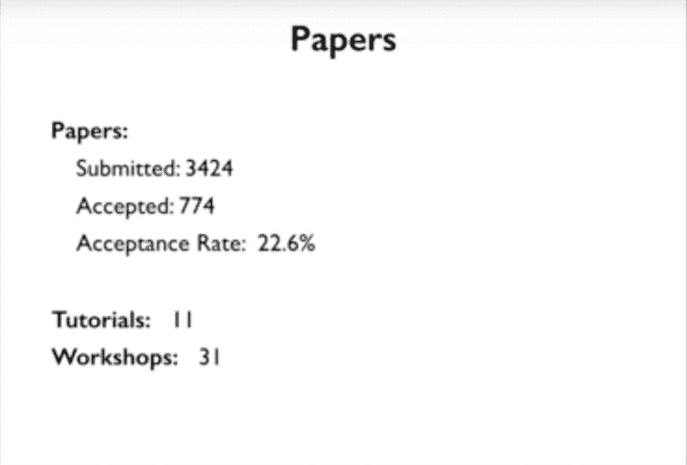
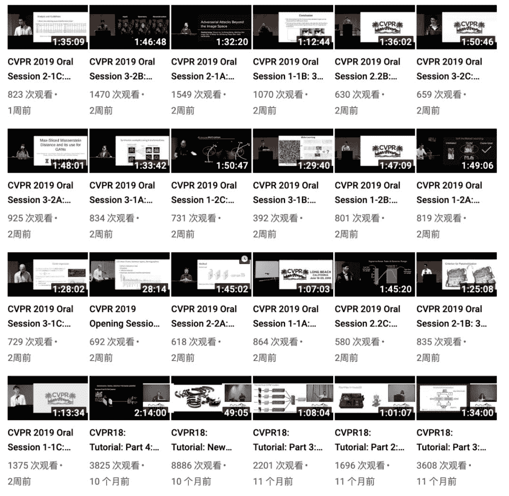

# 数千人顶会的干货，ICML、CVPR2019 演讲视频资源在此

> 原文：[`mp.weixin.qq.com/s?__biz=MzA3MzI4MjgzMw==&mid=2650765493&idx=4&sn=d1690b00e611d9093f6faa9be75244c8&chksm=871abccbb06d35dd0cd9fcc71ee89453920347187cae5d23d85c4c0eed66b7616539f4201be0&scene=21#wechat_redirect`](http://mp.weixin.qq.com/s?__biz=MzA3MzI4MjgzMw==&mid=2650765493&idx=4&sn=d1690b00e611d9093f6faa9be75244c8&chksm=871abccbb06d35dd0cd9fcc71ee89453920347187cae5d23d85c4c0eed66b7616539f4201be0&scene=21#wechat_redirect)

机器之心整理

**参与：李亚洲**

> 不久之前，两大人工智能国际顶会 ICML 2019、CVPR 2019 相继在美国加州长滩落幕。没能现场参会如何学习大会内容？近日，这两场大会的相关视频已经放出，感兴趣的读者可通过视频学习。

**ICML 2019 视频+PPT**

视频地址：https://icml.cc/Conferences/2019/Videos

ICML 2019（国际机器学习大会）召开时间为 6 月 9 日至 15 日。据大会官方介绍，本届大会共收到 3424 篇有效投稿论文，最终收录 774 篇，接收率为 22.6%。此外，今年大会组织了 11 场 Turotial、31 场 Workshop，使得这场为期一周的大会内容满满。

大会官方于近日开放的 ICML 2019 十分完整，按照时间分享了 Turotial、Oral、Workshop 的所有演讲视频与 PPT。

对此大会内容感兴趣的读者，也可以参阅由布朗大学博士 David Abel 整理的 ICML 2019 参会笔记作为辅助学习的资料。

参会笔记：https://david-abel.github.io/notes/icml_2019.pdf

**CVPR 2019 Oral 视频**

随着 ICML 2019 的落幕，CVPR 2019 接踵而至。今年的 CVPR 共有 9227 人注册参会，突破历届记录，其中来自国内的参会人数就达到 1044 位，仅次于大会举办地美国（4743 位）。

为期五天的 CVPR 2019，从 Tutorial、Workshop 到 Demo，干货满满。

不久之前，大会官方在 Youtube 上放出了今年大会的 Oral 演讲视频以供大家学习。

视频链接：https://www.youtube.com/channel/UC0n76gicaarsN_Y9YShWwhw/videos

[Image: image.png]

********本****文为机器之心整理，**转载请联系本公众号获得授权****。**

✄------------------------------------------------

**加入机器之心（全职记者 / 实习生）：hr@jiqizhixin.com**

**投稿或寻求报道：**content**@jiqizhixin.com**

**广告 & 商务合作：bd@jiqizhixin.com**